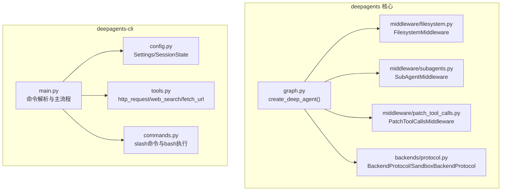
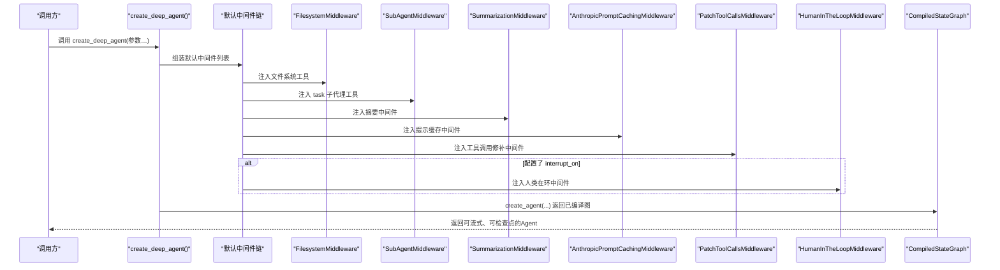
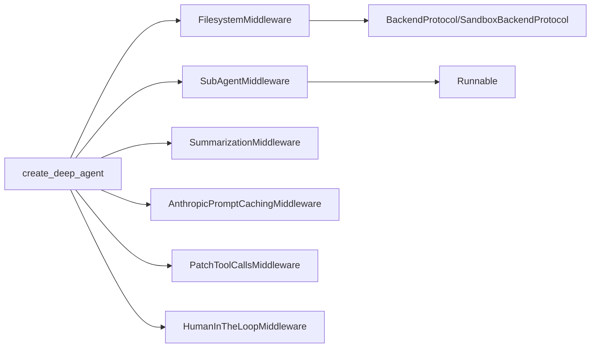

# API参考

<cite>
**本文引用的文件**
- [libs/deepagents/deepagents/__init__.py](file://libs/deepagents/deepagents/__init__.py)
- [libs/deepagents/deepagents/graph.py](file://libs/deepagents/deepagents/graph.py)
- [libs/deepagents/deepagents/middleware/filesystem.py](file://libs/deepagents/deepagents/middleware/filesystem.py)
- [libs/deepagents/deepagents/middleware/subagents.py](file://libs/deepagents/deepagents/middleware/subagents.py)
- [libs/deepagents/deepagents/middleware/patch_tool_calls.py](file://libs/deepagents/deepagents/middleware/patch_tool_calls.py)
- [libs/deepagents/deepagents/backends/protocol.py](file://libs/deepagents/deepagents/backends/protocol.py)
- [libs/deepagents/deepagents/backends/__init__.py](file://libs/deepagents/deepagents/backends/__init__.py)
- [libs/deepagents-cli/deepagents_cli/main.py](file://libs/deepagents-cli/deepagents_cli/main.py)
- [libs/deepagents-cli/deepagents_cli/commands.py](file://libs/deepagents-cli/deepagents_cli/commands.py)
- [libs/deepagents-cli/deepagents_cli/tools.py](file://libs/deepagents-cli/deepagents_cli/tools.py)
- [libs/deepagents-cli/deepagents_cli/config.py](file://libs/deepagents-cli/deepagents_cli/config.py)
- [README.md](file://README.md)
</cite>

## 目录
1. [简介](#简介)
2. [项目结构](#项目结构)
3. [核心组件](#核心组件)
4. [架构总览](#架构总览)
5. [详细组件分析](#详细组件分析)
6. [依赖关系分析](#依赖关系分析)
7. [性能考量](#性能考量)
8. [故障排查指南](#故障排查指南)
9. [结论](#结论)
10. [附录](#附录)

## 简介
本API参考面向使用 deepagents-langchain 的开发者，聚焦于以下目标：
- 文档化 create_deep_agent 接口的所有参数（模型、系统提示词、工具、中间件、子代理、中断配置、后端等），包括数据类型、默认值与典型用法。
- 文档化内置工具（write_todos、read_file、execute、task 等）的调用签名与行为。
- 说明 CLI 命令行接口的命令结构、选项与参数。
- 解释配置项（环境变量、配置文件）与运行时设置。
- 提供客户端实现指南、错误处理策略与版本兼容性信息，并确保与 __init__.py 中导出接口保持一致。

## 项目结构
本仓库包含三个主要子模块：
- deepagents：Agent创建与中间件系统、后端协议与工具生成器。
- deepagents-cli：交互式CLI、命令解析、会话状态、沙箱集成与工具。
- harbor：与外部系统（如LangSmith）的集成适配层。

图表来源
- [libs/deepagents/deepagents/graph.py](file://libs/deepagents/deepagents/graph.py#L40-L162)
- [libs/deepagents/deepagents/middleware/filesystem.py](file://libs/deepagents/deepagents/middleware/filesystem.py#L1-L120)
- [libs/deepagents/deepagents/middleware/subagents.py](file://libs/deepagents/deepagents/middleware/subagents.py#L377-L485)
- [libs/deepagents/deepagents/middleware/patch_tool_calls.py](file://libs/deepagents/deepagents/middleware/patch_tool_calls.py#L1-L45)
- [libs/deepagents/deepagents/backends/protocol.py](file://libs/deepagents/deepagents/backends/protocol.py#L1-L120)
- [libs/deepagents-cli/deepagents_cli/main.py](file://libs/deepagents-cli/deepagents_cli/main.py#L73-L131)
- [libs/deepagents-cli/deepagents_cli/config.py](file://libs/deepagents-cli/deepagents_cli/config.py#L116-L200)
- [libs/deepagents-cli/deepagents_cli/commands.py](file://libs/deepagents-cli/deepagents_cli/commands.py#L12-L49)
- [libs/deepagents-cli/deepagents_cli/tools.py](file://libs/deepagents-cli/deepagents_cli/tools.py#L15-L184)

章节来源
- [libs/deepagents/deepagents/__init__.py](file://libs/deepagents/deepagents/__init__.py#L1-L8)
- [libs/deepagents/deepagents/graph.py](file://libs/deepagents/deepagents/graph.py#L40-L162)
- [libs/deepagents/deepagents/middleware/filesystem.py](file://libs/deepagents/deepagents/middleware/filesystem.py#L1-L120)
- [libs/deepagents/deepagents/middleware/subagents.py](file://libs/deepagents/deepagents/middleware/subagents.py#L377-L485)
- [libs/deepagents/deepagents/middleware/patch_tool_calls.py](file://libs/deepagents/deepagents/middleware/patch_tool_calls.py#L1-L45)
- [libs/deepagents/deepagents/backends/protocol.py](file://libs/deepagents/deepagents/backends/protocol.py#L1-L120)
- [libs/deepagents-cli/deepagents_cli/main.py](file://libs/deepagents-cli/deepagents_cli/main.py#L73-L131)
- [libs/deepagents-cli/deepagents_cli/config.py](file://libs/deepagents-cli/deepagents_cli/config.py#L116-L200)
- [libs/deepagents-cli/deepagents_cli/commands.py](file://libs/deepagents-cli/deepagents_cli/commands.py#L12-L49)
- [libs/deepagents-cli/deepagents_cli/tools.py](file://libs/deepagents-cli/deepagents_cli/tools.py#L15-L184)

## 核心组件
- create_deep_agent：创建深度Agent的核心工厂函数，返回已编译的 LangGraph StateGraph。默认注入 TodoList、文件系统、子代理、摘要、提示缓存、工具调用修补与可选的人类在环中间件。
- FilesystemMiddleware：提供 ls、read_file、write_file、edit_file、glob、grep、execute 等工具，支持路径校验、分页读取、结果截断与安全限制。
- SubAgentMiddleware：通过 task 工具将复杂任务委派给隔离上下文的子代理，支持通用代理与自定义子代理。
- PatchToolCallsMiddleware：修复消息历史中的悬空工具调用，保证工具调用与 ToolMessage 的一致性。
- BackendProtocol/SandboxBackendProtocol：统一文件与执行接口，支持 StateBackend、FilesystemBackend、StoreBackend、CompositeBackend 及沙箱执行。

章节来源
- [libs/deepagents/deepagents/graph.py](file://libs/deepagents/deepagents/graph.py#L40-L162)
- [libs/deepagents/deepagents/middleware/filesystem.py](file://libs/deepagents/deepagents/middleware/filesystem.py#L1-L120)
- [libs/deepagents/deepagents/middleware/subagents.py](file://libs/deepagents/deepagents/middleware/subagents.py#L377-L485)
- [libs/deepagents/deepagents/middleware/patch_tool_calls.py](file://libs/deepagents/deepagents/middleware/patch_tool_calls.py#L1-L45)
- [libs/deepagents/deepagents/backends/protocol.py](file://libs/deepagents/deepagents/backends/protocol.py#L1-L120)

## 架构总览
下图展示 create_deep_agent 的内部装配流程与默认中间件链路。

图表来源
- [libs/deepagents/deepagents/graph.py](file://libs/deepagents/deepagents/graph.py#L113-L161)

章节来源
- [libs/deepagents/deepagents/graph.py](file://libs/deepagents/deepagents/graph.py#L113-L161)

## 详细组件分析

### create_deep_agent 接口规范
- 函数位置：graph.py
- 返回类型：CompiledStateGraph
- 关键参数与语义
  - model：语言模型实例或名称，默认使用内置模型工厂；若传入模型配置包含 max_input_tokens，则自动调整摘要触发阈值。
  - tools：工具序列（BaseTool/Callable/dict），与默认工具叠加。
  - system_prompt：附加到默认系统提示词之后，用于定制域内工作流。
  - middleware：追加到默认中间件之后的自定义中间件序列。
  - subagents：子代理规格或预编译 Runnable，用于 task 工具。
  - response_format：结构化输出格式（可选）。
  - context_schema：上下文模式（可选）。
  - checkpointer：状态持久化（可选）。
  - store：持久化存储（可选，当后端使用 StoreBackend 时需要）。
  - backend：后端实例或工厂（BackendProtocol | BackendFactory），控制文件系统与执行能力。
  - interrupt_on：工具级中断配置（可选），启用人类在环。
  - debug/name/cache：透传给底层 create_agent 的调试/命名/缓存参数。
- 默认行为
  - 自动注入 TodoList、Filesystem、SubAgent、摘要、提示缓存、工具修补与可选的人类在环中间件。
  - 默认系统提示词包含标准工具清单与使用建议。
  - 递归限制设置为 1000。

章节来源
- [libs/deepagents/deepagents/graph.py](file://libs/deepagents/deepagents/graph.py#L40-L162)
- [README.md](file://README.md#L61-L71)

### 内置工具：文件系统与执行
- 工具集合（均由 FilesystemMiddleware 生成）
  - ls(path: str)：列出目录内容，路径必须为绝对路径。
  - read_file(file_path: str, offset: int=0, limit: int=500)：按行号格式读取文件，支持分页；长行截断；空文件有提醒。
  - write_file(file_path: str, content: str)：新建或覆盖写入文件；返回更新命令或错误字符串。
  - edit_file(file_path: str, old_string: str, new_string: str, replace_all: bool=False)：精确字符串替换；需先读取再编辑；可批量替换。
  - glob(pattern: str, path: str="/")：按通配符匹配文件路径。
  - grep(pattern: str, path: str=None, glob: str=None, output_mode: str="files_with_matches")：在文件中搜索文本，支持多种输出模式。
  - execute(command: str)：在沙箱环境中执行命令（仅当 backend 实现 SandboxBackendProtocol 时可用）。
- 行为要点
  - 路径校验：禁止相对路径、目录穿越与 Windows 绝对路径；规范化为以“/”开头的虚拟路径。
  - 大结果截断：超过阈值的结果会被截断并保存至文件系统，可通过 read_file 分页读取。
  - 执行限制：未实现 SandboxBackendProtocol 的后端会返回错误提示；命令需避免使用 find/grep/cat/head/tail 等直接读取工具，应改用 glob/grep/read_file。
  - 同步/异步：所有工具均提供同步与异步实现。

章节来源
- [libs/deepagents/deepagents/middleware/filesystem.py](file://libs/deepagents/deepagents/middleware/filesystem.py#L159-L296)
- [libs/deepagents/deepagents/middleware/filesystem.py](file://libs/deepagents/deepagents/middleware/filesystem.py#L298-L755)
- [libs/deepagents/deepagents/backends/protocol.py](file://libs/deepagents/deepagents/backends/protocol.py#L161-L459)

### 内置工具：子代理委托（task）
- 工具：task(description: str, subagent_type: str)
- 行为
  - 支持通用子代理与自定义子代理；当未提供自定义子代理时默认启用通用子代理。
  - 将当前状态（排除特定键）传递给子代理，子代理完成后将结果合并回主状态并通过 ToolMessage 返回最终结果。
  - 若未配置允许的子代理类型，返回错误提示。
- 使用建议
  - 并行化独立任务以提升吞吐；仅在需要隔离上下文或消耗大量令牌时使用。
  - 子代理生命周期：spawn → run → return → reconcile。

章节来源
- [libs/deepagents/deepagents/middleware/subagents.py](file://libs/deepagents/deepagents/middleware/subagents.py#L1-L120)
- [libs/deepagents/deepagents/middleware/subagents.py](file://libs/deepagents/deepagents/middleware/subagents.py#L279-L375)
- [libs/deepagents/deepagents/middleware/subagents.py](file://libs/deepagents/deepagents/middleware/subagents.py#L377-L485)

### 内置工具：待办事项（write_todos、read_todos）
- 来源：默认 TodoListMiddleware 注入。
- 行为：提供结构化任务列表的创建与读取，辅助复杂工作流的进度跟踪与决策点管理。

章节来源
- [README.md](file://README.md#L252-L274)

### 中间件：工具调用修补（PatchToolCallsMiddleware）
- 作用：在消息历史中存在悬空工具调用但无对应 ToolMessage 时，自动插入一条占位 ToolMessage，避免后续推理中断。
- 触发条件：AI 消息包含工具调用但后续未出现对应 ToolMessage。

章节来源
- [libs/deepagents/deepagents/middleware/patch_tool_calls.py](file://libs/deepagents/deepagents/middleware/patch_tool_calls.py#L1-L45)

### 后端与执行能力
- BackendProtocol：统一文件操作接口（ls_info、read、write、edit、glob_info、grep_raw、upload_files、download_files）。
- SandboxBackendProtocol：在隔离环境中执行命令，返回输出、退出码与截断标记。
- 可用后端
  - StateBackend：内存态文件（默认）。
  - FilesystemBackend：真实磁盘。
  - StoreBackend：LangGraph Store 持久化。
  - CompositeBackend：路由不同路径到不同后端。
- 执行工具可用性：仅当 backend 实现 SandboxBackendProtocol 时才提供 execute 工具。

章节来源
- [libs/deepagents/deepagents/backends/protocol.py](file://libs/deepagents/deepagents/backends/protocol.py#L1-L120)
- [libs/deepagents/deepagents/backends/protocol.py](file://libs/deepagents/deepagents/backends/protocol.py#L423-L459)
- [libs/deepagents/deepagents/backends/__init__.py](file://libs/deepagents/deepagents/backends/__init__.py#L1-L16)
- [libs/deepagents/deepagents/middleware/filesystem.py](file://libs/deepagents/deepagents/middleware/filesystem.py#L645-L755)

### CLI 命令行接口
- 命令结构
  - 基本交互模式：deepagents [选项…]
  - 子命令：
    - list：列出所有可用代理
    - help：显示帮助信息
    - reset --agent NAME [--target TARGET]：重置指定代理，可从另一个代理复制提示
    - skills：技能管理（由 skills 子模块处理）
- 选项
  - --agent NAME：代理标识符（默认 agent），用于区分记忆存储
  - --auto-approve：自动批准工具使用，禁用人类在环
  - --sandbox {none,modal,daytona,runloop}：远程沙箱执行（默认 none）
  - --sandbox-id ID：复用现有沙箱ID
  - --sandbox-setup PATH：在沙箱创建后运行的设置脚本路径
  - --no-splash：禁用启动画面
- 交互特性
  - 支持斜杠命令（/clear、/help、/tokens、/quit）、bash 命令（!command）与多平台提示
  - 支持 Tavily API（可选）进行网络搜索
  - 支持远程沙箱（Modal、Runloop、Daytona）与本地模式切换

章节来源
- [libs/deepagents-cli/deepagents_cli/main.py](file://libs/deepagents-cli/deepagents_cli/main.py#L73-L131)
- [libs/deepagents-cli/deepagents_cli/main.py](file://libs/deepagents-cli/deepagents_cli/main.py#L133-L270)
- [libs/deepagents-cli/deepagents_cli/main.py](file://libs/deepagents-cli/deepagents_cli/main.py#L271-L387)
- [libs/deepagents-cli/deepagents_cli/commands.py](file://libs/deepagents-cli/deepagents_cli/commands.py#L12-L49)
- [libs/deepagents-cli/deepagents_cli/commands.py](file://libs/deepagents-cli/deepagents_cli/commands.py#L53-L90)
- [libs/deepagents-cli/deepagents_cli/tools.py](file://libs/deepagents-cli/deepagents_cli/tools.py#L15-L184)
- [libs/deepagents-cli/deepagents_cli/config.py](file://libs/deepagents-cli/deepagents_cli/config.py#L116-L200)

### 配置与环境变量
- 环境变量
  - OPENAI_API_KEY：使用 OpenAI 模型
  - ANTHROPIC_API_KEY：使用 Claude 模型
  - GOOGLE_API_KEY：使用 Gemini 模型
  - TAVILY_API_KEY：启用网络搜索（可选）
  - OPENAI_MODEL、ANTHROPIC_MODEL、GOOGLE_MODEL：模型名称（可选）
- 配置文件与路径
  - 用户代理配置目录：~/.deepagents/<agent_name>/
  - 项目级 .deepagents 目录：项目根/.deepagents/
  - agent.md：用户或项目级提示词模板（可组合加载）
- 会话状态
  - SessionState：包含 auto_approve、no_splash、线程ID等

章节来源
- [libs/deepagents-cli/deepagents_cli/config.py](file://libs/deepagents-cli/deepagents_cli/config.py#L116-L200)
- [libs/deepagents-cli/deepagents_cli/config.py](file://libs/deepagents-cli/deepagents_cli/config.py#L333-L412)
- [libs/deepagents-cli/deepagents_cli/main.py](file://libs/deepagents-cli/deepagents_cli/main.py#L390-L432)

### 客户端实现指南
- 基本步骤
  - 导入 create_deep_agent 与所需中间件/后端
  - 准备 tools（可包含自定义工具与 CLI 工具：http_request、fetch_url、web_search）
  - 可选：配置 backend（如 FilesystemBackend、StoreBackend、CompositeBackend）
  - 可选：配置 interrupt_on 实现人类在环
  - 调用 create_deep_agent 返回已编译 Agent
  - 使用 invoke/astream/stream_events 进行交互与流式输出
- 错误处理策略
  - 文件系统工具：捕获路径非法、权限不足、无效路径等错误，返回标准化错误码
  - 执行工具：当 backend 不支持执行时返回错误提示；命令超时或异常时返回相应错误信息
  - 子代理：当子代理类型不存在时返回错误提示
  - CLI：缺失依赖时提示安装；API Key 未配置时提示设置
- 版本兼容性
  - create_deep_agent 返回 CompiledStateGraph，可与 LangGraph 生态无缝集成（检查点、Studio、流式等）

章节来源
- [libs/deepagents/deepagents/graph.py](file://libs/deepagents/deepagents/graph.py#L113-L161)
- [libs/deepagents/deepagents/middleware/filesystem.py](file://libs/deepagents/deepagents/middleware/filesystem.py#L645-L755)
- [libs/deepagents/deepagents/middleware/subagents.py](file://libs/deepagents/deepagents/middleware/subagents.py#L315-L375)
- [libs/deepagents-cli/deepagents_cli/main.py](file://libs/deepagents-cli/deepagents_cli/main.py#L390-L432)

## 依赖关系分析
- 组件耦合
  - create_deep_agent 对 FilesystemMiddleware、SubAgentMiddleware、PatchToolCallsMiddleware、SummarizationMiddleware、AnthropicPromptCachingMiddleware、HumanInTheLoopMiddleware 具有强依赖。
  - FilesystemMiddleware 依赖 BackendProtocol/SandboxBackendProtocol 与工具生成器。
  - SubAgentMiddleware 依赖 create_agent 与 LangGraph Runnable。
- 外部依赖
  - LangChain/LangGraph：Agent、中间件、检查点、流式与状态图。
  - 可选：Anthropic Prompt Caching、Tavily、Requests、prompt-toolkit、rich、python-dotenv。

图表来源
- [libs/deepagents/deepagents/graph.py](file://libs/deepagents/deepagents/graph.py#L113-L161)
- [libs/deepagents/deepagents/middleware/filesystem.py](file://libs/deepagents/deepagents/middleware/filesystem.py#L298-L755)
- [libs/deepagents/deepagents/middleware/subagents.py](file://libs/deepagents/deepagents/middleware/subagents.py#L377-L485)
- [libs/deepagents/deepagents/backends/protocol.py](file://libs/deepagents/deepagents/backends/protocol.py#L161-L459)

章节来源
- [libs/deepagents/deepagents/graph.py](file://libs/deepagents/deepagents/graph.py#L113-L161)
- [libs/deepagents/deepagents/middleware/filesystem.py](file://libs/deepagents/deepagents/middleware/filesystem.py#L298-L755)
- [libs/deepagents/deepagents/middleware/subagents.py](file://libs/deepagents/deepagents/middleware/subagents.py#L377-L485)
- [libs/deepagents/deepagents/backends/protocol.py](file://libs/deepagents/deepagents/backends/protocol.py#L161-L459)

## 性能考量
- 上下文管理：当模型 profile 包含 max_input_tokens 或默认阈值达到上限时，自动启用摘要中间件以减少上下文长度。
- 结果截断：大结果通过工具返回“过大”提示并落盘，建议使用 read_file 分页读取。
- 并行化：task 工具支持并发子代理执行，降低整体延迟。
- 缓存：Anthropic 提示缓存中间件可降低重复提示成本。

章节来源
- [libs/deepagents/deepagents/graph.py](file://libs/deepagents/deepagents/graph.py#L101-L112)
- [libs/deepagents/deepagents/middleware/filesystem.py](file://libs/deepagents/deepagents/middleware/filesystem.py#L791-L800)

## 故障排查指南
- 执行工具不可用
  - 现象：execute 返回“执行不可用”
  - 原因：backend 未实现 SandboxBackendProtocol
  - 处理：提供支持执行的后端（如 CompositeBackend 默认为 SandboxBackend）
- 路径错误
  - 现象：路径被拒绝或报错
  - 原因：包含 “..”、“~”、Windows 绝对路径或不在允许前缀内
  - 处理：使用以“/”开头的虚拟绝对路径，并确保在允许前缀范围内
- 子代理类型不存在
  - 现象：task 返回错误提示
  - 处理：确认 subagents 列表中包含该类型，或使用通用子代理
- CLI 依赖缺失
  - 现象：启动时报错缺少 rich、requests、python-dotenv、tavily-python、prompt-toolkit
  - 处理：安装 deepagents[cli] 或相关依赖
- API Key 未配置
  - 现象：模型创建失败
  - 处理：设置 OPENAI_API_KEY、ANTHROPIC_API_KEY 或 GOOGLE_API_KEY

章节来源
- [libs/deepagents/deepagents/middleware/filesystem.py](file://libs/deepagents/deepagents/middleware/filesystem.py#L95-L149)
- [libs/deepagents/deepagents/middleware/filesystem.py](file://libs/deepagents/deepagents/middleware/filesystem.py#L645-L755)
- [libs/deepagents/deepagents/middleware/subagents.py](file://libs/deepagents/deepagents/middleware/subagents.py#L315-L375)
- [libs/deepagents-cli/deepagents_cli/main.py](file://libs/deepagents-cli/deepagents_cli/main.py#L32-L71)
- [libs/deepagents-cli/deepagents_cli/config.py](file://libs/deepagents-cli/deepagents_cli/config.py#L363-L412)

## 结论
deepagents 提供开箱即用的 Agent 创建与工具集，结合可插拔后端与中间件系统，既能满足本地开发，也能通过沙箱后端实现远程执行。CLI 提供交互式体验与技能生态支持。遵循本文档的参数说明、工具行为与配置约定，可快速构建稳定、可维护的智能体应用。

## 附录

### create_deep_agent 参数对照表
- 参数名：model
  - 类型：str | BaseChatModel | None
  - 默认：内置模型工厂
  - 说明：语言模型实例或名称；影响摘要阈值与提示缓存
- 参数名：tools
  - 类型：Sequence[BaseTool | Callable | dict[str, Any]] | None
  - 默认：None
  - 说明：自定义工具序列，与默认工具叠加
- 参数名：system_prompt
  - 类型：str | None
  - 默认：None
  - 说明：附加到默认系统提示词之后
- 参数名：middleware
  - 类型：Sequence[AgentMiddleware]
  - 默认：()
  - 说明：追加到默认中间件之后
- 参数名：subagents
  - 类型：list[SubAgent | CompiledSubAgent] | None
  - 默认：None
  - 说明：子代理规格或预编译 Runnable
- 参数名：response_format
  - 类型：ResponseFormat | None
  - 默认：None
  - 说明：结构化输出格式
- 参数名：context_schema
  - 类型：type[Any] | None
  - 默认：None
  - 说明：上下文模式
- 参数名：checkpointer
  - 类型：Checkpointer | None
  - 默认：None
  - 说明：状态持久化
- 参数名：store
  - 类型：BaseStore | None
  - 默认：None
  - 说明：持久化存储（当后端使用 StoreBackend 时需要）
- 参数名：backend
  - 类型：BackendProtocol | BackendFactory | None
  - 默认：None
  - 说明：后端实例或工厂；决定文件系统与执行能力
- 参数名：interrupt_on
  - 类型：dict[str, bool | InterruptOnConfig] | None
  - 默认：None
  - 说明：工具级中断配置，启用人类在环
- 参数名：debug/name/cache
  - 类型：bool/str/Any
  - 默认：False/None/None
  - 说明：透传给底层 create_agent 的调试/命名/缓存参数

章节来源
- [libs/deepagents/deepagents/graph.py](file://libs/deepagents/deepagents/graph.py#L40-L97)

### 内置工具调用签名与行为概览
- ls(path: str)
  - 行为：列出目录内容，路径必须为绝对路径
- read_file(file_path: str, offset: int=0, limit: int=500)
  - 行为：按行号格式读取文件，支持分页；长行截断；空文件有提醒
- write_file(file_path: str, content: str)
  - 行为：新建或覆盖写入文件；返回更新命令或错误字符串
- edit_file(file_path: str, old_string: str, new_string: str, replace_all: bool=False)
  - 行为：精确字符串替换；需先读取再编辑；可批量替换
- glob(pattern: str, path: str="/")
  - 行为：按通配符匹配文件路径
- grep(pattern: str, path: str=None, glob: str=None, output_mode: str="files_with_matches")
  - 行为：在文件中搜索文本，支持多种输出模式
- execute(command: str)
  - 行为：在沙箱环境中执行命令（仅当 backend 实现 SandboxBackendProtocol 时可用）
- task(description: str, subagent_type: str)
  - 行为：委派任务给子代理，返回最终结果

章节来源
- [libs/deepagents/deepagents/middleware/filesystem.py](file://libs/deepagents/deepagents/middleware/filesystem.py#L159-L296)
- [libs/deepagents/deepagents/middleware/filesystem.py](file://libs/deepagents/deepagents/middleware/filesystem.py#L298-L755)
- [libs/deepagents/deepagents/middleware/subagents.py](file://libs/deepagents/deepagents/middleware/subagents.py#L279-L375)

### CLI 命令与选项速查
- 基本命令
  - deepagents [选项…]
  - deepagents list
  - deepagents help
  - deepagents reset --agent NAME [--target TARGET]
  - deepagents skills …
- 选项
  - --agent NAME
  - --auto-approve
  - --sandbox {none,modal,daytona,runloop}
  - --sandbox-id ID
  - --sandbox-setup PATH
  - --no-splash

章节来源
- [libs/deepagents-cli/deepagents_cli/main.py](file://libs/deepagents-cli/deepagents_cli/main.py#L73-L131)
- [libs/deepagents-cli/deepagents_cli/main.py](file://libs/deepagents-cli/deepagents_cli/main.py#L390-L432)

### 配置与环境变量一览
- 环境变量
  - OPENAI_API_KEY、ANTHROPIC_API_KEY、GOOGLE_API_KEY、TAVILY_API_KEY、OPENAI_MODEL、ANTHROPIC_MODEL、GOOGLE_MODEL
- 路径
  - 用户代理目录：~/.deepagents/<agent_name>/
  - 项目 .deepagents 目录：项目根/.deepagents/

章节来源
- [libs/deepagents-cli/deepagents_cli/config.py](file://libs/deepagents-cli/deepagents_cli/config.py#L116-L200)
- [libs/deepagents-cli/deepagents_cli/config.py](file://libs/deepagents-cli/deepagents_cli/config.py#L333-L412)