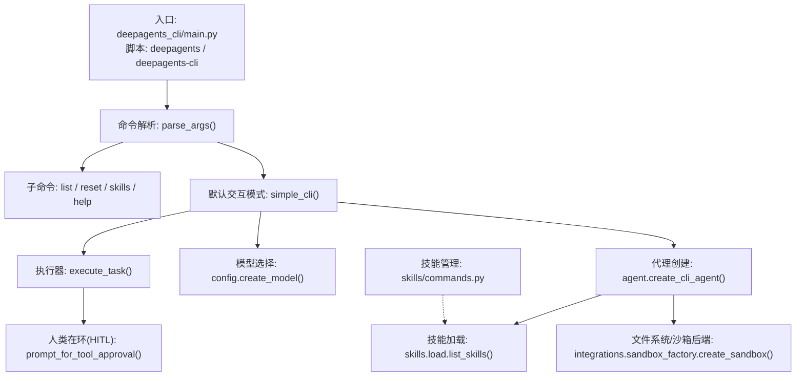
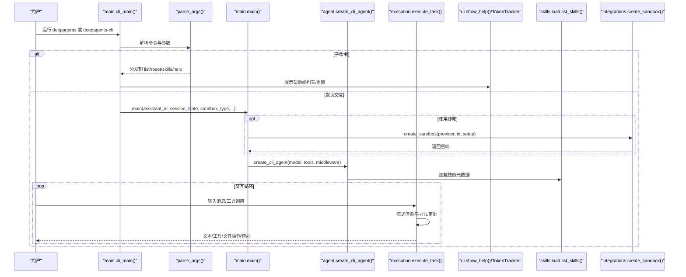
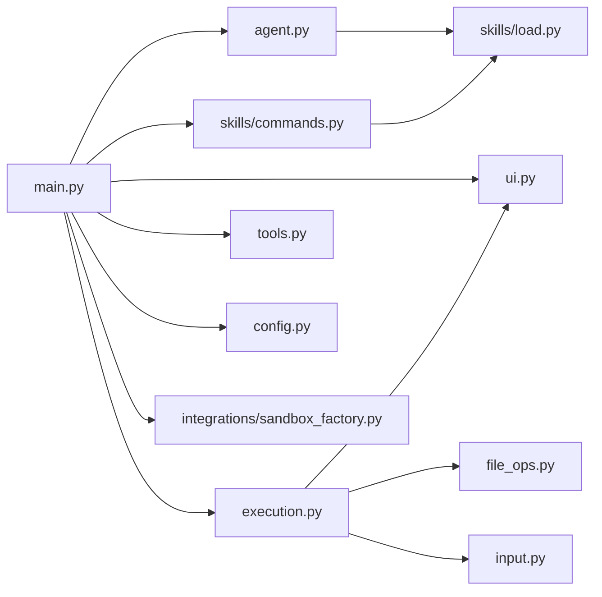

# CLI API

<cite>
**本文引用的文件**
- [pyproject.toml](file://libs/deepagents-cli/pyproject.toml)
- [main.py](file://libs/deepagents-cli/deepagents_cli/main.py)
- [commands.py](file://libs/deepagents-cli/deepagents_cli/commands.py)
- [config.py](file://libs/deepagents-cli/deepagents_cli/config.py)
- [agent.py](file://libs/deepagents-cli/deepagents_cli/agent.py)
- [execution.py](file://libs/deepagents-cli/deepagents_cli/execution.py)
- [ui.py](file://libs/deepagents-cli/deepagents_cli/ui.py)
- [skills/commands.py](file://libs/deepagents-cli/deepagents_cli/skills/commands.py)
- [skills/load.py](file://libs/deepagents-cli/deepagents_cli/skills/load.py)
- [tools.py](file://libs/deepagents-cli/deepagents_cli/tools.py)
- [integrations/sandbox_factory.py](file://libs/deepagents-cli/deepagents_cli/integrations/sandbox_factory.py)
- [README.md](file://libs/deepagents-cli/README.md)
</cite>

## 目录
1. [简介](#简介)
2. [项目结构](#项目结构)
3. [核心组件](#核心组件)
4. [架构总览](#架构总览)
5. [详细组件分析](#详细组件分析)
6. [依赖关系分析](#依赖关系分析)
7. [性能与可用性考量](#性能与可用性考量)
8. [故障排查指南](#故障排查指南)
9. [结论](#结论)
10. [附录：命令与用法速查](#附录命令与用法速查)

## 简介
本文件为 deepagents-cli 命令行接口的完整 API 文档，基于仓库中 pyproject.toml 的脚本定义与源码实现，系统性说明：
- 入口点与命令分发：deepagents 与 deepagents-cli 两个可执行入口
- 主要命令与子命令：基础交互、代理管理、技能管理（list、create、info）
- 命令行选项与参数格式、环境变量配置方式
- 典型使用场景：启动交互式会话、一次性任务、远程沙箱执行、技能管理
- 命令解析流程、配置加载机制、执行上下文管理
- 错误处理与常见问题解决

## 项目结构
deepagents-cli 位于 libs/deepagents-cli，核心入口在 main.py，命令解析与交互逻辑集中在 main.py、commands.py、ui.py、execution.py；代理与技能相关功能分别在 agent.py、skills/commands.py、skills/load.py；工具函数在 tools.py；沙箱集成在 integrations/sandbox_factory.py。

图表来源
- [main.py](file://libs/deepagents-cli/deepagents_cli/main.py#L73-L131)
- [commands.py](file://libs/deepagents-cli/deepagents_cli/commands.py#L12-L49)
- [execution.py](file://libs/deepagents-cli/deepagents_cli/execution.py#L180-L683)
- [config.py](file://libs/deepagents-cli/deepagents_cli/config.py#L363-L411)
- [agent.py](file://libs/deepagents-cli/deepagents_cli/agent.py#L326-L467)
- [skills/load.py](file://libs/deepagents-cli/deepagents_cli/skills/load.py#L206-L238)
- [integrations/sandbox_factory.py](file://libs/deepagents-cli/deepagents_cli/integrations/sandbox_factory.py#L284-L348)

章节来源
- [pyproject.toml](file://libs/deepagents-cli/pyproject.toml#L23-L25)
- [README.md](file://libs/deepagents-cli/README.md#L1-L120)

## 核心组件
- 入口与脚本定义：pyproject.toml 中注册了 deepagents 与 deepagents-cli 两个控制台脚本，均指向 deepagents_cli:cli_main
- 命令解析与路由：main.py 的 parse_args 构建主解析器与子解析器，支持 list、help、reset、skills 等命令
- 交互循环：simple_cli 提供富交互体验，支持 / 命令、! 命令、自动换行、提示信息等
- 执行引擎：execute_task 负责将用户输入交给智能体流式执行，支持 HITL 审批、工具调用、文件操作渲染、todo 列表等
- 配置与模型：config 模块负责环境检测、API Key 选择、路径与目录管理、会话状态
- 代理与技能：agent 创建带内存与技能中间件的智能体；skills 模块负责技能发现、元数据解析与展示
- 工具集：tools 提供 HTTP 请求、网页搜索、URL 转 Markdown 等工具
- 沙箱集成：integrations/sandbox_factory 统一创建 Modal/Runloop/Daytona 沙箱，支持复用与初始化脚本

章节来源
- [pyproject.toml](file://libs/deepagents-cli/pyproject.toml#L23-L25)
- [main.py](file://libs/deepagents-cli/deepagents_cli/main.py#L73-L131)
- [ui.py](file://libs/deepagents-cli/deepagents_cli/ui.py#L491-L640)
- [execution.py](file://libs/deepagents-cli/deepagents_cli/execution.py#L180-L683)
- [config.py](file://libs/deepagents-cli/deepagents_cli/config.py#L116-L411)
- [agent.py](file://libs/deepagents-cli/deepagents_cli/agent.py#L326-L467)
- [skills/commands.py](file://libs/deepagents-cli/deepagents_cli/skills/commands.py#L366-L474)
- [skills/load.py](file://libs/deepagents-cli/deepagents_cli/skills/load.py#L145-L238)
- [tools.py](file://libs/deepagents-cli/deepagents_cli/tools.py#L15-L184)
- [integrations/sandbox_factory.py](file://libs/deepagents-cli/deepagents_cli/integrations/sandbox_factory.py#L284-L348)

## 架构总览
下图展示了 CLI 的整体调用链路与模块协作关系。

图表来源
- [main.py](file://libs/deepagents-cli/deepagents_cli/main.py#L389-L432)
- [main.py](file://libs/deepagents-cli/deepagents_cli/main.py#L325-L387)
- [agent.py](file://libs/deepagents-cli/deepagents_cli/agent.py#L326-L467)
- [execution.py](file://libs/deepagents-cli/deepagents_cli/execution.py#L180-L683)
- [skills/load.py](file://libs/deepagents-cli/deepagents_cli/skills/load.py#L206-L238)
- [integrations/sandbox_factory.py](file://libs/deepagents-cli/deepagents_cli/integrations/sandbox_factory.py#L284-L348)

## 详细组件分析

### 命令入口与脚本定义
- 控制台脚本：pyproject.toml 注册 deepagents 与 deepagents-cli 两个入口，均指向 deepagents_cli:cli_main
- 启动流程：cli_main() 先检查依赖，再解析参数，最后根据命令分支执行

章节来源
- [pyproject.toml](file://libs/deepagents-cli/pyproject.toml#L23-L25)
- [main.py](file://libs/deepagents-cli/deepagents_cli/main.py#L389-L432)

### 命令解析与路由
- 主解析器：构建子解析器，支持 list、help、reset、skills 等
- 默认交互模式：未指定子命令时进入交互循环，支持 --agent、--auto-approve、--sandbox、--sandbox-id、--sandbox-setup、--no-splash 等选项
- 子命令 skills：由 skills/commands.setup_skills_parser 注册 list/create/info 三个子命令

章节来源
- [main.py](file://libs/deepagents-cli/deepagents_cli/main.py#L73-L131)
- [skills/commands.py](file://libs/deepagents-cli/deepagents_cli/skills/commands.py#L366-L428)

### 交互循环与命令处理
- simple_cli：负责启动画面、工作目录提示、HITL 提示、slash 命令与 bash 命令处理
- slash 命令：/help、/clear、/tokens、/quit 等，由 commands.handle_command 处理
- bash 命令：以 ! 开头，由 commands.execute_bash_command 执行并输出结果

章节来源
- [main.py](file://libs/deepagents-cli/deepagents_cli/main.py#L133-L270)
- [commands.py](file://libs/deepagents-cli/deepagents_cli/commands.py#L12-L49)
- [commands.py](file://libs/deepagents-cli/deepagents_cli/commands.py#L53-L90)
- [ui.py](file://libs/deepagents-cli/deepagents_cli/ui.py#L491-L640)

### 执行引擎与 HITL
- execute_task：将用户输入封装为消息流，调用智能体 astrea，支持多模态流式渲染、工具调用聚合、文件操作记录与 diff 渲染、todo 列表更新
- HITL：prompt_for_tool_approval 提供审批/拒绝/自动全量批准三种选择，支持键盘导航与回退处理
- 令牌统计：TokenTracker 记录输入/输出令牌，/tokens 命令显示当前会话统计

章节来源
- [execution.py](file://libs/deepagents-cli/deepagents_cli/execution.py#L180-L683)
- [ui.py](file://libs/deepagents-cli/deepagents_cli/ui.py#L173-L235)

### 代理与技能系统
- 代理创建：create_cli_agent 构建带内存中间件与技能中间件的智能体，支持本地与远程沙箱两种模式
- 技能加载：skills.load.list_skills 从用户与项目目录扫描 SKILL.md，解析 YAML frontmatter，合并去重（项目优先）
- 系统提示：get_system_prompt 根据是否沙箱生成不同工作目录与路径说明

章节来源
- [agent.py](file://libs/deepagents-cli/deepagents_cli/agent.py#L326-L467)
- [skills/load.py](file://libs/deepagents-cli/deepagents_cli/skills/load.py#L145-L238)
- [agent.py](file://libs/deepagents-cli/deepagents_cli/agent.py#L94-L188)

### 工具与外部能力
- HTTP 请求：http_request 支持 GET/POST/PUT/DELETE 等，返回结构化响应
- 网页搜索：web_search 依赖 Tavily，需设置 TAVILY_API_KEY
- URL 获取：fetch_url 将 HTML 转为 Markdown，便于后续处理
- 搜索开关：config.settings.has_tavily 决定是否注入 web_search 工具

章节来源
- [tools.py](file://libs/deepagents-cli/deepagents_cli/tools.py#L15-L184)
- [config.py](file://libs/deepagents-cli/deepagents_cli/config.py#L116-L189)

### 沙箱集成
- 统一入口：create_sandbox 根据 provider 调用 Modal/Runloop/Daytona 的上下文管理器
- 工作目录：get_default_working_dir 为各提供商提供默认工作目录
- 初始化脚本：支持在沙箱创建后运行 setup 脚本，结束后清理

章节来源
- [integrations/sandbox_factory.py](file://libs/deepagents-cli/deepagents_cli/integrations/sandbox_factory.py#L284-L348)

### 代理与技能管理命令
- list：列出已配置的代理
- reset：重置代理到默认或复制另一个代理的 agent.md
- skills list：列出技能（支持 --project 仅显示项目级技能）
- skills create：创建新技能模板（支持 --project）
- skills info：查看技能详情（含 SKILL.md 内容）

章节来源
- [agent.py](file://libs/deepagents-cli/deepagents_cli/agent.py#L29-L91)
- [skills/commands.py](file://libs/deepagents-cli/deepagents_cli/skills/commands.py#L82-L161)
- [skills/commands.py](file://libs/deepagents-cli/deepagents_cli/skills/commands.py#L163-L303)
- [skills/commands.py](file://libs/deepagents-cli/deepagents_cli/skills/commands.py#L304-L364)

## 依赖关系分析
- 入口依赖：main.py 依赖 agent、commands、config、execution、integrations、skills、tools、ui
- 配置依赖：config 提供 Settings、SessionState、模型选择、路径管理
- 执行依赖：execution 依赖 ui、file_ops、input、config
- 技能依赖：skills/commands 依赖 skills/load 与 config
- 沙箱依赖：integrations/sandbox_factory 依赖第三方 SDK（Modal/Runloop/Daytona）

图表来源
- [main.py](file://libs/deepagents-cli/deepagents_cli/main.py#L1-L40)
- [agent.py](file://libs/deepagents-cli/deepagents_cli/agent.py#L1-L27)
- [execution.py](file://libs/deepagents-cli/deepagents_cli/execution.py#L1-L35)
- [skills/commands.py](file://libs/deepagents-cli/deepagents_cli/skills/commands.py#L1-L17)
- [skills/load.py](file://libs/deepagents-cli/deepagents_cli/skills/load.py#L1-L23)
- [tools.py](file://libs/deepagents-cli/deepagents_cli/tools.py#L1-L14)
- [ui.py](file://libs/deepagents-cli/deepagents_cli/ui.py#L1-L17)
- [config.py](file://libs/deepagents-cli/deepagents_cli/config.py#L1-L26)
- [integrations/sandbox_factory.py](file://libs/deepagents-cli/deepagents_cli/integrations/sandbox_factory.py#L1-L23)

## 性能与可用性考量
- 流式渲染：execute_task 对文本与工具调用进行增量渲染，减少等待感
- HITL 审批：对潜在破坏性操作采用交互审批，避免误操作
- 令牌统计：TokenTracker 仅在 /tokens 命令显示，不干扰主流程
- 沙箱延迟：沙箱创建与就绪检测有超时与清理逻辑，失败时直接退出，避免静默失败
- 文件内容截断：大文件注入时限制长度，避免上下文膨胀

[本节为通用指导，无需特定文件引用]

## 故障排查指南
- 缺少 CLI 依赖：check_cli_dependencies 会在缺失 rich、requests、python-dotenv、tavily-python、prompt-toolkit 时提示安装
- 无 API Key：create_model 在未配置 OPENAI/ANTHROPIC/GOOGLE API Key 时直接退出并提示
- 沙箱创建失败：main 中捕获 ImportError/ValueError/RuntimeError/NotImplementedError 并打印错误后退出
- Tavily 未配置：web_search 返回错误提示，建议设置 TAVILY_API_KEY
- 路径安全：skills/commands 与 skills/load 对路径进行严格校验，防止路径穿越
- 交互中断：Ctrl+C 会优雅更新智能体状态，避免脏状态

章节来源
- [main.py](file://libs/deepagents-cli/deepagents_cli/main.py#L32-L71)
- [config.py](file://libs/deepagents-cli/deepagents_cli/config.py#L363-L411)
- [execution.py](file://libs/deepagents-cli/deepagents_cli/execution.py#L630-L674)
- [tools.py](file://libs/deepagents-cli/deepagents_cli/tools.py#L123-L138)
- [skills/commands.py](file://libs/deepagents-cli/deepagents_cli/skills/commands.py#L18-L48)
- [skills/load.py](file://libs/deepagents-cli/deepagents_cli/skills/load.py#L52-L90)

## 结论
deepagents-cli 提供了从命令行到交互式智能体的一体化体验，具备完善的代理管理、技能系统、远程沙箱执行与人类在环审批机制。通过清晰的命令结构、健壮的配置与错误处理、以及丰富的交互特性，用户可以高效地完成日常开发与研究任务。

[本节为总结性内容，无需特定文件引用]

## 附录：命令与用法速查

### 入口与脚本
- 可执行入口：deepagents、deepagents-cli（二者等价）
- 安装与运行参考：README 中的快速开始与常见选项

章节来源
- [pyproject.toml](file://libs/deepagents-cli/pyproject.toml#L23-L25)
- [README.md](file://libs/deepagents-cli/README.md#L1-L60)

### 基础命令
- 启动交互式会话
  - 基本用法：deepagents
  - 指定代理：deepagents --agent 名称
  - 自动审批：deepagents --auto-approve
  - 远程沙箱：deepagents --sandbox modal/runloop/daytona
  - 复用沙箱：deepagents --sandbox modal --sandbox-id ID
  - 关闭启动画面：deepagents --no-splash
- 查看帮助：deepagents help
- 列出代理：deepagents list
- 重置代理：deepagents reset --agent 名称；复制另一个代理：deepagents reset --agent 名称 --target 源代理

章节来源
- [main.py](file://libs/deepagents-cli/deepagents_cli/main.py#L73-L131)
- [ui.py](file://libs/deepagents-cli/deepagents_cli/ui.py#L539-L640)
- [agent.py](file://libs/deepagents-cli/deepagents_cli/agent.py#L29-L91)

### 交互命令
- /help：显示交互帮助
- /clear：清屏并重置对话
- /tokens：显示当前会话令牌用量
- /quit、/exit、q：退出会话
- !命令：执行本地 bash 命令（如 !ls、!git status）

章节来源
- [commands.py](file://libs/deepagents-cli/deepagents_cli/commands.py#L12-L49)
- [commands.py](file://libs/deepagents-cli/deepagents_cli/commands.py#L53-L90)
- [ui.py](file://libs/deepagents-cli/deepagents_cli/ui.py#L491-L640)

### 技能管理命令
- 列出技能：deepagents skills list [--agent 代理名] [--project]
- 创建技能：deepagents skills create <名称> [--agent 代理名] [--project]
- 查看技能：deepagents skills info <名称> [--agent 代理名] [--project]

章节来源
- [skills/commands.py](file://libs/deepagents-cli/deepagents_cli/skills/commands.py#L366-L474)
- [skills/load.py](file://libs/deepagents-cli/deepagents_cli/skills/load.py#L206-L238)

### 环境变量与配置
- 模型选择与 API Key：
  - OPENAI_API_KEY：启用 OpenAI 模型
  - ANTHROPIC_API_KEY：启用 Claude 模型
  - GOOGLE_API_KEY：启用 Gemini 模型
  - OPENAI_MODEL/ANTHROPIC_MODEL/GOOGLE_MODEL：自定义模型名称
- 搜索能力：
  - TAVILY_API_KEY：启用 web_search 工具
- 项目检测：自动查找 .git 根目录，加载项目级 agent.md 与 skills
- 代理存储：~/.deepagents/<agent>/ 下存放 agent.md 与 skills/

章节来源
- [config.py](file://libs/deepagents-cli/deepagents_cli/config.py#L144-L189)
- [config.py](file://libs/deepagents-cli/deepagents_cli/config.py#L363-L411)
- [README.md](file://libs/deepagents-cli/README.md#L90-L160)

### 典型使用场景
- 启动交互式会话：deepagents --agent mybot --auto-approve
- 远程沙箱执行：deepagents --sandbox runloop --sandbox-id dbx_123
- 一次性任务：在交互中输入任务描述，智能体自动规划与执行
- 管理技能插件：deepagents skills list / create / info
- 项目协作：在项目根目录添加 .deepagents/skills/，团队共享技能

章节来源
- [README.md](file://libs/deepagents-cli/README.md#L160-L240)
- [skills/commands.py](file://libs/deepagents-cli/deepagents_cli/skills/commands.py#L82-L161)