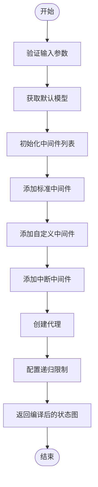
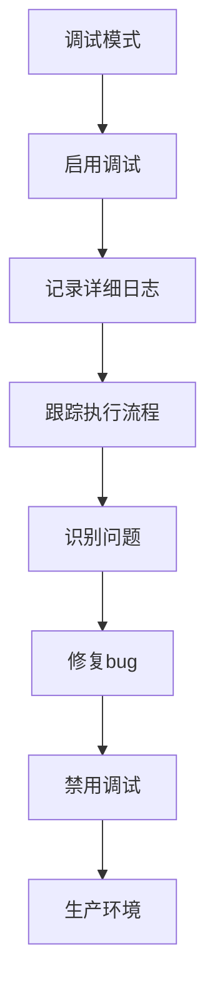

# 核心API

<cite>
**本文档中引用的文件**   
- [__init__.py](file://libs/deepagents/deepagents/__init__.py)
- [graph.py](file://libs/deepagents/deepagents/graph.py)
- [filesystem.py](file://libs/deepagents/deepagents/middleware/filesystem.py)
- [subagents.py](file://libs/deepagents/deepagents/middleware/subagents.py)
- [protocol.py](file://libs/deepagents/deepagents/backends/protocol.py)
- [state.py](file://libs/deepagents/deepagents/backends/state.py)
- [composite.py](file://libs/deepagents/deepagents/backends/composite.py)
- [patch_tool_calls.py](file://libs/deepagents/deepagents/middleware/patch_tool_calls.py)
- [README.md](file://libs/deepagents/README.md)
</cite>

## 目录
1. [简介](#简介)
2. [create_deep_agent函数接口定义](#createdeepagent函数接口定义)
3. [内置工具详解](#内置工具详解)
4. [代码示例](#代码示例)
5. [返回值CompiledStateGraph使用方法](#返回值compiledstategaph使用方法)
6. [中间件执行流程](#中间件执行流程)
7. [错误处理与调试模式](#错误处理与调试模式)

## 简介
deepagents库提供了一个高级代理创建框架，通过`create_deep_agent`函数创建具有规划、文件系统访问、子代理调用等能力的深度代理。该框架基于LangGraph构建，集成了多种中间件来增强代理的功能。核心功能包括内置的待办事项工具、文件系统工具、子代理调用机制以及可扩展的中间件架构。代理可以访问多种工具来执行复杂任务，包括文件操作、命令执行和子任务分解。

**Section sources**
- [__init__.py](file://libs/deepagents/deepagents/__init__.py#L1-L8)
- [README.md](file://libs/deepagents/README.md#L1-L50)

## create_deep_agent函数接口定义

`create_deep_agent`函数是deepagents库的核心API，用于创建具有增强功能的深度代理。该函数接受多个参数来配置代理的行为和能力。

### model参数
- **含义**：指定代理使用的语言模型
- **数据类型**：字符串标识或BaseChatModel实例
- **默认值**：`claude-sonnet-4-5-20250929`（通过`get_default_model()`函数获取）
- **使用场景**：当需要使用特定模型时，可以传递模型名称字符串或BaseChatModel实例。如果不指定，则使用默认的Claude Sonnet 4模型。

### tools参数
- **含义**：指定代理可以访问的工具列表
- **数据类型**：BaseTool实例、可调用对象或字典的序列
- **默认值**：None
- **使用场景**：用于扩展代理的功能，可以添加自定义工具。代理默认已包含文件操作工具和待办事项工具。

### system_prompt参数
- **含义**：附加的系统提示词，将与基础提示词结合使用
- **数据类型**：字符串
- **默认值**：None
- **使用场景**：用于定制代理的行为，可以提供特定领域的指导或约束。

### middleware参数
- **含义**：额外的中间件列表，将在标准中间件之后应用
- **数据类型**：AgentMiddleware实例的序列
- **默认值**：空元组
- **使用场景**：用于扩展代理功能，可以添加自定义中间件来实现特定逻辑。

### subagents参数
- **含义**：子代理配置列表
- **数据类型**：SubAgent或CompiledSubAgent实例的列表
- **默认值**：None
- **使用场景**：用于配置可由主代理调用的子代理，实现任务分解和上下文隔离。

### interrupt_on参数
- **含义**：中断配置，指定哪些工具调用需要人工干预
- **数据类型**：字典，键为工具名称，值为布尔值或InterruptOnConfig
- **默认值**：None
- **使用场景**：用于实现人机协作工作流，对敏感操作进行人工审核。

### backend参数
- **含义**：后端实现，用于文件存储和执行
- **数据类型**：BackendProtocol实例或BackendFactory可调用对象
- **默认值**：None
- **使用场景**：用于指定文件存储位置和执行环境，支持StateBackend、StoreBackend等不同后端。

**Section sources**
- [graph.py](file://libs/deepagents/deepagents/graph.py#L40-L162)

## 内置工具详解

### write_todos工具
- **调用方式**：通过`write_todos`函数调用
- **行为特征**：允许代理创建和更新待办事项列表，用于任务规划和进度跟踪。代理会在执行复杂任务前自动创建待办事项，并在完成步骤后更新状态。

### 文件系统工具
#### read_file工具
- **调用方式**：`read_file(file_path, offset=0, limit=500)`
- **行为特征**：读取文件内容，支持分页读取以避免上下文溢出。结果以带行号的格式返回，行号宽度为6个字符。对于空文件会返回特殊警告。

#### write_file工具
- **调用方式**：`write_file(file_path, content)`
- **行为特征**：创建新文件，如果文件已存在则返回错误。文件路径必须以斜杠开头，内容为字符串。

#### edit_file工具
- **调用方式**：`edit_file(file_path, old_string, new_string, replace_all=False)`
- **行为特征**：执行精确字符串替换。必须先读取文件才能编辑。如果old_string在文件中不唯一，编辑将失败，除非设置replace_all=True。

#### glob工具
- **调用方式**：`glob(pattern, path="/")`
- **行为特征**：根据glob模式查找文件，支持通配符匹配。返回匹配文件的绝对路径列表。

#### grep工具
- **调用方式**：`grep(pattern, path=None, glob=None, output_mode="files_with_matches")`
- **行为特征**：在文件中搜索文本模式，支持路径过滤和文件模式过滤。输出模式可选择文件列表、内容或计数。

### execute工具
- **调用方式**：`execute(command)`
- **行为特征**：在沙箱环境中执行shell命令。仅当后端实现SandboxBackendProtocol时可用。返回命令输出、退出码和截断状态。必须使用引号包围包含空格的路径。

**Section sources**
- [filesystem.py](file://libs/deepagents/deepagents/middleware/filesystem.py#L1-L800)
- [protocol.py](file://libs/deepagents/deepagents/backends/protocol.py#L1-L459)

## 代码示例

### 创建基本代理
```python
from deepagents import create_deep_agent

# 创建使用默认模型的基本代理
agent = create_deep_agent()
```

### 集成自定义工具
```python
import os
from tavily import TavilyClient
from deepagents import create_deep_agent

tavily_client = TavilyClient(api_key=os.environ["TAVILY_API_KEY"])

def internet_search(query: str, max_results: int = 5):
    """运行网络搜索"""
    return tavily_client.search(query, max_results=max_results)

# 创建带有自定义搜索工具的代理
agent = create_deep_agent(
    tools=[internet_search],
    system_prompt="你是一个专业研究员。你的工作是进行彻底的研究，然后撰写一份精炼的报告。"
)
```

### 配置复杂工作流
```python
from deepagents import create_deep_agent
from deepagents.middleware.subagents import SubAgent

# 定义研究子代理
research_subagent = SubAgent(
    name="research-agent",
    description="用于研究更深入的问题",
    system_prompt="你是一个优秀的研究员",
    tools=[internet_search],
    model="openai:gpt-4o"
)

# 创建带有子代理的主代理
agent = create_deep_agent(
    model="anthropic:claude-sonnet-4-20250514",
    tools=[internet_search],
    system_prompt="你是一个高级研究协调员",
    subagents=[research_subagent],
    backend=StateBackend(runtime),
    interrupt_on={"execute": {"allowed_decisions": ["approve", "edit", "reject"]}}
)
```

**Section sources**
- [README.md](file://libs/deepagents/README.md#L34-L320)
- [graph.py](file://libs/deepagents/deepagents/graph.py#L28-L37)

## 返回值CompiledStateGraph使用方法

`create_deep_agent`函数返回一个`CompiledStateGraph`实例，这是LangGraph框架中的核心概念。该返回值代表一个编译后的状态图，可以像普通LangChain代理一样进行交互。

### 基本使用
```python
# 调用代理
result = agent.invoke({"messages": [{"role": "user", "content": "什么是langgraph?"}]})

# 流式输出
for chunk in agent.stream({"messages": [{"role": "user", "content": "解释Python中的装饰器"}]}):
    print(chunk)
```

### 高级功能
- **持久化**：通过checkpointer参数实现代理状态的持久化，支持在多个会话间保持状态。
- **内存管理**：通过store参数实现跨会话的持久存储。
- **异步支持**：返回的CompiledStateGraph同时支持同步和异步调用，可以使用`ainvoke`和`astream`方法进行异步操作。
- **调试模式**：通过debug参数启用调试模式，有助于开发和问题排查。

**Section sources**
- [graph.py](file://libs/deepagents/deepagents/graph.py#L149-L161)
- [README.md](file://libs/deepagents/README.md#L80-L81)

## 中间件执行流程

deepagents框架使用中间件架构来增强代理功能。中间件的注入顺序和执行流程如下：

### 中间件注入顺序
1. **TodoListMiddleware**：提供待办事项管理功能
2. **FilesystemMiddleware**：提供文件系统访问功能
3. **SubAgentMiddleware**：提供子代理调用功能
4. **SummarizationMiddleware**：提供上下文摘要功能
5. **AnthropicPromptCachingMiddleware**：提供提示缓存功能
6. **PatchToolCallsMiddleware**：修复悬空工具调用
7. **用户自定义中间件**：通过middleware参数添加的中间件
8. **HumanInTheLoopMiddleware**：如果指定了interrupt_on参数

### 执行流程


**Diagram sources**
- [graph.py](file://libs/deepagents/deepagents/graph.py#L113-L147)

**Section sources**
- [graph.py](file://libs/deepagents/deepagents/graph.py#L113-L147)
- [patch_tool_calls.py](file://libs/deepagents/deepagents/middleware/patch_tool_calls.py#L1-L45)

## 错误处理与调试模式

### 错误处理
- **路径验证**：使用`_validate_path`函数验证路径安全性，防止目录遍历攻击。
- **执行支持检查**：使用`_supports_execution`函数检查后端是否支持命令执行。
- **错误消息**：提供清晰的错误消息，帮助代理理解和修复问题。

### 调试模式
- **启用方式**：通过debug参数设置为True
- **功能**：启用详细的日志记录和调试信息输出
- **使用建议**：在开发和测试阶段启用调试模式，生产环境中建议关闭以提高性能



**Diagram sources**
- [graph.py](file://libs/deepagents/deepagents/graph.py#L53-L54)
- [filesystem.py](file://libs/deepagents/deepagents/middleware/filesystem.py#L129-L148)

**Section sources**
- [graph.py](file://libs/deepagents/deepagents/graph.py#L53-L54)
- [filesystem.py](file://libs/deepagents/deepagents/middleware/filesystem.py#L129-L148)