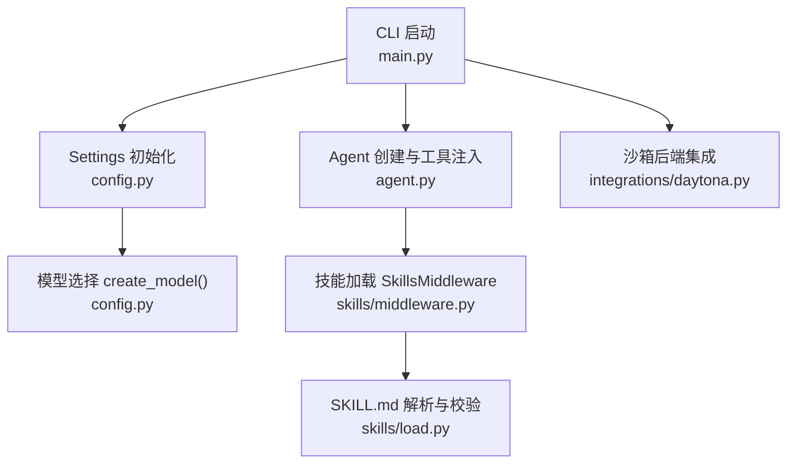
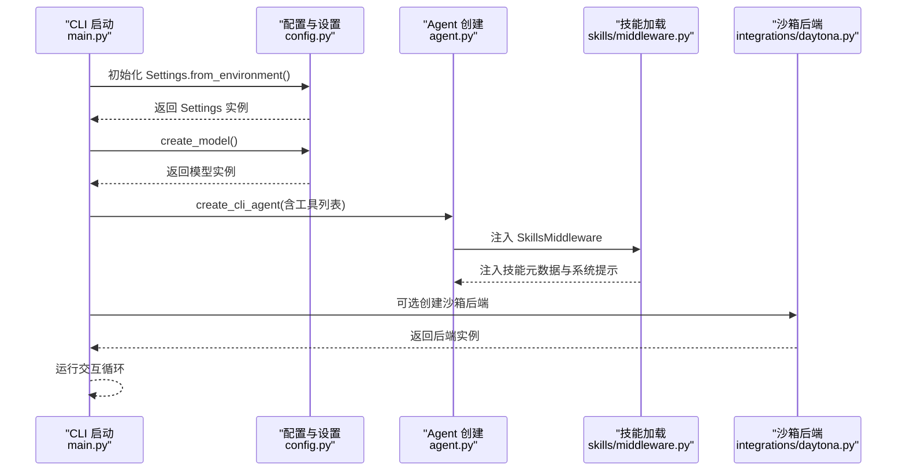
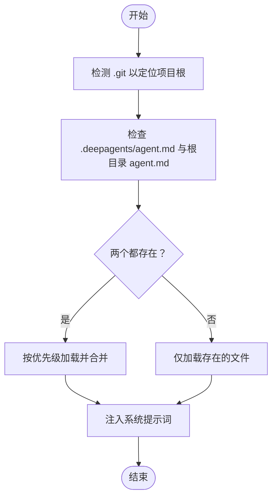
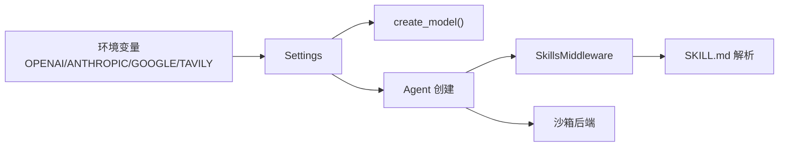

# 配置选项

<cite>
**本文引用的文件**
- [libs/deepagents-cli/deepagents_cli/config.py](file://libs/deepagents-cli/deepagents_cli/config.py)
- [libs/deepagents-cli/deepagents_cli/main.py](file://libs/deepagents-cli/deepagents_cli/main.py)
- [libs/deepagents-cli/deepagents_cli/project_utils.py](file://libs/deepagents-cli/deepagents_cli/project_utils.py)
- [libs/deepagents-cli/deepagents_cli/agent.py](file://libs/deepagents-cli/deepagents_cli/agent.py)
- [libs/deepagents-cli/deepagents_cli/skills/load.py](file://libs/deepagents-cli/deepagents_cli/skills/load.py)
- [libs/deepagents-cli/deepagents_cli/skills/middleware.py](file://libs/deepagents-cli/deepagents_cli/skills/middleware.py)
- [libs/deepagents-cli/deepagents_cli/default_agent_prompt.md](file://libs/deepagents-cli/deepagents_cli/default_agent_prompt.md)
- [libs/deepagents-cli/deepagents_cli/integrations/daytona.py](file://libs/deepagents-cli/deepagents_cli/integrations/daytona.py)
- [libs/deepagents/deepagents/middleware/filesystem.py](file://libs/deepagents/deepagents/middleware/filesystem.py)
- [libs/deepagents-cli/README.md](file://libs/deepagents-cli/README.md)
- [libs/deepagents-cli/tests/unit_tests/test_config.py](file://libs/deepagents-cli/tests/unit_tests/test_config.py)
</cite>

## 目录
1. [简介](#简介)
2. [项目结构与配置入口](#项目结构与配置入口)
3. [核心配置组件](#核心配置组件)
4. [架构总览](#架构总览)
5. [详细组件解析](#详细组件解析)
6. [依赖关系分析](#依赖关系分析)
7. [性能与安全考量](#性能与安全考量)
8. [故障诊断与排错指南](#故障诊断与排错指南)
9. [结论](#结论)
10. [附录：完整配置清单与示例](#附录完整配置清单与示例)

## 简介
本文件为 deepagents 的配置系统参考文档，聚焦于以下目标：
- 配置文件的查找路径、加载优先级与格式规范
- 可配置项：模型设置、工具启用/禁用、中间件配置、后端存储与沙箱集成参数
- 环境变量命名规则与覆盖机制（如 DAYTONA_API_KEY 等敏感信息）
- 基于 config.py 的配置验证逻辑与默认值回退策略
- 完整配置示例与最佳实践，帮助构建稳定可靠的运行环境

## 项目结构与配置入口
deepagents 的配置系统主要由 CLI 层负责初始化与加载：
- 全局设置与环境检测：通过 Settings 类从环境变量读取 API 密钥，并探测项目根目录与用户配置目录
- 模型选择：根据可用的 API 密钥动态创建对应的大模型客户端
- 工具与技能：按用户与项目两级目录加载 agent.md 与 SKILL.md，实现“全局+项目”的叠加与覆盖
- 沙箱集成：支持 modal、runloop、daytona 等远程执行后端

图表来源
- [libs/deepagents-cli/deepagents_cli/main.py](file://libs/deepagents-cli/deepagents_cli/main.py#L325-L432)
- [libs/deepagents-cli/deepagents_cli/config.py](file://libs/deepagents-cli/deepagents_cli/config.py#L143-L411)
- [libs/deepagents-cli/deepagents_cli/agent.py](file://libs/deepagents-cli/deepagents_cli/agent.py#L1-L200)
- [libs/deepagents-cli/deepagents_cli/skills/middleware.py](file://libs/deepagents-cli/deepagents_cli/skills/middleware.py#L1-L200)
- [libs/deepagents-cli/deepagents_cli/skills/load.py](file://libs/deepagents-cli/deepagents_cli/skills/load.py#L1-L200)
- [libs/deepagents-cli/deepagents_cli/integrations/daytona.py](file://libs/deepagents-cli/deepagents_cli/integrations/daytona.py#L1-L118)

章节来源
- [libs/deepagents-cli/deepagents_cli/main.py](file://libs/deepagents-cli/deepagents_cli/main.py#L325-L432)
- [libs/deepagents-cli/deepagents_cli/config.py](file://libs/deepagents-cli/deepagents_cli/config.py#L143-L411)
- [libs/deepagents-cli/deepagents_cli/agent.py](file://libs/deepagents-cli/deepagents_cli/agent.py#L1-L200)
- [libs/deepagents-cli/deepagents_cli/skills/middleware.py](file://libs/deepagents-cli/deepagents_cli/skills/middleware.py#L1-L200)
- [libs/deepagents-cli/deepagents_cli/skills/load.py](file://libs/deepagents-cli/deepagents_cli/skills/load.py#L1-L200)
- [libs/deepagents-cli/deepagents_cli/integrations/daytona.py](file://libs/deepagents-cli/deepagents_cli/integrations/daytona.py#L1-L118)

## 核心配置组件
- 全局设置 Settings
  - 负责从环境变量读取 OPENAI_API_KEY、ANTHROPIC_API_KEY、GOOGLE_API_KEY、TAVILY_API_KEY
  - 提供 has_openai、has_anthropic、has_google、has_tavily 等便捷属性
  - 提供用户与项目级配置目录的生成与校验
- 模型选择 create_model()
  - 根据已配置的 API 密钥选择对应模型，并支持通过环境变量覆盖模型名称
- agent.md 加载与合并
  - 支持用户级 ~/.deepagents/{agent}/agent.md 与项目级 .deepagents/agent.md 叠加
  - 项目级优先，两者内容在会话开始时注入系统提示词
- 技能系统 SkillsMiddleware
  - 用户级与项目级 skills 目录分别扫描，支持同名项目技能覆盖用户技能
  - 通过 SKILL.md 的 YAML frontmatter 注入系统提示词，实现“渐进披露”
- 沙箱集成
  - 支持 modal、runloop、daytona 等后端；通过命令行参数选择沙箱类型

章节来源
- [libs/deepagents-cli/deepagents_cli/config.py](file://libs/deepagents-cli/deepagents_cli/config.py#L143-L411)
- [libs/deepagents-cli/deepagents_cli/project_utils.py](file://libs/deepagents-cli/deepagents_cli/project_utils.py#L1-L57)
- [libs/deepagents-cli/deepagents_cli/agent.py](file://libs/deepagents-cli/deepagents_cli/agent.py#L94-L188)
- [libs/deepagents-cli/deepagents_cli/skills/middleware.py](file://libs/deepagents-cli/deepagents_cli/skills/middleware.py#L1-L200)
- [libs/deepagents-cli/deepagents_cli/skills/load.py](file://libs/deepagents-cli/deepagents_cli/skills/load.py#L1-L200)

## 架构总览
下图展示了配置系统的关键交互流程：从环境变量到模型选择、再到 agent.md 与技能加载、最终进入沙箱执行。

图表来源
- [libs/deepagents-cli/deepagents_cli/main.py](file://libs/deepagents-cli/deepagents_cli/main.py#L325-L432)
- [libs/deepagents-cli/deepagents_cli/config.py](file://libs/deepagents-cli/deepagents_cli/config.py#L143-L411)
- [libs/deepagents-cli/deepagents_cli/agent.py](file://libs/deepagents-cli/deepagents_cli/agent.py#L1-L200)
- [libs/deepagents-cli/deepagents_cli/skills/middleware.py](file://libs/deepagents-cli/deepagents_cli/skills/middleware.py#L1-L200)
- [libs/deepagents-cli/deepagents_cli/integrations/daytona.py](file://libs/deepagents-cli/deepagents_cli/integrations/daytona.py#L1-L118)

## 详细组件解析

### 1) 配置文件查找路径与加载优先级
- 项目根目录探测
  - 通过向上遍历目录树查找 .git 目录确定项目根
  - 项目根存在时，同时检查 .deepagents/agent.md 与根目录 agent.md
  - 两者均存在时，按“项目级 .deepagents/agent.md 优先”的顺序加载并合并
- 用户级 agent.md
  - 位于 ~/.deepagents/{agent}/agent.md
  - 作为全局默认人格/风格持久记忆
- 技能目录
  - 用户级：~/.deepagents/{agent}/skills/
  - 项目级：{project_root}/.deepagents/skills/
  - 同名技能以项目级覆盖用户级

图表来源
- [libs/deepagents-cli/deepagents_cli/project_utils.py](file://libs/deepagents-cli/deepagents_cli/project_utils.py#L1-L57)
- [libs/deepagents-cli/deepagents_cli/config.py](file://libs/deepagents-cli/deepagents_cli/config.py#L63-L113)
- [libs/deepagents-cli/README.md](file://libs/deepagents-cli/README.md#L101-L143)

章节来源
- [libs/deepagents-cli/deepagents_cli/project_utils.py](file://libs/deepagents-cli/deepagents_cli/project_utils.py#L1-L57)
- [libs/deepagents-cli/deepagents_cli/config.py](file://libs/deepagents-cli/deepagents_cli/config.py#L63-L113)
- [libs/deepagents-cli/README.md](file://libs/deepagents-cli/README.md#L101-L143)

### 2) 环境变量与覆盖机制
- API 密钥
  - OPENAI_API_KEY、ANTHROPIC_API_KEY、GOOGLE_API_KEY、TAVILY_API_KEY
  - 未配置时，模型创建阶段会输出提示并退出
- 模型名称覆盖
  - OPENAI_MODEL、ANTHROPIC_MODEL、GOOGLE_MODEL
  - 若未设置，则使用默认模型名称
- DOTENV 加载
  - 启动时自动加载 .env 文件中的键值对，可用于上述变量
- 敏感信息处理
  - 代码中未直接出现 DAYTONA_API_KEY 的硬编码读取逻辑；若需集成 daytona 沙箱，请确保通过环境变量或沙箱工厂正确传入凭据

章节来源
- [libs/deepagents-cli/deepagents_cli/config.py](file://libs/deepagents-cli/deepagents_cli/config.py#L143-L411)
- [libs/deepagents-cli/deepagents_cli/main.py](file://libs/deepagents-cli/deepagents_cli/main.py#L325-L432)

### 3) 模型设置与默认值回退
- 选择顺序
  - 优先使用 OPENAI_API_KEY 对应的 ChatOpenAI
  - 其次使用 ANTHROPIC_API_KEY 对应的 ChatAnthropic
  - 再次使用 GOOGLE_API_KEY 对应的 ChatGoogleGenerativeAI
  - 以上均不可用则报错并退出
- 默认模型名称
  - OPENAI_MODEL 默认 gpt-5-mini
  - ANTHROPIC_MODEL 默认 claude-sonnet-4-5-20250929
  - GOOGLE_MODEL 默认 gemini-3-pro-preview
- 温度与最大令牌
  - Google 模型设置温度为 0，最大令牌为无限制

章节来源
- [libs/deepagents-cli/deepagents_cli/config.py](file://libs/deepagents-cli/deepagents_cli/config.py#L363-L411)

### 4) 工具启用/禁用与条件注入
- 工具列表
  - http_request、fetch_url 始终可用
  - web_search 仅当 TAVILY_API_KEY 存在时才注入
- 会话状态
  - auto-approve 开关影响工具调用是否需要人工确认

章节来源
- [libs/deepagents-cli/deepagents_cli/main.py](file://libs/deepagents-cli/deepagents_cli/main.py#L271-L323)

### 5) 中间件配置与技能系统
- SkillsMiddleware
  - 在会话开始时扫描用户与项目技能目录，解析 SKILL.md 的 YAML frontmatter（name、description 必填）
  - 将技能元数据注入系统提示词，实现“渐进披露”
  - 同名项目技能覆盖用户技能
- SKILL.md 规范
  - 使用三短横线分隔的 YAML frontmatter
  - frontmatter 至少包含 name 与 description
  - 支持任意数量的支持性文件（脚本、配置等）

章节来源
- [libs/deepagents-cli/deepagents_cli/skills/middleware.py](file://libs/deepagents-cli/deepagents_cli/skills/middleware.py#L1-L200)
- [libs/deepagents-cli/deepagents_cli/skills/load.py](file://libs/deepagents-cli/deepagents_cli/skills/load.py#L1-L200)

### 6) 后端存储与文件系统安全
- 文件系统路径校验
  - 严格禁止相对路径中的 ..、~、Windows 绝对路径等
  - 强制统一使用前导斜杠与正斜杠
  - 支持通过 allowed_prefixes 参数限定允许的前缀
- 项目级 agent.md 与 skills 的组合
  - 项目级配置优先，可覆盖用户级配置

章节来源
- [libs/deepagents/deepagents/middleware/filesystem.py](file://libs/deepagents/deepagents/middleware/filesystem.py#L86-L117)
- [libs/deepagents-cli/README.md](file://libs/deepagents-cli/README.md#L101-L143)

### 7) 沙箱集成参数
- CLI 参数
  - --sandbox: 可选 none/modal/runloop/daytona
  - --sandbox-id: 复用现有沙箱 ID
  - --sandbox-setup: 沙箱创建后运行的设置脚本路径
- daytona 后端
  - 执行命令、批量上传下载文件，支持超时控制
  - 输出与错误映射为统一响应对象

章节来源
- [libs/deepagents-cli/deepagents_cli/main.py](file://libs/deepagents-cli/deepagents_cli/main.py#L73-L131)
- [libs/deepagents-cli/deepagents_cli/integrations/daytona.py](file://libs/deepagents-cli/deepagents_cli/integrations/daytona.py#L1-L118)

## 依赖关系分析
- Settings 依赖环境变量与项目根探测
- create_model 依赖 Settings 的 has_* 属性与环境变量
- Agent 创建依赖工具列表（受 TAVILY_API_KEY 控制）
- SkillsMiddleware 依赖用户与项目 skills 目录
- 沙箱后端依赖第三方库与 CLI 参数

图表来源
- [libs/deepagents-cli/deepagents_cli/config.py](file://libs/deepagents-cli/deepagents_cli/config.py#L143-L411)
- [libs/deepagents-cli/deepagents_cli/agent.py](file://libs/deepagents-cli/deepagents_cli/agent.py#L1-L200)
- [libs/deepagents-cli/deepagents_cli/skills/middleware.py](file://libs/deepagents-cli/deepagents_cli/skills/middleware.py#L1-L200)
- [libs/deepagents-cli/deepagents_cli/skills/load.py](file://libs/deepagents-cli/deepagents_cli/skills/load.py#L1-L200)
- [libs/deepagents-cli/deepagents_cli/main.py](file://libs/deepagents-cli/deepagents_cli/main.py#L325-L432)

章节来源
- [libs/deepagents-cli/deepagents_cli/config.py](file://libs/deepagents-cli/deepagents_cli/config.py#L143-L411)
- [libs/deepagents-cli/deepagents_cli/agent.py](file://libs/deepagents-cli/deepagents_cli/agent.py#L1-L200)
- [libs/deepagents-cli/deepagents_cli/skills/middleware.py](file://libs/deepagents-cli/deepagents_cli/skills/middleware.py#L1-L200)
- [libs/deepagents-cli/deepagents_cli/skills/load.py](file://libs/deepagents-cli/deepagents_cli/skills/load.py#L1-L200)
- [libs/deepagents-cli/deepagents_cli/main.py](file://libs/deepagents-cli/deepagents_cli/main.py#L325-L432)

## 性能与安全考量
- 性能
  - 模型选择与工具注入在会话启动时完成，避免重复 IO
  - 技能扫描在会话开始时进行，后续交互复用缓存结果
  - 沙箱批量上传/下载接口减少网络往返
- 安全
  - 文件系统路径严格校验，防止路径穿越与 Windows 绝对路径
  - SKILL.md 文件大小限制，避免 DoS 攻击
  - 项目级与用户级配置分离，便于团队共享与覆盖

章节来源
- [libs/deepagents/deepagents/middleware/filesystem.py](file://libs/deepagents/deepagents/middleware/filesystem.py#L86-L117)
- [libs/deepagents-cli/deepagents_cli/skills/load.py](file://libs/deepagents-cli/deepagents_cli/skills/load.py#L1-L200)
- [libs/deepagents-cli/deepagents_cli/integrations/daytona.py](file://libs/deepagents-cli/deepagents_cli/integrations/daytona.py#L1-L118)

## 故障诊断与排错指南
- 无 API 密钥导致模型创建失败
  - 现象：启动时报错并退出
  - 排查：检查 OPENAI_API_KEY、ANTHROPIC_API_KEY、GOOGLE_API_KEY 是否设置
  - 参考：[libs/deepagents-cli/deepagents_cli/config.py](file://libs/deepagents-cli/deepagents_cli/config.py#L363-L411)
- TAVILY_API_KEY 未配置导致 web_search 不可用
  - 现象：CLI 提示 web 搜索被禁用
  - 排查：设置 TAVILY_API_KEY 或移除该工具
  - 参考：[libs/deepagents-cli/deepagents_cli/main.py](file://libs/deepagents-cli/deepagents_cli/main.py#L179-L191)
- agent.md 未找到或项目根未识别
  - 现象：无法加载项目级 agent.md
  - 排查：确认 .git 存在且位于项目根；检查 .deepagents/agent.md 路径
  - 参考：[libs/deepagents-cli/deepagents_cli/project_utils.py](file://libs/deepagents-cli/deepagents_cli/project_utils.py#L1-L57)
- SKILL.md 解析失败
  - 现象：技能未显示或被忽略
  - 排查：确认 frontmatter 包含 name 与 description；文件大小未超过限制
  - 参考：[libs/deepagents-cli/deepagents_cli/skills/load.py](file://libs/deepagents-cli/deepagents_cli/skills/load.py#L1-L200)
- 文件系统路径错误
  - 现象：路径校验失败
  - 排查：使用绝对路径并避免 ..、~、Windows 绝对路径
  - 参考：[libs/deepagents/deepagents/middleware/filesystem.py](file://libs/deepagents/deepagents/middleware/filesystem.py#L86-L117)
- 沙箱集成问题
  - 现象：沙箱创建失败或运行中断
  - 排查：检查沙箱类型参数与凭据；查看异常堆栈
  - 参考：[libs/deepagents-cli/deepagents_cli/main.py](file://libs/deepagents-cli/deepagents_cli/main.py#L344-L386)

章节来源
- [libs/deepagents-cli/deepagents_cli/config.py](file://libs/deepagents-cli/deepagents_cli/config.py#L363-L411)
- [libs/deepagents-cli/deepagents_cli/main.py](file://libs/deepagents-cli/deepagents_cli/main.py#L179-L191)
- [libs/deepagents-cli/deepagents_cli/project_utils.py](file://libs/deepagents-cli/deepagents_cli/project_utils.py#L1-L57)
- [libs/deepagents-cli/deepagents_cli/skills/load.py](file://libs/deepagents-cli/deepagents_cli/skills/load.py#L1-L200)
- [libs/deepagents/deepagents/middleware/filesystem.py](file://libs/deepagents/deepagents/middleware/filesystem.py#L86-L117)
- [libs/deepagents-cli/deepagents_cli/main.py](file://libs/deepagents-cli/deepagents_cli/main.py#L344-L386)

## 结论
deepagents 的配置系统以环境变量为核心，结合用户与项目两级配置目录，实现了灵活而安全的定制能力。通过明确的加载优先级、严格的路径校验与渐进披露的技能系统，用户可以在本地或远程沙箱环境中稳定地运行代理，快速集成外部服务并优化性能参数。

## 附录：完整配置清单与示例

### A. 环境变量与默认值
- OPENAI_API_KEY / ANTHROPIC_API_KEY / GOOGLE_API_KEY
  - 作用：决定模型选择与创建
  - 默认模型名称：
    - OPENAI_MODEL 默认 gpt-5-mini
    - ANTHROPIC_MODEL 默认 claude-sonnet-4-5-20250929
    - GOOGLE_MODEL 默认 gemini-3-pro-preview
- TAVILY_API_KEY
  - 作用：启用 web_search 工具
- DOTENV
  - 作用：启动时自动加载 .env 文件中的键值对

章节来源
- [libs/deepagents-cli/deepagents_cli/config.py](file://libs/deepagents-cli/deepagents_cli/config.py#L143-L411)
- [libs/deepagents-cli/deepagents_cli/main.py](file://libs/deepagents-cli/deepagents_cli/main.py#L179-L191)

### B. agent.md 与 SKILL.md 配置要点
- agent.md
  - 用户级：~/.deepagents/{agent}/agent.md
  - 项目级：{project_root}/.deepagents/agent.md
  - 项目级优先，两者内容合并注入系统提示词
- SKILL.md
  - YAML frontmatter 必须包含 name 与 description
  - 支持任意数量的支持性文件
  - 用户级与项目级同名技能，项目级覆盖用户级

章节来源
- [libs/deepagents-cli/README.md](file://libs/deepagents-cli/README.md#L101-L143)
- [libs/deepagents-cli/deepagents_cli/skills/middleware.py](file://libs/deepagents-cli/deepagents_cli/skills/middleware.py#L1-L200)
- [libs/deepagents-cli/deepagents_cli/skills/load.py](file://libs/deepagents-cli/deepagents_cli/skills/load.py#L1-L200)

### C. 沙箱集成参数
- CLI 参数
  - --sandbox: none / modal / runloop / daytona
  - --sandbox-id: 复用现有沙箱 ID
  - --sandbox-setup: 沙箱创建后运行的设置脚本路径
- daytona 后端
  - 执行命令、批量上传/下载文件，支持超时控制

章节来源
- [libs/deepagents-cli/deepagents_cli/main.py](file://libs/deepagents-cli/deepagents_cli/main.py#L73-L131)
- [libs/deepagents-cli/deepagents_cli/integrations/daytona.py](file://libs/deepagents-cli/deepagents_cli/integrations/daytona.py#L1-L118)

### D. 配置验证与默认回退策略
- 验证逻辑
  - Settings.from_environment 读取环境变量并探测项目根
  - create_model 根据 has_* 属性选择模型，否则报错退出
  - SKILL.md frontmatter 校验与文件大小限制
  - 文件系统路径严格校验
- 默认回退
  - 模型名称默认值来自环境变量或硬编码默认值
  - 工具注入依据 TAVILY_API_KEY 是否存在

章节来源
- [libs/deepagents-cli/deepagents_cli/config.py](file://libs/deepagents-cli/deepagents_cli/config.py#L143-L411)
- [libs/deepagents-cli/deepagents_cli/skills/load.py](file://libs/deepagents-cli/deepagents_cli/skills/load.py#L1-L200)
- [libs/deepagents/deepagents/middleware/filesystem.py](file://libs/deepagents/deepagents/middleware/filesystem.py#L86-L117)

### E. 最佳实践建议
- 将敏感信息放入 .env 并通过 dotenv 自动加载
- 使用项目级 agent.md 保存团队约定，用户级 agent.md 保存个人偏好
- 通过 SKILL.md 的 frontmatter 明确技能职责，避免冗余与歧义
- 在沙箱模式下，优先使用绝对路径与 allowed_prefixes 限定范围
- 为不同环境准备不同的 OPENAI_MODEL、ANTHROPIC_MODEL、GOOGLE_MODEL，平衡成本与性能