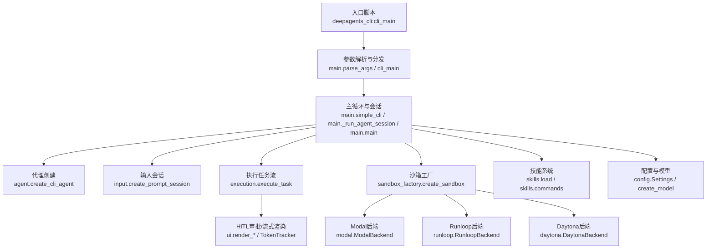
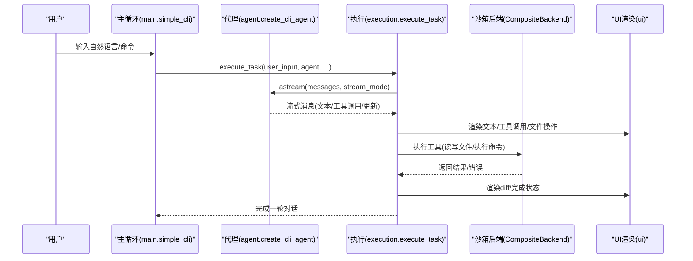
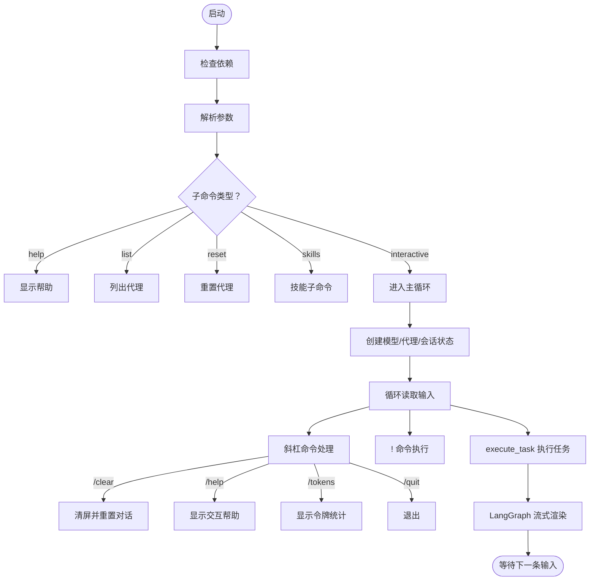
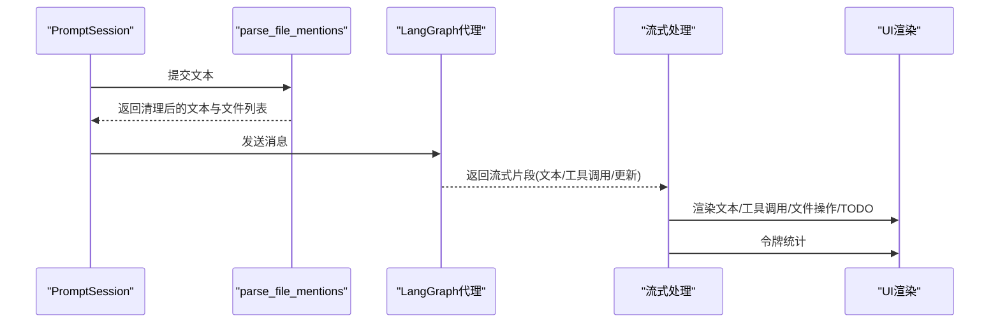
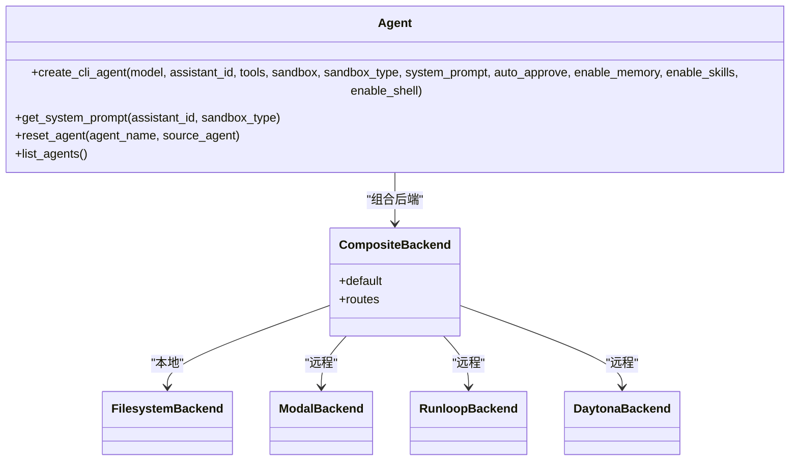
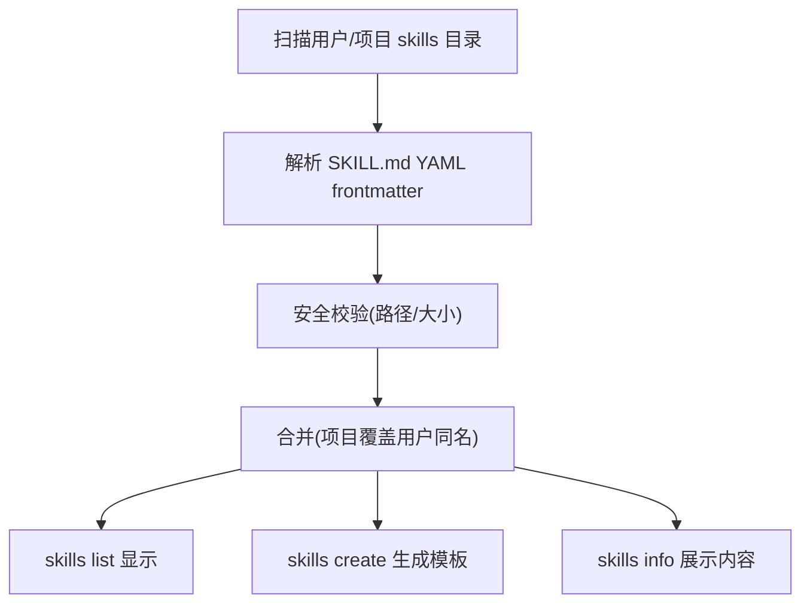
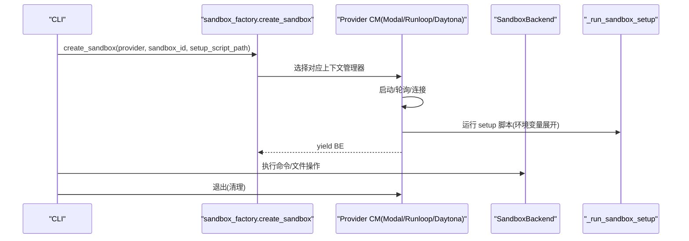
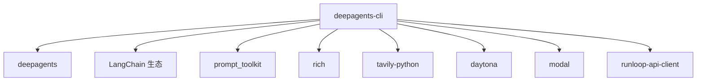

# CLI工具

<cite>
**本文引用的文件**
- [main.py](file://libs/deepagents-cli/deepagents_cli/main.py)
- [commands.py](file://libs/deepagents-cli/deepagents_cli/commands.py)
- [input.py](file://libs/deepagents-cli/deepagents_cli/input.py)
- [ui.py](file://libs/deepagents-cli/deepagents_cli/ui.py)
- [config.py](file://libs/deepagents-cli/deepagents_cli/config.py)
- [agent.py](file://libs/deepagents-cli/deepagents_cli/agent.py)
- [execution.py](file://libs/deepagents-cli/deepagents_cli/execution.py)
- [sandbox_factory.py](file://libs/deepagents-cli/deepagents_cli/integrations/sandbox_factory.py)
- [modal.py](file://libs/deepagents-cli/deepagents_cli/integrations/modal.py)
- [runloop.py](file://libs/deepagents-cli/deepagents_cli/integrations/runloop.py)
- [daytona.py](file://libs/deepagents-cli/deepagents_cli/integrations/daytona.py)
- [load.py](file://libs/deepagents-cli/deepagents_cli/skills/load.py)
- [commands.py（技能）](file://libs/deepagents-cli/deepagents_cli/skills/commands.py)
- [default_agent_prompt.md](file://libs/deepagents-cli/deepagents_cli/default_agent_prompt.md)
- [pyproject.toml](file://libs/deepagents-cli/pyproject.toml)
</cite>

## 目录
1. [简介](#简介)
2. [项目结构](#项目结构)
3. [核心组件](#核心组件)
4. [架构总览](#架构总览)
5. [详细组件分析](#详细组件分析)
6. [依赖关系分析](#依赖关系分析)
7. [性能考虑](#性能考虑)
8. [故障排查指南](#故障排查指南)
9. [结论](#结论)
10. [附录](#附录)

## 简介
本文件面向使用者与开发者，系统化梳理 deepagents CLI 的设计与实现，覆盖交互式命令行界面、启动流程、用户输入处理与响应渲染；代理管理（创建、重置、列出）；技能系统（加载、执行与管理命令）；以及与外部沙箱环境（Daytona、Modal、Runloop）的集成方式（基于工厂模式的 sandbox_factory）。同时给出 default_agent_prompt.md 中定义的默认提示工程细节，并提供使用 CLI 解决实际任务的完整示例与与核心库的依赖关系说明。

## 项目结构
deepagents-cli 是一个独立的命令行应用，入口脚本注册为 deepagents 与 deepagents-cli，主要模块组织如下：
- 入口与主循环：main.py
- 命令解析与子命令：commands.py、skills/commands.py
- 输入与编辑器支持：input.py
- UI 渲染与令牌统计：ui.py
- 配置与模型选择：config.py
- 代理创建与系统提示：agent.py
- 任务执行与流式渲染：execution.py
- 沙箱集成与工厂：integrations/sandbox_factory.py 及 modal.py、runloop.py、daytona.py
- 技能系统：skills/load.py、skills/commands.py
- 默认提示工程：default_agent_prompt.md
- 包配置：pyproject.toml

图表来源
- [main.py](file://libs/deepagents-cli/deepagents_cli/main.py#L325-L432)
- [agent.py](file://libs/deepagents-cli/deepagents_cli/agent.py#L326-L467)
- [input.py](file://libs/deepagents-cli/deepagents_cli/input.py#L176-L324)
- [execution.py](file://libs/deepagents-cli/deepagents_cli/execution.py#L180-L683)
- [sandbox_factory.py](file://libs/deepagents-cli/deepagents_cli/integrations/sandbox_factory.py#L284-L349)
- [modal.py](file://libs/deepagents-cli/deepagents_cli/integrations/modal.py#L1-L127)
- [runloop.py](file://libs/deepagents-cli/deepagents_cli/integrations/runloop.py#L1-L125)
- [daytona.py](file://libs/deepagents-cli/deepagents_cli/integrations/daytona.py#L1-L118)
- [load.py](file://libs/deepagents-cli/deepagents_cli/skills/load.py#L1-L238)
- [commands.py（技能）](file://libs/deepagents-cli/deepagents_cli/skills/commands.py#L1-L474)
- [config.py](file://libs/deepagents-cli/deepagents_cli/config.py#L337-L412)

章节来源
- [pyproject.toml](file://libs/deepagents-cli/pyproject.toml#L1-L30)

## 核心组件
- 启动与主循环：负责解析参数、检查依赖、创建会话状态、选择本地或远程沙箱模式、运行交互式主循环。
- 输入处理：基于 prompt_toolkit 提供多行输入、自动补全、文件路径注入、命令补全、编辑器打开、双击 Ctrl+C 退出确认等。
- 执行管线：将用户输入转换为 LangGraph 流式消息，处理工具调用、HITL 审批、文件操作记录与渲染、令牌统计。
- 代理管理：创建带内存中间件、技能中间件、可选 Shell 中间件的代理图，支持本地与远程沙箱。
- 沙箱集成：统一工厂接口 create_sandbox，按 Modal、Runloop、Daytona 分别实现生命周期管理与 setup 脚本执行。
- 技能系统：从用户与项目目录扫描 SKILL.md，解析 YAML frontmatter，提供 list/create/info 子命令。
- UI 与令牌：格式化工具显示、文件操作摘要与 diff、todo 列表渲染、令牌统计与会话展示。
- 配置与模型：检测 API Key，选择 OpenAI/Anthropic/Google 模型，提供全局 Settings 与 SessionState。

章节来源
- [main.py](file://libs/deepagents-cli/deepagents_cli/main.py#L133-L432)
- [input.py](file://libs/deepagents-cli/deepagents_cli/input.py#L1-L324)
- [execution.py](file://libs/deepagents-cli/deepagents_cli/execution.py#L180-L683)
- [agent.py](file://libs/deepagents-cli/deepagents_cli/agent.py#L1-L467)
- [sandbox_factory.py](file://libs/deepagents-cli/deepagents_cli/integrations/sandbox_factory.py#L1-L349)
- [load.py](file://libs/deepagents-cli/deepagents_cli/skills/load.py#L1-L238)
- [commands.py（技能）](file://libs/deepagents-cli/deepagents_cli/skills/commands.py#L1-L474)
- [ui.py](file://libs/deepagents-cli/deepagents_cli/ui.py#L1-L640)
- [config.py](file://libs/deepagents-cli/deepagents_cli/config.py#L1-L412)

## 架构总览
CLI 采用“主循环 + 中间件栈 + 外部沙箱”的分层架构：
- 主循环负责输入、命令处理、任务调度与异常处理。
- 中间件栈包含记忆、技能、Shell（仅本地）、HITL 审批。
- 沙箱后端统一实现执行、上传下载文件能力，屏蔽 Modal/Runloop/Daytona 差异。
- 任务执行采用 LangGraph 流式更新，支持工具调用、HITL 请求与 todo 列表。

图表来源
- [main.py](file://libs/deepagents-cli/deepagents_cli/main.py#L133-L323)
- [agent.py](file://libs/deepagents-cli/deepagents_cli/agent.py#L326-L467)
- [execution.py](file://libs/deepagents-cli/deepagents_cli/execution.py#L180-L683)
- [ui.py](file://libs/deepagents-cli/deepagents_cli/ui.py#L1-L640)

## 详细组件分析

### 交互式命令行界面与启动流程
- 依赖检查：在启动前检查 rich、requests、dotenv、tavily、prompt_toolkit 是否安装，缺失时提示安装方式。
- 参数解析：支持 list、help、reset、skills 子命令，以及交互式模式的 --agent、--auto-approve、--sandbox、--sandbox-id、--sandbox-setup、--no-splash。
- 主循环：清屏、打印启动横幅与沙箱信息、显示工作目录与提示、创建 PromptSession 与 TokenTracker、循环读取用户输入。
- 命令优先级：以斜杠开头的 / 命令优先处理（help、clear、tokens、quit），以感叹号开头的 ! 命令作为 Bash 执行，空输入跳过，quit/exit/q 直接退出。
- 会话状态：SessionState 维护 auto-approve、no_splash、线程标识与退出确认窗口。

图表来源
- [main.py](file://libs/deepagents-cli/deepagents_cli/main.py#L32-L129)
- [main.py](file://libs/deepagents-cli/deepagents_cli/main.py#L133-L323)
- [commands.py](file://libs/deepagents-cli/deepagents_cli/commands.py#L1-L90)
- [input.py](file://libs/deepagents-cli/deepagents_cli/input.py#L176-L324)
- [ui.py](file://libs/deepagents-cli/deepagents_cli/ui.py#L539-L640)

章节来源
- [main.py](file://libs/deepagents-cli/deepagents_cli/main.py#L32-L129)
- [main.py](file://libs/deepagents-cli/deepagents_cli/main.py#L133-L323)
- [commands.py](file://libs/deepagents-cli/deepagents_cli/commands.py#L1-L90)
- [input.py](file://libs/deepagents-cli/deepagents_cli/input.py#L1-L324)
- [ui.py](file://libs/deepagents-cli/deepagents_cli/ui.py#L1-L200)

### 用户输入处理与响应渲染
- 输入会话：基于 prompt_toolkit，支持多行输入、Esc+Enter 插入换行、Ctrl+E 打开外部编辑器、Ctrl+T 切换 auto-approve、双击 Ctrl+C 退出确认。
- 自动补全：@ 文件路径补全（含转义空格）、/ 命令补全；补全菜单保留空间，异步补全避免阻塞。
- 文件引用：支持在输入中使用 @filename 注入文件内容，自动解析并限制大小。
- 流式渲染：LangGraph 消息流中分别处理文本块、工具调用块、更新块（HITL 与 todo），工具调用以简洁形式显示，文件操作以摘要与 diff 展示，todo 列表以面板渲染。
- 令牌统计：首次消息后开始统计，支持 /tokens 查看会话令牌使用情况。

图表来源
- [input.py](file://libs/deepagents-cli/deepagents_cli/input.py#L1-L324)
- [execution.py](file://libs/deepagents-cli/deepagents_cli/execution.py#L180-L683)
- [ui.py](file://libs/deepagents-cli/deepagents_cli/ui.py#L1-L200)

章节来源
- [input.py](file://libs/deepagents-cli/deepagents_cli/input.py#L1-L324)
- [execution.py](file://libs/deepagents-cli/deepagents_cli/execution.py#L180-L683)
- [ui.py](file://libs/deepagents-cli/deepagents_cli/ui.py#L1-L200)

### 代理管理机制（创建、重置、列出）
- 创建代理：根据是否启用内存、技能、Shell 中间件构建 CompositeBackend，本地模式使用 FilesystemBackend，远程模式使用 SandboxBackendProtocol 实现（Modal/Runloop/Daytona）。
- 系统提示：根据是否处于沙箱模式动态生成当前工作目录、技能目录、HITL 使用规范、网络搜索使用规范、todo 管理规范等。
- 重置代理：删除目标代理目录并重新生成 agent.md（默认编码指令或复制源代理）。
- 列出代理：遍历 ~/.deepagents 下的代理目录，显示 agent.md 是否存在。

图表来源
- [agent.py](file://libs/deepagents-cli/deepagents_cli/agent.py#L1-L467)
- [sandbox_factory.py](file://libs/deepagents-cli/deepagents_cli/integrations/sandbox_factory.py#L1-L349)
- [modal.py](file://libs/deepagents-cli/deepagents_cli/integrations/modal.py#L1-L127)
- [runloop.py](file://libs/deepagents-cli/deepagents_cli/integrations/runloop.py#L1-L125)
- [daytona.py](file://libs/deepagents-cli/deepagents_cli/integrations/daytona.py#L1-L118)

章节来源
- [agent.py](file://libs/deepagents-cli/deepagents_cli/agent.py#L1-L188)
- [agent.py](file://libs/deepagents-cli/deepagents_cli/agent.py#L189-L467)

### 技能系统（加载、执行与管理命令）
- 加载策略：扫描用户与项目 skills 目录，按目录名查找 SKILL.md，解析 YAML frontmatter（name/description 必填），支持最大文件大小限制与安全路径校验，项目技能可覆盖用户技能同名项。
- 管理命令：skills list（支持 --agent 与 --project）、skills create（创建模板 SKILL.md，支持 --agent 与 --project）、skills info（显示 SKILL.md 内容与支持文件）。
- 执行流程：技能中间件在代理中启用时，工具调用与文件操作由 CompositeBackend 提供，技能脚本通过 execute/bash 在沙箱中运行。

图表来源
- [load.py](file://libs/deepagents-cli/deepagents_cli/skills/load.py#L1-L238)
- [commands.py（技能）](file://libs/deepagents-cli/deepagents_cli/skills/commands.py#L1-L474)

章节来源
- [load.py](file://libs/deepagents-cli/deepagents_cli/skills/load.py#L1-L238)
- [commands.py（技能）](file://libs/deepagents-cli/deepagents_cli/skills/commands.py#L1-L474)

### 与外部沙箱环境的集成（工厂模式）
- 工厂接口：create_sandbox(provider, sandbox_id, setup_script_path)，内部映射到 Modal/Runloop/Daytona 的上下文管理器。
- 生命周期：Modal/Runloop/Daytona 启动、轮询就绪、执行 setup 脚本（支持环境变量展开）、yield 后端实例、退出时清理。
- 后端实现：ModalBackend/RunloopBackend/DaytonaBackend 统一实现 execute/download/upload，适配不同 SDK 的 API。
- 工作目录：不同提供商有默认工作目录映射，用于系统提示与路径指引。

图表来源
- [sandbox_factory.py](file://libs/deepagents-cli/deepagents_cli/integrations/sandbox_factory.py#L1-L349)
- [modal.py](file://libs/deepagents-cli/deepagents_cli/integrations/modal.py#L1-L127)
- [runloop.py](file://libs/deepagents-cli/deepagents_cli/integrations/runloop.py#L1-L125)
- [daytona.py](file://libs/deepagents-cli/deepagents_cli/integrations/daytona.py#L1-L118)

章节来源
- [sandbox_factory.py](file://libs/deepagents-cli/deepagents_cli/integrations/sandbox_factory.py#L1-L349)
- [modal.py](file://libs/deepagents-cli/deepagents_cli/integrations/modal.py#L1-L127)
- [runloop.py](file://libs/deepagents-cli/deepagents_cli/integrations/runloop.py#L1-L125)
- [daytona.py](file://libs/deepagents-cli/deepagents_cli/integrations/daytona.py#L1-L118)

### 默认提示工程（default_agent_prompt.md）
- 角色与协议：强调“内存优先协议”，会话开始检查 /memories/，回答前优先读取已有知识，学习新信息时写入持久化记忆。
- 行为风格：简洁直接、少于若干行、先答后做、遵循约定、避免不必要介绍与结论。
- 任务管理：使用 write_todos 管理复杂多步骤任务，建议 3-6 项，简单任务直接执行。
- 文件读取最佳实践：大文件分页读取，探索代码库时先扫描再精读，避免上下文溢出。
- 子代理协作：使用文件进行大 I/O，支持并行子代理，明确规格，主代理整合结果。
- 工具清单：execute_bash、read_file/write_file/edit_file/ls/glob/grep、web_search、http_request。
- 代码引用：使用 file_path:line_number 格式。
- 文档规范：完成工作后不创建过多文档，除非明确要求。
- 与 CLI 的衔接：系统提示中包含技能目录、HITL 使用规范、网络搜索使用规范、todo 管理规范，确保在本地与远程沙箱模式下行为一致。

章节来源
- [default_agent_prompt.md](file://libs/deepagents-cli/deepagents_cli/default_agent_prompt.md#L1-L112)
- [agent.py](file://libs/deepagents-cli/deepagents_cli/agent.py#L94-L188)

### 使用 CLI 解决实际任务的完整示例
以下示例展示如何使用 CLI 完成“基于 arXiv 的生物信息学研究”任务（概念性流程，非具体代码）：
1. 启动 CLI 并选择沙箱（例如 runloop 或 modal）以获得可复现的远程环境。
2. 使用 skills list 查看可用技能，确认已安装 arxiv-search 技能。
3. 使用 skills info arxiv-search 查看技能说明与使用方法。
4. 在交互式会话中输入任务描述，例如“搜索最近关于蛋白质折叠预测的 arXiv 论文，返回摘要与链接”。
5. 代理根据系统提示与技能指导，调用 execute/bash 执行技能脚本，从 arXiv 获取结果。
6. 代理将结果整理为自然语言回答，并在需要时使用 write_file 将报告保存到本地。
7. 使用 /tokens 查看本次会话的令牌消耗，使用 /clear 清屏重置会话。

章节来源
- [commands.py（技能）](file://libs/deepagents-cli/deepagents_cli/skills/commands.py#L366-L474)
- [examples/skills/arxiv-search/SKILL.md](file://libs/deepagents-cli/examples/skills/arxiv-search/SKILL.md#L1-L103)
- [execution.py](file://libs/deepagents-cli/deepagents_cli/execution.py#L180-L683)

## 依赖关系分析
- CLI 与核心库：
  - deepagents：提供 create_deep_agent、CompositeBackend、SandboxBackendProtocol 等核心能力。
  - LangChain 生态：langchain-openai、langchain-anthropic、langchain-google-genai、langchain 等，用于模型接入与工具链。
  - prompt_toolkit：交互式输入与编辑器支持。
  - rich：富文本输出与面板渲染。
  - tavily-python：网络搜索工具。
  - daytona、modal、runloop-api-client：远程沙箱后端。
- 包导出：注册 deepagents 与 deepagents-cli 两个入口脚本，指向 deepagents_cli:cli_main。

图表来源
- [pyproject.toml](file://libs/deepagents-cli/pyproject.toml#L1-L30)
- [config.py](file://libs/deepagents-cli/deepagents_cli/config.py#L363-L412)

章节来源
- [pyproject.toml](file://libs/deepagents-cli/pyproject.toml#L1-L30)
- [config.py](file://libs/deepagents-cli/deepagents_cli/config.py#L363-L412)

## 性能考虑
- 流式渲染：LangGraph 流式消息减少等待时间，工具调用与文件操作完成后即时渲染，避免长尾阻塞。
- 令牌统计：仅在首次消息后开始统计，避免重复计算工具定义带来的开销。
- 文件引用：对 @ 引用的文件内容进行大小限制，防止超大文件导致上下文膨胀。
- 沙箱执行：Modal/Runloop/Daytona 的执行与文件传输采用批量 API（如 Daytona 的批量上传/下载），提升效率。
- 终端渲染：diff 渲染按终端宽度折行，避免过宽导致滚动卡顿。

[本节为通用指导，无需特定文件分析]

## 故障排查指南
- 缺少依赖：启动时报错提示缺少 rich、requests、dotenv、tavily-python、prompt-toolkit，按提示安装相应包。
- API Key 未配置：create_model 会在未检测到 OPENAI/ANTHROPIC/GOOGLE API Key 时终止并提示设置方式。
- 沙箱创建失败：Modal/Runloop/Daytona 启动超时或连接失败会抛出异常并退出；检查环境变量（DAYTONA_API_KEY、RUNLOOP_API_KEY）与网络连通性。
- Bash 命令超时：! 命令默认 30 秒超时，超时会提示；可在本地模式下调整或缩短命令。
- HITL 拒绝：用户拒绝工具调用时，代理会提示下一步操作；可切换 auto-approve 模式或调整工具调用策略。
- 令牌统计：首次消息前不会显示工具定义的令牌计数，属于预期行为。

章节来源
- [main.py](file://libs/deepagents-cli/deepagents_cli/main.py#L32-L129)
- [config.py](file://libs/deepagents-cli/deepagents_cli/config.py#L363-L412)
- [sandbox_factory.py](file://libs/deepagents-cli/deepagents_cli/integrations/sandbox_factory.py#L1-L349)
- [commands.py](file://libs/deepagents-cli/deepagents_cli/commands.py#L53-L90)
- [ui.py](file://libs/deepagents-cli/deepagents_cli/ui.py#L208-L235)

## 结论
deepagents CLI 通过清晰的模块划分与中间件架构，实现了从交互输入到工具调用、文件操作与远程沙箱执行的完整闭环。其工厂化的沙箱集成与技能系统扩展性强，配合默认提示工程确保行为一致性与安全性。对于日常任务，建议结合技能系统与远程沙箱以获得稳定且可复现的执行环境。

[本节为总结，无需特定文件分析]

## 附录
- 常用命令速查：
  - deepagents：启动交互式会话
  - deepagents list：列出所有代理
  - deepagents reset --agent NAME [--target SOURCE]：重置代理
  - deepagents skills list [--agent AGENT] [--project]：列出技能
  - deepagents skills create NAME [--agent AGENT] [--project]：创建技能模板
  - deepagents skills info NAME [--agent AGENT] [--project]：查看技能详情
  - deepagents --sandbox modal/runloop/daytona [--sandbox-id ID] [--sandbox-setup PATH]：在指定沙箱中运行
- 交互命令：
  - /help、/clear、/tokens、/quit、/exit
  - @filename：自动补全并注入文件内容
  - !command：执行 Bash 命令
  - Ctrl+E：打开外部编辑器
  - Ctrl+T：切换 auto-approve 模式

章节来源
- [ui.py](file://libs/deepagents-cli/deepagents_cli/ui.py#L491-L640)
- [commands.py（技能）](file://libs/deepagents-cli/deepagents_cli/skills/commands.py#L366-L474)
- [main.py](file://libs/deepagents-cli/deepagents_cli/main.py#L325-L432)