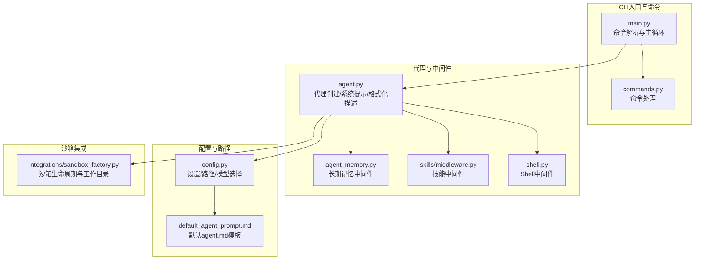
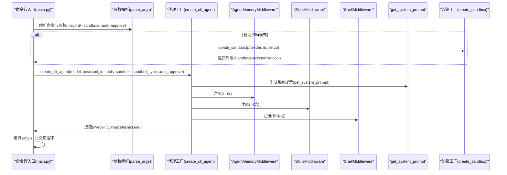
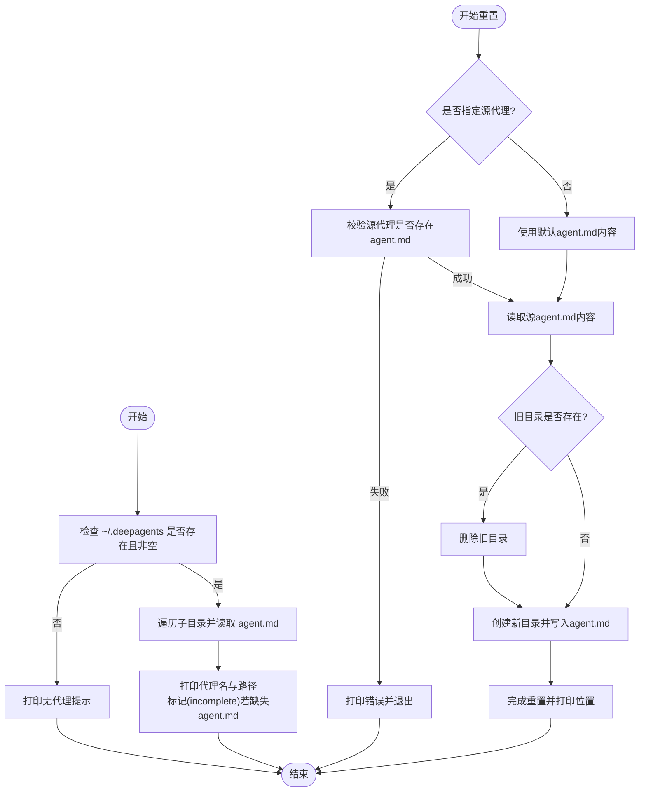
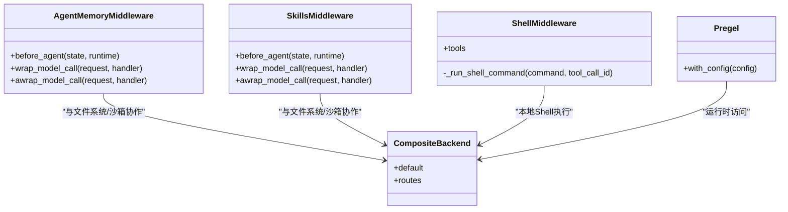
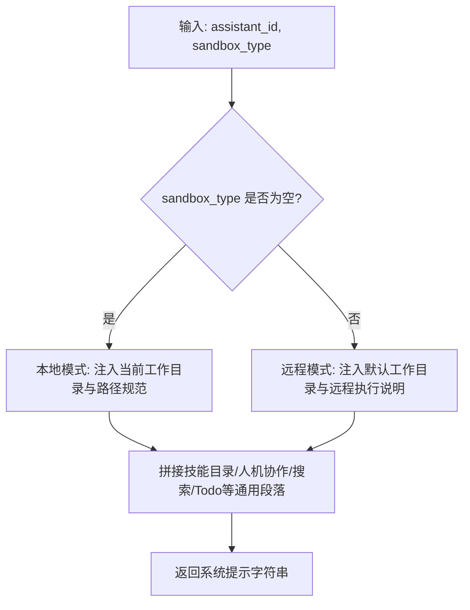
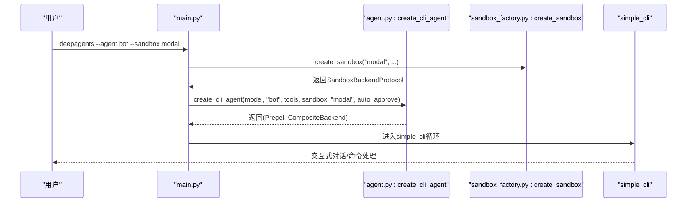
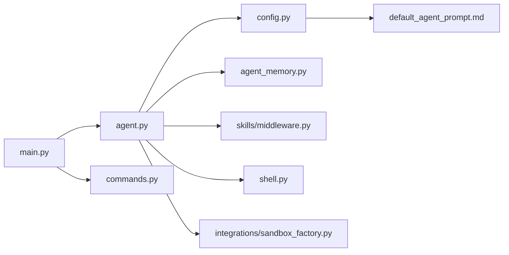

# 代理管理

<cite>
**本文引用的文件**
- [agent.py](file://libs/deepagents-cli/deepagents_cli/agent.py)
- [main.py](file://libs/deepagents-cli/deepagents_cli/main.py)
- [config.py](file://libs/deepagents-cli/deepagents_cli/config.py)
- [default_agent_prompt.md](file://libs/deepagents-cli/deepagents_cli/default_agent_prompt.md)
- [agent_memory.py](file://libs/deepagents-cli/deepagents_cli/agent_memory.py)
- [skills/middleware.py](file://libs/deepagents-cli/deepagents_cli/skills/middleware.py)
- [shell.py](file://libs/deepagents-cli/deepagents_cli/shell.py)
- [integrations/sandbox_factory.py](file://libs/deepagents-cli/deepagents_cli/integrations/sandbox_factory.py)
- [commands.py](file://libs/deepagents-cli/deepagents_cli/commands.py)
- [test_agent.py](file://libs/deepagents-cli/tests/unit_tests/test_agent.py)
- [test_config.py](file://libs/deepagents-cli/tests/unit_tests/test_config.py)
</cite>

## 目录
1. [简介](#简介)
2. [项目结构](#项目结构)
3. [核心组件](#核心组件)
4. [架构总览](#架构总览)
5. [详细组件分析](#详细组件分析)
6. [依赖关系分析](#依赖关系分析)
7. [性能考量](#性能考量)
8. [故障排查指南](#故障排查指南)
9. [结论](#结论)
10. [附录](#附录)

## 简介
本章节聚焦于CLI工具中的“代理管理”能力，围绕以下目标展开：
- 解释list_agents与reset_agent函数如何实现代理实例的列出与重置。
- 说明create_cli_agent工厂函数如何根据配置灵活创建代理实例，包括内存、技能与Shell中间件的启用/禁用。
- 描述get_system_prompt函数如何依据沙箱类型生成系统提示。
- 提供代理创建与管理的完整工作流程示例，并讨论其与持久化存储和配置系统的集成方式。

## 项目结构
代理管理相关的核心代码位于deepagents-cli包内，涉及代理创建、系统提示生成、中间件装配、沙箱集成以及命令行入口等模块。

图表来源
- [main.py](file://libs/deepagents-cli/deepagents_cli/main.py#L1-L120)
- [agent.py](file://libs/deepagents-cli/deepagents_cli/agent.py#L1-L120)
- [config.py](file://libs/deepagents-cli/deepagents_cli/config.py#L1-L120)
- [default_agent_prompt.md](file://libs/deepagents-cli/deepagents_cli/default_agent_prompt.md#L1-L40)
- [agent_memory.py](file://libs/deepagents-cli/deepagents_cli/agent_memory.py#L1-L80)
- [skills/middleware.py](file://libs/deepagents-cli/deepagents_cli/skills/middleware.py#L1-L60)
- [shell.py](file://libs/deepagents-cli/deepagents_cli/shell.py#L1-L60)
- [integrations/sandbox_factory.py](file://libs/deepagents-cli/deepagents_cli/integrations/sandbox_factory.py#L1-L80)

章节来源
- [main.py](file://libs/deepagents-cli/deepagents_cli/main.py#L1-L120)
- [agent.py](file://libs/deepagents-cli/deepagents_cli/agent.py#L1-L120)
- [config.py](file://libs/deepagents-cli/deepagents_cli/config.py#L1-L120)

## 核心组件
- 代理创建工厂：create_cli_agent负责按需装配中间件、系统提示与检查点，返回可执行的LangGraph图与复合后端。
- 系统提示生成：get_system_prompt根据沙箱类型动态注入工作目录与安全指引。
- 代理管理命令：list_agents用于枚举用户级代理目录；reset_agent用于重置或从其他代理复制agent.md。
- 中间件栈：AgentMemoryMiddleware、SkillsMiddleware、ShellMiddleware按开关启用，分别提供长期记忆、技能发现与本地Shell执行。
- 沙箱集成：通过sandbox_factory统一创建Modal/Runloop/Daytona沙箱，提供远程执行与工作目录映射。

章节来源
- [agent.py](file://libs/deepagents-cli/deepagents_cli/agent.py#L29-L188)
- [agent.py](file://libs/deepagents-cli/deepagents_cli/agent.py#L326-L467)
- [agent_memory.py](file://libs/deepagents-cli/deepagents_cli/agent_memory.py#L171-L329)
- [skills/middleware.py](file://libs/deepagents-cli/deepagents_cli/skills/middleware.py#L102-L278)
- [shell.py](file://libs/deepagents-cli/deepagents_cli/shell.py#L15-L139)
- [integrations/sandbox_factory.py](file://libs/deepagents-cli/deepagents_cli/integrations/sandbox_factory.py#L269-L348)

## 架构总览
下图展示CLI启动到代理会话的关键调用链路，包括命令解析、代理创建、系统提示与中间件装配、沙箱生命周期以及交互循环。

图表来源
- [main.py](file://libs/deepagents-cli/deepagents_cli/main.py#L133-L210)
- [main.py](file://libs/deepagents-cli/deepagents_cli/main.py#L271-L386)
- [agent.py](file://libs/deepagents-cli/deepagents_cli/agent.py#L326-L467)
- [integrations/sandbox_factory.py](file://libs/deepagents-cli/deepagents_cli/integrations/sandbox_factory.py#L284-L348)

## 详细组件分析

### 列出与重置代理：list_agents 与 reset_agent
- list_agents
  - 作用：遍历用户级代理目录(~/.deepagents)，打印每个代理名称及其路径；若目录不完整则标注(incomplete)。
  - 行为：当目录不存在或为空时，提示无代理并引导首次使用。
- reset_agent
  - 作用：将指定代理目录删除并重建，写入默认agent.md或从另一个代理复制agent.md。
  - 选项：支持从源代理复制，便于快速迁移或复用配置。

图表来源
- [agent.py](file://libs/deepagents-cli/deepagents_cli/agent.py#L29-L91)
- [config.py](file://libs/deepagents-cli/deepagents_cli/config.py#L196-L216)

章节来源
- [agent.py](file://libs/deepagents-cli/deepagents_cli/agent.py#L29-L91)
- [config.py](file://libs/deepagents-cli/deepagents_cli/config.py#L196-L216)

### create_cli_agent 工厂函数：中间件与沙箱装配
- 输入参数要点
  - model：语言模型实例或字符串标识。
  - assistant_id：代理标识，用于持久化存储与路径组织。
  - tools：附加工具列表，默认为空。
  - sandbox：远程沙箱后端；为None时使用本地文件系统与Shell。
  - sandbox_type：沙箱类型，用于系统提示生成与工作目录映射。
  - system_prompt：可覆盖默认系统提示。
  - auto_approve：自动批准工具调用，关闭人类在环(HITL)。
  - enable_memory/enable_skills/enable_shell：控制中间件启用。
- 中间件装配策略
  - 本地模式：CompositeBackend默认为FilesystemBackend；可选启用AgentMemoryMiddleware、SkillsMiddleware、ShellMiddleware。
  - 远程沙箱模式：CompositeBackend默认为传入的SandboxBackendProtocol；可选启用AgentMemoryMiddleware与SkillsMiddleware；ShellMiddleware不启用。
- 系统提示与HITL
  - 若未提供system_prompt，则调用get_system_prompt生成；否则直接使用。
  - auto_approve为True时，interrupt_on为空；否则为破坏性工具配置HITL描述格式化函数。
- 返回值
  - 返回(Pregel, CompositeBackend)，其中Pregel为可执行的LangGraph图，CompositeBackend为文件操作后端。

图表来源
- [agent.py](file://libs/deepagents-cli/deepagents_cli/agent.py#L326-L467)
- [agent_memory.py](file://libs/deepagents-cli/deepagents_cli/agent_memory.py#L171-L329)
- [skills/middleware.py](file://libs/deepagents-cli/deepagents_cli/skills/middleware.py#L102-L278)
- [shell.py](file://libs/deepagents-cli/deepagents_cli/shell.py#L15-L139)

章节来源
- [agent.py](file://libs/deepagents-cli/deepagents_cli/agent.py#L326-L467)

### get_system_prompt：基于沙箱类型的系统提示
- 本地模式
  - 注入当前工作目录与绝对路径规则，强调本地文件系统与路径规范。
- 远程沙箱模式
  - 注入默认工作目录与远程执行说明，强调CLI本地、代理远程的分工。
- 共同部分
  - 技能目录位置与使用指引。
  - 人机协作(HITL)工具审批流程与最佳实践。
  - 网络搜索与待办事项管理建议。

图表来源
- [agent.py](file://libs/deepagents-cli/deepagents_cli/agent.py#L94-L188)
- [integrations/sandbox_factory.py](file://libs/deepagents-cli/deepagents_cli/integrations/sandbox_factory.py#L326-L348)

章节来源
- [agent.py](file://libs/deepagents-cli/deepagents_cli/agent.py#L94-L188)
- [integrations/sandbox_factory.py](file://libs/deepagents-cli/deepagents_cli/integrations/sandbox_factory.py#L326-L348)

### 代理创建与管理的完整工作流程示例
- 场景一：本地交互
  - CLI解析参数，调用create_cli_agent创建本地代理，启用AgentMemoryMiddleware、SkillsMiddleware与ShellMiddleware。
  - 生成系统提示，配置HITL或自动批准，返回Pregel与CompositeBackend。
  - 进入simple_cli循环，处理slash命令与bash命令，执行任务。
- 场景二：远程沙箱
  - 通过create_sandbox创建Modal/Runloop/Daytona沙箱，返回SandboxBackendProtocol。
  - create_cli_agent以该后端作为CompositeBackend默认，启用AgentMemoryMiddleware与SkillsMiddleware，禁用ShellMiddleware。
  - 生成系统提示并进入交互循环，所有文件与执行均在沙箱内进行。

图表来源
- [main.py](file://libs/deepagents-cli/deepagents_cli/main.py#L325-L386)
- [agent.py](file://libs/deepagents-cli/deepagents_cli/agent.py#L326-L467)
- [integrations/sandbox_factory.py](file://libs/deepagents-cli/deepagents_cli/integrations/sandbox_factory.py#L284-L348)

章节来源
- [main.py](file://libs/deepagents-cli/deepagents_cli/main.py#L325-L386)
- [agent.py](file://libs/deepagents-cli/deepagents_cli/agent.py#L326-L467)

### 与持久化存储和配置系统的集成
- 代理目录与agent.md
  - Settings.ensure_agent_dir与get_agent_dir确保代理目录存在；首次创建时写入默认agent.md。
  - AgentMemoryMiddleware在每次会话前加载用户与项目级agent.md，注入到系统提示中。
- 技能系统
  - SkillsMiddleware在会话开始时扫描用户与项目技能目录，将技能元数据注入系统提示，实现“渐进披露”。
- 模型与API密钥
  - create_model根据环境变量选择OpenAI/Anthropic/Google模型；若均未配置则报错并退出。
- 项目检测
  - _find_project_root与_find_project_agent_md用于定位.git根目录与项目级agent.md，支持多层合并。

章节来源
- [config.py](file://libs/deepagents-cli/deepagents_cli/config.py#L196-L216)
- [config.py](file://libs/deepagents-cli/deepagents_cli/config.py#L230-L331)
- [config.py](file://libs/deepagents-cli/deepagents_cli/config.py#L353-L412)
- [agent_memory.py](file://libs/deepagents-cli/deepagents_cli/agent_memory.py#L171-L329)
- [skills/middleware.py](file://libs/deepagents-cli/deepagents_cli/skills/middleware.py#L102-L278)
- [test_config.py](file://libs/deepagents-cli/tests/unit_tests/test_config.py#L1-L110)

## 依赖关系分析
- 组件耦合
  - agent.py是中心枢纽，依赖config.py（路径/设置）、integrations/sandbox_factory.py（沙箱）、agent_memory.py与skills/middleware.py（中间件）。
  - main.py依赖agent.py进行代理创建，依赖commands.py处理slash命令与bash执行。
- 外部依赖
  - 沙箱提供商SDK（Modal/Runloop/Daytona）在运行时导入，未强制要求安装，避免影响本地使用。
- 循环依赖
  - 未发现直接循环依赖；各模块职责清晰，通过函数调用解耦。

图表来源
- [main.py](file://libs/deepagents-cli/deepagents_cli/main.py#L1-L120)
- [agent.py](file://libs/deepagents-cli/deepagents_cli/agent.py#L1-L120)
- [config.py](file://libs/deepagents-cli/deepagents_cli/config.py#L1-L120)
- [default_agent_prompt.md](file://libs/deepagents-cli/deepagents_cli/default_agent_prompt.md#L1-L40)
- [agent_memory.py](file://libs/deepagents-cli/deepagents_cli/agent_memory.py#L1-L80)
- [skills/middleware.py](file://libs/deepagents-cli/deepagents_cli/skills/middleware.py#L1-L60)
- [shell.py](file://libs/deepagents-cli/deepagents_cli/shell.py#L1-L60)
- [integrations/sandbox_factory.py](file://libs/deepagents-cli/deepagents_cli/integrations/sandbox_factory.py#L1-L80)

章节来源
- [main.py](file://libs/deepagents-cli/deepagents_cli/main.py#L1-L120)
- [agent.py](file://libs/deepagents-cli/deepagents_cli/agent.py#L1-L120)

## 性能考量
- 中间件开销
  - AgentMemoryMiddleware与SkillsMiddleware在每次模型调用前注入系统提示，属于轻量I/O与字符串拼接，通常可忽略。
- Shell中间件
  - ShellMiddleware执行外部进程，受超时与输出截断限制，避免长时间阻塞与内存膨胀。
- 沙箱通信
  - 远程沙箱执行通过后端协议传输，注意网络延迟与超时设置。
- 建议
  - 对频繁调用的工具（如web_search）合理设置缓存与去重。
  - 在自动批准模式下减少HITL交互成本，但需权衡安全性。

[本节为通用指导，无需特定文件引用]

## 故障排查指南
- 代理目录异常
  - 确认代理名称合法性（字母、数字、连字符、下划线、空格），否则会触发路径校验错误。
  - 使用list_agents确认代理目录是否存在agent.md；缺失时重置为默认或从其他代理复制。
- 沙箱创建失败
  - 检查对应提供商的API密钥与SDK安装情况；沙箱创建失败会直接抛出异常并终止。
- Web搜索不可用
  - 未配置TAVILY_API_KEY时，CLI会提示禁用Web搜索；设置后重启即可启用。
- 命令格式化与HITL
  - 若工具调用被拒绝，遵循提示重新规划任务或调整参数；格式化描述有助于明确风险。

章节来源
- [config.py](file://libs/deepagents-cli/deepagents_cli/config.py#L230-L268)
- [agent.py](file://libs/deepagents-cli/deepagents_cli/agent.py#L94-L188)
- [main.py](file://libs/deepagents-cli/deepagents_cli/main.py#L179-L191)
- [test_agent.py](file://libs/deepagents-cli/tests/unit_tests/test_agent.py#L1-L268)

## 结论
- list_agents与reset_agent提供了简洁而强大的代理管理入口，配合用户级与项目级agent.md实现个性化与可迁移的代理配置。
- create_cli_agent以可插拔中间件为核心，支持本地与远程沙箱两种执行模式，兼顾灵活性与安全性。
- get_system_prompt结合沙箱类型动态生成系统提示，强化路径规范、技能使用与人机协作的最佳实践。
- 与配置系统深度集成，确保代理目录、技能与模型选择的一致性与可维护性。

[本节为总结，无需特定文件引用]

## 附录
- 常用命令参考
  - 列出代理：deepagents list
  - 重置代理：deepagents reset --agent <name> [--target <other>]
  - 启动代理：deepagents --agent <name> [--sandbox modal|runloop|daytona] [--auto-approve]
- 测试覆盖
  - 单元测试覆盖了工具调用描述格式化、项目根目录与agent.md查找等关键逻辑。

章节来源
- [test_agent.py](file://libs/deepagents-cli/tests/unit_tests/test_agent.py#L1-L268)
- [test_config.py](file://libs/deepagents-cli/tests/unit_tests/test_config.py#L1-L110)