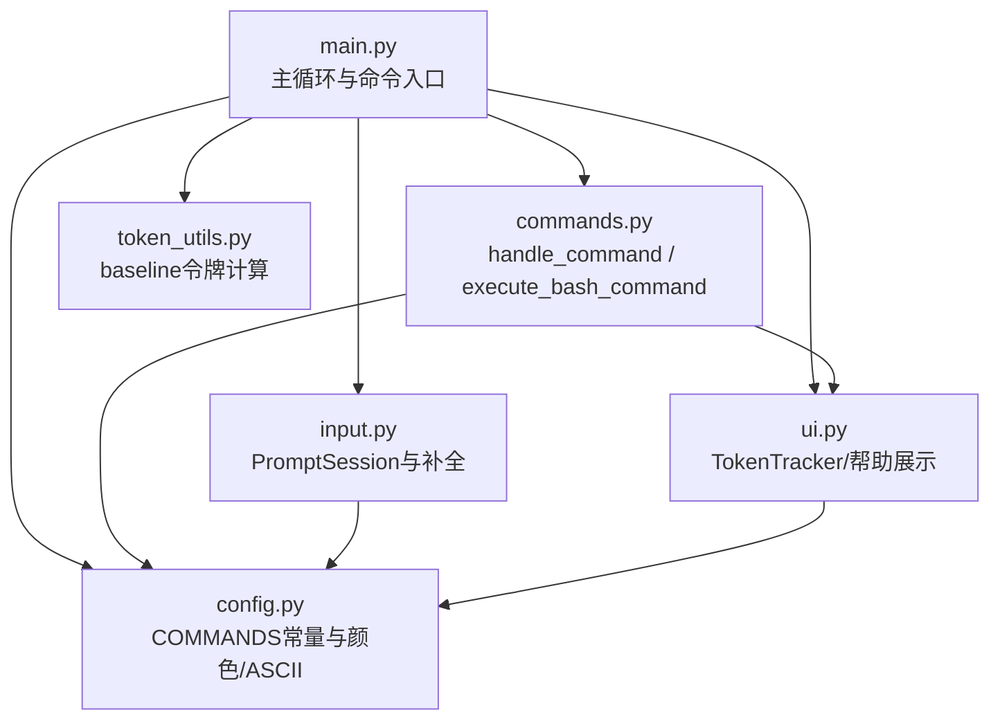
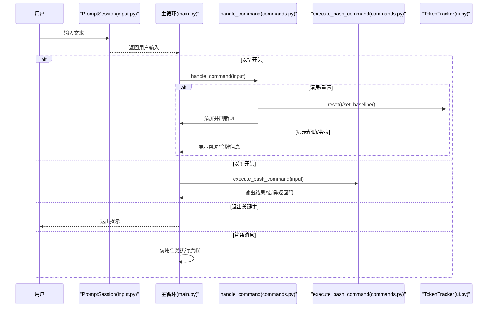
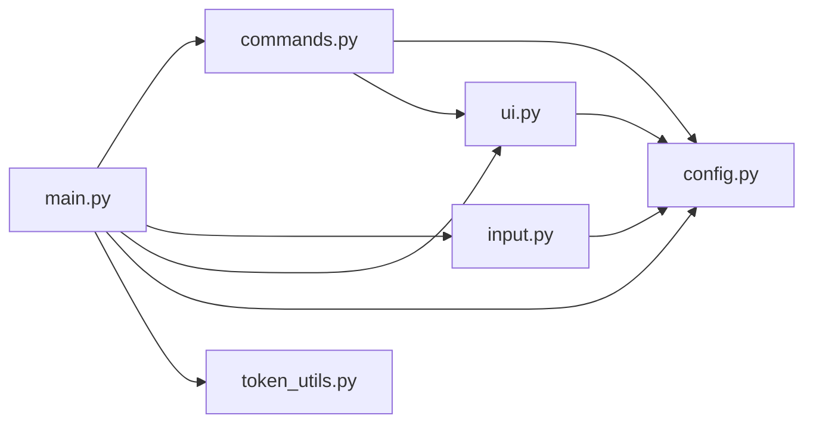

# 命令管理

<cite>
**本文引用的文件**
- [commands.py](file://libs/deepagents-cli/deepagents_cli/commands.py)
- [main.py](file://libs/deepagents-cli/deepagents_cli/main.py)
- [input.py](file://libs/deepagents-cli/deepagents_cli/input.py)
- [config.py](file://libs/deepagents-cli/deepagents_cli/config.py)
- [ui.py](file://libs/deepagents-cli/deepagents_cli/ui.py)
- [shell.py](file://libs/deepagents-cli/deepagents_cli/shell.py)
- [token_utils.py](file://libs/deepagents-cli/deepagents_cli/token_utils.py)
</cite>

## 目录
1. [简介](#简介)
2. [项目结构](#项目结构)
3. [核心组件](#核心组件)
4. [架构总览](#架构总览)
5. [详细组件分析](#详细组件分析)
6. [依赖关系分析](#依赖关系分析)
7. [性能考量](#性能考量)
8. [故障排查指南](#故障排查指南)
9. [结论](#结论)

## 简介
本节聚焦于CLI交互式命令管理，涵盖两类命令：
- 以“/”开头的内部命令：用于控制会话状态、显示帮助、查看令牌用量等。
- 以“!”开头的Bash命令执行：在本地安全地运行系统命令并捕获输出。

文档将详细说明 handle_command 函数如何处理内部命令并实现会话重置、帮助展示和令牌统计；execute_bash_command 如何安全地执行本地Bash命令并捕获输出；以及命令解析与执行流程如何与CLI主循环集成。

## 项目结构
命令管理相关代码主要分布在以下模块：
- 命令处理与执行：commands.py
- 主循环与命令入口：main.py
- 输入与补全：input.py
- 配置与常量：config.py
- UI与帮助展示：ui.py
- 代理侧Shell工具（供代理调用）：shell.py
- 令牌计数辅助：token_utils.py

图表来源
- [main.py](file://libs/deepagents-cli/deepagents_cli/main.py#L224-L269)
- [commands.py](file://libs/deepagents-cli/deepagents_cli/commands.py#L12-L90)
- [input.py](file://libs/deepagents-cli/deepagents_cli/input.py#L176-L324)
- [config.py](file://libs/deepagents-cli/deepagents_cli/config.py#L43-L51)
- [ui.py](file://libs/deepagents-cli/deepagents_cli/ui.py#L173-L235)
- [token_utils.py](file://libs/deepagents-cli/deepagents_cli/token_utils.py#L10-L78)

章节来源
- [main.py](file://libs/deepagents-cli/deepagents_cli/main.py#L224-L269)
- [commands.py](file://libs/deepagents-cli/deepagents_cli/commands.py#L12-L90)
- [input.py](file://libs/deepagents-cli/deepagents_cli/input.py#L176-L324)
- [config.py](file://libs/deepagents-cli/deepagents_cli/config.py#L43-L51)
- [ui.py](file://libs/deepagents-cli/deepagents_cli/ui.py#L173-L235)
- [token_utils.py](file://libs/deepagents-cli/deepagents_cli/token_utils.py#L10-L78)

## 核心组件
- 内部命令处理器：handle_command
  - 处理“/quit”“/exit”“/q”退出；“/clear”清屏并重置会话；“/help”显示交互帮助；“/tokens”显示当前会话令牌用量。
- Bash命令执行器：execute_bash_command
  - 以“!”开头的命令通过子进程执行，捕获标准输出与错误输出，限制超时时间，打印返回码。
- 令牌追踪器：TokenTracker
  - 记录baseline上下文、当前上下文、上一轮输出，支持重置与会话级展示。
- 输入与补全：PromptSession
  - 支持“/”命令自动补全、“!”模式提示栏、多行输入、快捷键绑定等。
- 常量与帮助：COMMANDS、ASCII、颜色
  - 定义可用内部命令列表与帮助文案，统一颜色风格。

章节来源
- [commands.py](file://libs/deepagents-cli/deepagents_cli/commands.py#L12-L90)
- [ui.py](file://libs/deepagents-cli/deepagents_cli/ui.py#L173-L235)
- [input.py](file://libs/deepagents-cli/deepagents_cli/input.py#L176-L324)
- [config.py](file://libs/deepagents-cli/deepagents_cli/config.py#L43-L51)

## 架构总览
命令管理在CLI主循环中的位置如下：

图表来源
- [main.py](file://libs/deepagents-cli/deepagents_cli/main.py#L224-L269)
- [commands.py](file://libs/deepagents-cli/deepagents_cli/commands.py#L12-L90)
- [input.py](file://libs/deepagents-cli/deepagents_cli/input.py#L176-L324)
- [ui.py](file://libs/deepagents-cli/deepagents_cli/ui.py#L173-L235)

## 详细组件分析

### 内部命令处理：handle_command
职责与行为
- 识别并规范化命令：去除前缀“/”，转为小写，去空白。
- 退出命令：支持“/quit”“/exit”“/q”，返回特殊值触发主循环退出。
- 清屏与重置：重置检查点（InMemorySaver），重置令牌追踪器，清屏并打印欢迎横幅与提示。
- 帮助显示：调用交互帮助展示函数。
- 令牌统计：调用令牌追踪器的会话展示方法。
- 未知命令：打印未知命令提示与可用命令指引。

关键数据结构与复杂度
- 字典查找：内部命令集合较小，查找为O(1)。
- 会话重置：涉及内存检查点与令牌追踪器重置，均为O(1)。

错误处理与边界
- 对空命令或仅空白输入不处理，交由普通消息流程。
- 未知命令时给出明确提示，避免静默失败。

与主循环集成
- 主循环在每次输入后优先判断是否以“/”开头，若是则调用handle_command并根据返回值决定后续流程。

章节来源
- [commands.py](file://libs/deepagents-cli/deepagents_cli/commands.py#L12-L49)
- [main.py](file://libs/deepagents-cli/deepagents_cli/main.py#L246-L255)
- [ui.py](file://libs/deepagents-cli/deepagents_cli/ui.py#L491-L537)

### Bash命令执行：execute_bash_command
职责与行为
- 去除前缀“!”，若为空则直接返回已处理。
- 使用子进程执行命令，启用shell模式，捕获stdout与stderr，设置超时上限，cwd为当前工作目录。
- 打印命令行与输出；非零返回码时额外打印退出码。
- 异常处理：超时与通用异常均打印错误信息并返回已处理。

安全性考虑
- 采用shell=True允许管道、重定向等；但CLI主循环与输入层未对“!”命令进行额外过滤，建议用户谨慎使用。
- 若需更强隔离，可参考代理侧ShellMiddleware（见下节）。

性能与可靠性
- 超时控制：默认30秒，避免长时间阻塞。
- 输出捕获：一次性捕获stdout/stderr，适合短命令输出。

章节来源
- [commands.py](file://libs/deepagents-cli/deepagents_cli/commands.py#L53-L90)
- [main.py](file://libs/deepagents-cli/deepagents_cli/main.py#L256-L259)

### 令牌追踪与会话重置：TokenTracker
职责与行为
- 设置baseline：在会话开始时基于模型与系统提示计算baseline令牌数。
- 重置：回到baseline，清空last_output。
- 展示：输出当前上下文与工具+对话增量，区分首次消息前后的不同提示。

与主循环集成
- 在主循环创建会话时初始化TokenTracker并设置baseline；在“/clear”时重置。

章节来源
- [ui.py](file://libs/deepagents-cli/deepagents_cli/ui.py#L173-L235)
- [token_utils.py](file://libs/deepagents-cli/deepagents_cli/token_utils.py#L10-L78)
- [main.py](file://libs/deepagents-cli/deepagents_cli/main.py#L224-L228)

### 输入与补全：PromptSession与命令补全
职责与行为
- 创建PromptSession，绑定键盘快捷键（提交、换行、打开外部编辑器、双击Ctrl+C确认退出、切换自动批准）。
- 命令补全：当输入以“/”开头时，按片段匹配COMMANDS中的命令名，提供自动补全与描述。
- 文件路径补全：当输入包含“@”时，提供文件路径补全。
- 底部工具栏：显示自动批准状态与“BASH MODE”高亮提示（当输入以“!”开头时）。

与命令处理的关系
- “/”命令补全与COMMANDS常量保持一致，确保用户看到的命令集与实际处理逻辑一致。
- “!”模式提示栏提升用户体验，避免误触。

章节来源
- [input.py](file://libs/deepagents-cli/deepagents_cli/input.py#L176-L324)
- [config.py](file://libs/deepagents-cli/deepagents_cli/config.py#L43-L51)

### 代理侧Shell工具（对比参考）
虽然本节重点是CLI内部命令，但代理侧ShellMiddleware展示了更严格的安全策略：
- 限制超时与最大输出字节数。
- 将stderr包裹为特定标记，便于区分。
- 对输出进行截断并提示。
- 提供工具调用ID以便生成ToolMessage。

该实现可作为CLI“!”命令在需要更强隔离与可观测性时的参考。

章节来源
- [shell.py](file://libs/deepagents-cli/deepagents_cli/shell.py#L15-L139)

## 依赖关系分析
命令管理模块之间的耦合与协作如下：

图表来源
- [main.py](file://libs/deepagents-cli/deepagents_cli/main.py#L11-L20)
- [commands.py](file://libs/deepagents-cli/deepagents_cli/commands.py#L12-L49)
- [input.py](file://libs/deepagents-cli/deepagents_cli/input.py#L176-L324)
- [config.py](file://libs/deepagents-cli/deepagents_cli/config.py#L43-L51)
- [ui.py](file://libs/deepagents-cli/deepagents_cli/ui.py#L173-L235)
- [token_utils.py](file://libs/deepagents-cli/deepagents_cli/token_utils.py#L10-L78)

章节来源
- [main.py](file://libs/deepagents-cli/deepagents_cli/main.py#L11-L20)
- [commands.py](file://libs/deepagents-cli/deepagents_cli/commands.py#L12-L49)
- [input.py](file://libs/deepagents-cli/deepagents_cli/input.py#L176-L324)
- [config.py](file://libs/deepagents-cli/deepagents_cli/config.py#L43-L51)
- [ui.py](file://libs/deepagents-cli/deepagents_cli/ui.py#L173-L235)
- [token_utils.py](file://libs/deepagents-cli/deepagents_cli/token_utils.py#L10-L78)

## 性能考量
- 子进程执行：execute_bash_command默认超时30秒，避免长时间阻塞；对于可能耗时较长的命令，建议拆分为多个短命令或在沙箱中执行。
- 令牌计数：baseline计算使用模型官方token计数接口，避免重复计算；首次消息后工具定义token计入总值。
- UI渲染：Rich渲染与底部工具栏更新频率较高，建议避免在高频循环中频繁打印大量文本。

[本节为一般性指导，无需列出具体文件来源]

## 故障排查指南
常见问题与定位
- “/clear”无效或未清屏
  - 检查handle_command是否被调用（主循环中以“/”开头即进入处理）。
  - 确认TokenTracker是否正确reset/set_baseline。
- “/tokens”无输出
  - 确认已在会话开始时设置baseline，并至少有一次API调用后才会有工具+对话增量。
- “!”命令无输出或卡住
  - 检查execute_bash_command是否被调用（主循环中以“!”开头即进入处理）。
  - 查看是否有超时或异常被捕获与打印。
- 未知命令提示
  - 确认输入是否以“/”开头且命令名拼写正确；可使用“/help”查看可用命令。

章节来源
- [commands.py](file://libs/deepagents-cli/deepagents_cli/commands.py#L12-L49)
- [commands.py](file://libs/deepagents-cli/deepagents_cli/commands.py#L53-L90)
- [main.py](file://libs/deepagents-cli/deepagents_cli/main.py#L246-L259)
- [ui.py](file://libs/deepagents-cli/deepagents_cli/ui.py#L208-L235)

## 结论
- CLI命令管理以简洁清晰的方式实现了内部命令与Bash命令执行，与主循环无缝集成。
- handle_command负责会话控制与信息展示，execute_bash_command提供本地命令执行能力并具备基础安全与可观测性。
- TokenTracker与baseline机制保证了令牌统计的准确性与一致性。
- 输入层通过补全与工具栏提升了交互效率与易用性。

[本节为总结性内容，无需列出具体文件来源]