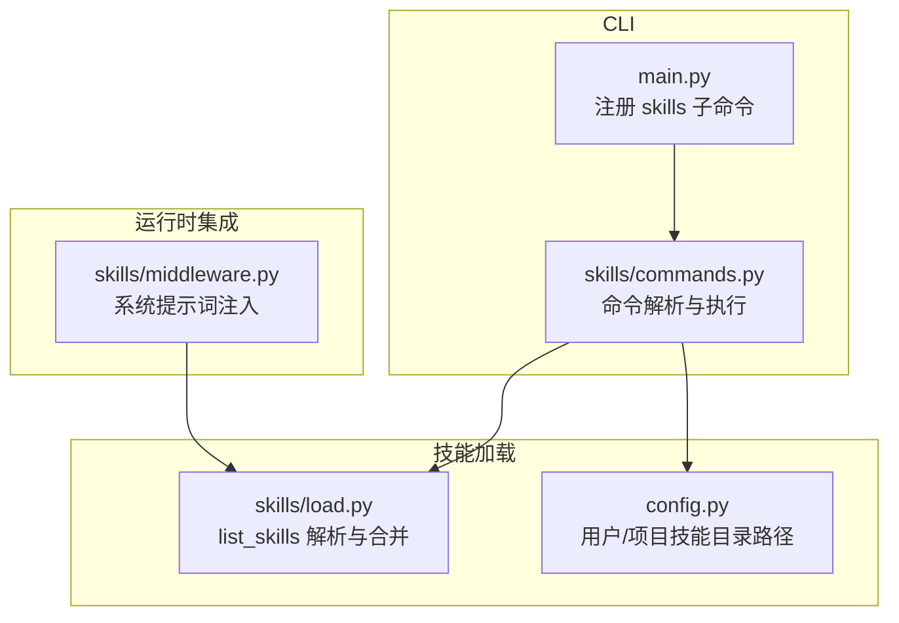
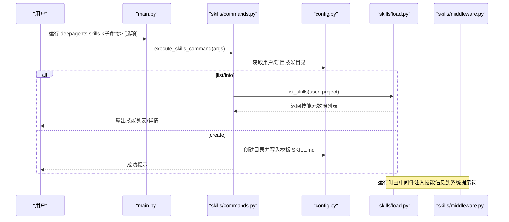
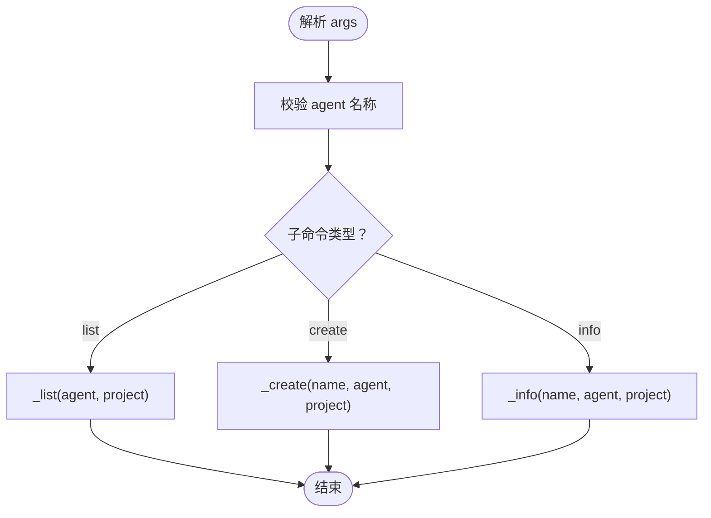
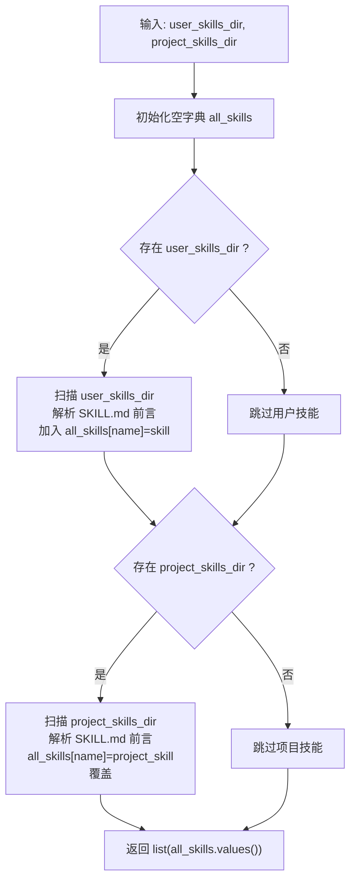
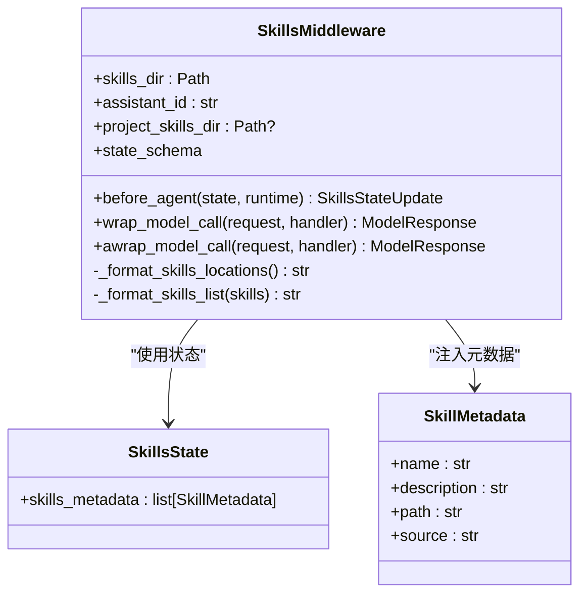
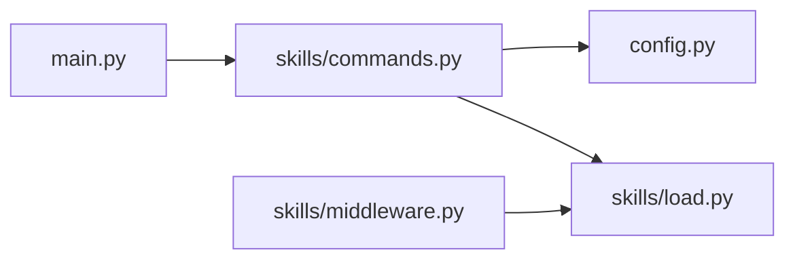

# 技能系统

<cite>
**本文引用的文件**
- [libs/deepagents-cli/deepagents_cli/skills/commands.py](file://libs/deepagents-cli/deepagents_cli/skills/commands.py)
- [libs/deepagents-cli/deepagents_cli/skills/load.py](file://libs/deepagents-cli/deepagents_cli/skills/load.py)
- [libs/deepagents-cli/deepagents_cli/skills/middleware.py](file://libs/deepagents-cli/deepagents_cli/skills/middleware.py)
- [libs/deepagents-cli/deepagents_cli/main.py](file://libs/deepagents-cli/deepagents_cli/main.py)
- [libs/deepagents-cli/deepagents_cli/config.py](file://libs/deepagents-cli/deepagents_cli/config.py)
- [libs/deepagents-cli/examples/skills/web-research/SKILL.md](file://libs/deepagents-cli/examples/skills/web-research/SKILL.md)
- [libs/deepagents-cli/examples/skills/langgraph-docs/SKILL.md](file://libs/deepagents-cli/examples/skills/langgraph-docs/SKILL.md)
- [libs/deepagents-cli/tests/unit_tests/skills/test_commands.py](file://libs/deepagents-cli/tests/unit_tests/skills/test_commands.py)
- [libs/deepagents-cli/tests/unit_tests/skills/test_load.py](file://libs/deepagents-cli/tests/unit_tests/skills/test_load.py)
</cite>

## 目录
1. [简介](#简介)
2. [项目结构](#项目结构)
3. [核心组件](#核心组件)
4. [架构总览](#架构总览)
5. [详细组件分析](#详细组件分析)
6. [依赖关系分析](#依赖关系分析)
7. [性能与安全考量](#性能与安全考量)
8. [故障排查指南](#故障排查指南)
9. [结论](#结论)
10. [附录：示例与最佳实践](#附录示例与最佳实践)

## 简介
本章节面向 CLI 工具的“技能系统”，系统性阐述以下内容：
- 如何通过命令行创建、列出和查询技能信息
- list_skills 函数如何从用户与项目目录加载并合并技能元数据
- 技能的结构规范（SKILL.md 的 YAML 前言与 Markdown 内容）
- 技能优先级规则（项目技能覆盖用户技能）
- 安全验证机制（名称校验、路径校验、符号链接检测、文件大小限制）

该系统遵循“渐进披露”的设计思想：在会话开始时注入技能清单到系统提示词，仅在需要时才读取完整 SKILL.md 内容，从而兼顾可发现性与安全性。

## 项目结构
技能系统主要分布在 deepagents-cli 的 skills 子模块中，并与主入口、配置与中间件协同工作：
- CLI 命令层：skills/commands.py 提供 skills list/create/info 子命令解析与执行
- 加载与解析层：skills/load.py 负责扫描目录、解析 YAML 前言、合并用户与项目技能
- 中间件层：skills/middleware.py 将技能元数据注入系统提示词，支持渐进披露
- 入口与配置：main.py 注册 skills 子命令；config.py 提供用户与项目技能目录路径

图表来源
- [libs/deepagents-cli/deepagents_cli/main.py](file://libs/deepagents-cli/deepagents_cli/main.py#L73-L129)
- [libs/deepagents-cli/deepagents_cli/skills/commands.py](file://libs/deepagents-cli/deepagents_cli/skills/commands.py#L366-L474)
- [libs/deepagents-cli/deepagents_cli/skills/load.py](file://libs/deepagents-cli/deepagents_cli/skills/load.py#L206-L238)
- [libs/deepagents-cli/deepagents_cli/config.py](file://libs/deepagents-cli/deepagents_cli/config.py#L286-L330)
- [libs/deepagents-cli/deepagents_cli/skills/middleware.py](file://libs/deepagents-cli/deepagents_cli/skills/middleware.py#L102-L278)

章节来源
- [libs/deepagents-cli/deepagents_cli/main.py](file://libs/deepagents-cli/deepagents_cli/main.py#L73-L129)
- [libs/deepagents-cli/deepagents_cli/skills/commands.py](file://libs/deepagents-cli/deepagents_cli/skills/commands.py#L366-L474)
- [libs/deepagents-cli/deepagents_cli/skills/load.py](file://libs/deepagents-cli/deepagents_cli/skills/load.py#L206-L238)
- [libs/deepagents-cli/deepagents_cli/config.py](file://libs/deepagents-cli/deepagents_cli/config.py#L286-L330)
- [libs/deepagents-cli/deepagents_cli/skills/middleware.py](file://libs/deepagents-cli/deepagents_cli/skills/middleware.py#L102-L278)

## 核心组件
- 命令解析与执行：setup_skills_parser 与 execute_skills_command 实现 skills list/create/info 的参数解析与分支执行
- 技能加载与合并：list_skills 从用户与项目目录扫描 SKILL.md，解析 YAML 前言，按名称去重并以项目技能覆盖用户技能
- 渐进披露中间件：SkillsMiddleware 在每次模型调用前注入技能位置与列表，仅在需要时读取完整 SKILL.md
- 配置与路径：Settings 提供用户与项目技能目录路径，确保创建与读取的安全性

章节来源
- [libs/deepagents-cli/deepagents_cli/skills/commands.py](file://libs/deepagents-cli/deepagents_cli/skills/commands.py#L366-L474)
- [libs/deepagents-cli/deepagents_cli/skills/load.py](file://libs/deepagents-cli/deepagents_cli/skills/load.py#L206-L238)
- [libs/deepagents-cli/deepagents_cli/skills/middleware.py](file://libs/deepagents-cli/deepagents_cli/skills/middleware.py#L102-L278)
- [libs/deepagents-cli/deepagents_cli/config.py](file://libs/deepagents-cli/deepagents_cli/config.py#L286-L330)

## 架构总览
技能系统在 CLI 生命周期内的交互流程如下：
- CLI 启动后注册 skills 子命令
- 用户执行 skills list/create/info
- 命令层根据参数决定目标目录（用户或项目），并进行安全校验
- list_skills 扫描目录、解析 YAML 前言、合并用户与项目技能
- 中间件在系统提示词中注入技能位置与列表，Agent 按需读取完整 SKILL.md

图表来源
- [libs/deepagents-cli/deepagents_cli/main.py](file://libs/deepagents-cli/deepagents_cli/main.py#L73-L129)
- [libs/deepagents-cli/deepagents_cli/skills/commands.py](file://libs/deepagents-cli/deepagents_cli/skills/commands.py#L366-L474)
- [libs/deepagents-cli/deepagents_cli/skills/load.py](file://libs/deepagents-cli/deepagents_cli/skills/load.py#L206-L238)
- [libs/deepagents-cli/deepagents_cli/skills/middleware.py](file://libs/deepagents-cli/deepagents_cli/skills/middleware.py#L186-L278)
- [libs/deepagents-cli/deepagents_cli/config.py](file://libs/deepagents-cli/deepagents_cli/config.py#L286-L330)

## 详细组件分析

### 命令层：setup_skills_parser 与 execute_skills_command
- setup_skills_parser
  - 注册 skills list/create/info 三个子命令，支持 --agent、--project 等选项
  - list：支持仅显示项目技能或同时显示用户与项目技能
  - create：支持在用户或项目目录创建新技能
  - info：展示指定技能的完整信息与支持文件
- execute_skills_command
  - 对 agent 名称进行合法性校验
  - 分派到 _list/_create/_info 并输出结果或帮助信息

图表来源
- [libs/deepagents-cli/deepagents_cli/skills/commands.py](file://libs/deepagents-cli/deepagents_cli/skills/commands.py#L366-L474)

章节来源
- [libs/deepagents-cli/deepagents_cli/skills/commands.py](file://libs/deepagents-cli/deepagents_cli/skills/commands.py#L366-L474)

### 技能加载与合并：list_skills
- 目录扫描
  - 支持用户与项目两个源，分别以 source 字段标识
  - 使用安全路径检查，防止符号链接逃逸与越界访问
- YAML 前言解析
  - 严格匹配 YAML frontmatter（name、description 必填）
  - 限制单个 SKILL.md 文件最大大小，避免 DoS
- 合并策略
  - 以字典按名称去重，先加载用户技能，再加载项目技能，后者覆盖前者

图表来源
- [libs/deepagents-cli/deepagents_cli/skills/load.py](file://libs/deepagents-cli/deepagents_cli/skills/load.py#L206-L238)

章节来源
- [libs/deepagents-cli/deepagents_cli/skills/load.py](file://libs/deepagents-cli/deepagents_cli/skills/load.py#L206-L238)

### 渐进披露中间件：SkillsMiddleware
- before_agent：在会话开始时重新加载技能元数据
- wrap_model_call/awrap_model_call：在每次模型调用前将技能位置与列表注入系统提示词
- 支持用户与项目技能，项目技能覆盖用户技能
- 通过模板化提示词，指导 Agent 在需要时读取完整 SKILL.md

图表来源
- [libs/deepagents-cli/deepagents_cli/skills/middleware.py](file://libs/deepagents-cli/deepagents_cli/skills/middleware.py#L102-L278)
- [libs/deepagents-cli/deepagents_cli/skills/load.py](file://libs/deepagents-cli/deepagents_cli/skills/load.py#L36-L51)

章节来源
- [libs/deepagents-cli/deepagents_cli/skills/middleware.py](file://libs/deepagents-cli/deepagents_cli/skills/middleware.py#L102-L278)
- [libs/deepagents-cli/deepagents_cli/skills/load.py](file://libs/deepagents-cli/deepagents_cli/skills/load.py#L36-L51)

### 路径与配置：Settings
- 用户技能目录：~/.deepagents/{agent}/skills
- 项目技能目录：{project_root}/.deepagents/skills
- 提供 ensure_* 方法确保目录存在，便于创建新技能

章节来源
- [libs/deepagents-cli/deepagents_cli/config.py](file://libs/deepagents-cli/deepagents_cli/config.py#L286-L330)

## 依赖关系分析
- 命令层依赖配置层（获取目录）、加载层（解析与合并）
- 中间件依赖加载层（获取技能元数据）
- 主入口负责注册 skills 子命令并分发到命令层

图表来源
- [libs/deepagents-cli/deepagents_cli/main.py](file://libs/deepagents-cli/deepagents_cli/main.py#L73-L129)
- [libs/deepagents-cli/deepagents_cli/skills/commands.py](file://libs/deepagents-cli/deepagents_cli/skills/commands.py#L366-L474)
- [libs/deepagents-cli/deepagents_cli/skills/load.py](file://libs/deepagents-cli/deepagents_cli/skills/load.py#L206-L238)
- [libs/deepagents-cli/deepagents_cli/skills/middleware.py](file://libs/deepagents-cli/deepagents_cli/skills/middleware.py#L186-L278)
- [libs/deepagents-cli/deepagents_cli/config.py](file://libs/deepagents-cli/deepagents_cli/config.py#L286-L330)

章节来源
- [libs/deepagents-cli/deepagents_cli/main.py](file://libs/deepagents-cli/deepagents_cli/main.py#L73-L129)
- [libs/deepagents-cli/deepagents_cli/skills/commands.py](file://libs/deepagents-cli/deepagents_cli/skills/commands.py#L366-L474)
- [libs/deepagents-cli/deepagents_cli/skills/load.py](file://libs/deepagents-cli/deepagents_cli/skills/load.py#L206-L238)
- [libs/deepagents-cli/deepagents_cli/skills/middleware.py](file://libs/deepagents-cli/deepagents_cli/skills/middleware.py#L186-L278)
- [libs/deepagents-cli/deepagents_cli/config.py](file://libs/deepagents-cli/deepagents_cli/config.py#L286-L330)

## 性能与安全考量
- 性能
  - list_skills 采用字典按名称去重，时间复杂度 O(U+P)，其中 U、P 分别为用户与项目技能数量
  - 仅在需要时读取完整 SKILL.md，避免不必要的 IO
- 安全
  - 名称校验：禁止空名、绝对路径、路径分隔符、包含危险字符
  - 路径校验：使用 resolve 与 is_relative_to（或相对路径计算）确保不越界
  - 符号链接检测：_is_safe_path 通过 resolve 后 relative_to 防止指向外部目录
  - 文件大小限制：MAX_SKILL_FILE_SIZE 防止超大文件导致内存压力
  - 项目技能覆盖用户技能：保证项目定制优先于通用默认

章节来源
- [libs/deepagents-cli/deepagents_cli/skills/commands.py](file://libs/deepagents-cli/deepagents_cli/skills/commands.py#L18-L80)
- [libs/deepagents-cli/deepagents_cli/skills/load.py](file://libs/deepagents-cli/deepagents_cli/skills/load.py#L32-L34)
- [libs/deepagents-cli/deepagents_cli/skills/load.py](file://libs/deepagents-cli/deepagents_cli/skills/load.py#L52-L90)
- [libs/deepagents-cli/deepagents_cli/skills/load.py](file://libs/deepagents-cli/deepagents_cli/skills/load.py#L206-L238)
- [libs/deepagents-cli/tests/unit_tests/skills/test_commands.py](file://libs/deepagents-cli/tests/unit_tests/skills/test_commands.py#L1-L198)
- [libs/deepagents-cli/tests/unit_tests/skills/test_load.py](file://libs/deepagents-cli/tests/unit_tests/skills/test_load.py#L1-L293)

## 故障排查指南
- “不在项目目录”或“无项目技能”
  - 当使用 --project 且当前不在 Git 项目根目录时，命令会提示无法识别项目根目录
  - 参考：[libs/deepagents-cli/deepagents_cli/skills/commands.py](file://libs/deepagents-cli/deepagents_cli/skills/commands.py#L90-L115)
- “技能已存在”
  - 目标目录已存在时拒绝重复创建
  - 参考：[libs/deepagents-cli/deepagents_cli/skills/commands.py](file://libs/deepagents-cli/deepagents_cli/skills/commands.py#L204-L209)
- “技能未找到”
  - info 命令找不到对应技能时会列出可用技能
  - 参考：[libs/deepagents-cli/deepagents_cli/skills/commands.py](file://libs/deepagents-cli/deepagents_cli/skills/commands.py#L325-L334)
- YAML 前言缺失或字段不完整
  - list_skills 会忽略缺少 name/description 或格式不正确的 SKILL.md
  - 参考：[libs/deepagents-cli/deepagents_cli/skills/load.py](file://libs/deepagents-cli/deepagents_cli/skills/load.py#L120-L143)
- 路径越界或符号链接异常
  - _is_safe_path 与 _validate_skill_path 会阻止越界访问
  - 参考：[libs/deepagents-cli/deepagents_cli/skills/load.py](file://libs/deepagents-cli/deepagents_cli/skills/load.py#L52-L90), [libs/deepagents-cli/deepagents_cli/skills/commands.py](file://libs/deepagents-cli/deepagents_cli/skills/commands.py#L50-L80)
- 单元测试验证
  - 测试覆盖了名称与路径校验、项目覆盖用户技能、无效文件跳过等场景
  - 参考：[libs/deepagents-cli/tests/unit_tests/skills/test_commands.py](file://libs/deepagents-cli/tests/unit_tests/skills/test_commands.py#L1-L198), [libs/deepagents-cli/tests/unit_tests/skills/test_load.py](file://libs/deepagents-cli/tests/unit_tests/skills/test_load.py#L1-L293)

章节来源
- [libs/deepagents-cli/deepagents_cli/skills/commands.py](file://libs/deepagents-cli/deepagents_cli/skills/commands.py#L90-L115)
- [libs/deepagents-cli/deepagents_cli/skills/commands.py](file://libs/deepagents-cli/deepagents_cli/skills/commands.py#L204-L209)
- [libs/deepagents-cli/deepagents_cli/skills/commands.py](file://libs/deepagents-cli/deepagents_cli/skills/commands.py#L325-L334)
- [libs/deepagents-cli/deepagents_cli/skills/load.py](file://libs/deepagents-cli/deepagents_cli/skills/load.py#L120-L143)
- [libs/deepagents-cli/deepagents_cli/skills/load.py](file://libs/deepagents-cli/deepagents_cli/skills/load.py#L52-L90)
- [libs/deepagents-cli/tests/unit_tests/skills/test_commands.py](file://libs/deepagents-cli/tests/unit_tests/skills/test_commands.py#L1-L198)
- [libs/deepagents-cli/tests/unit_tests/skills/test_load.py](file://libs/deepagents-cli/tests/unit_tests/skills/test_load.py#L1-L293)

## 结论
技能系统通过清晰的命令接口、严格的加载与安全机制以及渐进披露的运行时集成，实现了可扩展、可维护、可审计的技能管理能力。其关键优势包括：
- 易用的 CLI 管理命令
- 可靠的 YAML 前言解析与文件大小限制
- 安全的路径与符号链接检测
- 项目技能覆盖用户技能的优先级规则
- 运行时仅在需要时读取完整 SKILL.md，降低开销

## 附录：示例与最佳实践

### 技能结构规范
- 目录组织
  - 每个技能是一个目录，包含一个必需的 SKILL.md 文件与若干可选的支持文件
  - 参考示例：[libs/deepagents-cli/examples/skills/web-research/SKILL.md](file://libs/deepagents-cli/examples/skills/web-research/SKILL.md#L1-L103), [libs/deepagents-cli/examples/skills/langgraph-docs/SKILL.md](file://libs/deepagents-cli/examples/skills/langgraph-docs/SKILL.md#L1-L36)
- YAML 前言
  - 必须包含 name 与 description
  - 参考：[libs/deepagents-cli/deepagents_cli/skills/load.py](file://libs/deepagents-cli/deepagents_cli/skills/load.py#L120-L143)
- Markdown 内容
  - 提供技能用途、使用时机、步骤、最佳实践与示例
  - 参考示例：[libs/deepagents-cli/examples/skills/web-research/SKILL.md](file://libs/deepagents-cli/examples/skills/web-research/SKILL.md#L1-L103)

### 创建与使用示例（步骤说明）
- 创建技能
  - 在用户目录创建：deepagents skills create <name> --agent <agent>
  - 在项目目录创建：deepagents skills create <name> --project
  - 参考：[libs/deepagents-cli/deepagents_cli/skills/commands.py](file://libs/deepagents-cli/deepagents_cli/skills/commands.py#L163-L302), [libs/deepagents-cli/deepagents_cli/config.py](file://libs/deepagents-cli/deepagents_cli/config.py#L297-L330)
- 列出技能
  - 查看所有技能：deepagents skills list --agent <agent>
  - 仅查看项目技能：deepagents skills list --project
  - 参考：[libs/deepagents-cli/deepagents_cli/skills/commands.py](file://libs/deepagents-cli/deepagents_cli/skills/commands.py#L82-L161)
- 查询技能详情
  - deepagents skills info <name> [--agent/--project]
  - 参考：[libs/deepagents-cli/deepagents_cli/skills/commands.py](file://libs/deepagents-cli/deepagents_cli/skills/commands.py#L304-L364)

### 优先级规则与覆盖机制
- 合并顺序：先加载用户技能，再加载项目技能，同名项目技能覆盖用户技能
- 参考：[libs/deepagents-cli/deepagents_cli/skills/load.py](file://libs/deepagents-cli/deepagents_cli/skills/load.py#L222-L237), [libs/deepagents-cli/tests/unit_tests/skills/test_load.py](file://libs/deepagents-cli/tests/unit_tests/skills/test_load.py#L195-L229)

### 安全验证要点
- 名称校验：禁止空名、绝对路径、路径分隔符、危险字符
- 路径校验：确保最终解析路径位于基目录内
- 符号链接检测：通过 resolve 后 relative_to 判断
- 文件大小限制：超过阈值的 SKILL.md 将被忽略
- 参考：
  - [libs/deepagents-cli/deepagents_cli/skills/commands.py](file://libs/deepagents-cli/deepagents_cli/skills/commands.py#L18-L80)
  - [libs/deepagents-cli/deepagents_cli/skills/load.py](file://libs/deepagents-cli/deepagents_cli/skills/load.py#L52-L90)
  - [libs/deepagents-cli/deepagents_cli/skills/load.py](file://libs/deepagents-cli/deepagents_cli/skills/load.py#L32-L34)
  - [libs/deepagents-cli/tests/unit_tests/skills/test_commands.py](file://libs/deepagents-cli/tests/unit_tests/skills/test_commands.py#L1-L198)
  - [libs/deepagents-cli/tests/unit_tests/skills/test_load.py](file://libs/deepagents-cli/tests/unit_tests/skills/test_load.py#L1-L293)