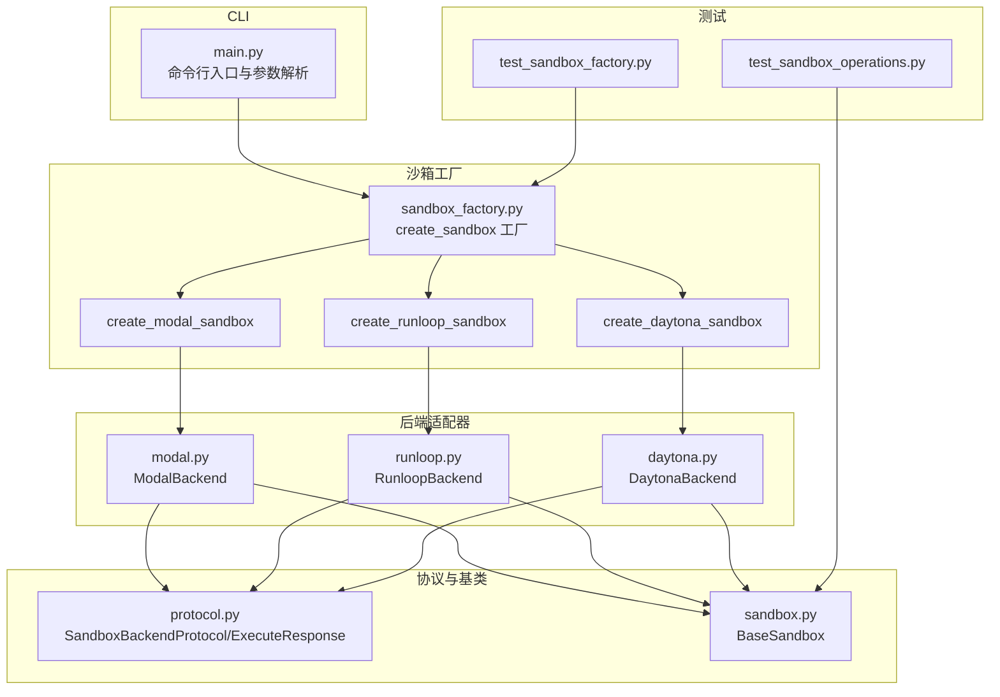
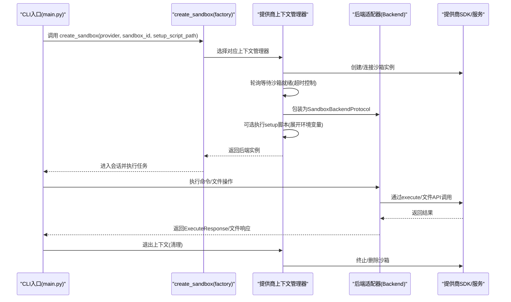
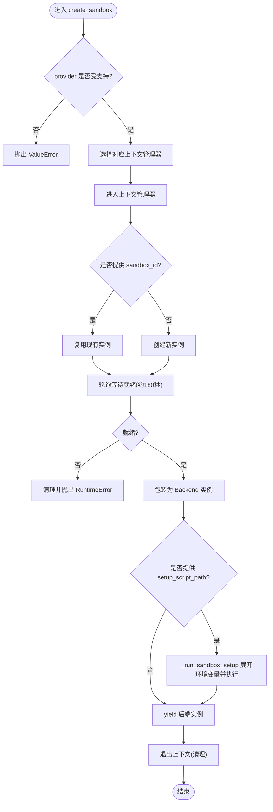
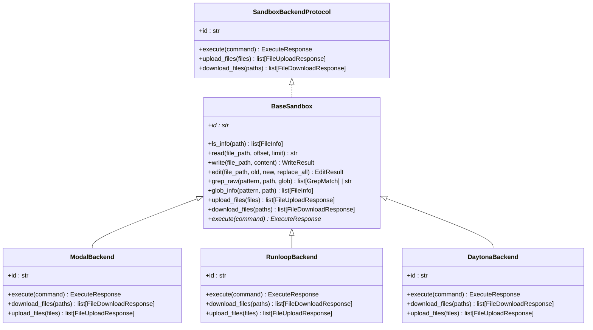
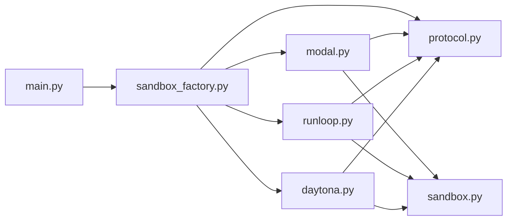

# 沙箱集成

<cite>
**本文引用的文件**
- [sandbox_factory.py](file://libs/deepagents-cli/deepagents_cli/integrations/sandbox_factory.py)
- [modal.py](file://libs/deepagents-cli/deepagents_cli/integrations/modal.py)
- [runloop.py](file://libs/deepagents-cli/deepagents_cli/integrations/runloop.py)
- [daytona.py](file://libs/deepagents-cli/deepagents_cli/integrations/daytona.py)
- [protocol.py](file://libs/deepagents/deepagents/backends/protocol.py)
- [sandbox.py](file://libs/deepagents/deepagents/backends/sandbox.py)
- [main.py](file://libs/deepagents-cli/deepagents_cli/main.py)
- [test_sandbox_factory.py](file://libs/deepagents-cli/tests/integration_tests/test_sandbox_factory.py)
- [test_sandbox_operations.py](file://libs/deepagents-cli/tests/integration_tests/test_sandbox_operations.py)
</cite>

## 目录
1. [简介](#简介)
2. [项目结构](#项目结构)
3. [核心组件](#核心组件)
4. [架构总览](#架构总览)
5. [详细组件分析](#详细组件分析)
6. [依赖关系分析](#依赖关系分析)
7. [性能考量](#性能考量)
8. [故障排查指南](#故障排查指南)
9. [结论](#结论)
10. [附录：使用示例与最佳实践](#附录使用示例与最佳实践)

## 简介
本章节聚焦于CLI工具中的沙箱集成，系统性阐述create_sandbox工厂函数如何统一管理Modal、Runloop和Daytona等不同沙箱提供商的生命周期；解释各沙箱上下文管理器（create_modal_sandbox、create_runloop_sandbox、create_daytona_sandbox）如何实现沙箱的创建、连接与清理；说明get_default_working_dir函数如何为不同提供商返回相应的默认工作目录；并提供完整的沙箱集成与使用示例，涵盖环境变量配置、超时处理与错误恢复等关键问题。

## 项目结构
沙箱集成位于CLI子模块中，采用“工厂 + 上下文管理器 + 后端适配器”的分层设计：
- 工厂与上下文管理器：libs/deepagents-cli/deepagents_cli/integrations/sandbox_factory.py
- 各提供商后端适配器：modal.py、runloop.py、daytona.py
- 统一协议与基类：libs/deepagents/deepagents/backends/protocol.py、sandbox.py
- CLI入口与参数解析：libs/deepagents-cli/deepagents_cli/main.py
- 集成测试：tests/integration_tests/test_sandbox_factory.py、test_sandbox_operations.py

图表来源
- [main.py](file://libs/deepagents-cli/deepagents_cli/main.py#L1-L120)
- [sandbox_factory.py](file://libs/deepagents-cli/deepagents_cli/integrations/sandbox_factory.py#L284-L349)
- [modal.py](file://libs/deepagents-cli/deepagents_cli/integrations/modal.py#L1-L127)
- [runloop.py](file://libs/deepagents-cli/deepagents_cli/integrations/runloop.py#L1-L125)
- [daytona.py](file://libs/deepagents-cli/deepagents_cli/integrations/daytona.py#L1-L118)
- [protocol.py](file://libs/deepagents/deepagents/backends/protocol.py#L423-L459)
- [sandbox.py](file://libs/deepagents/deepagents/backends/sandbox.py#L141-L361)
- [test_sandbox_factory.py](file://libs/deepagents-cli/tests/integration_tests/test_sandbox_factory.py#L1-L120)
- [test_sandbox_operations.py](file://libs/deepagents-cli/tests/integration_tests/test_sandbox_operations.py#L1-L60)

章节来源
- [main.py](file://libs/deepagents-cli/deepagents_cli/main.py#L1-L120)
- [sandbox_factory.py](file://libs/deepagents-cli/deepagents_cli/integrations/sandbox_factory.py#L284-L349)

## 核心组件
- create_sandbox工厂函数：根据提供商类型选择对应的上下文管理器，统一创建/清理流程，并支持可选的setup脚本执行。
- 各提供商上下文管理器：封装Modal、Runloop、Daytona的沙箱创建、轮询等待就绪、执行setup脚本、异常处理与清理。
- get_default_working_dir：按提供商返回默认工作目录，便于CLI在远程执行时定位路径。
- 后端适配器（ModalBackend、RunloopBackend、DaytonaBackend）：继承BaseSandbox，仅实现execute方法，其余文件操作通过BaseSandbox模板化实现。
- 协议与基类：SandboxBackendProtocol定义统一接口；BaseSandbox提供read/write/edit/glob/grep等通用实现。

章节来源
- [sandbox_factory.py](file://libs/deepagents-cli/deepagents_cli/integrations/sandbox_factory.py#L284-L349)
- [modal.py](file://libs/deepagents-cli/deepagents_cli/integrations/modal.py#L1-L127)
- [runloop.py](file://libs/deepagents-cli/deepagents_cli/integrations/runloop.py#L1-L125)
- [daytona.py](file://libs/deepagents-cli/deepagents_cli/integrations/daytona.py#L1-L118)
- [protocol.py](file://libs/deepagents/deepagents/backends/protocol.py#L423-L459)
- [sandbox.py](file://libs/deepagents/deepagents/backends/sandbox.py#L141-L361)

## 架构总览
下面的序列图展示了CLI调用create_sandbox到实际执行命令的整体流程，以及setup脚本的扩展机制。

图表来源
- [main.py](file://libs/deepagents-cli/deepagents_cli/main.py#L325-L387)
- [sandbox_factory.py](file://libs/deepagents-cli/deepagents_cli/integrations/sandbox_factory.py#L284-L349)
- [modal.py](file://libs/deepagents-cli/deepagents_cli/integrations/modal.py#L1-L127)
- [runloop.py](file://libs/deepagents-cli/deepagents_cli/integrations/runloop.py#L1-L125)
- [daytona.py](file://libs/deepagents-cli/deepagents_cli/integrations/daytona.py#L1-L118)

## 详细组件分析

### 工厂与上下文管理器：create_sandbox与三个提供商上下文
- create_sandbox工厂：根据provider映射到具体上下文管理器，统一异常处理与资源清理。
- create_modal_sandbox：创建Modal沙箱，轮询等待就绪，执行setup脚本，finally终止沙箱。
- create_runloop_sandbox：基于Bearer Token创建/连接Runloop Devbox，轮询等待运行状态，执行setup脚本，finally关闭Devbox。
- create_daytona_sandbox：基于API Key创建Daytona沙箱，轮询等待就绪，执行setup脚本，finally删除沙箱。

图表来源
- [sandbox_factory.py](file://libs/deepagents-cli/deepagents_cli/integrations/sandbox_factory.py#L284-L349)

章节来源
- [sandbox_factory.py](file://libs/deepagents-cli/deepagents_cli/integrations/sandbox_factory.py#L16-L47)
- [sandbox_factory.py](file://libs/deepagents-cli/deepagents_cli/integrations/sandbox_factory.py#L49-L121)
- [sandbox_factory.py](file://libs/deepagents-cli/deepagents_cli/integrations/sandbox_factory.py#L123-L193)
- [sandbox_factory.py](file://libs/deepagents-cli/deepagents_cli/integrations/sandbox_factory.py#L195-L267)

### 后端适配器：ModalBackend、RunloopBackend、DaytonaBackend
- 共同点：均继承BaseSandbox，仅实现execute方法；id属性由各自SDK对象提供；上传/下载文件API由各提供商原生能力实现。
- ModalBackend：通过Modal Sandbox.exec执行命令，合并stdout/stderr输出；文件读写使用Modal沙箱文件API。
- RunloopBackend：通过Runloop客户端devboxes.execute_and_await_completion执行命令；文件读写使用Runloop API。
- DaytonaBackend：通过Daytona Sandbox.process.exec执行命令；文件读写使用Daytona fs批量API。

图表来源
- [protocol.py](file://libs/deepagents/deepagents/backends/protocol.py#L423-L459)
- [sandbox.py](file://libs/deepagents/deepagents/backends/sandbox.py#L141-L361)
- [modal.py](file://libs/deepagents-cli/deepagents_cli/integrations/modal.py#L1-L127)
- [runloop.py](file://libs/deepagents-cli/deepagents_cli/integrations/runloop.py#L1-L125)
- [daytona.py](file://libs/deepagents-cli/deepagents_cli/integrations/daytona.py#L1-L118)

章节来源
- [modal.py](file://libs/deepagents-cli/deepagents_cli/integrations/modal.py#L1-L127)
- [runloop.py](file://libs/deepagents-cli/deepagents_cli/integrations/runloop.py#L1-L125)
- [daytona.py](file://libs/deepagents-cli/deepagents_cli/integrations/daytona.py#L1-L118)
- [sandbox.py](file://libs/deepagents/deepagents/backends/sandbox.py#L141-L361)

### 默认工作目录：get_default_working_dir
- 提供映射表，返回Modal/Runloop/Daytona的默认工作目录字符串，用于CLI提示与路径规划。
- 若provider未知，抛出ValueError。

章节来源
- [sandbox_factory.py](file://libs/deepagents-cli/deepagents_cli/integrations/sandbox_factory.py#L269-L273)
- [sandbox_factory.py](file://libs/deepagents-cli/deepagents_cli/integrations/sandbox_factory.py#L326-L342)

### CLI集成与参数解析
- main.py解析--sandbox/--sandbox-id/--sandbox-setup等参数，调用create_sandbox创建后端，进入交互会话。
- 在simple_cli中展示本地目录与远程工作目录信息，结合get_default_working_dir进行提示。

章节来源
- [main.py](file://libs/deepagents-cli/deepagents_cli/main.py#L73-L131)
- [main.py](file://libs/deepagents-cli/deepagents_cli/main.py#L133-L209)
- [main.py](file://libs/deepagents-cli/deepagents_cli/main.py#L325-L387)

## 依赖关系分析
- 工厂与上下文管理器依赖SandboxBackendProtocol接口与Console输出。
- 各后端适配器依赖对应提供商SDK；Modal/Runloop/Datona分别导入modal、runloop_api_client、daytona。
- BaseSandbox依赖protocol.py中的ExecuteResponse、FileDownloadResponse、FileUploadResponse等数据结构。

图表来源
- [sandbox_factory.py](file://libs/deepagents-cli/deepagents_cli/integrations/sandbox_factory.py#L1-L30)
- [modal.py](file://libs/deepagents-cli/deepagents_cli/integrations/modal.py#L1-L20)
- [runloop.py](file://libs/deepagents-cli/deepagents_cli/integrations/runloop.py#L1-L20)
- [daytona.py](file://libs/deepagents-cli/deepagents_cli/integrations/daytona.py#L1-L20)
- [protocol.py](file://libs/deepagents/deepagents/backends/protocol.py#L1-L40)
- [sandbox.py](file://libs/deepagents/deepagents/backends/sandbox.py#L1-L30)
- [main.py](file://libs/deepagents-cli/deepagents_cli/main.py#L1-L40)

章节来源
- [sandbox_factory.py](file://libs/deepagents-cli/deepagents_cli/integrations/sandbox_factory.py#L1-L30)
- [protocol.py](file://libs/deepagents/deepagents/backends/protocol.py#L1-L40)
- [sandbox.py](file://libs/deepagents/deepagents/backends/sandbox.py#L1-L30)
- [main.py](file://libs/deepagents-cli/deepagents_cli/main.py#L1-L40)

## 性能考量
- 命令执行超时：各后端适配器默认超时为30分钟，避免长时间阻塞。
- 文件批量操作：Daytona与Runloop提供原生批量上传/下载API，减少网络往返；Modal沙箱文件API处于alpha阶段，注意生产风险。
- 轮询等待：Modal/Runloop/Daytona均采用轮询等待就绪，超时约180秒；建议在CI或自动化场景中合理设置sandbox_id以复用实例，缩短测试时间。
- 输出截断：部分后端不提供截断信息，调用方需自行控制输出长度或分页读取。

章节来源
- [modal.py](file://libs/deepagents-cli/deepagents_cli/integrations/modal.py#L31-L71)
- [runloop.py](file://libs/deepagents-cli/deepagents_cli/integrations/runloop.py#L53-L88)
- [daytona.py](file://libs/deepagents-cli/deepagents_cli/integrations/daytona.py#L32-L58)
- [sandbox_factory.py](file://libs/deepagents-cli/deepagents_cli/integrations/sandbox_factory.py#L85-L103)

## 故障排查指南
- 环境变量缺失
  - RUNLOOP_API_KEY未设置：Runloop上下文管理器直接抛出ValueError。
  - DAYTONA_API_KEY未设置：Daytona上下文管理器直接抛出ValueError。
  - 解决：在启动前设置相应环境变量，或在项目根目录添加.env文件。
- 提供商不可用
  - ImportError：缺少提供商SDK包（如runloop_api_client、daytona）。
  - 解决：安装对应依赖。
- 沙箱创建失败
  - RuntimeError：沙箱启动超时或意外终止。
  - 解决：检查网络、API密钥、提供商可用性；必要时重试或更换提供商。
- setup脚本失败
  - _run_sandbox_setup在非零退出码时抛出RuntimeError并打印输出。
  - 解决：修正脚本语法、权限与依赖；确保在沙箱内可访问所需工具。
- 清理失败
  - 各上下文管理器在finally中尝试清理，若失败仅打印警告，不影响主流程。
  - 解决：手动清理或稍后重试。

章节来源
- [sandbox_factory.py](file://libs/deepagents-cli/deepagents_cli/integrations/sandbox_factory.py#L147-L151)
- [sandbox_factory.py](file://libs/deepagents-cli/deepagents_cli/integrations/sandbox_factory.py#L216-L219)
- [sandbox_factory.py](file://libs/deepagents-cli/deepagents_cli/integrations/sandbox_factory.py#L164-L174)
- [sandbox_factory.py](file://libs/deepagents-cli/deepagents_cli/integrations/sandbox_factory.py#L234-L250)
- [sandbox_factory.py](file://libs/deepagents-cli/deepagents_cli/integrations/sandbox_factory.py#L38-L45)

## 结论
该沙箱集成通过create_sandbox工厂与三个提供商上下文管理器，实现了对Modal、Runloop、Daytona的统一生命周期管理；后端适配器遵循SandboxBackendProtocol，借助BaseSandbox模板化实现文件操作，保证了跨提供商的一致性体验。配合CLI参数解析与默认工作目录查询，用户可以便捷地在不同环境中进行远程代码执行与文件操作。测试覆盖了基本创建、命令执行与文件上传下载，为进一步完善错误处理与标准化错误码提供了方向。

## 附录：使用示例与最佳实践

### 使用示例
- 基本用法（Python）
  - 通过create_sandbox在指定提供商上创建沙箱，自动执行setup脚本，退出时自动清理。
  - 示例路径参考：[test_sandbox_factory.py](file://libs/deepagents-cli/tests/integration_tests/test_sandbox_factory.py#L295-L323)
- CLI用法
  - 启动CLI并选择沙箱类型：--sandbox modal|runloop|daytona
  - 复用已有沙箱：--sandbox-id <id>
  - 执行setup脚本：--sandbox-setup ./scripts/setup.sh
  - 示例路径参考：[main.py](file://libs/deepagents-cli/deepagents_cli/main.py#L73-L131)、[main.py](file://libs/deepagents-cli/deepagents_cli/main.py#L325-L387)

### 环境变量配置
- RUNLOOP_API_KEY：Runloop提供商认证
- DAYTONA_API_KEY：Daytona提供商认证
- OPENAI_API_KEY/ANTHROPIC_API_KEY/GOOGLE_API_KEY：模型选择与调用（CLI侧）
- TAVILY_API_KEY：可选的网络搜索工具
- 示例路径参考：[main.py](file://libs/deepagents-cli/deepagents_cli/main.py#L180-L191)、[runloop.py](file://libs/deepagents-cli/deepagents_cli/integrations/runloop.py#L44-L49)、[daytona.py](file://libs/deepagents-cli/deepagents_cli/integrations/daytona.py#L216-L219)

### 超时处理与错误恢复
- 轮询等待：Modal/Runloop/Daytona均采用约180秒超时轮询，超时则终止/关闭并抛错。
- setup脚本：使用5分钟超时执行，非零退出码即失败并中断。
- 清理策略：上下文管理器在finally中尝试清理，失败仅告警。
- 错误码：文件操作错误码在协议中定义，未来可在后端适配器中映射。
- 示例路径参考：[sandbox_factory.py](file://libs/deepagents-cli/deepagents_cli/integrations/sandbox_factory.py#L85-L103)、[sandbox_factory.py](file://libs/deepagents-cli/deepagents_cli/integrations/sandbox_factory.py#L164-L174)、[sandbox_factory.py](file://libs/deepagents-cli/deepagents_cli/integrations/sandbox_factory.py#L234-L250)、[protocol.py](file://libs/deepagents/deepagents/backends/protocol.py#L17-L31)

### 最佳实践
- CI/CD复用：在持续集成中传入--sandbox-id复用沙箱，减少冷启动时间。
- 分离setup与业务逻辑：将环境准备放入setup脚本，便于在多提供商间复用。
- 输出分页：大文件读取使用offset/limit分页，避免上下文溢出。
- 错误隔离：文件批量操作采用partial success模式，逐个记录错误以便修复。
- 安全与权限：避免在setup脚本中硬编码敏感信息，优先使用环境变量注入。