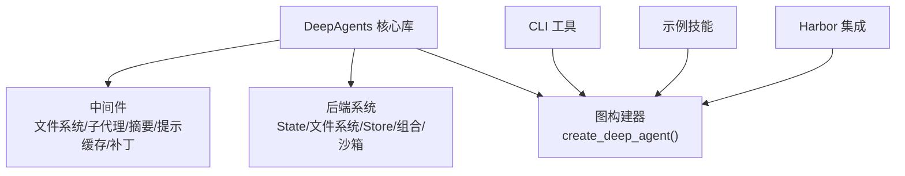
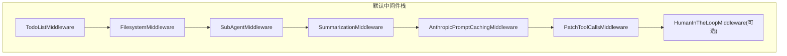
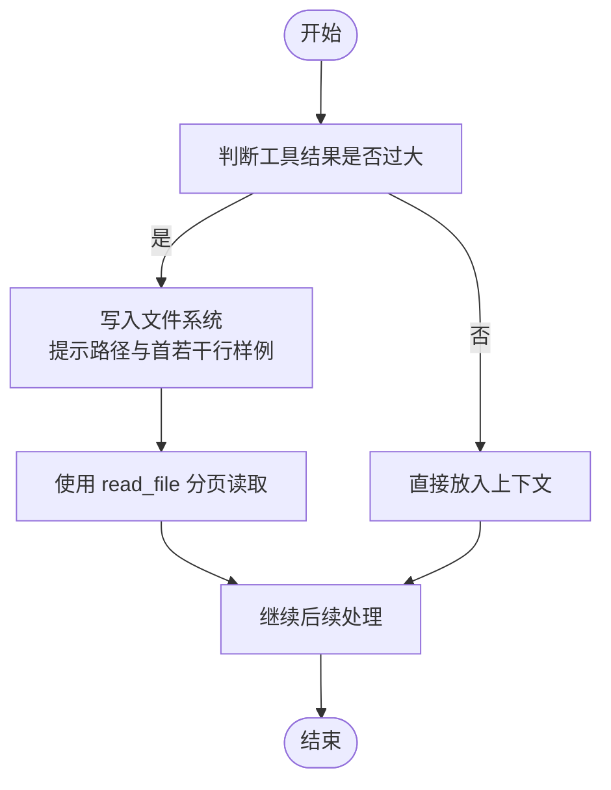
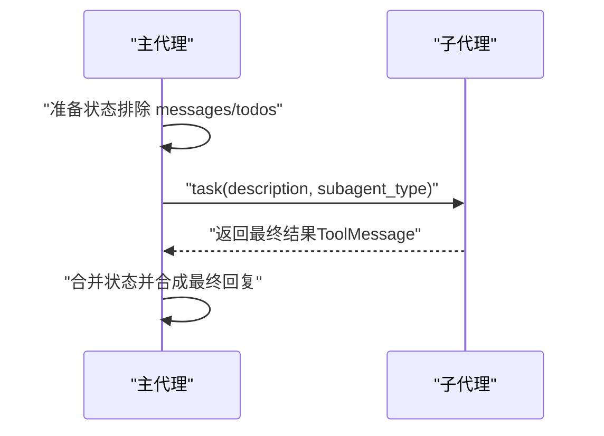
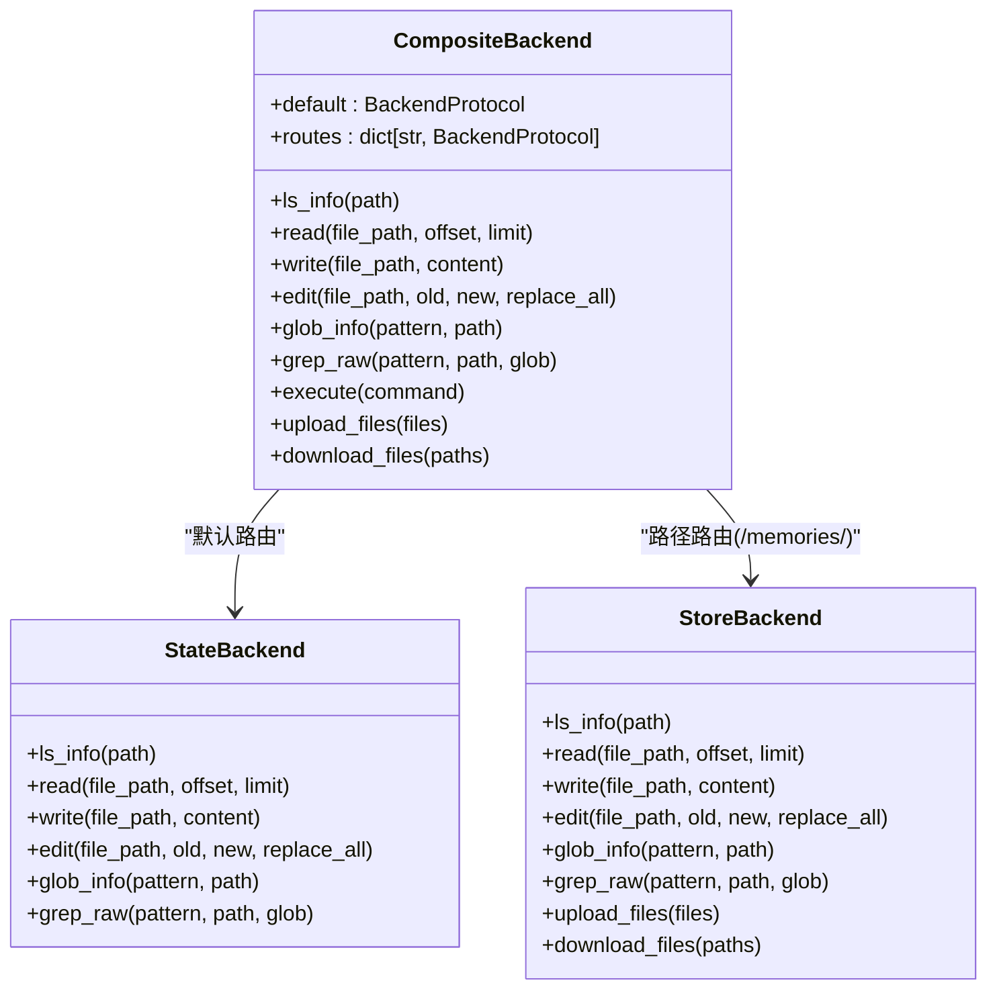
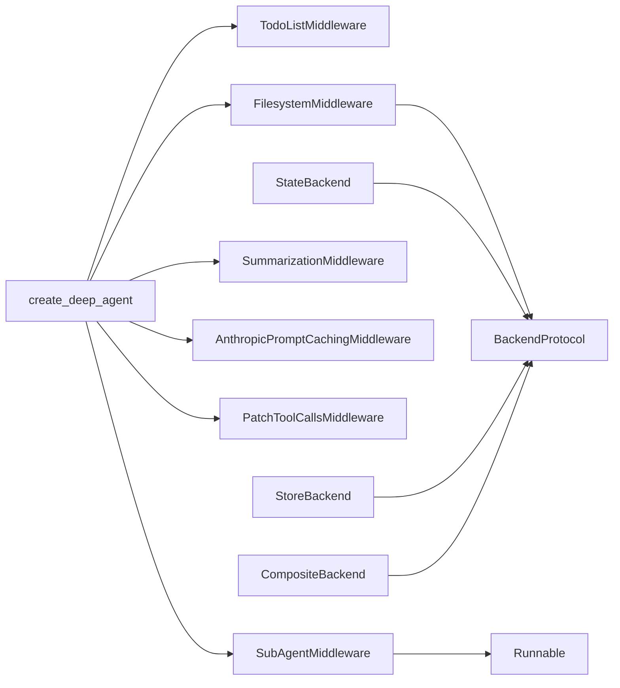

# 最佳实践

<cite>
**本文引用的文件**
- [README.md](file://README.md)
- [CLAUDE.md](file://CLAUDE.md)
- [libs/deepagents/README.md](file://libs/deepagents/README.md)
- [libs/deepagents/CLAUDE.md](file://libs/deepagents/CLAUDE.md)
- [libs/deepagents/deepagents/graph.py](file://libs/deepagents/deepagents/graph.py)
- [libs/deepagents/deepagents/middleware/filesystem.py](file://libs/deepagents/deepagents/middleware/filesystem.py)
- [libs/deepagents/deepagents/middleware/subagents.py](file://libs/deepagents/deepagents/middleware/subagents.py)
- [libs/deepagents/deepagents/backends/composite.py](file://libs/deepagents/deepagents/backends/composite.py)
- [libs/deepagents/deepagents/backends/state.py](file://libs/deepagents/deepagents/backends/state.py)
- [libs/deepagents/deepagents/backends/store.py](file://libs/deepagents/deepagents/backends/store.py)
- [libs/deepagents/deepagents/backends/filesystem.py](file://libs/deepagents/deepagents/backends/filesystem.py)
- [libs/deepagents/deepagents/middleware/patch_tool_calls.py](file://libs/deepagents/deepagents/middleware/patch_tool_calls.py)
- [libs/deepagents/tests/integration_tests/test_deepagents.py](file://libs/deepagents/tests/integration_tests/test_deepagents.py)
- [libs/deepagents/tests/unit_tests/test_middleware.py](file://libs/deepagents/tests/unit_tests/test_middleware.py)
</cite>

## 目录
1. [简介](#简介)
2. [项目结构](#项目结构)
3. [核心组件](#核心组件)
4. [架构总览](#架构总览)
5. [详细组件分析](#详细组件分析)
6. [依赖关系分析](#依赖关系分析)
7. [性能与成本优化](#性能与成本优化)
8. [故障排查指南](#故障排查指南)
9. [结论](#结论)
10. [附录](#附录)

## 简介
本指南面向使用 deepagents-langchain 的开发者，围绕“任务规划、上下文管理、专业化委派、持久化策略、性能优化、成本管理”六大主题，结合仓库中的实现与文档，总结可操作的最佳实践，并给出与 CLAUDE.md 中 AI 使用指引一致的落地方法。

## 项目结构
- 核心库 libs/deepagents 提供 Agent 创建、中间件与后端抽象，以及内置工具与子代理委派能力。
- CLI 工具与示例技能位于 libs/deepagents-cli 与 examples 目录，便于交互式使用与技能扩展。
- Harbor 集成提供评估与追踪能力，支持多沙箱环境与 LangSmith 集成。

图表来源
- [libs/deepagents/CLAUDE.md](file://libs/deepagents/CLAUDE.md#L1-L120)
- [libs/deepagents/deepagents/graph.py](file://libs/deepagents/deepagents/graph.py#L40-L162)

章节来源
- [libs/deepagents/CLAUDE.md](file://libs/deepagents/CLAUDE.md#L1-L120)
- [README.md](file://README.md#L1-L120)

## 核心组件
- 任务规划与进度跟踪：内置 write_todos/read_todos 工具，配合 TodoListMiddleware，确保复杂任务分解与回溯。
- 上下文管理：文件系统工具链（ls/read_file/write_file/edit_file/glob/grep），支持大结果卸载到文件并按需分页读取；execute 工具在具备沙箱后端时启用。
- 专业化委派：task 工具通过 SubAgentMiddleware 将独立复杂任务委派给子代理，实现上下文隔离与并行执行。
- 长期记忆与持久化：通过 StoreBackend 与 CompositeBackend，将关键数据（如用户偏好、知识库）持久化跨会话保存。
- 异步优先与并发：全面支持异步后端与中间件，提升 I/O 与命令执行的非阻塞能力。
- 成本优化：AnthropicPromptCachingMiddleware 缓存系统提示；自动摘要与上下文裁剪减少 token 消耗。

章节来源
- [README.md](file://README.md#L252-L319)
- [libs/deepagents/README.md](file://libs/deepagents/README.md#L80-L120)
- [libs/deepagents/deepagents/graph.py](file://libs/deepagents/deepagents/graph.py#L113-L162)

## 架构总览
deepagents 的默认中间件栈包含：
- TodoListMiddleware：任务规划与进度跟踪
- FilesystemMiddleware：文件系统工具与上下文卸载
- SubAgentMiddleware：子代理委派与生命周期管理
- SummarizationMiddleware：上下文超限时自动摘要
- AnthropicPromptCachingMiddleware：提示缓存（成本优化）
- PatchToolCallsMiddleware：修复中断导致的悬空工具调用
- 可选 HumanInTheLoopMiddleware：敏感工具的人工审批

图表来源
- [libs/deepagents/deepagents/graph.py](file://libs/deepagents/deepagents/graph.py#L113-L162)

章节来源
- [libs/deepagents/deepagents/graph.py](file://libs/deepagents/deepagents/graph.py#L113-L162)

## 详细组件分析

### 任务规划与 write_todos
- 使用场景：复杂多步骤任务必须先写入待办列表，再逐步完成；避免遗漏与重复。
- 最佳实践：
  - 在系统提示中明确“何时使用 write_todos”“如何标记完成”“何时不使用 todos（简单任务）”。
  - 将任务拆分为可独立验证的小步骤，完成后立即更新状态。
  - 结合子代理并行推进多个子任务，最后合成结果。
- 参考实现与说明：
  - 内置工具与说明来自中间件文档与 README。
  - 默认中间件栈已包含 TodoListMiddleware。

章节来源
- [README.md](file://README.md#L290-L319)
- [libs/deepagents/README.md](file://libs/deepagents/README.md#L80-L120)
- [libs/deepagents/deepagents/graph.py](file://libs/deepagents/deepagents/graph.py#L113-L143)

### 上下文管理与文件系统工具
- 大结果卸载：当工具返回结果过大时，系统会提示将结果保存至文件系统，随后通过 read_file 分页读取，避免上下文溢出。
- 安全与路径校验：所有路径必须以“/”开头，禁止相对路径与路径穿越；Windows 绝对路径不被支持。
- 搜索与过滤：glob 与 grep 支持通配与内容检索；支持按目录与模式过滤。
- 执行能力：execute 工具仅在后端实现 SandboxBackendProtocol 时可用；否则返回不可用提示。
- 异步支持：ls、read、write、edit、glob、grep、execute 均提供异步版本，提升 I/O 并发。

图表来源
- [libs/deepagents/deepagents/middleware/filesystem.py](file://libs/deepagents/deepagents/middleware/filesystem.py#L791-L800)
- [libs/deepagents/deepagents/middleware/filesystem.py](file://libs/deepagents/deepagents/middleware/filesystem.py#L1-L120)

章节来源
- [libs/deepagents/deepagents/middleware/filesystem.py](file://libs/deepagents/deepagents/middleware/filesystem.py#L1-L120)
- [libs/deepagents/deepagents/middleware/filesystem.py](file://libs/deepagents/deepagents/middleware/filesystem.py#L791-L800)

### 专业化委派与子代理
- 使用时机：复杂、多步骤且可并行的任务；需要隔离上下文窗口；需要聚焦特定领域。
- 生命周期：Spawn → Run → Return → Reconcile；子代理只保留最终结果，隐藏中间过程。
- 并行执行：尽量在同一消息中并行发起多个 task 调用，最大化吞吐。
- 默认通用子代理：包含与主代理相同的工具集，适合大多数复杂任务的上下文隔离。

图表来源
- [libs/deepagents/deepagents/middleware/subagents.py](file://libs/deepagents/deepagents/middleware/subagents.py#L315-L375)

章节来源
- [libs/deepagents/deepagents/middleware/subagents.py](file://libs/deepagents/deepagents/middleware/subagents.py#L1-L120)
- [libs/deepagents/deepagents/middleware/subagents.py](file://libs/deepagents/deepagents/middleware/subagents.py#L315-L375)

### 持久化策略与 CompositeBackend
- 场景：用户偏好、知识库、研究进度等需要跨会话保持的数据。
- 方案：使用 CompositeBackend 将特定路径（如 /memories/）路由到 StoreBackend，其余路径仍使用 StateBackend（会话内临时）。
- 优势：工作文件临时化，重要数据持久化；混合路由灵活可控。

图表来源
- [libs/deepagents/deepagents/backends/composite.py](file://libs/deepagents/deepagents/backends/composite.py#L1-L120)
- [libs/deepagents/deepagents/backends/state.py](file://libs/deepagents/deepagents/backends/state.py#L1-L120)
- [libs/deepagents/deepagents/backends/store.py](file://libs/deepagents/deepagents/backends/store.py#L1-L120)

章节来源
- [README.md](file://README.md#L224-L251)
- [libs/deepagents/deepagents/backends/composite.py](file://libs/deepagents/deepagents/backends/composite.py#L1-L120)
- [libs/deepagents/deepagents/backends/state.py](file://libs/deepagents/deepagents/backends/state.py#L1-L120)
- [libs/deepagents/deepagents/backends/store.py](file://libs/deepagents/deepagents/backends/store.py#L1-L120)

### 异步流式处理与并发
- 异步优先：create_deep_agent 统一支持同步与异步；文件系统与子代理均提供异步版本。
- 并发执行：子代理可并行启动；文件批量上传/下载按后端分批聚合，减少往返次数。
- 非阻塞 I/O：文件读写与命令执行不阻塞主流程，显著降低响应延迟。

章节来源
- [libs/deepagents/README.md](file://libs/deepagents/README.md#L456-L496)
- [libs/deepagents/deepagents/backends/composite.py](file://libs/deepagents/deepagents/backends/composite.py#L421-L562)
- [libs/deepagents/deepagents/backends/filesystem.py](file://libs/deepagents/deepagents/backends/filesystem.py#L1-L120)

### 成本管理与提示缓存
- 提示缓存：AnthropicPromptCachingMiddleware 在 Anthropic 模型上启用系统提示缓存，降低重复调用成本。
- 自动摘要：当上下文超过阈值（按 tokens 或 fraction）时，SummarizationMiddleware 自动摘要，减少 token 使用。
- 模型选择：根据任务复杂度与成本预算选择合适模型；对长文本与高成本任务优先采用缓存与摘要策略。

章节来源
- [libs/deepagents/deepagents/graph.py](file://libs/deepagents/deepagents/graph.py#L113-L162)

## 依赖关系分析
- Agent 创建入口：create_deep_agent() 统一装配默认中间件与后端，返回编译后的 StateGraph。
- 中间件依赖：
  - FilesystemMiddleware 依赖 BackendProtocol；execute 工具依赖 SandboxBackendProtocol。
  - SubAgentMiddleware 依赖 create_agent 与 Runnable，支持自定义子代理或预编译图。
- 后端依赖：
  - StateBackend：依赖 LangGraph 状态与命令对象更新。
  - StoreBackend：依赖 LangGraph Store，支持命名空间隔离与分页检索。
  - CompositeBackend：将不同路径路由到不同后端，实现混合持久化策略。

图表来源
- [libs/deepagents/deepagents/graph.py](file://libs/deepagents/deepagents/graph.py#L113-L162)
- [libs/deepagents/deepagents/middleware/filesystem.py](file://libs/deepagents/deepagents/middleware/filesystem.py#L645-L766)
- [libs/deepagents/deepagents/middleware/subagents.py](file://libs/deepagents/deepagents/middleware/subagents.py#L208-L277)
- [libs/deepagents/deepagents/backends/state.py](file://libs/deepagents/deepagents/backends/state.py#L1-L120)
- [libs/deepagents/deepagents/backends/store.py](file://libs/deepagents/deepagents/backends/store.py#L1-L120)
- [libs/deepagents/deepagents/backends/composite.py](file://libs/deepagents/deepagents/backends/composite.py#L1-L120)

章节来源
- [libs/deepagents/deepagents/graph.py](file://libs/deepagents/deepagents/graph.py#L113-L162)
- [libs/deepagents/deepagents/middleware/filesystem.py](file://libs/deepagents/deepagents/middleware/filesystem.py#L645-L766)
- [libs/deepagents/deepagents/middleware/subagents.py](file://libs/deepagents/deepagents/middleware/subagents.py#L208-L277)
- [libs/deepagents/deepagents/backends/state.py](file://libs/deepagents/deepagents/backends/state.py#L1-L120)
- [libs/deepagents/deepagents/backends/store.py](file://libs/deepagents/deepagents/backends/store.py#L1-L120)
- [libs/deepagents/deepagents/backends/composite.py](file://libs/deepagents/deepagents/backends/composite.py#L1-L120)

## 性能与成本优化
- 异步与并发
  - 优先使用异步 API（astream/async）；子代理并行执行；文件批量操作按后端聚合。
- 上下文控制
  - 大结果一律卸载到文件并通过分页读取；合理使用 glob/grep 过滤范围。
  - 当上下文接近阈值时，启用自动摘要中间件。
- 持久化与缓存
  - 使用 CompositeBackend 将关键数据持久化；在 Anthropic 模型上启用提示缓存。
- 模型选择
  - 对长文本与高成本任务，优先选择支持缓存的模型；对简单任务可选用更低成本模型。
- I/O 与执行
  - 文件系统后端支持安全路径解析与最大文件大小限制；execute 仅在沙箱后端可用。

章节来源
- [libs/deepagents/README.md](file://libs/deepagents/README.md#L456-L496)
- [libs/deepagents/deepagents/graph.py](file://libs/deepagents/deepagents/graph.py#L113-L162)
- [libs/deepagents/deepagents/backends/filesystem.py](file://libs/deepagents/deepagents/backends/filesystem.py#L1-L120)

## 故障排查指南
- 悬空工具调用
  - 使用 PatchToolCallsMiddleware 在消息历史中补全缺失的 ToolMessage，避免中断后工具调用丢失。
- 路径与权限
  - 文件系统工具要求绝对路径且不得越权；Windows 绝对路径不被支持；注意最大文件大小限制。
- 执行不可用
  - execute 工具仅在后端实现 SandboxBackendProtocol 时可用；否则返回不可用提示。
- 子代理调用失败
  - 确认子代理类型存在；子代理状态仅包含必要字段，避免污染主代理上下文。
- 集成测试参考
  - 单元与集成测试覆盖了中间件、子代理、持久化与异步能力，可作为行为验证的参考。

章节来源
- [libs/deepagents/deepagents/middleware/patch_tool_calls.py](file://libs/deepagents/deepagents/middleware/patch_tool_calls.py#L1-L45)
- [libs/deepagents/deepagents/middleware/filesystem.py](file://libs/deepagents/deepagents/middleware/filesystem.py#L1-L120)
- [libs/deepagents/deepagents/middleware/subagents.py](file://libs/deepagents/deepagents/middleware/subagents.py#L315-L375)
- [libs/deepagents/tests/unit_tests/test_middleware.py](file://libs/deepagents/tests/unit_tests/test_middleware.py#L1-L120)
- [libs/deepagents/tests/integration_tests/test_deepagents.py](file://libs/deepagents/tests/integration_tests/test_deepagents.py#L1-L166)

## 结论
- 任务规划：务必使用 write_todos，将复杂任务结构化、可验证、可回溯。
- 上下文管理：大结果一律卸载到文件系统，按需分页读取；合理使用 glob/grep 过滤范围。
- 专业化委派：对独立、复杂、可并行的任务使用 task 工具委派给子代理，实现上下文隔离与性能提升。
- 持久化策略：使用 CompositeBackend 将关键数据持久化，工作文件保持临时化。
- 性能与成本：全面采用异步与并发；启用提示缓存与自动摘要；合理选择模型。
- 以上实践与 CLAUDE.md 的 AI 使用指引高度一致，可在工程中直接落地。

## 附录
- 快速开始与示例：参见 README 与 CLAUDE.md 中的使用示例与 CLI 操作。
- 示例技能：通过 examples/skills 提供的模板与示例，快速扩展自定义技能。

章节来源
- [README.md](file://README.md#L1-L120)
- [CLAUDE.md](file://CLAUDE.md#L110-L180)
- [examples/CLAUDE.md](file://examples/CLAUDE.md#L1-L120)