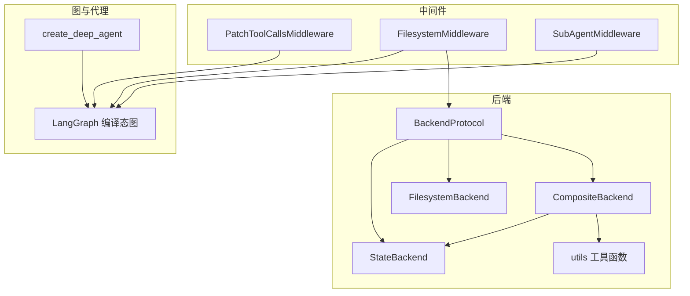
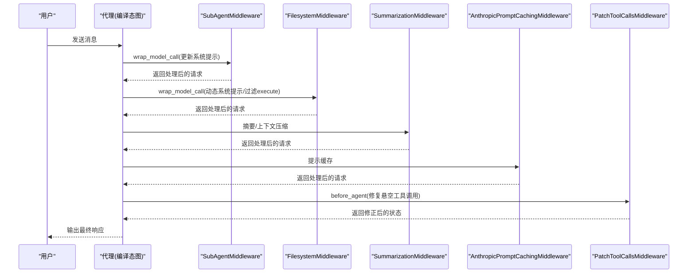
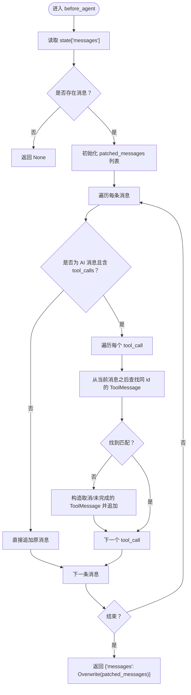
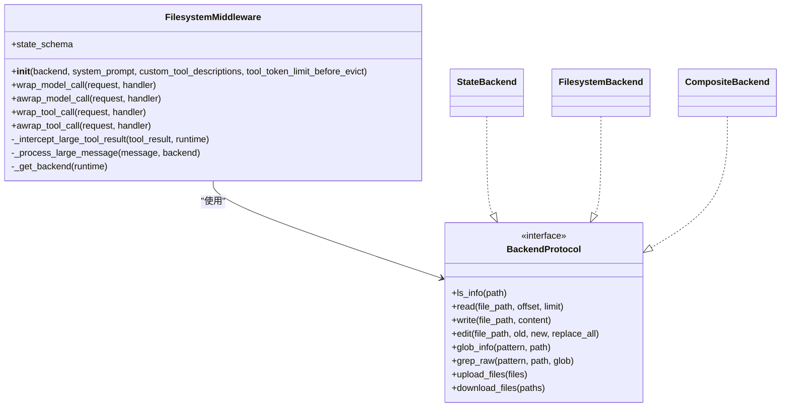
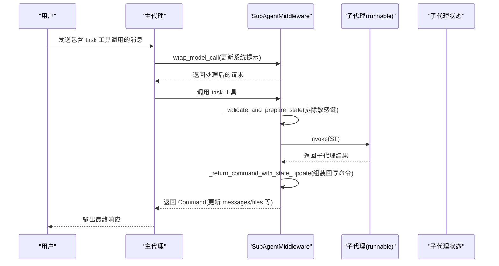
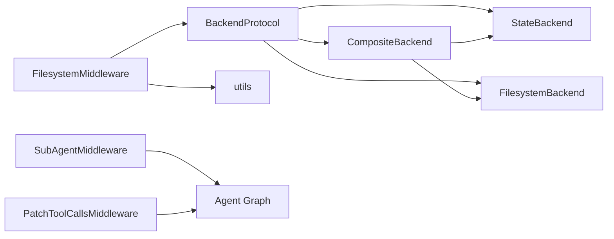

# 中间件系统

<cite>
**本文引用的文件**
- [libs/deepagents/deepagents/middleware/__init__.py](file://libs/deepagents/deepagents/middleware/__init__.py)
- [libs/deepagents/deepagents/middleware/patch_tool_calls.py](file://libs/deepagents/deepagents/middleware/patch_tool_calls.py)
- [libs/deepagents/deepagents/middleware/filesystem.py](file://libs/deepagents/deepagents/middleware/filesystem.py)
- [libs/deepagents/deepagents/middleware/subagents.py](file://libs/deepagents/deepagents/middleware/subagents.py)
- [libs/deepagents/deepagents/graph.py](file://libs/deepagents/deepagents/graph.py)
- [libs/deepagents/deepagents/backends/protocol.py](file://libs/deepagents/deepagents/backends/protocol.py)
- [libs/deepagents/deepagents/backends/state.py](file://libs/deepagents/deepagents/backends/state.py)
- [libs/deepagents/deepagents/backends/filesystem.py](file://libs/deepagents/deepagents/backends/filesystem.py)
- [libs/deepagents/deepagents/backends/composite.py](file://libs/deepagents/deepagents/backends/composite.py)
- [libs/deepagents/deepagents/backends/utils.py](file://libs/deepagents/deepagents/backends/utils.py)
- [libs/deepagents/tests/integration_tests/test_filesystem_middleware.py](file://libs/deepagents/tests/integration_tests/test_filesystem_middleware.py)
- [libs/deepagents/tests/integration_tests/test_subagent_middleware.py](file://libs/deepagents/tests/integration_tests/test_subagent_middleware.py)
- [libs/deepagents/tests/unit_tests/test_middleware.py](file://libs/deepagents/tests/unit_tests/test_middleware.py)
- [libs/deepagents/tests/unit_tests/test_middleware_async.py](file://libs/deepagents/tests/unit_tests/test_middleware_async.py)
</cite>

## 目录
1. [引言](#引言)
2. [项目结构](#项目结构)
3. [核心组件](#核心组件)
4. [架构总览](#架构总览)
5. [详细组件分析](#详细组件分析)
6. [依赖关系分析](#依赖关系分析)
7. [性能考量](#性能考量)
8. [故障排查指南](#故障排查指南)
9. [结论](#结论)
10. [附录](#附录)

## 引言
本文件系统化梳理 deepagents 的中间件体系，重点围绕以下目标展开：
- 解释中间件在代理执行流程中的作用机制，尤其是如何通过拦截与修改工具调用（如 patch_tool_calls）增强行为一致性与鲁棒性。
- 深入说明 FilesystemMiddleware 如何为代理提供文件系统访问能力，包括路径安全校验、虚拟路径路由、大结果落盘与状态回写等。
- 阐述 SubAgentMiddleware 如何实现子代理的上下文隔离与任务委派，以及默认通用子代理与自定义子代理的组合方式。
- 结合代码示例路径展示中间件的注册、执行顺序与链式调用模式。
- 讨论中间件与 LangGraph 状态机的集成方式，以及如何通过中间件扩展代理行为而不修改核心逻辑。
- 总结中间件开发的最佳实践、常见陷阱与调试策略。

## 项目结构
中间件位于 deepagents/middleware 目录，配合 backends 提供统一的文件系统抽象与执行能力；graph.py 负责创建“深度代理”，内置默认中间件链；测试覆盖了文件系统与子代理中间件的典型用法与边界场景。

图表来源
- [libs/deepagents/deepagents/middleware/patch_tool_calls.py](file://libs/deepagents/deepagents/middleware/patch_tool_calls.py#L1-L45)
- [libs/deepagents/deepagents/middleware/filesystem.py](file://libs/deepagents/deepagents/middleware/filesystem.py#L800-L1087)
- [libs/deepagents/deepagents/middleware/subagents.py](file://libs/deepagents/deepagents/middleware/subagents.py#L377-L485)
- [libs/deepagents/deepagents/backends/protocol.py](file://libs/deepagents/deepagents/backends/protocol.py#L161-L459)
- [libs/deepagents/deepagents/backends/state.py](file://libs/deepagents/deepagents/backends/state.py#L20-L188)
- [libs/deepagents/deepagents/backends/filesystem.py](file://libs/deepagents/deepagents/backends/filesystem.py#L35-L551)
- [libs/deepagents/deepagents/backends/composite.py](file://libs/deepagents/deepagents/backends/composite.py#L19-L562)
- [libs/deepagents/deepagents/backends/utils.py](file://libs/deepagents/deepagents/backends/utils.py#L1-L437)
- [libs/deepagents/deepagents/graph.py](file://libs/deepagents/deepagents/graph.py#L40-L162)

章节来源
- [libs/deepagents/deepagents/middleware/__init__.py](file://libs/deepagents/deepagents/middleware/__init__.py#L1-L12)
- [libs/deepagents/deepagents/graph.py](file://libs/deepagents/deepagents/graph.py#L40-L162)

## 核心组件
- PatchToolCallsMiddleware：在模型前处理阶段修复“悬空工具调用”问题，确保消息历史中每个 AI 工具调用都有对应的 ToolMessage 响应，避免后续推理因缺失响应而中断。
- FilesystemMiddleware：为代理注入文件系统工具集（ls、read_file、write_file、edit_file、glob、grep、execute），并根据后端能力动态调整系统提示与工具可用性；支持大结果落盘与状态回写，保障上下文窗口不溢出。
- SubAgentMiddleware：提供 task 工具，用于启动上下文隔离的子代理，完成复杂或多步任务；支持默认通用子代理与自定义子代理，可按需叠加中间件与中断配置。
- 后端协议与实现：BackendProtocol 定义统一接口；StateBackend/ FilesystemBackend/ CompositeBackend 实现不同存储与执行策略；utils 提供路径校验、格式化、替换、匹配等工具。

章节来源
- [libs/deepagents/deepagents/middleware/patch_tool_calls.py](file://libs/deepagents/deepagents/middleware/patch_tool_calls.py#L1-L45)
- [libs/deepagents/deepagents/middleware/filesystem.py](file://libs/deepagents/deepagents/middleware/filesystem.py#L800-L1087)
- [libs/deepagents/deepagents/middleware/subagents.py](file://libs/deepagents/deepagents/middleware/subagents.py#L377-L485)
- [libs/deepagents/deepagents/backends/protocol.py](file://libs/deepagents/deepagents/backends/protocol.py#L161-L459)
- [libs/deepagents/deepagents/backends/state.py](file://libs/deepagents/deepagents/backends/state.py#L20-L188)
- [libs/deepagents/deepagents/backends/filesystem.py](file://libs/deepagents/deepagents/backends/filesystem.py#L35-L551)
- [libs/deepagents/deepagents/backends/composite.py](file://libs/deepagents/deepagents/backends/composite.py#L19-L562)
- [libs/deepagents/deepagents/backends/utils.py](file://libs/deepagents/deepagents/backends/utils.py#L1-L437)

## 架构总览
deepagents 的默认代理由 create_deep_agent 组装，内置多层中间件链，形成“先子代理、再文件系统、再摘要与缓存、再补丁工具调用”的执行顺序。该顺序既保证了任务委派的优先级，也确保了文件系统能力与上下文管理的协同。

图表来源
- [libs/deepagents/deepagents/graph.py](file://libs/deepagents/deepagents/graph.py#L113-L143)
- [libs/deepagents/deepagents/middleware/subagents.py](file://libs/deepagents/deepagents/middleware/subagents.py#L464-L485)
- [libs/deepagents/deepagents/middleware/filesystem.py](file://libs/deepagents/deepagents/middleware/filesystem.py#L882-L974)
- [libs/deepagents/deepagents/middleware/patch_tool_calls.py](file://libs/deepagents/deepagents/middleware/patch_tool_calls.py#L14-L45)

章节来源
- [libs/deepagents/deepagents/graph.py](file://libs/deepagents/deepagents/graph.py#L113-L143)

## 详细组件分析

### PatchToolCallsMiddleware 分析
- 作用：在模型调用前扫描消息历史，若发现 AI 已发出工具调用但未收到对应 ToolMessage，则自动插入一条“已取消/未完成”的 ToolMessage，以保持消息历史完整性。
- 关键点：遍历消息列表，对每个 AI 消息的 tool_calls 进行检查；若找不到匹配的 ToolMessage，则构造 ToolMessage 并追加到消息队列；返回包含 Overwrite 的状态更新，确保后续推理能正确读取。

图表来源
- [libs/deepagents/deepagents/middleware/patch_tool_calls.py](file://libs/deepagents/deepagents/middleware/patch_tool_calls.py#L14-L45)

章节来源
- [libs/deepagents/deepagents/middleware/patch_tool_calls.py](file://libs/deepagents/deepagents/middleware/patch_tool_calls.py#L14-L45)
- [libs/deepagents/tests/unit_tests/test_middleware.py](file://libs/deepagents/tests/unit_tests/test_middleware.py#L1227-L1285)

### FilesystemMiddleware 分析
- 作用：为代理注入文件系统工具集，支持路径安全校验、虚拟路径路由、大结果落盘与状态回写、执行工具（当后端支持）。
- 关键点：
  - 系统提示动态构建：若存在 execute 工具且后端支持，则附加执行说明；否则过滤掉 execute。
  - 大结果落盘：当工具结果长度超过阈值时，将结果写入后端（默认 /large_tool_results/<sanitized_id>），并在 ToolMessage 中提示用户从文件系统读取分页结果。
  - 工具生成器：统一管理 ls/read_file/write_file/edit_file/glob/grep/execute 的生成与包装，支持同步/异步。
  - 后端选择：支持 StateBackend（内存态）、FilesystemBackend（真实文件系统）、CompositeBackend（混合路由）。
  - 路径安全：提供路径规范化与前缀校验，拒绝目录穿越与非法绝对路径，确保虚拟路径一致性。

图表来源
- [libs/deepagents/deepagents/middleware/filesystem.py](file://libs/deepagents/deepagents/middleware/filesystem.py#L800-L1087)
- [libs/deepagents/deepagents/backends/protocol.py](file://libs/deepagents/deepagents/backends/protocol.py#L161-L459)
- [libs/deepagents/deepagents/backends/state.py](file://libs/deepagents/deepagents/backends/state.py#L20-L188)
- [libs/deepagents/deepagents/backends/filesystem.py](file://libs/deepagents/deepagents/backends/filesystem.py#L35-L551)
- [libs/deepagents/deepagents/backends/composite.py](file://libs/deepagents/deepagents/backends/composite.py#L19-L562)

章节来源
- [libs/deepagents/deepagents/middleware/filesystem.py](file://libs/deepagents/deepagents/middleware/filesystem.py#L800-L1087)
- [libs/deepagents/deepagents/backends/protocol.py](file://libs/deepagents/deepagents/backends/protocol.py#L161-L459)
- [libs/deepagents/deepagents/backends/state.py](file://libs/deepagents/deepagents/backends/state.py#L20-L188)
- [libs/deepagents/deepagents/backends/filesystem.py](file://libs/deepagents/deepagents/backends/filesystem.py#L35-L551)
- [libs/deepagents/deepagents/backends/composite.py](file://libs/deepagents/deepagents/backends/composite.py#L19-L562)
- [libs/deepagents/deepagents/backends/utils.py](file://libs/deepagents/deepagents/backends/utils.py#L1-L437)
- [libs/deepagents/tests/integration_tests/test_filesystem_middleware.py](file://libs/deepagents/tests/integration_tests/test_filesystem_middleware.py#L1-L800)
- [libs/deepagents/tests/unit_tests/test_middleware_async.py](file://libs/deepagents/tests/unit_tests/test_middleware_async.py#L23-L49)

### SubAgentMiddleware 分析
- 作用：为代理注入 task 工具，允许启动上下文隔离的子代理执行复杂或多步任务；支持默认通用子代理与自定义子代理，可叠加中间件与中断配置。
- 关键点：
  - 默认通用子代理：当启用时，会基于主代理的 tools/model/default_middleware 创建一个“通用型”子代理，便于隔离上下文与减少主代理负担。
  - 自定义子代理：支持 name/description/system_prompt/tools/model/middleware/interrupt_on 等字段；可通过“runnable”直接传入已编译的子图。
  - 状态隔离：子代理执行时仅传递必要的状态键，排除 messages/todos 等，避免污染主代理上下文。
  - 结果回写：子代理返回的结果会被封装为 Command，仅保留非排除键，并以 ToolMessage 形式回写至主代理的消息流。

图表来源
- [libs/deepagents/deepagents/middleware/subagents.py](file://libs/deepagents/deepagents/middleware/subagents.py#L279-L375)
- [libs/deepagents/deepagents/middleware/subagents.py](file://libs/deepagents/deepagents/middleware/subagents.py#L377-L485)

章节来源
- [libs/deepagents/deepagents/middleware/subagents.py](file://libs/deepagents/deepagents/middleware/subagents.py#L1-L485)
- [libs/deepagents/tests/integration_tests/test_subagent_middleware.py](file://libs/deepagents/tests/integration_tests/test_subagent_middleware.py#L1-L284)

### 中间件注册、执行顺序与链式调用
- 注册方式：通过 create_deep_agent 或 create_agent 的 middleware 参数传入中间件列表；默认链路包含 TodoList、Filesystem、SubAgent、Summarization、PromptCaching、PatchToolCalls 等。
- 执行顺序：LangGraph 在模型调用前依次调用各中间件的 wrap_model_call/awrap_model_call；在工具调用前后分别调用 wrap_tool_call/awrap_tool_call；在模型调用后调用 before_agent（用于补丁工具调用）。
- 链式调用：中间件之间通过请求/响应对象的覆盖与传递实现链式处理；例如 FilesystemMiddleware 可能过滤 execute 工具，SubAgentMiddleware 可能注入 task 工具，PatchToolCallsMiddleware 可能在 before_agent 阶段修正消息历史。

章节来源
- [libs/deepagents/deepagents/graph.py](file://libs/deepagents/deepagents/graph.py#L113-L143)
- [libs/deepagents/deepagents/middleware/filesystem.py](file://libs/deepagents/deepagents/middleware/filesystem.py#L882-L974)
- [libs/deepagents/deepagents/middleware/subagents.py](file://libs/deepagents/deepagents/middleware/subagents.py#L464-L485)
- [libs/deepagents/deepagents/middleware/patch_tool_calls.py](file://libs/deepagents/deepagents/middleware/patch_tool_calls.py#L14-L45)

## 依赖关系分析
- FilesystemMiddleware 依赖 BackendProtocol 抽象，具体实现可为 StateBackend（内存态）、FilesystemBackend（真实文件系统）、CompositeBackend（混合路由）。
- CompositeBackend 支持将不同路径前缀路由到不同后端，并在默认后端不支持执行时提供执行委托。
- utils 提供路径校验、格式化、字符串替换、匹配与聚合等工具，贯穿 FilesystemMiddleware 与 backends 的实现。
- create_deep_agent 将中间件链与 LangGraph 编译态图整合，形成完整的代理执行环境。

图表来源
- [libs/deepagents/deepagents/middleware/filesystem.py](file://libs/deepagents/deepagents/middleware/filesystem.py#L800-L1087)
- [libs/deepagents/deepagents/backends/protocol.py](file://libs/deepagents/deepagents/backends/protocol.py#L161-L459)
- [libs/deepagents/deepagents/backends/state.py](file://libs/deepagents/deepagents/backends/state.py#L20-L188)
- [libs/deepagents/deepagents/backends/filesystem.py](file://libs/deepagents/deepagents/backends/filesystem.py#L35-L551)
- [libs/deepagents/deepagents/backends/composite.py](file://libs/deepagents/deepagents/backends/composite.py#L19-L562)
- [libs/deepagents/deepagents/backends/utils.py](file://libs/deepagents/deepagents/backends/utils.py#L1-L437)
- [libs/deepagents/deepagents/middleware/subagents.py](file://libs/deepagents/deepagents/middleware/subagents.py#L377-L485)
- [libs/deepagents/deepagents/middleware/patch_tool_calls.py](file://libs/deepagents/deepagents/middleware/patch_tool_calls.py#L14-L45)

章节来源
- [libs/deepagents/deepagents/backends/protocol.py](file://libs/deepagents/deepagents/backends/protocol.py#L161-L459)
- [libs/deepagents/deepagents/backends/composite.py](file://libs/deepagents/deepagents/backends/composite.py#L19-L562)
- [libs/deepagents/deepagents/backends/utils.py](file://libs/deepagents/deepagents/backends/utils.py#L1-L437)

## 性能考量
- 上下文控制：FilesystemMiddleware 的大结果落盘阈值（tool_token_limit_before_evict）与 truncate_if_too_long 机制，有助于避免长 ToolResult 溢出上下文窗口。
- 摘要与缓存：默认链路包含 SummarizationMiddleware 与 AnthropicPromptCachingMiddleware，可在高 token 使用场景下降低成本与延迟。
- 异步与批量：FilesystemBackend/CompositeBackend 支持异步与批量上传/下载，提升 IO 效率。
- 路由与隔离：CompositeBackend 的路由与 StateBackend 的状态回写，使文件操作更可控且可持久化。

章节来源
- [libs/deepagents/deepagents/backends/utils.py](file://libs/deepagents/deepagents/backends/utils.py#L210-L221)
- [libs/deepagents/deepagents/middleware/filesystem.py](file://libs/deepagents/deepagents/middleware/filesystem.py#L1001-L1048)
- [libs/deepagents/deepagents/backends/composite.py](file://libs/deepagents/deepagents/backends/composite.py#L421-L562)
- [libs/deepagents/deepagents/graph.py](file://libs/deepagents/deepagents/graph.py#L113-L143)

## 故障排查指南
- 悬空工具调用修复：若出现“工具调用无响应”导致推理中断，检查 PatchToolCallsMiddleware 是否被正确加入中间件链，或在 before_agent 阶段是否成功插入 ToolMessage。
- 文件系统工具不可用：若 execute 工具缺失，确认后端是否实现了 SandboxBackendProtocol；FilesystemMiddleware 会在 wrap_model_call 阶段过滤掉不可用工具。
- 路径错误与越界：路径校验失败（如包含 “..” 或 Windows 绝对路径）会导致异常；使用虚拟路径并确保前缀一致。
- 大结果未落盘：若 ToolResult 过大但未触发落盘，检查 tool_token_limit_before_evict 设置与 _intercept_large_tool_result 的判断条件。
- 子代理状态污染：确认 SubAgentMiddleware 是否正确排除 messages/todos 等键；若主代理上下文异常，检查 _return_command_with_state_update 的状态合并逻辑。

章节来源
- [libs/deepagents/deepagents/middleware/patch_tool_calls.py](file://libs/deepagents/deepagents/middleware/patch_tool_calls.py#L14-L45)
- [libs/deepagents/deepagents/middleware/filesystem.py](file://libs/deepagents/deepagents/middleware/filesystem.py#L882-L974)
- [libs/deepagents/deepagents/middleware/filesystem.py](file://libs/deepagents/deepagents/middleware/filesystem.py#L1001-L1048)
- [libs/deepagents/deepagents/middleware/subagents.py](file://libs/deepagents/deepagents/middleware/subagents.py#L315-L375)
- [libs/deepagents/tests/unit_tests/test_middleware.py](file://libs/deepagents/tests/unit_tests/test_middleware.py#L1227-L1285)

## 结论
deepagents 的中间件体系通过“可插拔、可组合”的设计，将文件系统能力、子代理委派与上下文治理有机融合。PatchToolCallsMiddleware 保障消息历史完整性，FilesystemMiddleware 提供安全、灵活的文件系统抽象与执行能力，SubAgentMiddleware 实现任务委派与上下文隔离。借助 LangGraph 的编译态图与中间件链，代理行为得以在不修改核心逻辑的前提下被持续扩展与优化。

## 附录
- 中间件注册与默认链路参考路径：
  - [libs/deepagents/deepagents/graph.py](file://libs/deepagents/deepagents/graph.py#L113-L143)
- FilesystemMiddleware 初始化与工具生成：
  - [libs/deepagents/deepagents/middleware/filesystem.py](file://libs/deepagents/deepagents/middleware/filesystem.py#L800-L881)
- SubAgentMiddleware 初始化与 task 工具：
  - [libs/deepagents/deepagents/middleware/subagents.py](file://libs/deepagents/deepagents/middleware/subagents.py#L437-L485)
- 测试用例参考：
  - [libs/deepagents/tests/integration_tests/test_filesystem_middleware.py](file://libs/deepagents/tests/integration_tests/test_filesystem_middleware.py#L1-L800)
  - [libs/deepagents/tests/integration_tests/test_subagent_middleware.py](file://libs/deepagents/tests/integration_tests/test_subagent_middleware.py#L1-L284)
  - [libs/deepagents/tests/unit_tests/test_middleware.py](file://libs/deepagents/tests/unit_tests/test_middleware.py#L1227-L1285)
  - [libs/deepagents/tests/unit_tests/test_middleware_async.py](file://libs/deepagents/tests/unit_tests/test_middleware_async.py#L23-L49)