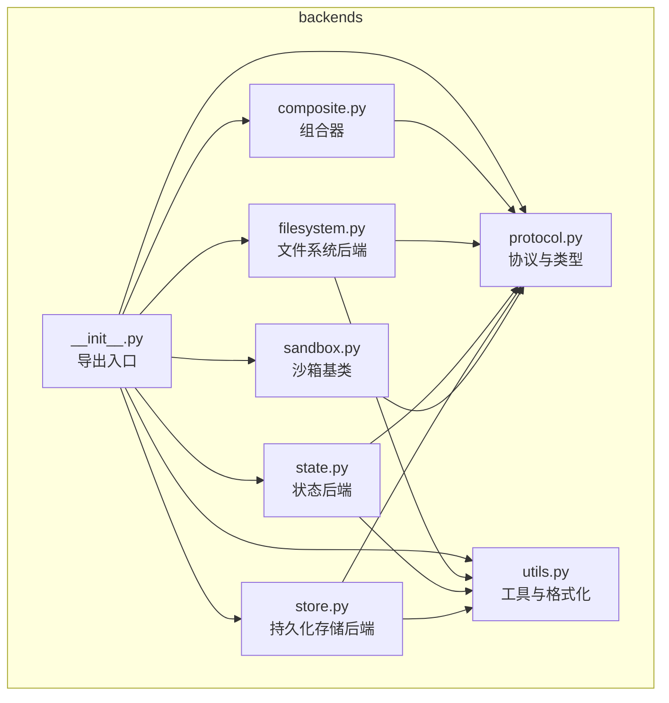
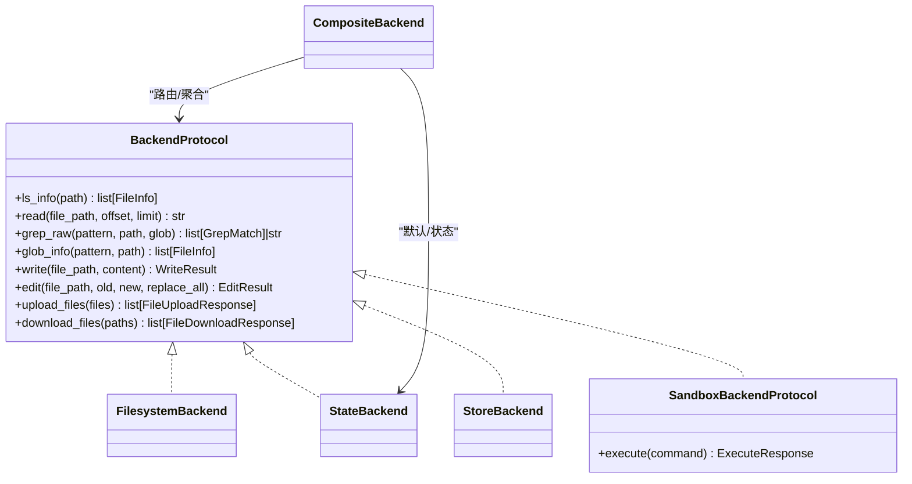
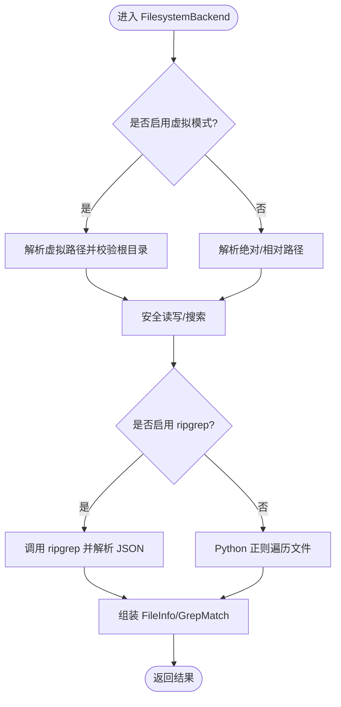
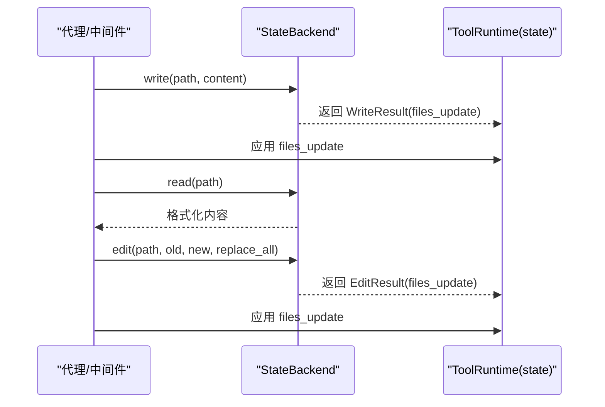
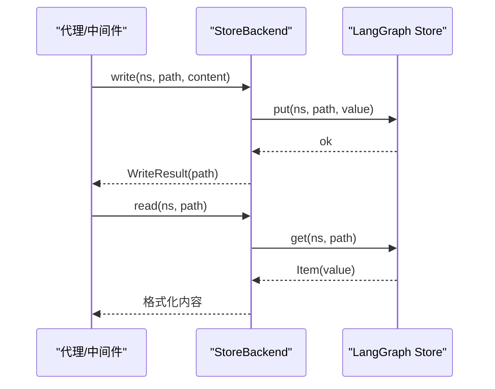
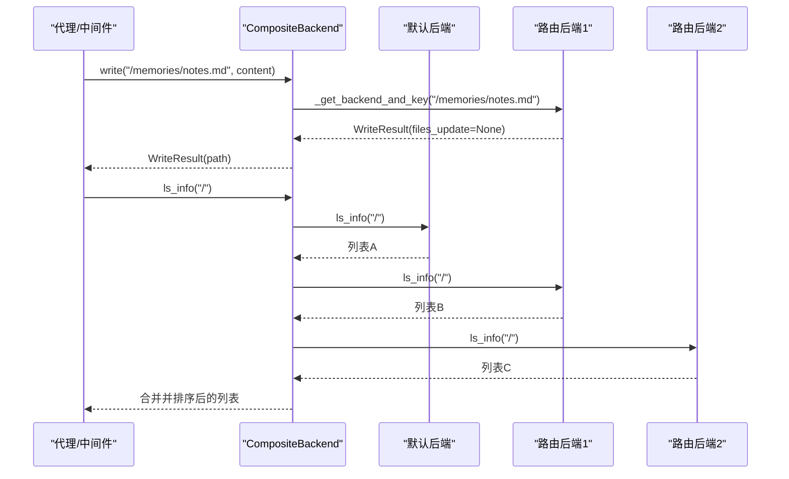
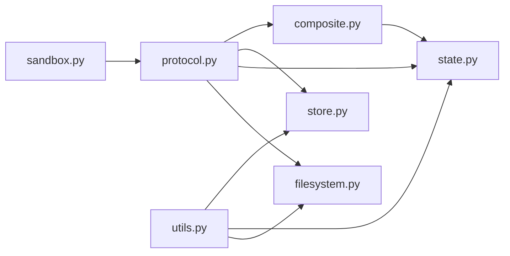

# 后端系统

<cite>
**本文引用的文件**
- [libs/deepagents/deepagents/backends/__init__.py](file://libs/deepagents/deepagents/backends/__init__.py)
- [libs/deepagents/deepagents/backends/protocol.py](file://libs/deepagents/deepagents/backends/protocol.py)
- [libs/deepagents/deepagents/backends/utils.py](file://libs/deepagents/deepagents/backends/utils.py)
- [libs/deepagents/deepagents/backends/composite.py](file://libs/deepagents/deepagents/backends/composite.py)
- [libs/deepagents/deepagents/backends/filesystem.py](file://libs/deepagents/deepagents/backends/filesystem.py)
- [libs/deepagents/deepagents/backends/state.py](file://libs/deepagents/deepagents/backends/state.py)
- [libs/deepagents/deepagents/backends/store.py](file://libs/deepagents/deepagents/backends/store.py)
- [libs/deepagents/deepagents/backends/sandbox.py](file://libs/deepagents/deepagents/backends/sandbox.py)
- [libs/deepagents/tests/unit_tests/backends/test_composite_backend.py](file://libs/deepagents/tests/unit_tests/backends/test_composite_backend.py)
- [libs/deepagents/tests/unit_tests/backends/test_state_backend.py](file://libs/deepagents/tests/unit_tests/backends/test_state_backend.py)
- [libs/deepagents/tests/unit_tests/backends/test_store_backend.py](file://libs/deepagents/tests/unit_tests/backends/test_store_backend.py)
</cite>

## 目录
1. [简介](#简介)
2. [项目结构](#项目结构)
3. [核心组件](#核心组件)
4. [架构总览](#架构总览)
5. [详细组件分析](#详细组件分析)
6. [依赖关系分析](#依赖关系分析)
7. [性能考量](#性能考量)
8. [故障排查指南](#故障排查指南)
9. [结论](#结论)
10. [附录](#附录)

## 简介
本文件面向 deepagents 后端系统，围绕 StateBackend、FilesystemBackend、StoreBackend 和 CompositeBackend 的设计与实现进行深入解析，重点阐述其基于策略模式的可插拔架构：如何通过统一协议接口适配不同存储介质（内存状态、文件系统、持久化存储），以及如何通过路由机制将路径前缀映射到不同后端，从而在单一代理中实现“多后端合一”的统一访问体验。文档同时结合协议与工具函数，给出配置与切换策略、典型使用场景、性能对比与优化建议，并提供自定义后端开发指南。

## 项目结构
后端系统位于 deepagents 包的 backends 子模块，包含协议定义、通用工具、具体后端实现与组合器等文件。对外导出统一入口，便于在中间件与代理中按需装配。

图表来源
- [libs/deepagents/deepagents/backends/__init__.py](file://libs/deepagents/deepagents/backends/__init__.py#L1-L16)
- [libs/deepagents/deepagents/backends/protocol.py](file://libs/deepagents/deepagents/backends/protocol.py#L1-L120)
- [libs/deepagents/deepagents/backends/utils.py](file://libs/deepagents/deepagents/backends/utils.py#L1-L60)
- [libs/deepagents/deepagents/backends/composite.py](file://libs/deepagents/deepagents/backends/composite.py#L1-L60)
- [libs/deepagents/deepagents/backends/filesystem.py](file://libs/deepagents/deepagents/backends/filesystem.py#L1-L40)
- [libs/deepagents/deepagents/backends/state.py](file://libs/deepagents/deepagents/backends/state.py#L1-L40)
- [libs/deepagents/deepagents/backends/store.py](file://libs/deepagents/deepagents/backends/store.py#L1-L40)
- [libs/deepagents/deepagents/backends/sandbox.py](file://libs/deepagents/deepagents/backends/sandbox.py#L1-L40)

章节来源
- [libs/deepagents/deepagents/backends/__init__.py](file://libs/deepagents/deepagents/backends/__init__.py#L1-L16)

## 核心组件
- 协议与类型（protocol.py）
  - 定义 BackendProtocol 及其异步变体，统一文件 CRUD、搜索、批量上传下载等操作接口；定义结构化返回类型（如 WriteResult、EditResult、FileInfo、GrepMatch、FileUploadResponse、FileDownloadResponse）与执行响应（ExecuteResponse）。
  - 提供 SandboxBackendProtocol 扩展，支持在隔离环境中执行命令。
- 工具函数（utils.py）
  - 提供内容格式化、空内容检测、字符串替换、文件数据结构转换、glob/grep 结构化辅助等，支撑各后端的一致行为与组合器的无损处理。
- 具体后端
  - FilesystemBackend：直接读写文件系统，支持虚拟模式（根目录限制）、安全路径解析、ripgrep 优先搜索回退 Python 正则搜索、glob 支持等。
  - StateBackend：将文件存于 LangGraph 状态（线程内短期记忆），每次变更通过 Command 对象更新状态，适合对话会话内的临时上下文。
  - StoreBackend：基于 LangGraph Store 的持久化存储（跨线程），支持命名空间隔离与分页检索，适合长期记忆与跨会话共享。
- 组合器（CompositeBackend）
  - 基于路径前缀路由到不同后端，聚合默认后端与多路由后端的列表与搜索结果，支持批量上传下载的后端分组批处理，保证顺序与错误信息保留。

章节来源
- [libs/deepagents/deepagents/backends/protocol.py](file://libs/deepagents/deepagents/backends/protocol.py#L1-L120)
- [libs/deepagents/deepagents/backends/utils.py](file://libs/deepagents/deepagents/backends/utils.py#L1-L120)
- [libs/deepagents/deepagents/backends/filesystem.py](file://libs/deepagents/deepagents/backends/filesystem.py#L1-L120)
- [libs/deepagents/deepagents/backends/state.py](file://libs/deepagents/deepagents/backends/state.py#L1-L120)
- [libs/deepagents/deepagents/backends/store.py](file://libs/deepagents/deepagents/backends/store.py#L1-L120)
- [libs/deepagents/deepagents/backends/composite.py](file://libs/deepagents/deepagents/backends/composite.py#L1-L120)

## 架构总览
后端系统采用“协议驱动 + 策略模式 + 组合器”的架构：
- 协议层统一接口，屏蔽底层差异；
- 各后端作为策略实现协议；
- 组合器根据路径前缀选择策略，必要时合并结果；
- 工具层提供格式化与结构化辅助，避免脆弱字符串解析。

图表来源
- [libs/deepagents/deepagents/backends/protocol.py](file://libs/deepagents/deepagents/backends/protocol.py#L160-L220)
- [libs/deepagents/deepagents/backends/filesystem.py](file://libs/deepagents/deepagents/backends/filesystem.py#L35-L60)
- [libs/deepagents/deepagents/backends/state.py](file://libs/deepagents/deepagents/backends/state.py#L20-L40)
- [libs/deepagents/deepagents/backends/store.py](file://libs/deepagents/deepagents/backends/store.py#L28-L45)
- [libs/deepagents/deepagents/backends/composite.py](file://libs/deepagents/deepagents/backends/composite.py#L19-L40)

## 详细组件分析

### 协议与类型（protocol.py）
- 接口契约
  - 文件操作：ls_info、read、grep_raw、glob_info、write、edit、upload_files、download_files，均提供同步与异步版本。
  - 搜索与匹配：grep_raw 返回结构化 GrepMatch 列表；glob_info 返回 FileInfo 列表。
  - 结果封装：WriteResult、EditResult、FileInfo、GrepMatch、FileUploadResponse、FileDownloadResponse。
  - 执行能力：SandboxBackendProtocol 提供 execute/aexecute，ExecuteResponse 统一输出格式。
- 设计要点
  - 统一的绝对路径约定（以“/”开头）与分页读取（offset/limit）。
  - 错误标准化为结构化枚举，便于 LLM 自动修复。
  - 异步默认通过线程池包装，简化实现。

章节来源
- [libs/deepagents/deepagents/backends/protocol.py](file://libs/deepagents/deepagents/backends/protocol.py#L1-L220)
- [libs/deepagents/deepagents/backends/protocol.py](file://libs/deepagents/deepagents/backends/protocol.py#L220-L459)

### 工具函数（utils.py）
- 内容与格式化
  - 行号格式化、长行截断、空内容提醒、读取分页格式化。
- 数据结构转换
  - FileData 创建/更新、字符串与 FileData 转换。
- 字符串替换
  - 替换次数校验、唯一性约束、错误提示。
- 搜索与匹配
  - _glob_search_files、_grep_search_files、grep_matches_from_files、format_grep_matches。
- 辅助校验
  - 路径规范化、令牌上限截断。

章节来源
- [libs/deepagents/deepagents/backends/utils.py](file://libs/deepagents/deepagents/backends/utils.py#L1-L220)
- [libs/deepagents/deepagents/backends/utils.py](file://libs/deepagents/deepagents/backends/utils.py#L220-L437)

### FilesystemBackend（文件系统后端）
- 安全与特性
  - 虚拟模式：root_dir + cwd 限定，禁止路径穿越，相对路径解析安全。
  - 防符号链接：读写使用 O_NOFOLLOW（若可用）。
  - 搜索：优先 ripgrep（JSON 输出），失败回退 Python 正则 + glob 过滤，受最大文件大小限制。
  - 列表：支持虚拟路径与真实路径两种模式，保持稳定排序。
- 关键方法
  - ls_info、read、write、edit、grep_raw、glob_info、upload_files、download_files。
- 性能与限制
  - 大文件与大量文件扫描可能较慢，ripgrep 优先提升搜索效率。
  - 虚拟模式下路径转换开销较小，但受限于 cwd。

图表来源
- [libs/deepagents/deepagents/backends/filesystem.py](file://libs/deepagents/deepagents/backends/filesystem.py#L60-L120)
- [libs/deepagents/deepagents/backends/filesystem.py](file://libs/deepagents/deepagents/backends/filesystem.py#L308-L420)

章节来源
- [libs/deepagents/deepagents/backends/filesystem.py](file://libs/deepagents/deepagents/backends/filesystem.py#L1-L200)
- [libs/deepagents/deepagents/backends/filesystem.py](file://libs/deepagents/deepagents/backends/filesystem.py#L200-L420)

### StateBackend（状态后端）
- 特性
  - 文件存储于 LangGraph 状态字典（ephemeral，线程内有效）。
  - 每次写入/编辑返回 Command 所需的 files_update，由运行时应用到状态。
  - 列表与搜索通过内存字典过滤与正则匹配实现。
- 关键方法
  - ls_info、read、write、edit、grep_raw、glob_info。
- 使用注意
  - 必须先读取再编辑；重复写入会报错；需要在调用方应用 files_update。

图表来源
- [libs/deepagents/deepagents/backends/state.py](file://libs/deepagents/deepagents/backends/state.py#L117-L158)
- [libs/deepagents/tests/unit_tests/backends/test_state_backend.py](file://libs/deepagents/tests/unit_tests/backends/test_state_backend.py#L22-L61)

章节来源
- [libs/deepagents/deepagents/backends/state.py](file://libs/deepagents/deepagents/backends/state.py#L1-L188)
- [libs/deepagents/tests/unit_tests/backends/test_state_backend.py](file://libs/deepagents/tests/unit_tests/backends/test_state_backend.py#L1-L162)

### StoreBackend（持久化存储后端）
- 特性
  - 基于 LangGraph Store 的持久化存储，支持命名空间隔离（assistant_id）。
  - 分页检索所有条目，本地过滤路径前缀，避免耦合 Store 查询语义。
  - 读写/编辑通过 store.get/put 实现，返回标准 WriteResult/EditResult。
- 关键方法
  - ls_info、read、write、edit、grep_raw、glob_info、upload_files、download_files。
- 使用注意
  - 需要运行时提供 store；命名空间优先从 runtime.config 或上下文获取。

图表来源
- [libs/deepagents/deepagents/backends/store.py](file://libs/deepagents/deepagents/backends/store.py#L282-L340)
- [libs/deepagents/deepagents/backends/store.py](file://libs/deepagents/deepagents/backends/store.py#L388-L443)

章节来源
- [libs/deepagents/deepagents/backends/store.py](file://libs/deepagents/deepagents/backends/store.py#L1-L200)
- [libs/deepagents/deepagents/backends/store.py](file://libs/deepagents/deepagents/backends/store.py#L200-L387)
- [libs/deepagents/tests/unit_tests/backends/test_store_backend.py](file://libs/deepagents/tests/unit_tests/backends/test_store_backend.py#L1-L136)

### CompositeBackend（组合器）
- 设计目标
  - 将多个后端通过路径前缀路由到不同后端，统一对外接口。
  - 在根目录聚合默认后端与所有路由后端的列表与搜索结果。
  - 批量上传/下载按后端分组批处理，保持原始顺序与错误信息。
- 路由规则
  - 按前缀长度降序匹配，确保最长前缀优先。
  - ls_info/glob_info 在根目录聚合；grep_raw/upload_files/download_files 按路径路由或合并。
- 默认后端与状态同步
  - 当默认后端为 StateBackend 且写入/编辑产生 files_update 时，自动同步到运行时 state 的 files 字段，使列表视图即时反映变更。

图表来源
- [libs/deepagents/deepagents/backends/composite.py](file://libs/deepagents/deepagents/backends/composite.py#L34-L99)
- [libs/deepagents/deepagents/backends/composite.py](file://libs/deepagents/deepagents/backends/composite.py#L274-L323)
- [libs/deepagents/deepagents/backends/composite.py](file://libs/deepagents/deepagents/backends/composite.py#L421-L493)

章节来源
- [libs/deepagents/deepagents/backends/composite.py](file://libs/deepagents/deepagents/backends/composite.py#L1-L200)
- [libs/deepagents/deepagents/backends/composite.py](file://libs/deepagents/deepagents/backends/composite.py#L200-L420)
- [libs/deepagents/tests/unit_tests/backends/test_composite_backend.py](file://libs/deepagents/tests/unit_tests/backends/test_composite_backend.py#L1-L200)

### 沙箱基类（BaseSandbox）
- 设计
  - 仅抽象 execute 方法，其余方法（ls_info、read、write、edit、grep_raw、glob_info、upload_files、download_files）均基于 shell 命令实现。
  - 通过模板命令与 base64 编解码规避 shell 注入与转义问题。
- 适用场景
  - 隔离环境下的文件操作与命令执行，配合 SandboxBackendProtocol 使用。

章节来源
- [libs/deepagents/deepagents/backends/sandbox.py](file://libs/deepagents/deepagents/backends/sandbox.py#L1-L120)
- [libs/deepagents/deepagents/backends/sandbox.py](file://libs/deepagents/deepagents/backends/sandbox.py#L120-L240)

## 依赖关系分析
- 组件耦合
  - 后端均依赖 protocol.py 的统一接口与数据结构；工具函数被 FilesystemBackend、StateBackend、StoreBackend 复用。
  - CompositeBackend 依赖 protocol 与 state（用于默认后端为 StateBackend 时的状态同步）。
  - BaseSandbox 依赖 protocol 的 SandboxBackendProtocol。
- 外部依赖
  - FilesystemBackend 依赖操作系统文件 API、ripgrep（可选）、正则与 glob 库。
  - StoreBackend 依赖 LangGraph Store 与上下文配置。
- 循环依赖
  - 未发现循环导入；模块间通过协议与工具函数松耦合。

图表来源
- [libs/deepagents/deepagents/backends/protocol.py](file://libs/deepagents/deepagents/backends/protocol.py#L160-L220)
- [libs/deepagents/deepagents/backends/utils.py](file://libs/deepagents/deepagents/backends/utils.py#L1-L120)
- [libs/deepagents/deepagents/backends/composite.py](file://libs/deepagents/deepagents/backends/composite.py#L1-L60)
- [libs/deepagents/deepagents/backends/filesystem.py](file://libs/deepagents/deepagents/backends/filesystem.py#L1-L40)
- [libs/deepagents/deepagents/backends/state.py](file://libs/deepagents/deepagents/backends/state.py#L1-L40)
- [libs/deepagents/deepagents/backends/store.py](file://libs/deepagents/deepagents/backends/store.py#L1-L40)
- [libs/deepagents/deepagents/backends/sandbox.py](file://libs/deepagents/deepagents/backends/sandbox.py#L1-L40)

章节来源
- [libs/deepagents/deepagents/backends/__init__.py](file://libs/deepagents/deepagents/backends/__init__.py#L1-L16)

## 性能考量
- 搜索性能
  - FilesystemBackend 优先使用 ripgrep，对大仓库搜索更高效；Python 回退方案受文件大小与 glob 过滤影响。
  - StoreBackend 通过分页检索所有条目并在本地过滤，适合小到中规模持久化存储；大规模场景建议在 Store 层面增加索引或查询条件。
- I/O 与并发
  - FilesystemBackend 使用 O_NOFOLLOW 与安全打开减少符号链接风险；批量上传/下载在 CompositeBackend 中按后端分组批处理，降低网络/磁盘往返。
  - StateBackend 与 StoreBackend 为内存/持久化操作，避免磁盘抖动；但 StateBackend 需要频繁应用 files_update。
- 上下文与令牌
  - utils 提供令牌上限截断与长结果拦截（结合中间件），避免上下文溢出。

章节来源
- [libs/deepagents/deepagents/backends/filesystem.py](file://libs/deepagents/deepagents/backends/filesystem.py#L308-L420)
- [libs/deepagents/deepagents/backends/store.py](file://libs/deepagents/deepagents/backends/store.py#L139-L185)
- [libs/deepagents/deepagents/backends/composite.py](file://libs/deepagents/deepagents/backends/composite.py#L421-L493)
- [libs/deepagents/deepagents/backends/utils.py](file://libs/deepagents/deepagents/backends/utils.py#L210-L221)

## 故障排查指南
- 常见错误与定位
  - 路径错误：FilesystemBackend 的虚拟模式禁止路径穿越；StoreBackend 的命名空间缺失会导致初始化失败；CompositeBackend 前缀不匹配导致落到默认后端。
  - 权限与存在性：FilesystemBackend 的读写权限与文件存在性检查；StoreBackend 的 get/put 失败；StateBackend 的重复写入与缺失文件编辑。
  - 搜索异常：无效正则导致 grep_raw 返回错误字符串；ripgrep 不可用时回退 Python 正则，注意性能与文件大小限制。
- 定位建议
  - 使用单元测试中的断言与示例，逐步缩小范围（如 CompositeBackend 的路由与聚合逻辑、StateBackend 的 files_update 应用流程、StoreBackend 的命名空间与分页检索）。
  - 检查运行时配置（runtime.config、store、ToolRuntime.state）与中间件拦截策略。

章节来源
- [libs/deepagents/tests/unit_tests/backends/test_composite_backend.py](file://libs/deepagents/tests/unit_tests/backends/test_composite_backend.py#L1-L200)
- [libs/deepagents/tests/unit_tests/backends/test_state_backend.py](file://libs/deepagents/tests/unit_tests/backends/test_state_backend.py#L1-L162)
- [libs/deepagents/tests/unit_tests/backends/test_store_backend.py](file://libs/deepagents/tests/unit_tests/backends/test_store_backend.py#L1-L136)

## 结论
deepagents 后端系统通过协议抽象与策略模式实现了高度可插拔的存储层：FilesystemBackend 适合本地开发与沙箱执行；StateBackend 适合短期对话上下文；StoreBackend 适合跨会话持久化；CompositeBackend 则将多后端统一为单一接口，满足复杂场景的混合存储需求。配合协议与工具函数，系统在安全性、一致性与易用性之间取得平衡，并为自定义后端扩展提供了清晰的路径。

## 附录

### 配置与切换指南
- 本地开发（FilesystemBackend）
  - 设置 root_dir 与 virtual_mode，启用安全路径解析与符号链接防护；ripgrep 优先搜索提升查找效率。
- 沙箱执行（SandboxBackendProtocol）
  - 使用 BaseSandbox 或自定义实现 execute；通过 CompositeBackend 的 default 指定沙箱后端，仅允许执行命令。
- 长期任务（StoreBackend）
  - 通过 runtime.config 提供 assistant_id，实现 per-assistant 命名空间隔离；分页检索避免一次性加载过多数据。
- 组合策略（CompositeBackend）
  - 默认后端可为 StateBackend（短期记忆）+ 多个 StoreBackend（不同路由命名空间）；或默认 FilesystemBackend + StoreBackend 路由；ls_info/glob_info 在根目录聚合，grep_raw 合并结果。

章节来源
- [libs/deepagents/deepagents/backends/composite.py](file://libs/deepagents/deepagents/backends/composite.py#L19-L99)
- [libs/deepagents/deepagents/backends/store.py](file://libs/deepagents/deepagents/backends/store.py#L60-L96)
- [libs/deepagents/deepagents/backends/sandbox.py](file://libs/deepagents/deepagents/backends/sandbox.py#L141-L200)

### 交互协议与工具函数作用
- 协议（protocol.py）
  - 统一接口契约与结构化返回，屏蔽后端差异；SandboxBackendProtocol 为隔离执行提供统一入口。
- 工具（utils.py）
  - 提供格式化、替换、数据结构转换与搜索辅助，避免脆弱字符串解析；在组合器与后端中广泛复用。

章节来源
- [libs/deepagents/deepagents/backends/protocol.py](file://libs/deepagents/deepagents/backends/protocol.py#L1-L220)
- [libs/deepagents/deepagents/backends/utils.py](file://libs/deepagents/deepagents/backends/utils.py#L1-L220)

### 自定义后端开发指南
- 实现步骤
  - 实现 BackendProtocol（或 SandboxBackendProtocol）的所有方法；返回标准结果对象；遵循绝对路径约定与分页读取。
  - 使用 utils 提供的格式化与匹配工具，确保与组合器协作顺畅。
  - 在 CompositeBackend 中注册前缀路由，或作为默认后端接入。
- 注意事项
  - 错误标准化为 FileOperationError 或协议定义的错误字段；避免抛出异常，保持工具链友好。
  - 对大文件与高并发场景考虑缓存、批处理与分页检索。

章节来源
- [libs/deepagents/deepagents/backends/protocol.py](file://libs/deepagents/deepagents/backends/protocol.py#L160-L459)
- [libs/deepagents/deepagents/backends/utils.py](file://libs/deepagents/deepagents/backends/utils.py#L1-L220)
- [libs/deepagents/deepagents/backends/composite.py](file://libs/deepagents/deepagents/backends/composite.py#L1-L120)