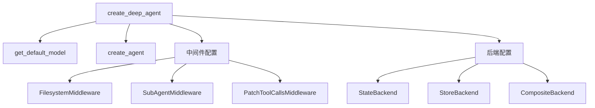
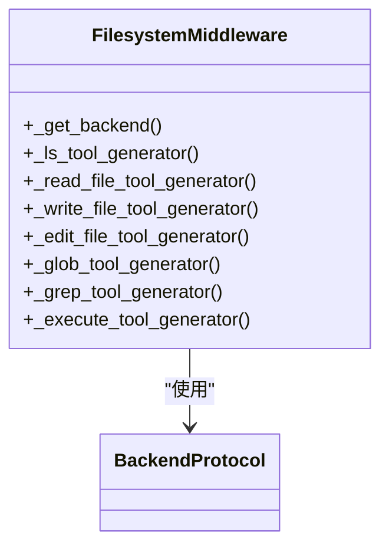
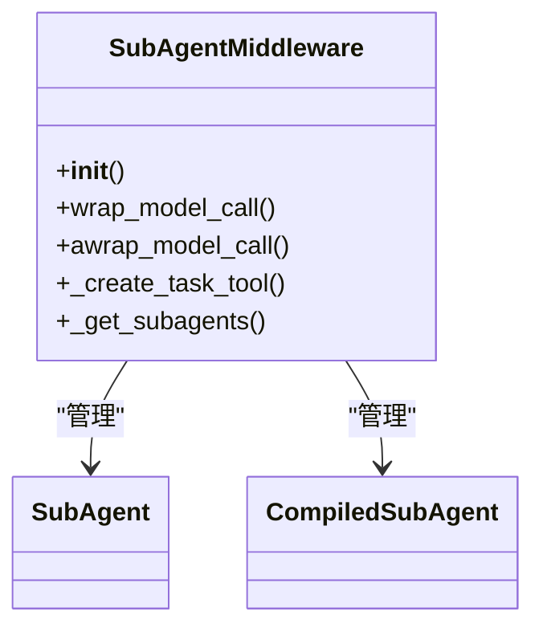
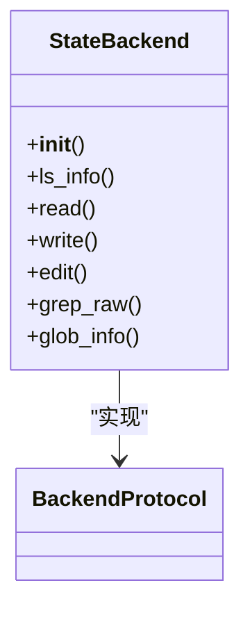
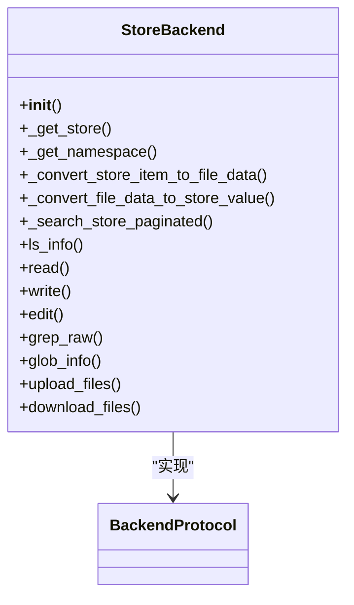
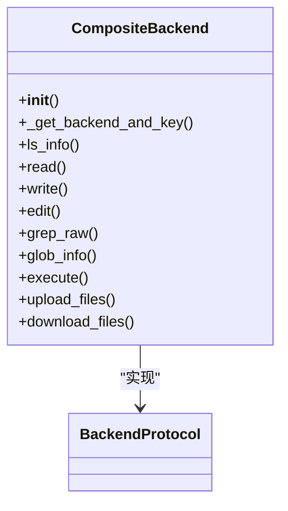
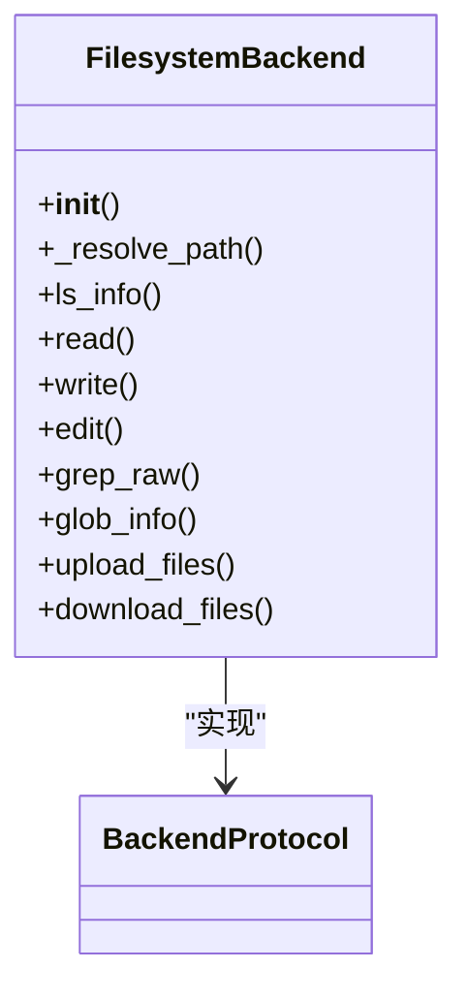
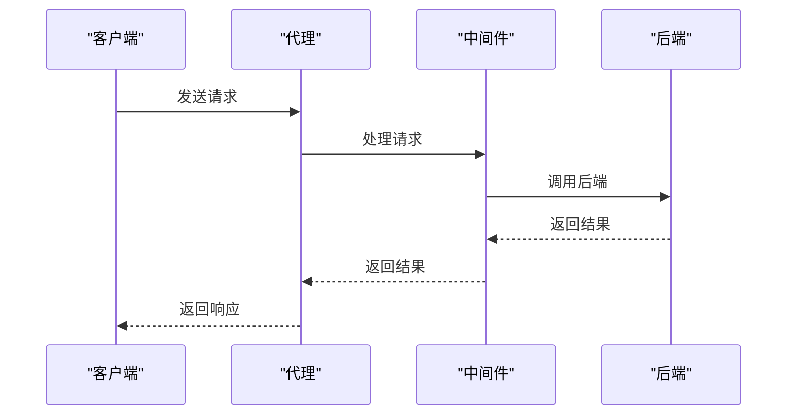
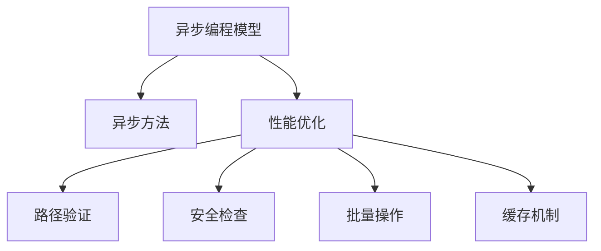

# 核心框架

<cite>
**本文档引用的文件**   
- [__init__.py](file://libs/deepagents/deepagents/__init__.py)
- [graph.py](file://libs/deepagents/deepagents/graph.py)
- [protocol.py](file://libs/deepagents/deepagents/backends/protocol.py)
- [state.py](file://libs/deepagents/deepagents/backends/state.py)
- [store.py](file://libs/deepagents/deepagents/backends/store.py)
- [composite.py](file://libs/deepagents/deepagents/backends/composite.py)
- [filesystem.py](file://libs/deepagents/deepagents/backends/filesystem.py)
- [filesystem.py](file://libs/deepagents/deepagents/middleware/filesystem.py)
- [subagents.py](file://libs/deepagents/deepagents/middleware/subagents.py)
- [patch_tool_calls.py](file://libs/deepagents/deepagents/middleware/patch_tool_calls.py)
</cite>

## 目录
1. [介绍](#介绍)
2. [create_deep_agent工厂函数](#createdeep_agent工厂函数)
3. [中间件系统](#中间件系统)
4. [后端系统策略模式](#后端系统策略模式)
5. [组件协同工作](#组件协同工作)
6. [异步编程模型与性能优化](#异步编程模型与性能优化)
7. [结论](#结论)

## 介绍
deepagents核心框架提供了一个强大的代理系统，通过`create_deep_agent`工厂函数作为LangGraph StateGraph的编译器，实现了任务规划、上下文隔离和持久化存储。该框架通过中间件系统和后端系统的策略模式实现，支持灵活的扩展和配置。本文档将详细说明这些组件的设计与用途，以及它们如何协同工作。

## create_deep_agent工厂函数
`create_deep_agent`工厂函数是deepagents框架的核心，负责创建和配置深度代理。该函数通过组合不同的中间件和后端，生成一个编译后的状态图（CompiledStateGraph），从而实现复杂的任务规划和执行。

**图源**
- [graph.py](file://libs/deepagents/deepagents/graph.py#L40-L162)

**本节源码**
- [graph.py](file://libs/deepagents/deepagents/graph.py#L40-L162)

## 中间件系统
中间件系统通过注入工具和修改提示来扩展代理功能。主要中间件包括`FilesystemMiddleware`和`SubAgentMiddleware`，它们分别负责文件系统操作和子代理管理。

### FilesystemMiddleware
`FilesystemMiddleware`提供了文件系统操作的工具，如`ls`、`read_file`、`write_file`、`edit_file`、`glob`和`grep`。这些工具允许代理在文件系统中进行读写操作，支持路径验证和安全检查。

**图源**
- [filesystem.py](file://libs/deepagents/deepagents/middleware/filesystem.py#L22-L800)

**本节源码**
- [filesystem.py](file://libs/deepagents/deepagents/middleware/filesystem.py#L22-L800)

### SubAgentMiddleware
`SubAgentMiddleware`通过`task`工具提供子代理功能，允许主代理将复杂任务分解为多个独立的子任务。每个子代理在隔离的上下文中运行，完成后返回结果。

**图源**
- [subagents.py](file://libs/deepagents/deepagents/middleware/subagents.py#L377-L485)

**本节源码**
- [subagents.py](file://libs/deepagents/deepagents/middleware/subagents.py#L377-L485)

## 后端系统策略模式
后端系统通过策略模式实现，支持多种存储和执行后端。主要后端包括`StateBackend`、`FilesystemBackend`、`StoreBackend`和`CompositeBackend`。

### StateBackend
`StateBackend`将文件存储在LangGraph代理状态中，适用于临时存储。文件在会话线程内持久化，但不跨线程。

**图源**
- [state.py](file://libs/deepagents/deepagents/backends/state.py#L20-L188)

**本节源码**
- [state.py](file://libs/deepagents/deepagents/backends/state.py#L20-L188)

### StoreBackend
`StoreBackend`使用LangGraph的BaseStore进行持久化存储，文件跨会话线程持久化。支持命名空间和多代理隔离。

**图源**
- [store.py](file://libs/deepagents/deepagents/backends/store.py#L28-L443)

**本节源码**
- [store.py](file://libs/deepagents/deepagents/backends/store.py#L28-L443)

### CompositeBackend
`CompositeBackend`通过路径前缀路由操作到不同的后端，支持组合多种后端。默认后端处理未匹配的路径，路由后端处理特定路径。

**图源**
- [composite.py](file://libs/deepagents/deepagents/backends/composite.py#L19-L562)

**本节源码**
- [composite.py](file://libs/deepagents/deepagents/backends/composite.py#L19-L562)

### FilesystemBackend
`FilesystemBackend`直接从文件系统读写文件，支持安全路径解析和防止符号链接跟随。适用于需要直接文件系统访问的场景。

**图源**
- [filesystem.py](file://libs/deepagents/deepagents/backends/filesystem.py#L35-L551)

**本节源码**
- [filesystem.py](file://libs/deepagents/deepagents/backends/filesystem.py#L35-L551)

## 组件协同工作
这些组件通过`create_deep_agent`工厂函数协同工作，实现任务规划、上下文隔离和持久化存储。中间件系统通过注入工具扩展代理功能，后端系统通过策略模式提供灵活的存储和执行选项。

**图源**
- [graph.py](file://libs/deepagents/deepagents/graph.py#L40-L162)
- [middleware](file://libs/deepagents/deepagents/middleware/)
- [backends](file://libs/deepagents/deepagents/backends/)

**本节源码**
- [graph.py](file://libs/deepagents/deepagents/graph.py#L40-L162)
- [middleware](file://libs/deepagents/deepagents/middleware/)
- [backends](file://libs/deepagents/deepagents/backends/)

## 异步编程模型与性能优化
框架支持异步编程模型，通过异步方法提高性能。性能优化策略包括路径验证、安全检查、批量操作和缓存机制。

**图源**
- [protocol.py](file://libs/deepagents/deepagents/backends/protocol.py#L161-L459)
- [middleware](file://libs/deepagents/deepagents/middleware/)

**本节源码**
- [protocol.py](file://libs/deepagents/deepagents/backends/protocol.py#L161-L459)
- [middleware](file://libs/deepagents/deepagents/middleware/)

## 结论
deepagents核心框架通过`create_deep_agent`工厂函数、中间件系统和后端系统的策略模式，实现了强大的任务规划、上下文隔离和持久化存储功能。通过灵活的配置和扩展，该框架能够满足各种复杂任务的需求，支持异步编程模型和性能优化策略，为开发者提供了高效、安全的代理系统。