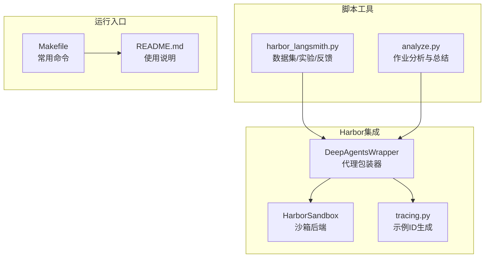
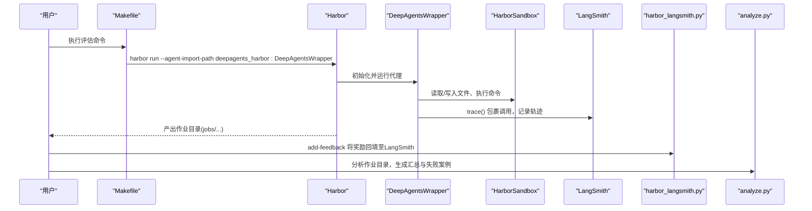
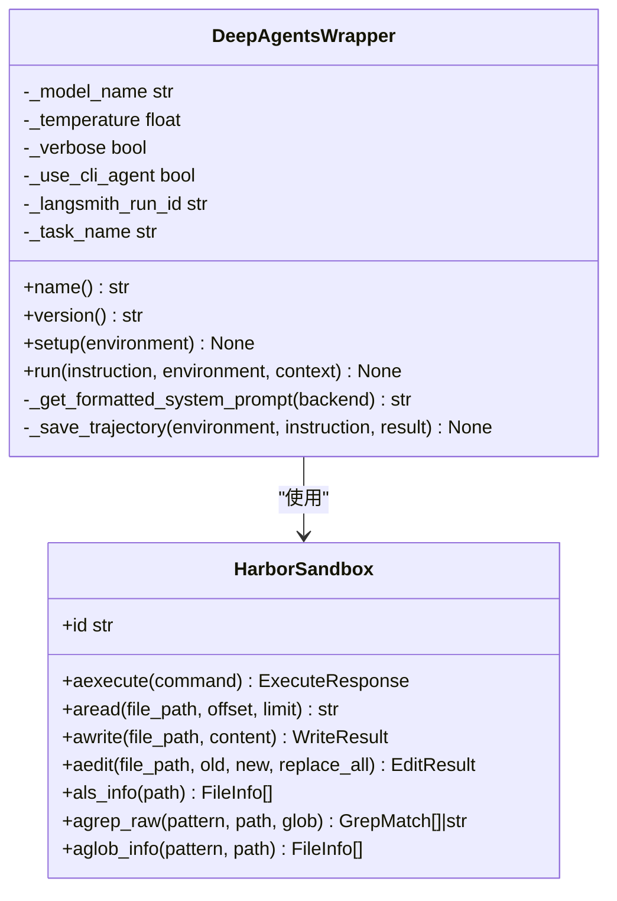
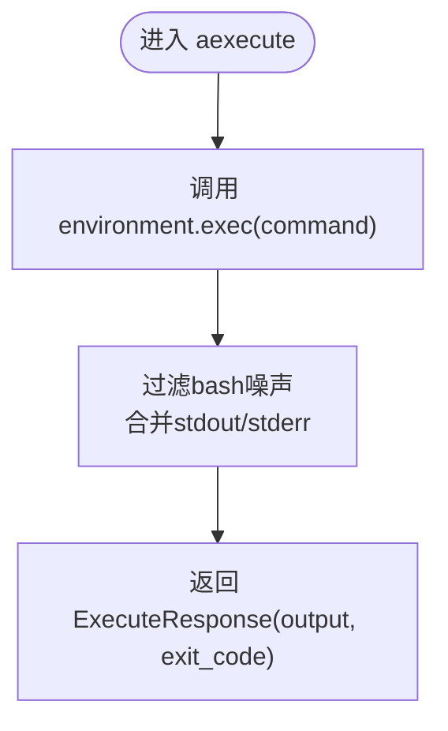
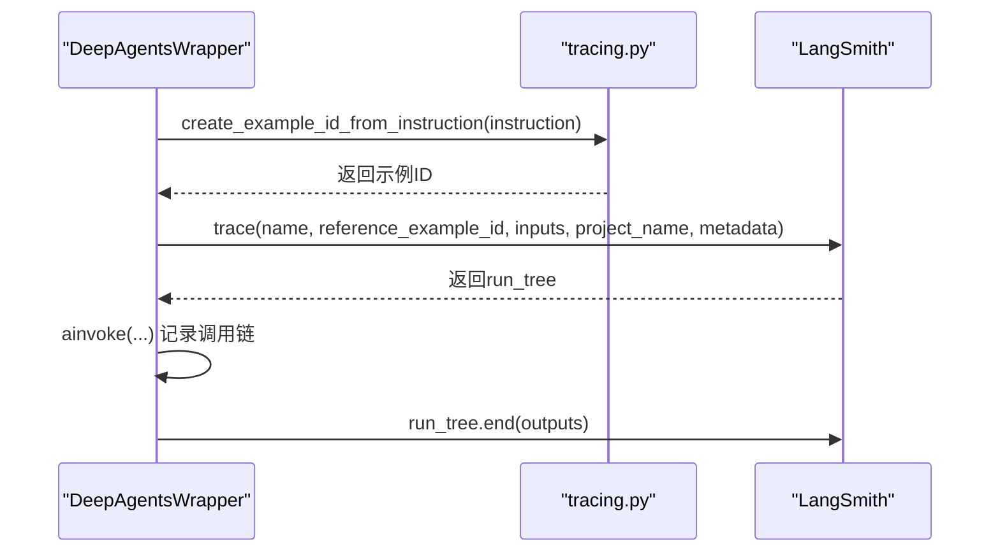
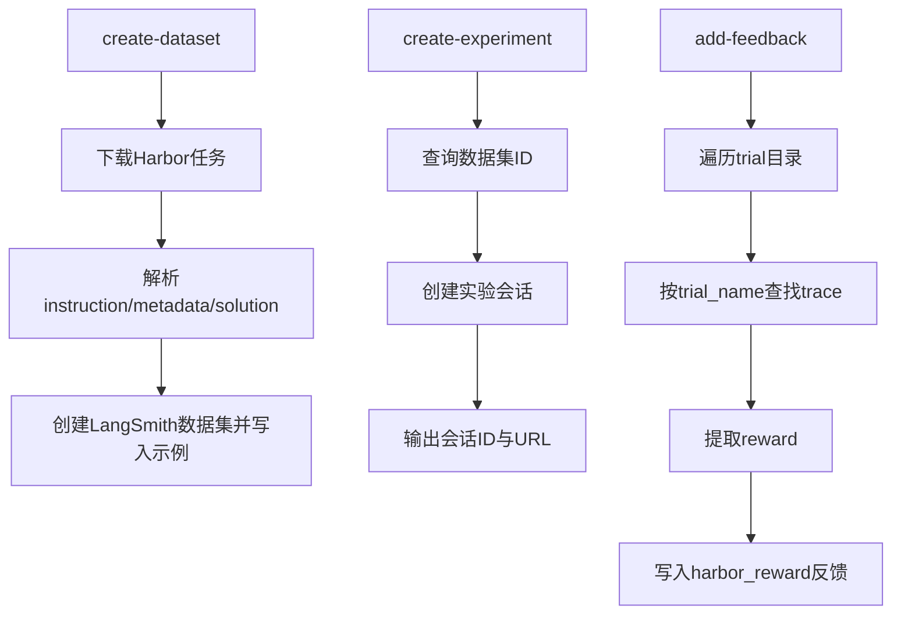
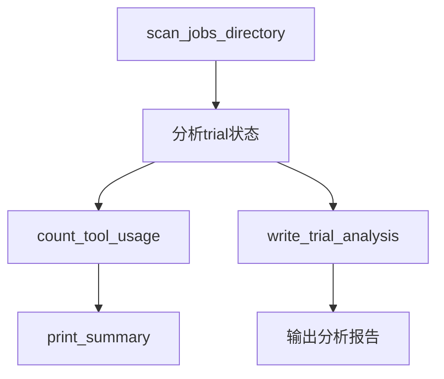
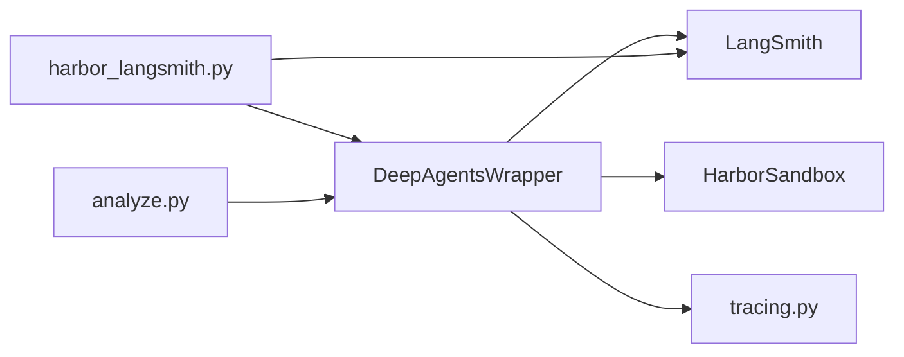

# 评估框架

<cite>
**本文引用的文件**
- [libs/harbor/deepagents_harbor/__init__.py](file://libs/harbor/deepagents_harbor/__init__.py)
- [libs/harbor/deepagents_harbor/deepagents_wrapper.py](file://libs/harbor/deepagents_harbor/deepagents_wrapper.py)
- [libs/harbor/deepagents_harbor/backend.py](file://libs/harbor/deepagents_harbor/backend.py)
- [libs/harbor/deepagents_harbor/tracing.py](file://libs/harbor/deepagents_harbor/tracing.py)
- [libs/harbor/scripts/harbor_langsmith.py](file://libs/harbor/scripts/harbor_langsmith.py)
- [libs/harbor/scripts/analyze.py](file://libs/harbor/scripts/analyze.py)
- [libs/harbor/Makefile](file://libs/harbor/Makefile)
- [libs/harbor/README.md](file://libs/harbor/README.md)
- [libs/deepagents/README.md](file://libs/deepagents/README.md)
</cite>

## 目录
1. [简介](#简介)
2. [项目结构](#项目结构)
3. [核心组件](#核心组件)
4. [架构总览](#架构总览)
5. [详细组件分析](#详细组件分析)
6. [依赖关系分析](#依赖关系分析)
7. [性能考量](#性能考量)
8. [故障排查指南](#故障排查指南)
9. [结论](#结论)
10. [附录](#附录)

## 简介
本文件面向Harbor评估框架，聚焦于与Terminal Bench 2.0的集成，用于在90+挑战性任务上量化评估代理性能。文档解释了deepagents_wrapper如何包装核心代理以适配Harbor的评估协议；通过LangSmith实现的追踪系统，包括轨迹记录、性能分析与瓶颈识别；在不同沙箱环境（Docker、Daytona、Modal）中运行评估的流程与配置；奖励评分机制（0.0–1.0）及其在迭代改进中的作用；以及运行评估的Makefile命令示例与评估结果解读方法。

## 项目结构
Harbor评估框架位于libs/harbor目录，围绕以下模块组织：
- deepagents_harbor：Harbor集成的核心实现，包含代理包装器、沙箱后端与LangSmith追踪辅助
- scripts：与Harbor/LangSmith协作的脚本，负责数据集创建、实验会话与反馈打分
- Makefile：提供常用运行命令，便于在不同沙箱环境中快速启动评估

图表来源
- [libs/harbor/deepagents_harbor/deepagents_wrapper.py](file://libs/harbor/deepagents_harbor/deepagents_wrapper.py#L1-L376)
- [libs/harbor/deepagents_harbor/backend.py](file://libs/harbor/deepagents_harbor/backend.py#L1-L378)
- [libs/harbor/deepagents_harbor/tracing.py](file://libs/harbor/deepagents_harbor/tracing.py#L1-L33)
- [libs/harbor/scripts/harbor_langsmith.py](file://libs/harbor/scripts/harbor_langsmith.py#L1-L502)
- [libs/harbor/scripts/analyze.py](file://libs/harbor/scripts/analyze.py#L1-L797)
- [libs/harbor/Makefile](file://libs/harbor/Makefile#L1-L85)
- [libs/harbor/README.md](file://libs/harbor/README.md#L1-L161)

章节来源
- [libs/harbor/README.md](file://libs/harbor/README.md#L1-L161)
- [libs/harbor/Makefile](file://libs/harbor/Makefile#L1-L85)

## 核心组件
- DeepAgentsWrapper：Harbor代理实现，封装DeepAgents以在Harbor环境中执行任务，负责系统提示词格式化、LangSmith追踪、轨迹保存与指标统计
- HarborSandbox：Harbor沙箱后端，屏蔽底层环境差异，提供统一的文件读写、命令执行与搜索接口
- tracing：为LangSmith提供确定性的示例ID生成，确保任务指令与LangSmith示例一一对应
- harbor_langsmith：LangSmith集成CLI，负责从Harbor任务创建LangSmith数据集、创建实验会话、向轨迹添加奖励反馈
- analyze：作业分析工具，扫描jobs目录，提取轨迹、奖励与工具使用情况，输出汇总与失败案例深度分析

章节来源
- [libs/harbor/deepagents_harbor/deepagents_wrapper.py](file://libs/harbor/deepagents_harbor/deepagents_wrapper.py#L1-L376)
- [libs/harbor/deepagents_harbor/backend.py](file://libs/harbor/deepagents_harbor/backend.py#L1-L378)
- [libs/harbor/deepagents_harbor/tracing.py](file://libs/harbor/deepagents_harbor/tracing.py#L1-L33)
- [libs/harbor/scripts/harbor_langsmith.py](file://libs/harbor/scripts/harbor_langsmith.py#L1-L502)
- [libs/harbor/scripts/analyze.py](file://libs/harbor/scripts/analyze.py#L1-L797)

## 架构总览
Harbor评估框架的端到端流程如下：
- 数据准备：从Harbor注册表下载Terminal Bench 2.0任务，生成LangSmith数据集
- 实验会话：创建LangSmith实验会话，关联数据集，便于对比分析
- 评估执行：DeepAgentsWrapper在Harbor环境中运行，调用HarborSandbox执行命令与文件操作，同时通过LangSmith进行追踪
- 结果反馈：harbor_langsmith将Harbor的奖励分数（0.0–1.0）回填至LangSmith轨迹，形成可过滤的反馈
- 分析总结：analyze工具扫描作业目录，统计成功/失败率、工具使用分布，并对失败案例进行深度分析

图表来源
- [libs/harbor/Makefile](file://libs/harbor/Makefile#L24-L44)
- [libs/harbor/deepagents_harbor/deepagents_wrapper.py](file://libs/harbor/deepagents_harbor/deepagents_wrapper.py#L154-L256)
- [libs/harbor/deepagents_harbor/backend.py](file://libs/harbor/deepagents_harbor/backend.py#L24-L116)
- [libs/harbor/scripts/harbor_langsmith.py](file://libs/harbor/scripts/harbor_langsmith.py#L262-L345)
- [libs/harbor/scripts/analyze.py](file://libs/harbor/scripts/analyze.py#L326-L400)

## 详细组件分析

### DeepAgentsWrapper：Harbor代理包装器
- 角色定位：将DeepAgents代理适配为Harbor可用的BaseAgent实现，负责系统提示词格式化、LangSmith追踪、轨迹保存与指标统计
- 关键职责
  - 系统提示词：动态注入当前工作目录与文件列表上下文，避免冗余ls调用
  - 代理创建：支持CLI与SDK两种模式，按配置选择
  - LangSmith追踪：根据环境变量决定是否启用实验追踪，自动计算示例ID并与Harbor会话ID关联
  - 轨迹保存：将消息流转换为ATIF格式轨迹，统计token用量与步骤数
- 运行流程
  - 读取Harbor配置，构造HarborSandbox
  - 依据use_cli_agent选择create_cli_agent或create_deep_agent
  - 可选trace包裹，记录输入输出与元数据
  - 保存trajectory.json，供后续分析

图表来源
- [libs/harbor/deepagents_harbor/deepagents_wrapper.py](file://libs/harbor/deepagents_harbor/deepagents_wrapper.py#L55-L256)
- [libs/harbor/deepagents_harbor/backend.py](file://libs/harbor/deepagents_harbor/backend.py#L17-L378)

章节来源
- [libs/harbor/deepagents_harbor/deepagents_wrapper.py](file://libs/harbor/deepagents_harbor/deepagents_wrapper.py#L1-L376)

### HarborSandbox：沙箱后端
- 设计目标：屏蔽Harbor环境差异，提供统一的文件系统与命令执行接口
- 主要能力
  - 命令执行：过滤非TTY环境下的bash噪声，合并stdout/stderr
  - 文件读写：安全转义路径，base64编码避免转义问题
  - 文本编辑：基于perl的可靠替换，支持多处出现与全部替换
  - 列表与搜索：目录遍历、glob匹配、grep检索
- 异步优先：仅提供异步接口，确保与Harbor环境一致

图表来源
- [libs/harbor/deepagents_harbor/backend.py](file://libs/harbor/deepagents_harbor/backend.py#L24-L116)

章节来源
- [libs/harbor/deepagents_harbor/backend.py](file://libs/harbor/deepagents_harbor/backend.py#L1-L378)

### LangSmith追踪与示例ID
- 示例ID生成：基于任务指令的确定性哈希，确保同一指令映射到同一LangSmith示例，便于跨运行对比
- 追踪开关：当设置LANGSMITH_EXPERIMENT时，DeepAgentsWrapper使用trace()包裹调用，自动标注标签与元数据
- 项目命名：也可设置LANGSMITH_PROJECT以简化开发视图

图表来源
- [libs/harbor/deepagents_harbor/deepagents_wrapper.py](file://libs/harbor/deepagents_harbor/deepagents_wrapper.py#L213-L249)
- [libs/harbor/deepagents_harbor/tracing.py](file://libs/harbor/deepagents_harbor/tracing.py#L1-L33)

章节来源
- [libs/harbor/deepagents_harbor/tracing.py](file://libs/harbor/deepagents_harbor/tracing.py#L1-L33)
- [libs/harbor/deepagents_harbor/deepagents_wrapper.py](file://libs/harbor/deepagents_harbor/deepagents_wrapper.py#L213-L249)

### LangSmith集成CLI：数据集、实验与反馈
- 创建数据集：从Harbor注册表下载任务，解析instruction与metadata，生成LangSmith示例并写入数据集
- 创建实验：为数据集创建LangSmith实验会话，输出会话ID与访问链接，便于Harbor运行时关联
- 添加反馈：扫描作业目录，按trial_name匹配LangSmith根运行，提取Harbor奖励（0.0–1.0），写入harbor_reward反馈

图表来源
- [libs/harbor/scripts/harbor_langsmith.py](file://libs/harbor/scripts/harbor_langsmith.py#L119-L158)
- [libs/harbor/scripts/harbor_langsmith.py](file://libs/harbor/scripts/harbor_langsmith.py#L165-L255)
- [libs/harbor/scripts/harbor_langsmith.py](file://libs/harbor/scripts/harbor_langsmith.py#L262-L345)

章节来源
- [libs/harbor/scripts/harbor_langsmith.py](file://libs/harbor/scripts/harbor_langsmith.py#L1-L502)

### 作业分析工具：轨迹与工具使用统计
- 扫描作业：遍历jobs目录，提取每个trial的状态（完成/失败/待定）、奖励、异常与轨迹路径
- 工具统计：解析ATIF轨迹，统计各工具调用次数，帮助识别工具使用偏差
- 失败分析：对失败或待定trial，结合参考解（solve.sh）与轨迹，生成深度分析报告

图表来源
- [libs/harbor/scripts/analyze.py](file://libs/harbor/scripts/analyze.py#L326-L400)
- [libs/harbor/scripts/analyze.py](file://libs/harbor/scripts/analyze.py#L175-L203)
- [libs/harbor/scripts/analyze.py](file://libs/harbor/scripts/analyze.py#L542-L602)

章节来源
- [libs/harbor/scripts/analyze.py](file://libs/harbor/scripts/analyze.py#L1-L797)

## 依赖关系分析
- 组件耦合
  - DeepAgentsWrapper依赖HarborSandbox与LangSmith追踪工具，耦合度低但职责清晰
  - harbor_langsmith与analyze分别独立于评估执行，通过Harbor输出的作业目录与LangSmith数据集交互
- 外部依赖
  - Harbor框架提供环境抽象与任务执行
  - LangSmith提供追踪、数据集与反馈管理
  - DeepAgents提供代理创建与工具生态

图表来源
- [libs/harbor/deepagents_harbor/deepagents_wrapper.py](file://libs/harbor/deepagents_harbor/deepagents_wrapper.py#L1-L376)
- [libs/harbor/deepagents_harbor/backend.py](file://libs/harbor/deepagents_harbor/backend.py#L1-L378)
- [libs/harbor/deepagents_harbor/tracing.py](file://libs/harbor/deepagents_harbor/tracing.py#L1-L33)
- [libs/harbor/scripts/harbor_langsmith.py](file://libs/harbor/scripts/harbor_langsmith.py#L1-L502)
- [libs/harbor/scripts/analyze.py](file://libs/harbor/scripts/analyze.py#L1-L797)

章节来源
- [libs/harbor/deepagents_harbor/deepagents_wrapper.py](file://libs/harbor/deepagents_harbor/deepagents_wrapper.py#L1-L376)
- [libs/harbor/deepagents_harbor/backend.py](file://libs/harbor/deepagents_harbor/backend.py#L1-L378)
- [libs/harbor/scripts/harbor_langsmith.py](file://libs/harbor/scripts/harbor_langsmith.py#L1-L502)
- [libs/harbor/scripts/analyze.py](file://libs/harbor/scripts/analyze.py#L1-L797)

## 性能考量
- Token与成本控制：DeepAgentsWrapper在轨迹保存阶段聚合UsageMetadata，便于监控prompt/completion token与总步数
- I/O与命令开销：HarborSandbox对命令执行与文件操作进行了安全与健壮性处理，减少因转义与TTY问题导致的重试与失败
- 并发与稳定性：LangSmith追踪在实验模式下可并行运行多个trial，建议合理设置并发与超时，避免资源争用
- 工具使用优化：analyze工具统计工具使用频次，有助于识别过度依赖某工具或遗漏关键工具的情况

[本节为通用指导，无需列出具体文件来源]

## 故障排查指南
- 无trace或反馈缺失
  - 确认已设置LANGSMITH_EXPERIMENT或LANGSMITH_PROJECT
  - 使用harbor_langsmith.py add-feedback匹配trial_name，检查是否重复添加反馈
- 奖励分数异常
  - harbor_langsmith.py在缺少result.json时默认奖励为0.0，检查Harbor任务是否正常结束
- 轨迹缺失或不完整
  - 确认DeepAgentsWrapper已正确保存trajectory.json
  - analyze工具依赖ATIF格式，若解析失败需检查轨迹结构
- 沙箱环境问题
  - Modal/Docker等环境启动超时或退出，需检查API密钥与网络连通性
  - Daytona/Runloop沙箱清理失败不影响评估，但需关注资源占用

章节来源
- [libs/harbor/scripts/harbor_langsmith.py](file://libs/harbor/scripts/harbor_langsmith.py#L262-L345)
- [libs/harbor/scripts/analyze.py](file://libs/harbor/scripts/analyze.py#L108-L113)
- [libs/harbor/deepagents_harbor/deepagents_wrapper.py](file://libs/harbor/deepagents_harbor/deepagents_wrapper.py#L257-L376)

## 结论
Harbor评估框架通过DeepAgentsWrapper将DeepAgents代理无缝接入Harbor与LangSmith，实现了在Terminal Bench 2.0上的规模化评估。借助确定性示例ID、ATIF轨迹与奖励反馈，团队可以系统地定位问题、优化提示与工具，并在多沙箱环境中稳定复现结果。分析工具进一步提供了从宏观到微观的洞察，支撑持续迭代改进。

[本节为总结，无需列出具体文件来源]

## 附录

### 沙箱环境与运行命令
- 支持的沙箱：docker、daytona、modal、runloop
- 常用Makefile命令
  - run-terminal-bench-docker：本地Docker单任务
  - run-terminal-bench-daytona：Daytona批量任务
  - run-terminal-bench-modal：Modal批量任务
  - run-terminal-bench-runloop：Runloop批量任务
- 环境变量
  - LANGSMITH_API_KEY、LANGSMITH_TRACING_V2、LANGSMITH_ENDPOINT
  - 可选DAYTONA_API_KEY等

章节来源
- [libs/harbor/README.md](file://libs/harbor/README.md#L141-L161)
- [libs/harbor/Makefile](file://libs/harbor/Makefile#L24-L44)

### Terminal Bench 2.0与奖励评分
- Benchmark规模：90+任务，覆盖软件工程、生物学、安全、游戏等领域
- 奖励机制：0.0–1.0，由Harbor测试结果推导，作为LangSmith反馈字段harbor_reward
- 评估流程：数据集创建→实验会话→运行评估→添加反馈→分析总结

章节来源
- [libs/harbor/README.md](file://libs/harbor/README.md#L1-L161)

### DeepAgents能力与提示词
- DeepAgents提供规划、文件系统、子代理与长期记忆等能力，适合复杂终端任务
- 建议在DeepAgentsWrapper中注入更丰富的系统提示词，明确工具使用与测试节奏

章节来源
- [libs/deepagents/README.md](file://libs/deepagents/README.md#L1-L200)