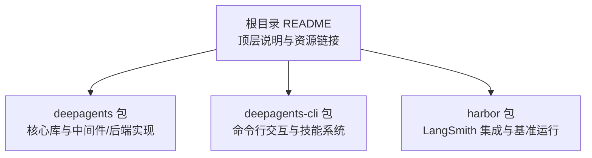
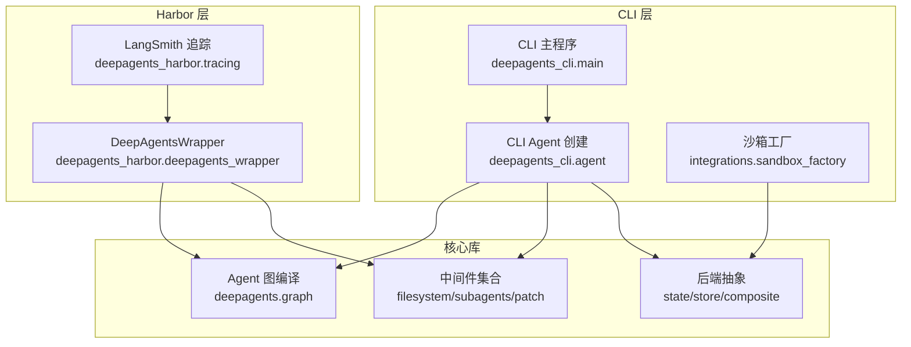
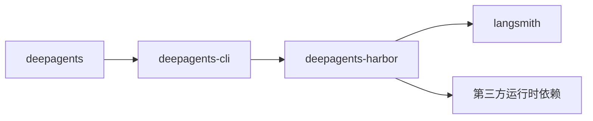

# 贡献指南

<cite>
**本文引用的文件**
- [根目录 README](file://README.md)
- [deepagents 包 pyproject.toml](file://libs/deepagents/pyproject.toml)
- [deepagents-cli 包 pyproject.toml](file://libs/deepagents-cli/pyproject.toml)
- [harbor 包 pyproject.toml](file://libs/harbor/pyproject.toml)
- [deepagents 包 Makefile](file://libs/deepagents/Makefile)
- [deepagents-cli 包 Makefile](file://libs/deepagents-cli/Makefile)
- [harbor 包 Makefile](file://libs/harbor/Makefile)
- [deepagents 单测样例](file://libs/deepagents/tests/unit_tests/test_middleware.py)
- [deepagents 集成测试样例](file://libs/deepagents/tests/integration_tests/test_deepagents.py)
- [CLI 基准测试样例](file://libs/deepagents-cli/tests/integration_tests/benchmarks/test_simple_tasks.py)
- [CLI 沙箱集成测试样例](file://libs/deepagents-cli/tests/integration_tests/test_sandbox_factory.py)
- [harbor 导入测试样例](file://libs/harbor/tests/unit_tests/test_imports.py)
- [CLI 测试夹具](file://libs/deepagents-cli/tests/integration_tests/conftest.py)
</cite>

## 目录
1. [简介](#简介)
2. [项目结构](#项目结构)
3. [核心组件](#核心组件)
4. [架构总览](#架构总览)
5. [详细组件分析](#详细组件分析)
6. [依赖关系分析](#依赖关系分析)
7. [性能与测试策略](#性能与测试策略)
8. [编码规范与工具链](#编码规范与工具链)
9. [开发环境搭建](#开发环境搭建)
10. [运行测试与代码检查](#运行测试与代码检查)
11. [提交与 PR 流程](#提交与-pr-流程)
12. [故障排查](#故障排查)
13. [结论](#结论)

## 简介
本指南面向希望为 deepagents-langchain 项目做出贡献的开发者，覆盖从环境搭建、工具链配置、测试策略到编码规范与提交流程的全流程。项目包含三个主要子包：deepagents（核心库）、deepagents-cli（命令行工具）、harbor（与 LangSmith 的集成与基准运行器）。本文将基于仓库中的配置与测试文件，给出可操作的实践建议与最佳实践。

## 项目结构
项目采用多包结构，分别在 libs 下组织核心库、CLI 和 Harbor 集成模块，并在各包内提供独立的构建与测试配置。

图表来源
- [根目录 README](file://README.md#L1-L30)
- [deepagents 包 pyproject.toml](file://libs/deepagents/pyproject.toml#L1-L20)
- [deepagents-cli 包 pyproject.toml](file://libs/deepagents-cli/pyproject.toml#L1-L20)
- [harbor 包 pyproject.toml](file://libs/harbor/pyproject.toml#L1-L10)

章节来源
- [根目录 README](file://README.md#L1-L30)

## 核心组件
- deepagents：提供 Agent 构建、中间件（文件系统、子代理、补丁等）、后端（内存/持久化/组合路由）与图编译能力。
- deepagents-cli：提供 CLI 交互、技能加载、沙箱集成（Modal/Daytona/RunLoop）、HITL 工作流与终端基准测试。
- harbor：提供与 LangSmith 的集成、可观测性追踪以及基于数据集的基准任务运行（如 Terminal Bench）。

章节来源
- [deepagents 包 pyproject.toml](file://libs/deepagents/pyproject.toml#L1-L20)
- [deepagents-cli 包 pyproject.toml](file://libs/deepagents-cli/pyproject.toml#L1-L20)
- [harbor 包 pyproject.toml](file://libs/harbor/pyproject.toml#L1-L10)

## 架构总览
下图展示了 CLI、Harbor 与核心库之间的关系及典型调用路径。

图表来源
- [deepagents 包 pyproject.toml](file://libs/deepagents/pyproject.toml#L1-L20)
- [deepagents-cli 包 pyproject.toml](file://libs/deepagents-cli/pyproject.toml#L1-L20)
- [harbor 包 pyproject.toml](file://libs/harbor/pyproject.toml#L1-L10)

## 详细组件分析

### deepagents 单元测试与中间件行为验证
- 文件系统中间件与子代理中间件的行为通过单元测试覆盖，验证工具注册、路径列举、搜索与匹配、分页存储等逻辑。
- 示例断言包括工具名称存在、路径过滤、结果截断提示、正则匹配与计数模式等。

章节来源
- [deepagents 单测样例](file://libs/deepagents/tests/unit_tests/test_middleware.py#L1-L120)
- [deepagents 单测样例](file://libs/deepagents/tests/unit_tests/test_middleware.py#L120-L300)
- [deepagents 单测样例](file://libs/deepagents/tests/unit_tests/test_middleware.py#L300-L600)

### deepagents 集成测试与子代理工作流
- 集成测试验证主 Agent 的构建、工具注入、子代理委托、结构化输出策略等端到端行为。
- 断言包括工具可用性、子代理类型识别、递归深度配置与研究通道扩展等。

章节来源
- [deepagents 集成测试样例](file://libs/deepagents/tests/integration_tests/test_deepagents.py#L1-L166)

### CLI 基准测试与 HITL 行为
- 基准测试以自动批准模式运行，覆盖“写文件”“批量文件创建”等简单任务；同时验证 HITL 中断点与 shell 工具调用参数解析。
- 使用 StringIO 捕获控制台输出，通过异步流事件验证中断触发与命令参数正确性。

章节来源
- [CLI 基准测试样例](file://libs/deepagents-cli/tests/integration_tests/benchmarks/test_simple_tasks.py#L1-L120)
- [CLI 基准测试样例](file://libs/deepagents-cli/tests/integration_tests/benchmarks/test_simple_tasks.py#L120-L275)

### CLI 沙箱集成测试
- 针对 RunLoop、Daytona、Modal 提供统一的沙箱基类测试，覆盖上传/下载单文件与批量、二进制内容、部分成功场景等。
- 支持可选的沙箱复用以减少测试耗时。

章节来源
- [CLI 沙箱集成测试样例](file://libs/deepagents-cli/tests/integration_tests/test_sandbox_factory.py#L1-L120)
- [CLI 沙箱集成测试样例](file://libs/deepagents-cli/tests/integration_tests/test_sandbox_factory.py#L120-L323)

### Harbor 导入与基准运行
- Harbor 包含基础导入测试与基准运行入口（如 Terminal Bench），支持多种执行环境（Modal/Daytona/Docker/RunLoop）。
- Makefile 提供一键运行基准任务的目标。

章节来源
- [harbor 导入测试样例](file://libs/harbor/tests/unit_tests/test_imports.py#L1-L6)
- [harbor 包 Makefile](file://libs/harbor/Makefile#L1-L85)

## 依赖关系分析
- deepagents-cli 依赖 deepagents 作为核心库，并引入 CLI 所需的第三方依赖（如 rich、prompt-toolkit、langchain-openai、tavily-python 等）。
- harbor 依赖 deepagents、deepagents-cli 与 LangSmith，用于可观测性与基准运行。
- 各包均定义了独立的依赖组（test/dev/lint），并使用 ruff、mypy 等工具进行静态检查与格式化。

图表来源
- [deepagents-cli 包 pyproject.toml](file://libs/deepagents-cli/pyproject.toml#L1-L25)
- [harbor 包 pyproject.toml](file://libs/harbor/pyproject.toml#L1-L20)

章节来源
- [deepagents-cli 包 pyproject.toml](file://libs/deepagents-cli/pyproject.toml#L1-L25)
- [harbor 包 pyproject.toml](file://libs/harbor/pyproject.toml#L1-L20)

## 性能与测试策略
- 单元测试：覆盖核心中间件与后端逻辑，保证工具行为与状态管理正确性。
- 集成测试：验证 Agent 构建、子代理委托、结构化输出等端到端流程。
- CLI 基准测试：以自动批准模式运行简单任务，评估文件系统与工具链性能；同时验证 HITL 中断与命令解析。
- Harbor 基准：通过 Makefile 提供多环境运行目标，便于在 Modal/Daytona/Docker/RunLoop 上执行 Terminal Bench。

章节来源
- [deepagents 单测样例](file://libs/deepagents/tests/unit_tests/test_middleware.py#L1-L200)
- [deepagents 集成测试样例](file://libs/deepagents/tests/integration_tests/test_deepagents.py#L1-L166)
- [CLI 基准测试样例](file://libs/deepagents-cli/tests/integration_tests/benchmarks/test_simple_tasks.py#L1-L120)
- [harbor 包 Makefile](file://libs/harbor/Makefile#L1-L85)

## 编码规范与工具链
- Python 版本要求
  - deepagents：要求 Python >=3.11 且 <4.0
  - harbor：要求 Python >=3.12
- 代码格式化：ruff
  - line-length：deepagents 为 150，deepagents-cli 为 100，harbor 为 100
  - 文档字符串风格：Google 风格
  - 忽略规则：针对格式器冲突与复杂度等规则的特定忽略项
- 类型检查：mypy（严格模式）
  - strict=true，允许忽略缺失导入，启用 deprecated 错误码
- 文档字符串：遵循 Google 风格
- 行长度限制：按包配置不同

章节来源
- [deepagents 包 pyproject.toml](file://libs/deepagents/pyproject.toml#L48-L100)
- [deepagents-cli 包 pyproject.toml](file://libs/deepagents-cli/pyproject.toml#L63-L120)
- [harbor 包 pyproject.toml](file://libs/harbor/pyproject.toml#L43-L58)

## 开发环境搭建
- Python 版本
  - deepagents：>=3.11,<4.0
  - harbor：>=3.12
- 安装依赖
  - 在各包目录下使用 pip 可编辑安装 dev 与 tests 组合依赖，以获得完整的开发与测试工具链
- 工具链配置
  - ruff：用于格式化与静态检查
  - mypy：用于类型检查（严格模式）

章节来源
- [deepagents 包 pyproject.toml](file://libs/deepagents/pyproject.toml#L25-L47)
- [deepagents-cli 包 pyproject.toml](file://libs/deepagents-cli/pyproject.toml#L27-L55)
- [harbor 包 pyproject.toml](file://libs/harbor/pyproject.toml#L1-L20)

## 运行测试与代码检查
- 使用 Makefile 提供的一键命令
  - 单元测试：在 deepagents 包中运行单元测试并生成覆盖率报告
  - 集成测试：在 deepagents 包中运行集成测试
  - CLI 测试：在 deepagents-cli 包中运行单元/集成测试与 watch 模式
  - Harbor 基准：在 harbor 包中运行 hello-world 与 Terminal Bench 多环境任务
- 代码检查
  - ruff：格式化与静态检查（支持 diff 模式）
  - mypy：类型检查（支持缓存目录）

章节来源
- [deepagents 包 Makefile](file://libs/deepagents/Makefile#L1-L30)
- [deepagents-cli 包 Makefile](file://libs/deepagents-cli/Makefile#L1-L67)
- [harbor 包 Makefile](file://libs/harbor/Makefile#L1-L85)

## 提交与 PR 流程
- 分支与变更
  - 建议使用功能分支进行开发，避免直接在主分支提交
- 提交前检查
  - 运行 ruff 格式化与静态检查
  - 运行 mypy 类型检查
  - 运行单元测试与集成测试（必要时）
- 提交信息
  - 使用清晰、简洁的描述，说明变更目的与影响范围
- PR 审查
  - 保持 PR 小而专注，附带测试与变更说明
  - 确保 CI 通过（若项目配置了 CI）

[本节为通用流程建议，不直接分析具体文件，故无章节来源]

## 故障排查
- 测试超时或网络受限
  - CLI 集成测试使用超时装饰器，可在本地适当调整超时时间
  - 沙箱集成测试可能受外部服务限制，可通过环境变量控制沙箱复用
- LangSmith 集成
  - 若未配置 API Key，LangSmith 客户端会自动跳过；测试夹具会在会话结束后刷新
- 覆盖率与缓存
  - 单元测试使用覆盖率报告；mypy 支持缓存目录以提升性能

章节来源
- [CLI 基准测试样例](file://libs/deepagents-cli/tests/integration_tests/benchmarks/test_simple_tasks.py#L160-L275)
- [CLI 沙箱集成测试样例](file://libs/deepagents-cli/tests/integration_tests/test_sandbox_factory.py#L1-L120)
- [CLI 测试夹具](file://libs/deepagents-cli/tests/integration_tests/conftest.py#L1-L37)

## 结论
本指南基于仓库现有配置与测试文件，给出了可落地的开发环境搭建、工具链配置、测试策略与编码规范建议。建议贡献者在提交前完成格式化、类型检查与相关测试，确保代码质量与一致性。