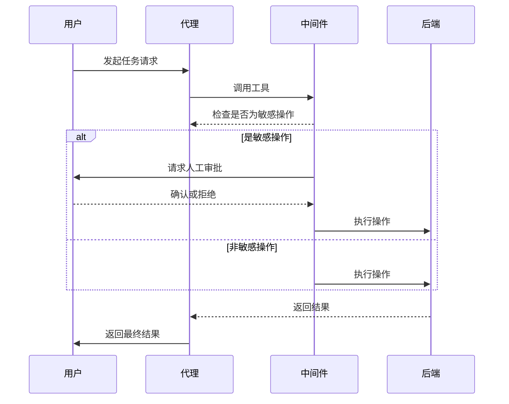
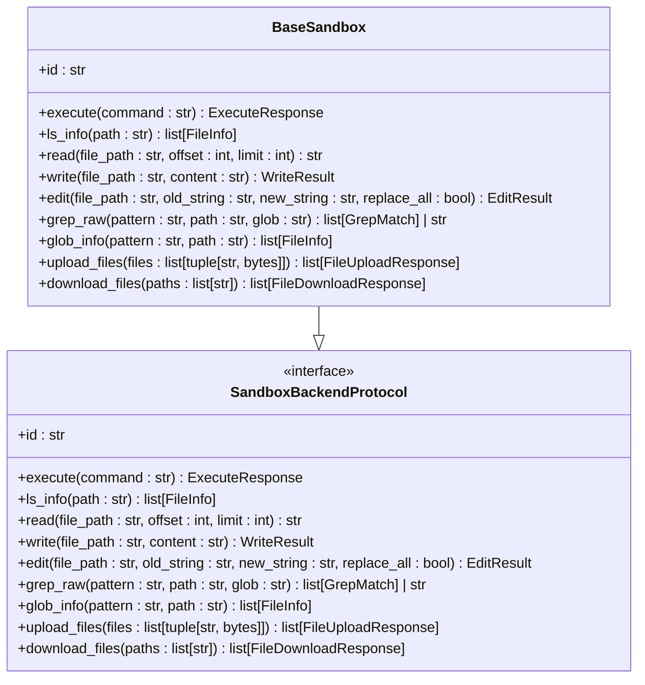
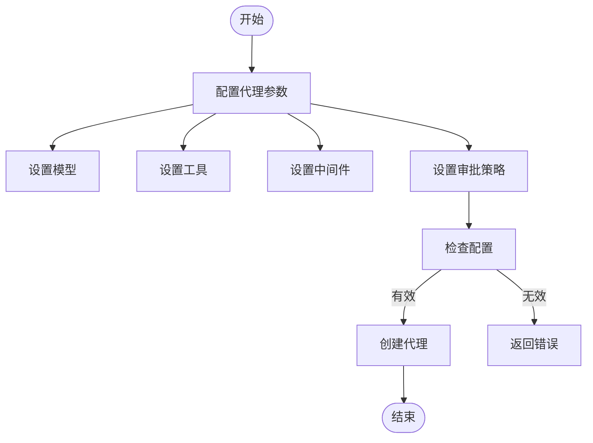

# 安全与人类在环机制

<cite>
**本文档引用的文件**   
- [filesystem.py](file://libs/deepagents/deepagents/middleware/filesystem.py)
- [subagents.py](file://libs/deepagents/deepagents/middleware/subagents.py)
- [sandbox.py](file://libs/deepagents/deepagents/backends/sandbox.py)
- [protocol.py](file://libs/deepagents/deepagents/backends/protocol.py)
- [graph.py](file://libs/deepagents/deepagents/graph.py)
- [state.py](file://libs/deepagents/deepagents/backends/state.py)
- [store.py](file://libs/deepagents/deepagents/backends/store.py)
- [commands.py](file://libs/deepagents-cli/deepagents_cli/commands.py)
</cite>

## 目录
1. [引言](#引言)
2. [安全设计与人类在环机制](#安全设计与人类在环机制)
3. [中间件拦截与审批流程](#中间件拦截与审批流程)
4. [沙箱后端隔离机制](#沙箱后端隔离机制)
5. [CLI命令处理与用户确认](#cli命令处理与用户确认)
6. [配置指南](#配置指南)
7. [潜在安全风险与缓解措施](#潜在安全风险与缓解措施)
8. [真实场景案例](#真实场景案例)
9. [结论](#结论)

## 引言
DeepAgents框架提供了一套全面的安全机制，通过中间件拦截、沙箱隔离和人类在环（Human-in-the-Loop）审批流程，确保AI代理在执行敏感操作时的安全性。本文档深入探讨了这些安全设计的实现细节，包括如何拦截敏感工具调用、如何通过沙箱后端隔离代码执行环境，以及如何结合CLI命令处理逻辑实现用户确认机制。同时，文档还提供了详细的配置指南和真实场景案例，帮助开发者理解和应用这些安全特性。

## 安全设计与人类在环机制
DeepAgents框架的安全设计核心在于通过中间件拦截敏感工具调用，并触发人类在环（Human-in-the-Loop）审批流程。这种设计确保了在执行可能对系统造成影响的操作之前，必须经过人工审核，从而防止恶意或错误的操作。框架通过`HumanInTheLoopMiddleware`实现这一机制，该中间件可以配置为在特定工具调用时中断执行流程，等待用户确认。

**Section sources**
- [subagents.py](file://libs/deepagents/deepagents/middleware/subagents.py#L208-L277)
- [graph.py](file://libs/deepagents/deepagents/graph.py#L113-L148)

## 中间件拦截与审批流程
中间件在DeepAgents框架中扮演着关键角色，负责拦截和处理工具调用。`FilesystemMiddleware`和`SubAgentMiddleware`等中间件通过拦截文件系统操作和子代理调用，确保所有操作都符合安全策略。当检测到敏感操作时，中间件会触发审批流程，要求用户确认后才能继续执行。

**Diagram sources**
- [filesystem.py](file://libs/deepagents/deepagents/middleware/filesystem.py#L757-L765)
- [subagents.py](file://libs/deepagents/deepagents/middleware/subagents.py#L208-L277)

## 沙箱后端隔离机制
沙箱后端（SandboxBackend）通过隔离代码执行环境来防止恶意操作。`BaseSandbox`类实现了`SandboxBackendProtocol`，提供了执行命令、读写文件等操作的接口。所有操作都在隔离的环境中进行，确保不会影响主系统。通过`execute`方法，可以在沙箱中运行shell命令，并返回执行结果。

**Diagram sources**
- [sandbox.py](file://libs/deepagents/deepagents/backends/sandbox.py#L141-L361)
- [protocol.py](file://libs/deepagents/deepagents/backends/protocol.py#L423-L456)

## CLI命令处理与用户确认
CLI命令处理逻辑通过`commands.py`中的`handle_command`和`execute_bash_command`函数实现。这些函数负责处理用户输入的命令，并在执行前进行必要的验证和确认。例如，`execute_bash_command`函数在执行bash命令前会显示命令内容，并在执行后显示输出结果，确保用户对操作有清晰的了解。

**Section sources**
- [commands.py](file://libs/deepagents-cli/deepagents_cli/commands.py#L12-L90)

## 配置指南
配置指南包括定义敏感工具列表、设置审批策略及审计日志记录。通过`create_deep_agent`函数，可以配置代理的模型、工具、中间件等参数。`interrupt_on`参数用于指定需要人工审批的工具，`backend`参数用于指定后端存储和执行环境。

**Diagram sources**
- [graph.py](file://libs/deepagents/deepagents/graph.py#L40-L162)

## 潜在安全风险与缓解措施
潜在安全风险包括中间件绕过、沙箱逃逸等。为了缓解这些风险，框架采用了多层次的安全措施。例如，通过严格的路径验证防止目录遍历攻击，通过沙箱隔离防止恶意代码执行。此外，定期的安全审计和更新也是确保系统安全的重要措施。

**Section sources**
- [filesystem.py](file://libs/deepagents/deepagents/middleware/filesystem.py#L95-L149)
- [sandbox.py](file://libs/deepagents/deepagents/backends/sandbox.py#L141-L361)

## 真实场景案例
在复杂任务中，安全策略的实际应用至关重要。例如，在执行文件删除或系统命令时，代理会通过中间件拦截操作，并提示用户进行确认。只有在用户确认后，操作才会被执行。这种机制确保了即使在复杂的任务流程中，也能保持对关键操作的控制。

**Section sources**
- [subagents.py](file://libs/deepagents/deepagents/middleware/subagents.py#L66-L174)
- [commands.py](file://libs/deepagents-cli/deepagents_cli/commands.py#L53-L90)

## 结论
DeepAgents框架通过中间件拦截、沙箱隔离和人类在环审批流程，提供了一套全面的安全机制。这些机制确保了AI代理在执行敏感操作时的安全性，防止了潜在的恶意或错误操作。通过合理的配置和使用，开发者可以充分利用这些安全特性，构建更加安全可靠的AI应用。