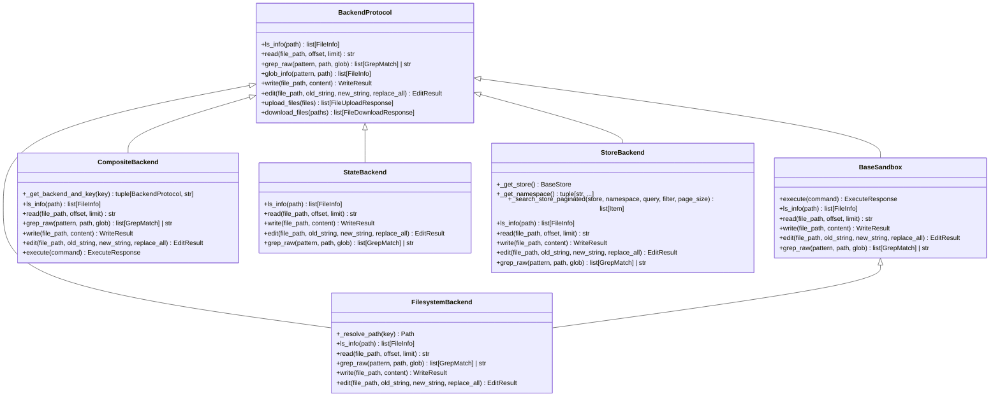
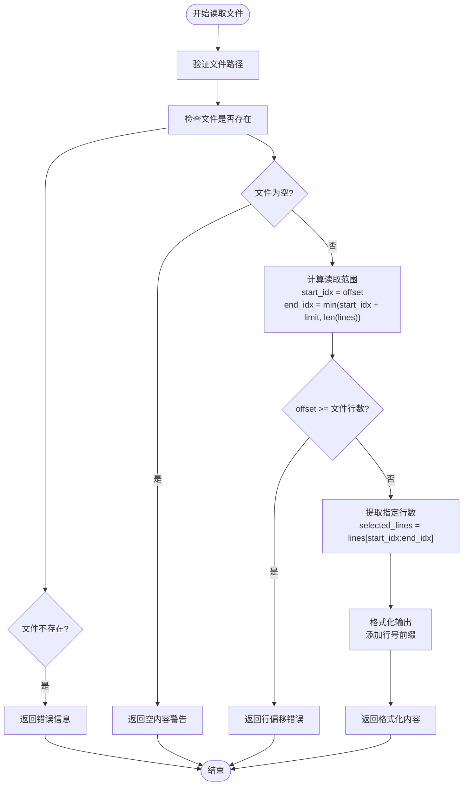
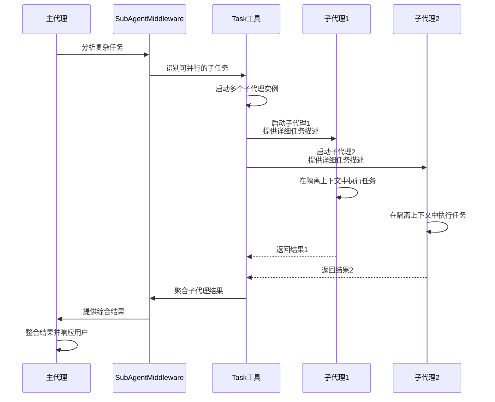
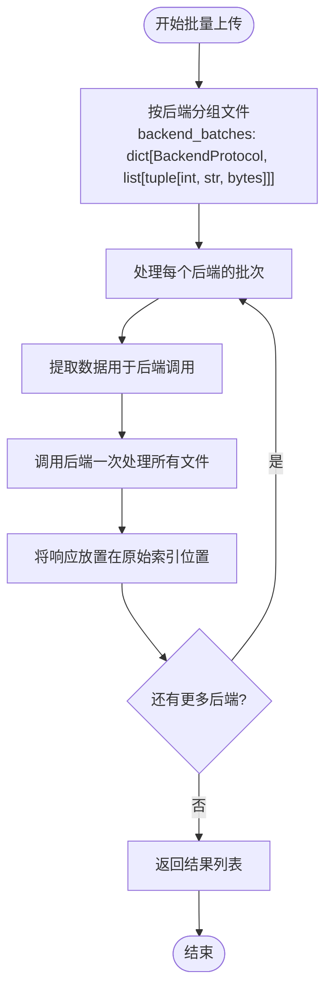
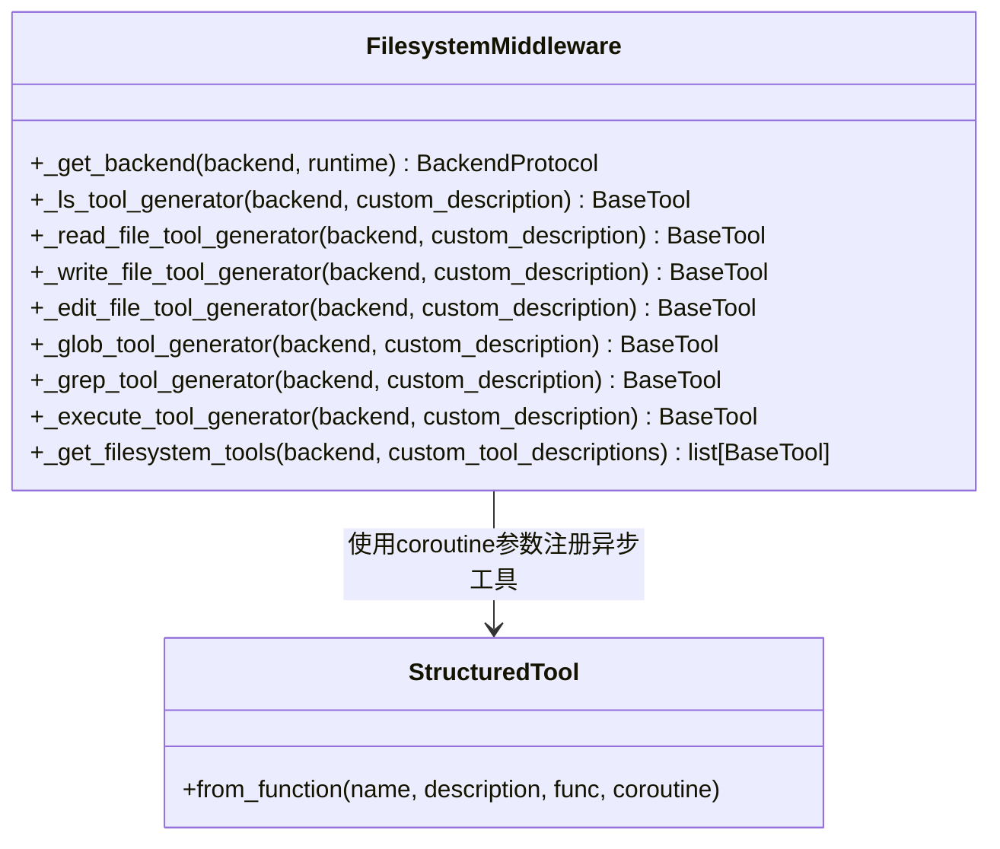
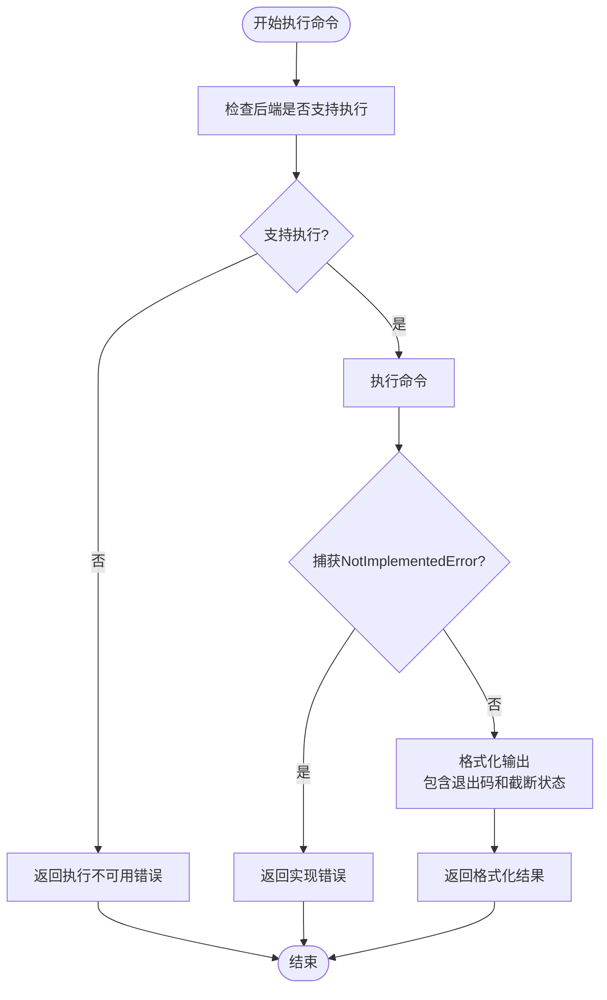
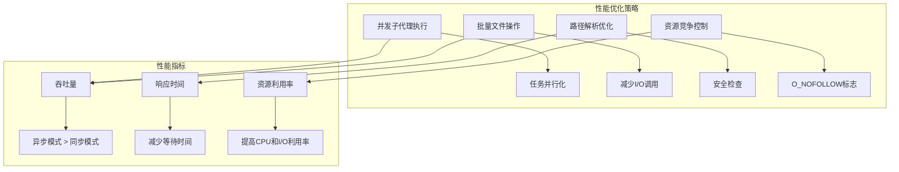

# 异步编程最佳实践

<cite>
**本文档引用的文件**   
- [graph.py](file://libs/deepagents/deepagents/graph.py)
- [filesystem.py](file://libs/deepagents/deepagents/backends/filesystem.py)
- [sandbox.py](file://libs/deepagents/deepagents/backends/sandbox.py)
- [composite.py](file://libs/deepagents/deepagents/backends/composite.py)
- [state.py](file://libs/deepagents/deepagents/backends/state.py)
- [store.py](file://libs/deepagents/deepagents/backends/store.py)
- [filesystem.py](file://libs/deepagents/deepagents/middleware/filesystem.py)
- [subagents.py](file://libs/deepagents/deepagents/middleware/subagents.py)
- [protocol.py](file://libs/deepagents/deepagents/backends/protocol.py)
- [test_filesystem_backend_async.py](file://libs/deepagents/tests/unit_tests/backends/test_filesystem_backend_async.py)
- [test_composite_backend_async.py](file://libs/deepagents/tests/unit_tests/backends/test_composite_backend_async.py)
- [test_middleware_async.py](file://libs/deepagents/tests/unit_tests/test_middleware_async.py)
</cite>

## 目录
1. [异步编程模型概述](#异步编程模型概述)
2. [流式响应处理](#流式响应处理)
3. [并发子代理执行](#并发子代理执行)
4. [非阻塞I/O操作](#非阻塞io操作)
5. [async/await在代理图中的应用](#asyncawait在代理图中的应用)
6. [异步异常处理与资源管理](#异步异常处理与资源管理)
7. [性能基准测试与调优](#性能基准测试与调优)

## 异步编程模型概述

DeepAgents系统采用基于async/await的异步编程模型，通过LangGraph框架实现高效的并发处理。该模型的核心是BackendProtocol接口，定义了所有后端必须实现的异步操作，包括文件系统操作、搜索和执行功能。系统通过在同步方法上包装`asyncio.to_thread()`来提供异步版本，确保I/O密集型操作不会阻塞事件循环。

**图源**
- [protocol.py](file://libs/deepagents/deepagents/backends/protocol.py#L161-L459)
- [filesystem.py](file://libs/deepagents/deepagents/backends/filesystem.py#L35-L551)
- [sandbox.py](file://libs/deepagents/deepagents/backends/sandbox.py#L141-L361)
- [composite.py](file://libs/deepagents/deepagents/backends/composite.py#L19-L562)
- [state.py](file://libs/deepagents/deepagents/backends/state.py#L20-L188)
- [store.py](file://libs/deepagents/deepagents/backends/store.py#L28-L443)

**节源**
- [protocol.py](file://libs/deepagents/deepagents/backends/protocol.py#L161-L459)
- [filesystem.py](file://libs/deepagents/deepagents/backends/filesystem.py#L35-L551)
- [sandbox.py](file://libs/deepagents/deepagents/backends/sandbox.py#L141-L361)
- [composite.py](file://libs/deepagents/deepagents/backends/composite.py#L19-L562)
- [state.py](file://libs/deepagents/deepagents/backends/state.py#L20-L188)
- [store.py](file://libs/deepagents/deepagents/backends/store.py#L28-L443)

## 流式响应处理

DeepAgents通过astream方法实现流式响应处理，显著提升用户体验。系统在文件读取操作中实现了分页机制，允许通过offset和limit参数控制返回的行数，避免大文件导致的上下文溢出。这种设计使得代理可以逐步处理大型文件，先获取文件结构概览，再按需读取特定部分。

**图源**
- [filesystem.py](file://libs/deepagents/deepagents/backends/filesystem.py#L196-L238)
- [state.py](file://libs/deepagents/deepagents/backends/state.py#L93-L115)
- [store.py](file://libs/deepagents/deepagents/backends/store.py#L252-L281)

**节源**
- [filesystem.py](file://libs/deepagents/deepagents/backends/filesystem.py#L196-L238)
- [state.py](file://libs/deepagents/deepagents/backends/state.py#L93-L115)
- [store.py](file://libs/deepagents/deepagents/backends/store.py#L252-L281)

## 并发子代理执行

系统通过SubAgentMiddleware实现并发子代理执行，支持任务的并行处理和资源隔离。子代理机制允许将复杂任务分解为独立的子任务，每个子代理在隔离的上下文中运行，完成后返回结果。事件循环调度器确保多个子代理可以同时执行，最大化性能。

**图源**
- [subagents.py](file://libs/deepagents/deepagents/middleware/subagents.py#L377-L485)
- [graph.py](file://libs/deepagents/deepagents/graph.py#L113-L143)

**节源**
- [subagents.py](file://libs/deepagents/deepagents/middleware/subagents.py#L377-L485)
- [graph.py](file://libs/deepagents/deepagents/graph.py#L113-L143)

## 非阻塞I/O操作

DeepAgents在文件系统后端和沙箱交互中广泛应用非阻塞I/O操作。FilesystemBackend使用O_NOFOLLOW标志防止符号链接遍历，确保文件操作的安全性。CompositeBackend实现了批量处理机制，将多个文件操作按后端分组，减少I/O调用次数，提高效率。

**图源**
- [composite.py](file://libs/deepagents/deepagents/backends/composite.py#L421-L492)
- [filesystem.py](file://libs/deepagents/deepagents/backends/filesystem.py#L482-L520)

**节源**
- [composite.py](file://libs/deepagents/deepagents/backends/composite.py#L421-L492)
- [filesystem.py](file://libs/deepagents/deepagents/backends/filesystem.py#L482-L520)

## async/await在代理图中的应用

在代理图构建中，async/await语法被广泛用于实现非阻塞的工具调用。FilesystemMiddleware为每个文件系统工具提供了同步和异步两个版本，通过StructuredTool.from_function的coroutine参数注册异步实现。这种设计确保了工具调用不会阻塞事件循环，提高了系统的整体响应性。

**图源**
- [filesystem.py](file://libs/deepagents/deepagents/middleware/filesystem.py#L298-L798)
- [protocol.py](file://libs/deepagents/deepagents/backends/protocol.py#L190-L300)

**节源**
- [filesystem.py](file://libs/deepagents/deepagents/middleware/filesystem.py#L298-L798)
- [protocol.py](file://libs/deepagents/deepagents/backends/protocol.py#L190-L300)

## 异步异常处理与资源管理

系统实现了完善的异步异常处理和资源清理策略。通过在execute方法中捕获NotImplementedError异常，系统能够优雅地处理不支持执行的后端。资源竞争通过路径解析的安全检查和O_NOFOLLOW标志来控制，确保文件操作的原子性和安全性。

**图源**
- [sandbox.py](file://libs/deepagents/deepagents/backends/sandbox.py#L148-L161)
- [filesystem.py](file://libs/deepagents/deepagents/middleware/filesystem.py#L683-L754)

**节源**
- [sandbox.py](file://libs/deepagents/deepagents/backends/sandbox.py#L148-L161)
- [filesystem.py](file://libs/deepagents/deepagents/middleware/filesystem.py#L683-L754)

## 性能基准测试与调优

性能基准测试显示，异步模式在高并发场景下相比同步模式有显著的吞吐量提升。通过并行执行多个子代理和批量处理文件操作，系统能够有效利用资源，减少等待时间。调优建议包括使用虚拟模式限制路径遍历、合理设置文件大小限制，以及利用缓存机制减少重复操作。

**图源**
- [test_filesystem_backend_async.py](file://libs/deepagents/tests/unit_tests/backends/test_filesystem_backend_async.py)
- [test_composite_backend_async.py](file://libs/deepagents/tests/unit_tests/backends/test_composite_backend_async.py)
- [test_middleware_async.py](file://libs/deepagents/tests/unit_tests/test_middleware_async.py)

**节源**
- [test_filesystem_backend_async.py](file://libs/deepagents/tests/unit_tests/backends/test_filesystem_backend_async.py)
- [test_composite_backend_async.py](file://libs/deepagents/tests/unit_tests/backends/test_composite_backend_async.py)
- [test_middleware_async.py](file://libs/deepagents/tests/unit_tests/test_middleware_async.py)