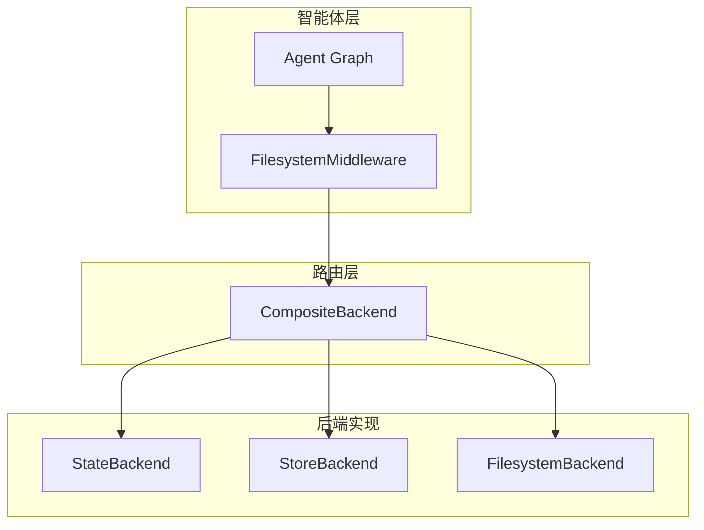
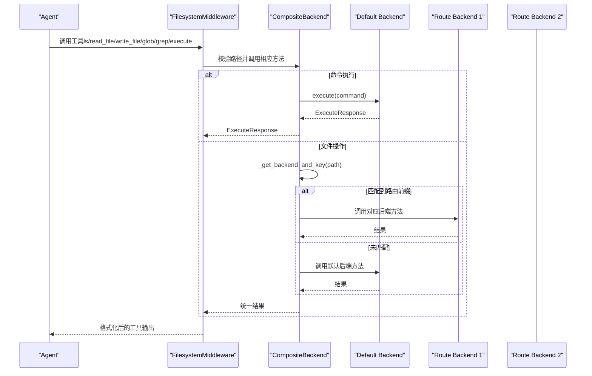
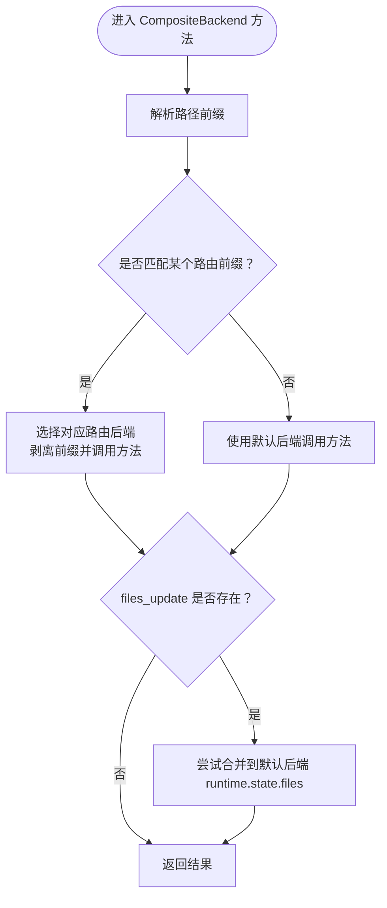
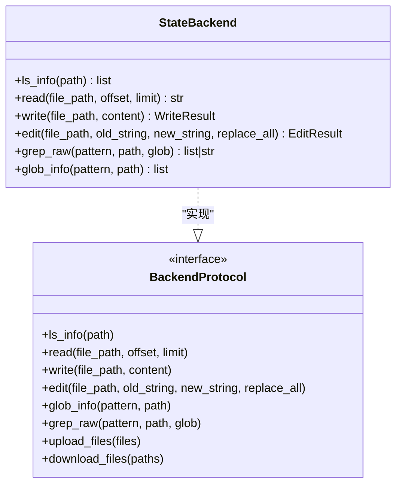
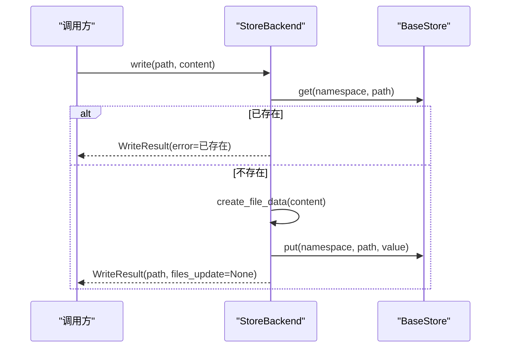
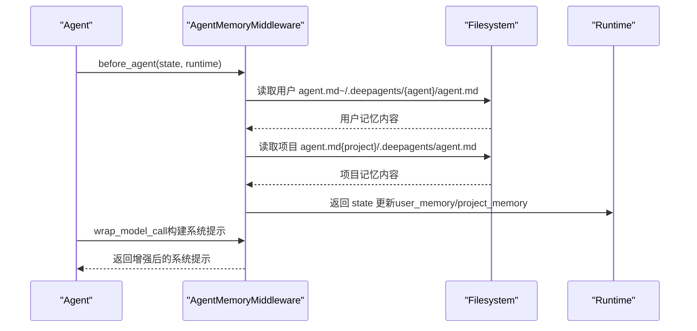
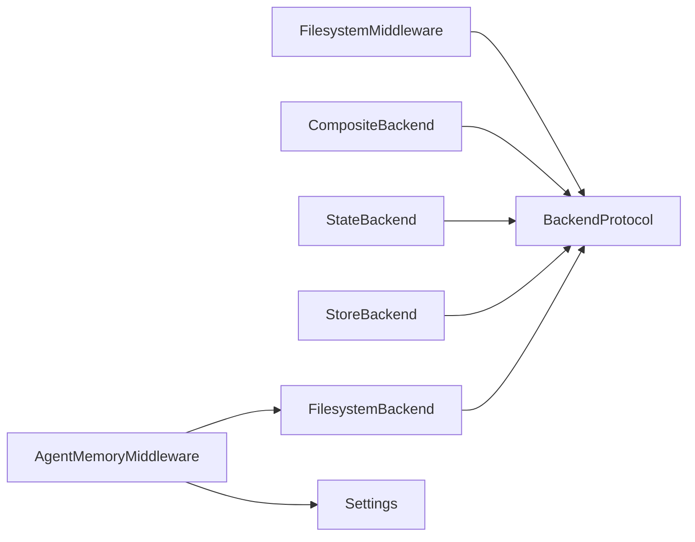

# 持久化存储与长期记忆

<cite>
**本文引用的文件**
- [composite.py](file://libs/deepagents/deepagents/backends/composite.py)
- [store.py](file://libs/deepagents/deepagents/backends/store.py)
- [state.py](file://libs/deepagents/deepagents/backends/state.py)
- [filesystem.py](file://libs/deepagents/deepagents/backends/filesystem.py)
- [protocol.py](file://libs/deepagents/deepagents/backends/protocol.py)
- [utils.py](file://libs/deepagents/deepagents/backends/utils.py)
- [filesystem.py](file://libs/deepagents/deepagents/middleware/filesystem.py)
- [agent_memory.py](file://libs/deepagents-cli/deepagents_cli/agent_memory.py)
- [config.py](file://libs/deepagents-cli/deepagents_cli/config.py)
- [graph.py](file://libs/deepagents/deepagents/graph.py)
- [test_composite_backend.py](file://libs/deepagents/tests/unit_tests/backends/test_composite_backend.py)
- [test_filesystem_middleware.py](file://libs/deepagents/tests/integration_tests/test_filesystem_middleware.py)
</cite>

## 目录
1. [引言](#引言)
2. [项目结构](#项目结构)
3. [核心组件](#核心组件)
4. [架构总览](#架构总览)
5. [详细组件分析](#详细组件分析)
6. [依赖关系分析](#依赖关系分析)
7. [性能考量](#性能考量)
8. [故障排查指南](#故障排查指南)
9. [结论](#结论)
10. [附录：配置与使用示例](#附录配置与使用示例)

## 引言
本文件聚焦于 DeepAgents 的持久化存储架构与长期记忆实现机制，系统解析 CompositeBackend 的路由策略，说明其如何将临时状态（StateBackend）与持久化记忆（StoreBackend）结合使用，实现高效的数据分层管理；并深入分析 agent_memory.py 中的记忆管理逻辑，展示跨会话记忆的加载与保存流程。同时提供配置示例，说明如何设置不同后端（如文件系统、数据库）作为存储策略，并讨论数据序列化格式、版本兼容性及迁移策略，最后给出性能优化建议与大规模记忆数据的内存管理技巧。

## 项目结构
DeepAgents 将“文件系统工具”与“存储后端”解耦，通过 FilesystemMiddleware 将统一的工具接口暴露给智能体，内部由 BackendProtocol 抽象统一的文件操作协议，再由 CompositeBackend 路由到具体后端实现：
- FilesystemMiddleware：面向智能体的工具层，负责路径校验、结果截断、执行能力检测等
- CompositeBackend：路由层，按路径前缀将请求分发到 StateBackend/StoreBackend/自定义后端
- StateBackend：基于 LangGraph 状态的临时存储，适合会话内临时文件
- StoreBackend：基于 LangGraph BaseStore 的持久化存储，适合跨会话长期记忆
- FilesystemBackend：直接读写本地文件系统（可选）
- Protocol/Utils：统一协议、数据结构与通用工具

图表来源
- [filesystem.py](file://libs/deepagents/deepagents/middleware/filesystem.py#L1-L120)
- [composite.py](file://libs/deepagents/deepagents/backends/composite.py#L1-L120)
- [state.py](file://libs/deepagents/deepagents/backends/state.py#L1-L60)
- [store.py](file://libs/deepagents/deepagents/backends/store.py#L1-L60)
- [filesystem.py](file://libs/deepagents/deepagents/backends/filesystem.py#L1-L60)

章节来源
- [filesystem.py](file://libs/deepagents/deepagents/middleware/filesystem.py#L1-L120)
- [graph.py](file://libs/deepagents/deepagents/graph.py#L1-L162)

## 核心组件
- BackendProtocol：统一的文件操作协议，定义 ls_info、read、write、edit、glob_info、grep_raw、upload_files、download_files、execute 等方法
- CompositeBackend：根据路径前缀路由到不同后端，支持同步与异步操作，支持批量上传/下载
- StateBackend：将文件存储在 LangGraph agent state 中，随会话状态自动检查点
- StoreBackend：将文件存储在 LangGraph BaseStore 中，跨线程/会话持久化
- FilesystemBackend：直接读写本地文件系统，支持虚拟模式与安全路径解析
- FilesystemMiddleware：为智能体生成 ls/read_file/write_file/edit_file/glob/grep/execute 工具，负责路径校验、结果截断、执行能力检测

章节来源
- [protocol.py](file://libs/deepagents/deepagents/backends/protocol.py#L161-L459)
- [composite.py](file://libs/deepagents/deepagents/backends/composite.py#L1-L120)
- [state.py](file://libs/deepagents/deepagents/backends/state.py#L1-L120)
- [store.py](file://libs/deepagents/deepagents/backends/store.py#L1-L120)
- [filesystem.py](file://libs/deepagents/deepagents/backends/filesystem.py#L1-L120)
- [filesystem.py](file://libs/deepagents/deepagents/middleware/filesystem.py#L1-L120)

## 架构总览
CompositeBackend 的路由策略基于最长前缀匹配，优先匹配更长的路由前缀，确保精确路由。默认后端用于执行命令（仅当默认后端实现 SandboxBackendProtocol 时），其他文件操作则按路径前缀分发到对应后端。StateBackend 返回 files_update 用于 LangGraph 状态更新，StoreBackend 返回 None 表示外部持久化。

图表来源
- [filesystem.py](file://libs/deepagents/deepagents/middleware/filesystem.py#L298-L360)
- [composite.py](file://libs/deepagents/deepagents/backends/composite.py#L34-L120)
- [protocol.py](file://libs/deepagents/deepagents/backends/protocol.py#L423-L459)

章节来源
- [composite.py](file://libs/deepagents/deepagents/backends/composite.py#L1-L120)
- [filesystem.py](file://libs/deepagents/deepagents/middleware/filesystem.py#L298-L360)
- [protocol.py](file://libs/deepagents/deepagents/backends/protocol.py#L423-L459)

## 详细组件分析

### CompositeBackend 路由策略与批量操作
- 路由规则
  - 使用最长前缀匹配，先排序 routes，确保更长前缀优先
  - _get_backend_and_key：剥离路由前缀，保留前导斜杠，返回目标后端与“已剥离”的路径
  - 默认后端用于 execute 命令执行（需实现 SandboxBackendProtocol）
- 列表/搜索/匹配
  - ls_info：根目录聚合默认后端与所有路由；非根目录仅查询匹配路由或默认后端
  - grep_raw/glob_info：若 path 指向特定路由，仅在该路由后端搜索；否则合并默认与所有路由的结果
- 批量上传/下载
  - upload_files/adownload_files：按后端分组，一次性调用后端的批量接口，减少往返开销
- State 更新合并
  - write/edit 成功且 files_update 非空时，尝试从 default.runtime.state 合并 files_update，使列表视图即时反映变更

图表来源
- [composite.py](file://libs/deepagents/deepagents/backends/composite.py#L34-L120)
- [composite.py](file://libs/deepagents/deepagents/backends/composite.py#L274-L323)
- [composite.py](file://libs/deepagents/deepagents/backends/composite.py#L324-L376)

章节来源
- [composite.py](file://libs/deepagents/deepagents/backends/composite.py#L1-L120)
- [composite.py](file://libs/deepagents/deepagents/backends/composite.py#L274-L376)
- [composite.py](file://libs/deepagents/deepagents/backends/composite.py#L421-L562)

### StateBackend（临时状态）
- 存储位置：LangGraph agent state 的 files 字典
- 特点：随会话状态自动检查点，适合临时文件与会话内共享
- 写入/编辑：返回 WriteResult/EditResult，其中 files_update 为 {path: file_data}，供 LangGraph 通过 Command 更新状态
- 列表/搜索：遍历 runtime.state.get("files", {})，支持 glob 与 grep

图表来源
- [state.py](file://libs/deepagents/deepagents/backends/state.py#L1-L188)
- [protocol.py](file://libs/deepagents/deepagents/backends/protocol.py#L161-L459)

章节来源
- [state.py](file://libs/deepagents/deepagents/backends/state.py#L1-L188)
- [protocol.py](file://libs/deepagents/deepagents/backends/protocol.py#L161-L459)

### StoreBackend（持久化记忆）
- 存储位置：LangGraph BaseStore，支持多命名空间隔离（可包含 assistant_id）
- 特点：跨线程/会话持久化，适合长期记忆
- 数据结构：FileData 字典，包含 content（行列表）、created_at、modified_at
- 搜索与分页：_search_store_paginated 支持分页检索，避免一次性拉取过多数据
- 写入/编辑：先 get 再 put，保证幂等；编辑时进行字符串替换与时间戳更新
- 列表/搜索：将 Store.Item 转换为 FileData，再进行本地过滤与排序

图表来源
- [store.py](file://libs/deepagents/deepagents/backends/store.py#L282-L340)

章节来源
- [store.py](file://libs/deepagents/deepagents/backends/store.py#L1-L188)
- [store.py](file://libs/deepagents/deepagents/backends/store.py#L186-L340)
- [store.py](file://libs/deepagents/deepagents/backends/store.py#L341-L443)

### FilesystemBackend（文件系统后端）
- 安全与虚拟模式：支持 virtual_mode，限制路径为相对 cwd 的虚拟绝对路径，防止路径穿越
- 搜索：优先使用 ripgrep（rg），失败回退到 Python 正则扫描，支持 include_glob 过滤
- 大小限制：max_file_size_mb 控制扫描文件大小上限
- 上传/下载：批量接口，错误标准化为 FileOperationError

章节来源
- [filesystem.py](file://libs/deepagents/deepagents/backends/filesystem.py#L1-L120)
- [filesystem.py](file://libs/deepagents/deepagents/backends/filesystem.py#L120-L240)
- [filesystem.py](file://libs/deepagents/deepagents/backends/filesystem.py#L240-L420)
- [filesystem.py](file://libs/deepagents/deepagents/backends/filesystem.py#L420-L551)

### FilesystemMiddleware（工具层）
- 路径校验：_validate_path 规范化并拒绝路径穿越与 Windows 绝对路径
- 工具生成：ls/read_file/write_file/edit_file/glob/grep/execute 工具，统一描述与行为
- 执行能力检测：_supports_execution 仅当默认后端实现 SandboxBackendProtocol 时才启用 execute
- 截断与提示：truncate_if_too_long 对超长结果进行截断，并提供保存到文件系统的提示

章节来源
- [filesystem.py](file://libs/deepagents/deepagents/middleware/filesystem.py#L95-L150)
- [filesystem.py](file://libs/deepagents/deepagents/middleware/filesystem.py#L298-L360)
- [filesystem.py](file://libs/deepagents/deepagents/middleware/filesystem.py#L645-L755)

### agent_memory.py（跨会话长期记忆）
- 加载时机：before_agent 钩子在会话开始时从用户与项目目录加载 agent.md，注入到 state
- 注入方式：_build_system_prompt 将 user_memory/project_memory 与基础系统提示拼接
- 路径与目录：通过 Settings 获取 ~/.deepagents/{assistant_id}/agent.md 与项目 .deepagents/agent.md
- 文档化提示：提供记忆优先级、何时检查/读取、何时更新等指导

图表来源
- [agent_memory.py](file://libs/deepagents-cli/deepagents_cli/agent_memory.py#L210-L246)
- [agent_memory.py](file://libs/deepagents-cli/deepagents_cli/agent_memory.py#L247-L329)
- [config.py](file://libs/deepagents-cli/deepagents_cli/config.py#L196-L236)

章节来源
- [agent_memory.py](file://libs/deepagents-cli/deepagents_cli/agent_memory.py#L1-L170)
- [agent_memory.py](file://libs/deepagents-cli/deepagents_cli/agent_memory.py#L210-L329)
- [config.py](file://libs/deepagents-cli/deepagents_cli/config.py#L196-L236)

## 依赖关系分析
- FilesystemMiddleware 依赖 BackendProtocol 接口，通过工厂或实例注入后端
- CompositeBackend 依赖 BackendProtocol 实现，支持默认后端与多路由后端
- StateBackend/StoreBackend/FileSystemBackend 共同实现 BackendProtocol
- agent_memory.py 与 config.py 协作，提供用户与项目级记忆路径

图表来源
- [filesystem.py](file://libs/deepagents/deepagents/middleware/filesystem.py#L298-L360)
- [composite.py](file://libs/deepagents/deepagents/backends/composite.py#L1-L120)
- [state.py](file://libs/deepagents/deepagents/backends/state.py#L1-L60)
- [store.py](file://libs/deepagents/deepagents/backends/store.py#L1-L60)
- [filesystem.py](file://libs/deepagents/deepagents/backends/filesystem.py#L1-L60)
- [agent_memory.py](file://libs/deepagents-cli/deepagents_cli/agent_memory.py#L171-L246)
- [config.py](file://libs/deepagents-cli/deepagents_cli/config.py#L196-L236)

章节来源
- [filesystem.py](file://libs/deepagents/deepagents/middleware/filesystem.py#L298-L360)
- [composite.py](file://libs/deepagents/deepagents/backends/composite.py#L1-L120)
- [state.py](file://libs/deepagents/deepagents/backends/state.py#L1-L60)
- [store.py](file://libs/deepagents/deepagents/backends/store.py#L1-L60)
- [filesystem.py](file://libs/deepagents/deepagents/backends/filesystem.py#L1-L60)
- [agent_memory.py](file://libs/deepagents-cli/deepagents_cli/agent_memory.py#L171-L246)
- [config.py](file://libs/deepagents-cli/deepagents_cli/config.py#L196-L236)

## 性能考量
- 路由与批量
  - CompositeBackend 的 upload_files/adownload_files 按后端分组批量提交，显著降低网络/IO往返次数
- 分页与扫描
  - StoreBackend 的 _search_store_paginated 采用分页检索，避免一次性拉取大量数据导致内存压力
  - FilesystemBackend 的 ripgrep 优先，Python 回退并配合 include_glob 与 max_file_size_mb 控制扫描范围
- 结果截断
  - utils.truncate_if_too_long 对超长结果进行截断，避免上下文溢出
- 缓存策略
  - 可利用 LangGraph Checkpointer 与 Store 的持久化特性，减少重复加载
  - 对频繁访问的文件，可在应用层维护轻量缓存（注意与持久化一致性）
- 并发与异步
  - CompositeBackend 提供异步版本（als_info/agrep_raw/aglob_info/awrite/aedit/aexecute/aupload_files/adownload_files），在高并发场景下提升吞吐

章节来源
- [composite.py](file://libs/deepagents/deepagents/backends/composite.py#L421-L562)
- [store.py](file://libs/deepagents/deepagents/backends/store.py#L139-L185)
- [filesystem.py](file://libs/deepagents/deepagents/backends/filesystem.py#L308-L420)
- [utils.py](file://libs/deepagents/deepagents/backends/utils.py#L210-L221)

## 故障排查指南
- 执行工具不可用
  - 现象：execute 工具报错“不支持命令执行”
  - 原因：默认后端未实现 SandboxBackendProtocol
  - 解决：为 CompositeBackend 提供实现 SandboxBackendProtocol 的默认后端
- 文件不存在或权限问题
  - 现象：read/write/edit/glob/grep 返回错误
  - 原因：路径非法、权限不足、文件被删除
  - 解决：使用 ls/glob/grep 先定位文件；检查路径合法性；确认后端权限
- 路由未生效
  - 现象：写入未到达预期后端
  - 原因：路径前缀不匹配或路由顺序不当
  - 解决：确认 longest-prefix 匹配；调整 routes 顺序
- 大文件读取溢出
  - 现象：上下文过长
  - 解决：使用 read(offset, limit) 分段读取；或改用工具结果落盘后 read_file 分段读取

章节来源
- [filesystem.py](file://libs/deepagents/deepagents/middleware/filesystem.py#L645-L755)
- [filesystem.py](file://libs/deepagents/deepagents/middleware/filesystem.py#L1-L120)
- [composite.py](file://libs/deepagents/deepagents/backends/composite.py#L34-L120)

## 结论
DeepAgents 通过 FilesystemMiddleware 与 BackendProtocol 抽象，将工具层与存储层解耦；CompositeBackend 以最长前缀路由策略实现灵活的数据分层：StateBackend 用于会话内的临时文件，StoreBackend 用于跨会话的长期记忆。agent_memory.py 在系统提示层面实现了跨会话记忆的加载与注入，形成“工具层-路由层-后端层”的清晰架构。配合分页检索、批量操作、结果截断与执行能力检测，系统在可用性、安全性与性能之间取得平衡。

## 附录：配置与使用示例

### 设置不同后端作为存储策略
- 使用 StateBackend 作为默认后端（临时状态）
  - 示例：在创建代理时传入 backend=lambda rt: StateBackend(rt)，或直接传入 StateBackend 实例
  - 适用：会话内临时文件、无需跨会话持久化的场景
- 使用 StoreBackend 作为默认后端（持久化）
  - 示例：在创建代理时传入 backend=lambda rt: StoreBackend(rt)，并确保传入 store
  - 适用：需要跨会话长期记忆的场景
- 使用 FilesystemBackend 作为默认后端（文件系统）
  - 示例：backend=FilesystemBackend(root_dir="/workspace", virtual_mode=True)
  - 适用：直接读写本地文件系统，配合安全限制

章节来源
- [graph.py](file://libs/deepagents/deepagents/graph.py#L40-L162)
- [filesystem.py](file://libs/deepagents/deepagents/middleware/filesystem.py#L298-L360)

### CompositeBackend 路由配置示例
- 默认后端为 StateBackend，路由前缀 “/memories/” 指向 StoreBackend
  - 示例：routes={"/memories/": lambda rt: StoreBackend(rt)}
  - 说明：写入 /memories/xxx 将持久化，写入 /xxx 将保存在会话状态
- 多路由：/memories/、/archive/、/cache/ 分别指向不同的 StoreBackend 实例
  - 示例：routes={"/memories/": ..., "/archive/": ..., "/cache/": ...}

章节来源
- [test_composite_backend.py](file://libs/deepagents/tests/unit_tests/backends/test_composite_backend.py#L1-L120)
- [test_composite_backend.py](file://libs/deepagents/tests/unit_tests/backends/test_composite_backend.py#L139-L207)

### 记忆加载与保存流程（agent_memory.py）
- 用户记忆：~/.deepagents/{assistant_id}/agent.md
- 项目记忆：{project_root}/.deepagents/agent.md
- 加载顺序：会话开始时先加载用户记忆，再加载项目记忆；注入到系统提示
- 更新建议：在回答问题前先检查项目记忆，再检查用户记忆；更新时明确区分“用户级”与“项目级”

章节来源
- [agent_memory.py](file://libs/deepagents-cli/deepagents_cli/agent_memory.py#L1-L170)
- [agent_memory.py](file://libs/deepagents-cli/deepagents_cli/agent_memory.py#L210-L329)
- [config.py](file://libs/deepagents-cli/deepagents_cli/config.py#L196-L236)

### 数据序列化格式、版本兼容性与迁移策略
- 序列化格式
  - StoreBackend 使用 LangGraph BaseStore 的 Item/value 结构，FileData 字典包含 content、created_at、modified_at
  - FilesystemBackend 以纯文本形式读写，元数据来自文件系统 stat
- 版本兼容性
  - FileData 字段保持 content/list[str]、created_at/modified_at 字符串格式，便于跨版本兼容
  - StoreBackend 在转换时进行字段校验，缺失或类型不符将抛出错误
- 迁移策略
  - 从 FilesystemBackend 迁移到 StoreBackend：使用 upload_files/download_files 批量迁移
  - 多命名空间隔离：通过 _get_namespace 支持 assistant_id 隔离，避免冲突
  - 分页迁移：_search_store_paginated 支持分页获取，避免一次性迁移大量数据

章节来源
- [store.py](file://libs/deepagents/deepagents/backends/store.py#L97-L138)
- [store.py](file://libs/deepagents/deepagents/backends/store.py#L139-L185)
- [filesystem.py](file://libs/deepagents/deepagents/backends/filesystem.py#L482-L551)

### 性能优化建议与大规模记忆数据的内存管理
- 路由与批量
  - 使用 CompositeBackend 的批量上传/下载接口，减少往返
- 分页与扫描
  - StoreBackend 分页检索；FilesystemBackend 限制文件大小与 include_glob
- 结果截断
  - 使用 truncate_if_too_long 与 read(offset, limit) 分段读取
- 内存管理
  - 对大型文件，避免一次性读入内存；优先使用分页与流式处理
  - 在应用层维护轻量缓存，注意与持久化一致性

章节来源
- [composite.py](file://libs/deepagents/deepagents/backends/composite.py#L421-L562)
- [store.py](file://libs/deepagents/deepagents/backends/store.py#L139-L185)
- [filesystem.py](file://libs/deepagents/deepagents/backends/filesystem.py#L308-L420)
- [utils.py](file://libs/deepagents/deepagents/backends/utils.py#L210-L221)