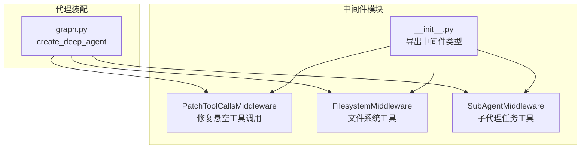
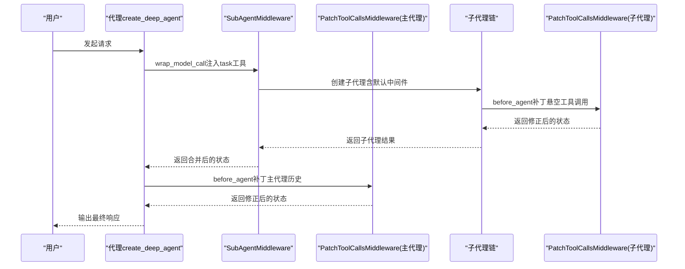
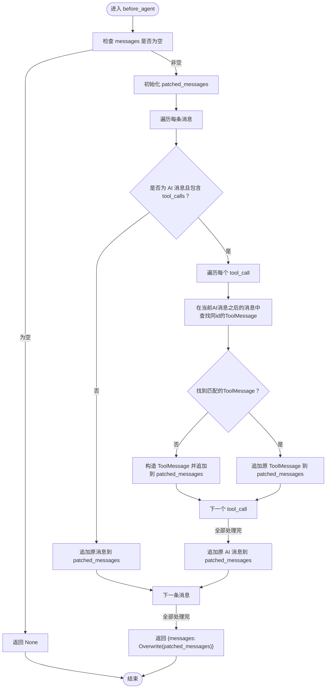
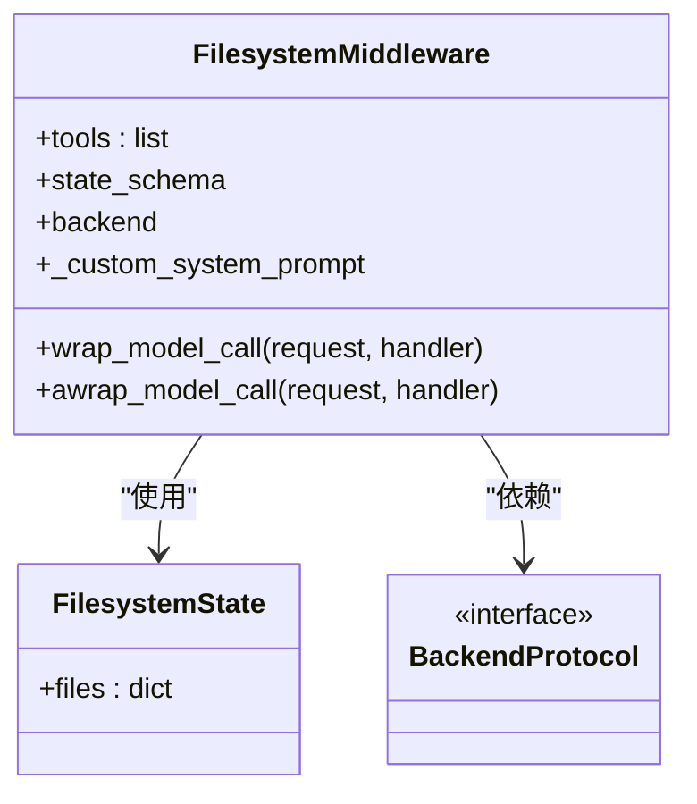
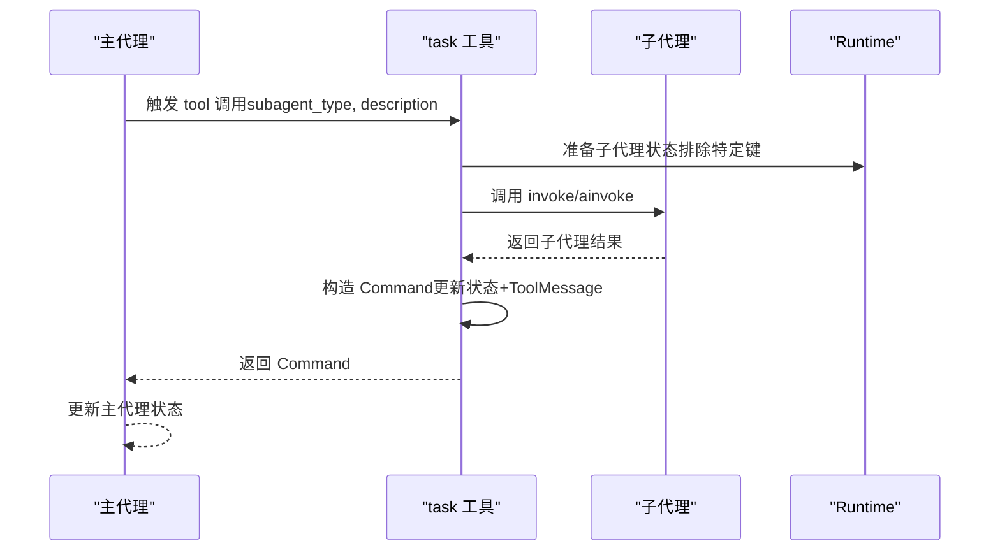
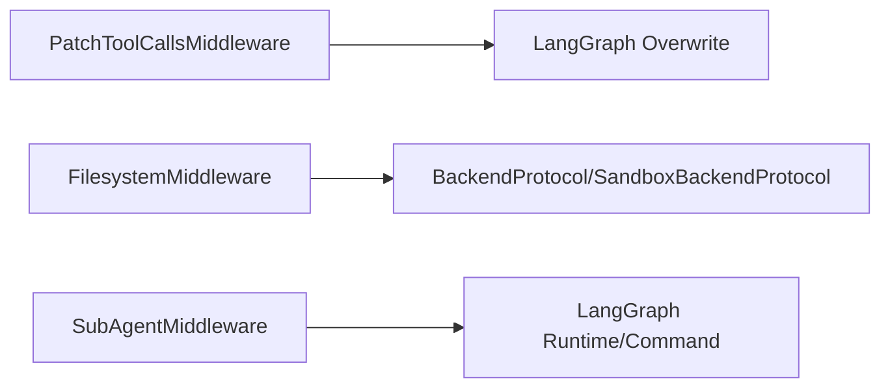

# 自定义中间件开发

<cite>
**本文引用的文件**
- [patch_tool_calls.py](file://libs/deepagents/deepagents/middleware/patch_tool_calls.py)
- [filesystem.py（中间件）](file://libs/deepagents/deepagents/middleware/filesystem.py)
- [subagents.py](file://libs/deepagents/deepagents/middleware/subagents.py)
- [__init__.py（中间件导出）](file://libs/deepagents/deepagents/middleware/__init__.py)
- [graph.py](file://libs/deepagents/deepagents/graph.py)
- [test_middleware.py](file://libs/deepagents/tests/unit_tests/test_middleware.py)
- [test_middleware_async.py](file://libs/deepagents/tests/unit_tests/test_middleware_async.py)
- [test_subagent_middleware.py](file://libs/deepagents/tests/integration_tests/test_subagent_middleware.py)
- [test_filesystem_middleware.py](file://libs/deepagents/tests/integration_tests/test_filesystem_middleware.py)
</cite>

## 目录
1. [引言](#引言)
2. [项目结构](#项目结构)
3. [核心组件](#核心组件)
4. [架构总览](#架构总览)
5. [详细组件分析](#详细组件分析)
6. [依赖关系分析](#依赖关系分析)
7. [性能考量](#性能考量)
8. [故障排查指南](#故障排查指南)
9. [结论](#结论)
10. [附录：创建自定义中间件步骤](#附录创建自定义中间件步骤)

## 引言
本文件面向希望扩展 DeepAgents 框架能力的开发者，系统讲解如何开发自定义中间件，重点剖析 PatchToolCallsMiddleware 的实现机制，说明它如何修复 LLM 在中断后产生的“悬空工具调用”问题，确保执行流程的连续性；同时结合 filesystem.py 与 subagents.py 中的中间件实现，阐述中间件的注册、执行顺序控制与上下文传递模式。文档还提供完整示例路径，演示如何创建新的中间件类并重写 before 与 after 方法以拦截代理执行流程；解释中间件与 LangGraph 节点的集成方式以及异步调用处理；最后总结常见陷阱（如状态污染与异常传播）并给出调试建议。

## 项目结构
DeepAgents 的中间件位于 deepagents/middleware 目录，包含：
- PatchToolCallsMiddleware：修复“悬空工具调用”的专用中间件
- FilesystemMiddleware：为代理注入文件系统工具集
- SubAgentMiddleware：通过 task 工具提供子代理能力
- __init__.py：统一导出中间件类型

此外，graph.py 提供 create_deep_agent，集中装配默认中间件链路，包括 PatchToolCallsMiddleware 的两次注册（主代理与子代理默认链路），体现中间件的注册与顺序控制。

图表来源
- [graph.py](file://libs/deepagents/deepagents/graph.py#L113-L143)
- [__init__.py](file://libs/deepagents/deepagents/middleware/__init__.py#L1-L12)

章节来源
- [graph.py](file://libs/deepagents/deepagents/graph.py#L113-L143)
- [__init__.py](file://libs/deepagents/deepagents/middleware/__init__.py#L1-L12)

## 核心组件
- PatchToolCallsMiddleware：在代理运行前扫描消息历史，检测 AI 消息中存在但未匹配 ToolMessage 的工具调用，自动补全缺失的 ToolMessage，避免后续执行阶段因缺少对应工具结果而中断。
- FilesystemMiddleware：生成一组文件系统工具（ls、read_file、write_file、edit_file、glob、grep、execute），支持短时态与长时态存储（CompositeBackend），并可按需覆盖系统提示与工具描述。
- SubAgentMiddleware：注入 task 工具，允许代理启动独立的子代理执行复杂或多步任务，子代理拥有独立上下文窗口与可选的默认中间件链路。

章节来源
- [patch_tool_calls.py](file://libs/deepagents/deepagents/middleware/patch_tool_calls.py#L11-L45)
- [filesystem.py（中间件）](file://libs/deepagents/deepagents/middleware/filesystem.py#L152-L200)
- [subagents.py](file://libs/deepagents/deepagents/middleware/subagents.py#L377-L485)

## 架构总览
DeepAgents 使用 create_deep_agent 统一装配中间件链路，其中默认包含：
- TodoListMiddleware
- FilesystemMiddleware
- SubAgentMiddleware（内部再装配默认子代理中间件链）
  - 其中包含 SummarizationMiddleware、AnthropicPromptCachingMiddleware、PatchToolCallsMiddleware 等
- SummarizationMiddleware
- AnthropicPromptCachingMiddleware
- PatchToolCallsMiddleware（主代理层）

该装配顺序保证了：
- 文件系统工具可用
- 子代理具备默认中间件链（含补丁中间件）
- 主代理层也进行一次补丁，确保最终一致性

图表来源
- [graph.py](file://libs/deepagents/deepagents/graph.py#L113-L143)
- [subagents.py](file://libs/deepagents/deepagents/middleware/subagents.py#L464-L485)
- [patch_tool_calls.py](file://libs/deepagents/deepagents/middleware/patch_tool_calls.py#L14-L45)

章节来源
- [graph.py](file://libs/deepagents/deepagents/graph.py#L113-L143)

## 详细组件分析

### PatchToolCallsMiddleware 分析
- 目标：修复 LLM 在中断后产生的“悬空工具调用”。当 AI 消息声明了工具调用，但在后续消息中未出现对应的 ToolMessage 时，会导致执行阶段无法继续。
- 实现要点：
  - before_agent 钩子：遍历消息历史，识别 AI 消息中的 tool_calls
  - 匹配策略：在当前 AI 消息之后的消息中查找同 id 的 ToolMessage
  - 补丁策略：若未找到，则构造 ToolMessage 并追加到消息列表，使用 Overwrite 包装返回，确保后续执行能读取到工具结果
- 关键数据结构与复杂度：
  - 时间复杂度：O(N^2)，N 为消息数量；对每个 AI 消息的 tool_calls，向后扫描消息列表匹配 ToolMessage
  - 空间复杂度：O(N)，用于构建 patched_messages
- 执行顺序与上下文：
  - 作为中间件链的一部分，在模型调用前被调用，修改 state["messages"]，影响后续工具节点与子代理执行
  - 通过 Overwrite 返回，避免直接修改原状态对象，降低状态污染风险

图表来源
- [patch_tool_calls.py](file://libs/deepagents/deepagents/middleware/patch_tool_calls.py#L14-L45)

章节来源
- [patch_tool_calls.py](file://libs/deepagents/deepagents/middleware/patch_tool_calls.py#L11-L45)
- [test_middleware.py](file://libs/deepagents/tests/unit_tests/test_middleware.py#L1177-L1306)

### FilesystemMiddleware 分析
- 功能：为代理注入文件系统工具集，支持本地与长时态存储（通过 CompositeBackend），并提供执行工具（execute）。
- 注册与上下文：
  - 通过 create_deep_agent 默认装配，或在自定义代理中显式添加
  - 支持自定义系统提示与工具描述覆盖
  - 工具函数接收 runtime 参数，可访问 state、store 等上下文
- 异步支持：所有工具均提供同步与异步版本（coroutine），便于在异步运行时使用
- 安全与路径校验：提供路径验证与规范化逻辑，防止目录穿越等安全问题
- 上下文传递模式：
  - 工具函数签名包含 runtime，可从 runtime.state 获取当前状态（如 messages、files）
  - 工具执行可能返回 Command，用于更新状态（如 files 字段），并通过 ToolMessage 将结果回传给模型

图表来源
- [filesystem.py（中间件）](file://libs/deepagents/deepagents/middleware/filesystem.py#L152-L200)
- [filesystem.py（中间件）](file://libs/deepagents/deepagents/middleware/filesystem.py#L298-L311)

章节来源
- [filesystem.py（中间件）](file://libs/deepagents/deepagents/middleware/filesystem.py#L152-L200)
- [filesystem.py（中间件）](file://libs/deepagents/deepagents/middleware/filesystem.py#L298-L311)
- [test_filesystem_middleware.py](file://libs/deepagents/tests/integration_tests/test_filesystem_middleware.py#L1-L120)

### SubAgentMiddleware 分析
- 功能：注入 task 工具，允许代理调用子代理执行独立任务；子代理拥有独立上下文窗口与可选工具与中间件。
- 注册与默认链路：
  - 默认装配默认子代理（general-purpose），并可配置默认工具、默认中间件、默认中断策略
  - 子代理的中间件链由 default_middleware 与子代理 spec 的 middleware 组合而成，避免默认中间件重复累积
- 上下文传递：
  - task 工具会基于当前状态创建子代理状态（排除特定键），并将子代理最终结果转换为 ToolMessage 回传
  - 支持同步与异步调用（task 与 atask）
- 与 LangGraph 节点集成：
  - 通过 StructuredTool 注入工具节点，LangGraph 节点负责调度子图执行
  - 子代理执行完成后，返回 Command 或字符串，中间件将其转换为 ToolMessage 并更新主代理状态

图表来源
- [subagents.py](file://libs/deepagents/deepagents/middleware/subagents.py#L279-L375)
- [subagents.py](file://libs/deepagents/deepagents/middleware/subagents.py#L377-L485)

章节来源
- [subagents.py](file://libs/deepagents/deepagents/middleware/subagents.py#L279-L375)
- [subagents.py](file://libs/deepagents/deepagents/middleware/subagents.py#L377-L485)
- [test_subagent_middleware.py](file://libs/deepagents/tests/integration_tests/test_subagent_middleware.py#L1-L120)

## 依赖关系分析
- 中间件注册与顺序：
  - graph.py 中 create_deep_agent 显式装配中间件链，PatchToolCallsMiddleware 在主代理与子代理两处注册，确保最终一致性
  - SubAgentMiddleware 内部维护 default_middleware 与子代理 spec 的 middleware 组合，避免默认中间件叠加
- 外部依赖：
  - PatchToolCallsMiddleware 依赖 LangGraph 的 Overwrite 类型，用于原子地替换 state["messages"]
  - FilesystemMiddleware 依赖 BackendProtocol/SandboxBackendProtocol，支持执行工具
  - SubAgentMiddleware 依赖 LangGraph 的 Runtime 与 Command，用于子代理状态更新

图表来源
- [patch_tool_calls.py](file://libs/deepagents/deepagents/middleware/patch_tool_calls.py#L14-L45)
- [filesystem.py（中间件）](file://libs/deepagents/deepagents/middleware/filesystem.py#L645-L666)
- [subagents.py](file://libs/deepagents/deepagents/middleware/subagents.py#L315-L323)

章节来源
- [graph.py](file://libs/deepagents/deepagents/graph.py#L113-L143)
- [subagents.py](file://libs/deepagents/deepagents/middleware/subagents.py#L233-L277)

## 性能考量
- PatchToolCallsMiddleware 的时间复杂度为 O(N^2)，在消息量较大时可能成为瓶颈。建议：
  - 控制消息历史长度，必要时启用 SummarizationMiddleware 进行摘要
  - 合理设置触发阈值与保留策略，减少不必要的历史记录
- FilesystemMiddleware 的工具输出可能很大，应使用分页读取（offset/limit）与结果截断策略，避免上下文溢出
- SubAgentMiddleware 的子代理执行可能产生大量中间状态，建议：
  - 仅在需要时使用 task 工具，避免过度拆分
  - 对子代理的系统提示与工具集进行精简，减少 token 使用

[本节为通用指导，无需列出具体文件来源]

## 故障排查指南
- 常见陷阱与对策
  - 状态污染：中间件应通过 Overwrite 或 Command 更新状态，避免直接修改原对象；参考 PatchToolCallsMiddleware 的返回值包装
  - 异常传播：FilesystemMiddleware 的 execute 工具在失败时会返回格式化的错误信息；异步场景下同样会返回包含退出码与截断标记的结果
  - 中间件叠加：SubAgentMiddleware 通过 default_middleware 与子代理 spec 的 middleware 组合，避免默认中间件重复累积
- 调试建议
  - 使用单元测试验证中间件行为：参考 test_middleware.py 中对 PatchToolCallsMiddleware 的多场景断言
  - 异步工具调试：参考 test_middleware_async.py 中对 execute 工具的异步断言
  - 集成测试：参考 test_subagent_middleware.py 与 test_filesystem_middleware.py，验证中间件在真实代理中的表现

章节来源
- [test_middleware.py](file://libs/deepagents/tests/unit_tests/test_middleware.py#L1177-L1306)
- [test_middleware_async.py](file://libs/deepagents/tests/unit_tests/test_middleware_async.py#L730-L814)
- [test_subagent_middleware.py](file://libs/deepagents/tests/integration_tests/test_subagent_middleware.py#L1-L120)
- [test_filesystem_middleware.py](file://libs/deepagents/tests/integration_tests/test_filesystem_middleware.py#L1-L120)

## 结论
通过 PatchToolCallsMiddleware、FilesystemMiddleware 与 SubAgentMiddleware 的协同，DeepAgents 能够在复杂交互场景中保持执行流程的连续性与稳定性。PatchToolCallsMiddleware 修复“悬空工具调用”，FilesystemMiddleware 提供强大的文件系统能力，SubAgentMiddleware 则通过 task 工具实现任务隔离与并发执行。中间件的注册顺序、上下文传递与异步支持共同构成了可扩展的代理执行框架。

[本节为总结，无需列出具体文件来源]

## 附录：创建自定义中间件步骤
- 步骤概览
  - 新建中间件类，继承 AgentMiddleware
  - 实现 before_agent 与/或 wrap_model_call（同步/异步），用于拦截与修改代理执行流程
  - 在代理装配时注册中间件，控制执行顺序
  - 如需更新状态，使用 Overwrite 或 Command 包装返回值
- 示例路径（不展示代码，仅提供定位）
  - 自定义中间件基类与钩子：[patch_tool_calls.py](file://libs/deepagents/deepagents/middleware/patch_tool_calls.py#L11-L18)
  - 异步中间件钩子示例（文件系统中间件）：[filesystem.py（中间件）](file://libs/deepagents/deepagents/middleware/filesystem.py#L298-L311)
  - 中间件注册与顺序控制（graph 装配）：[graph.py](file://libs/deepagents/deepagents/graph.py#L113-L143)
  - 子代理中间件的默认链路与组合策略：[subagents.py](file://libs/deepagents/deepagents/middleware/subagents.py#L233-L277)
  - LangGraph 节点集成与工具调用：[subagents.py](file://libs/deepagents/deepagents/middleware/subagents.py#L315-L375)

章节来源
- [patch_tool_calls.py](file://libs/deepagents/deepagents/middleware/patch_tool_calls.py#L11-L18)
- [filesystem.py（中间件）](file://libs/deepagents/deepagents/middleware/filesystem.py#L298-L311)
- [graph.py](file://libs/deepagents/deepagents/graph.py#L113-L143)
- [subagents.py](file://libs/deepagents/deepagents/middleware/subagents.py#L233-L277)
- [subagents.py](file://libs/deepagents/deepagents/middleware/subagents.py#L315-L375)