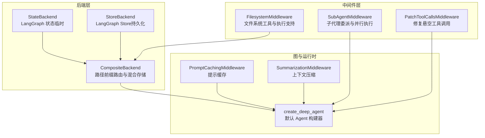
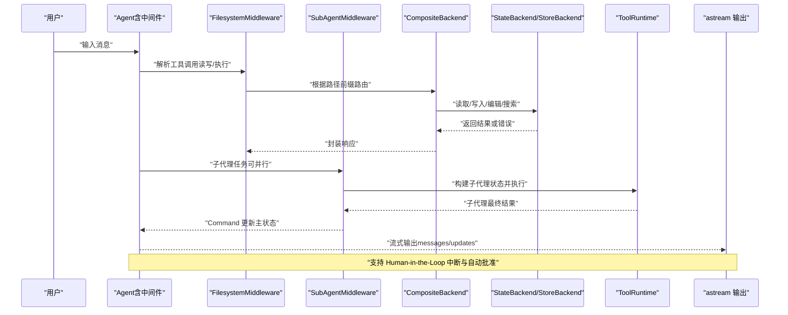
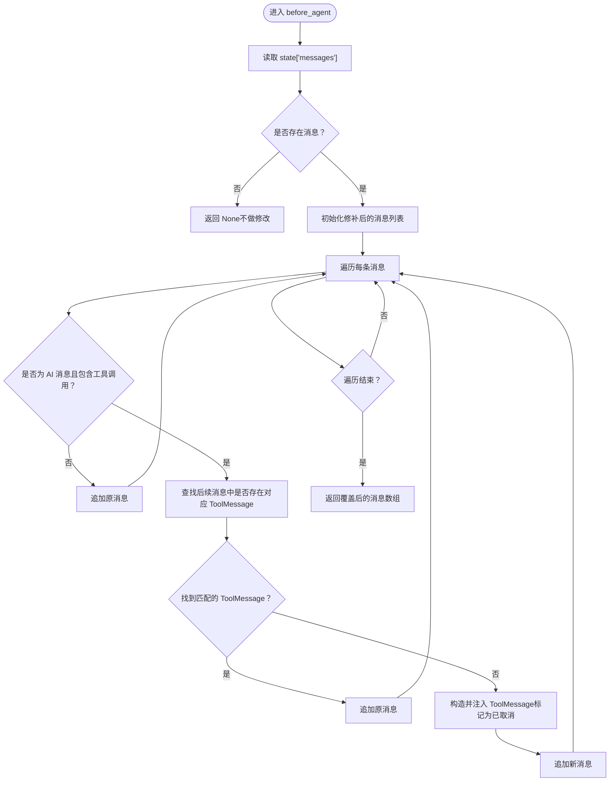
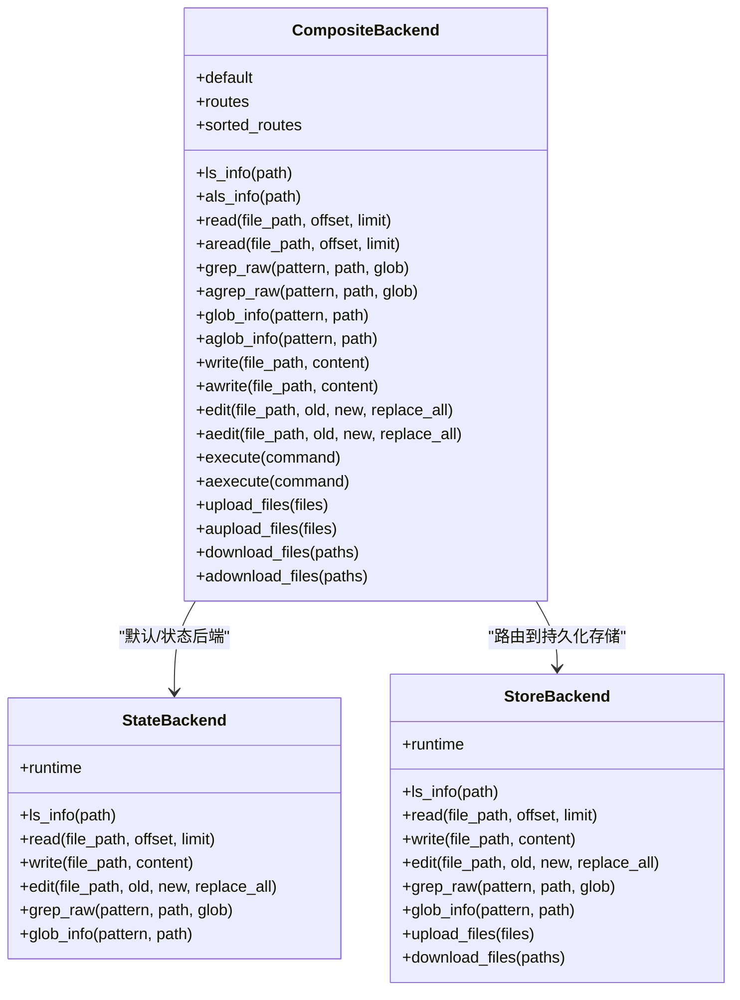
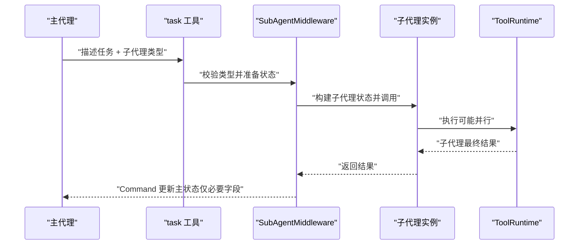
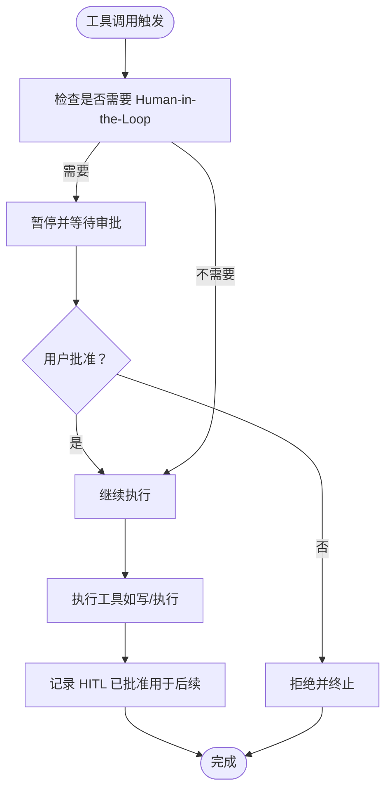
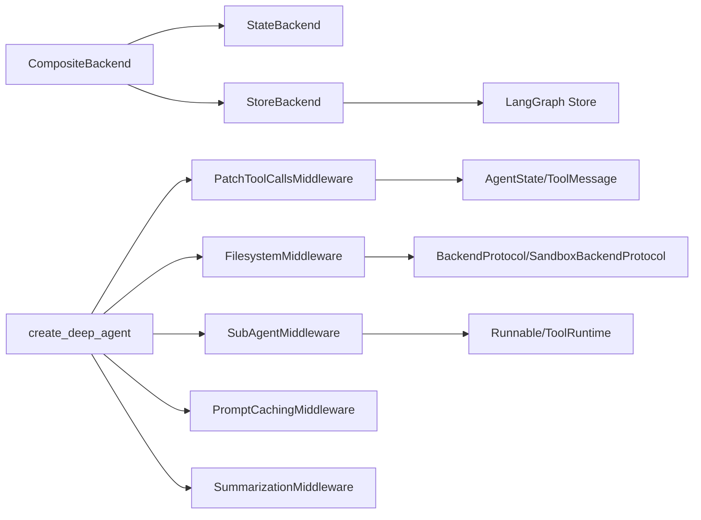

# 高级主题

<cite>
**本文引用的文件**
- [libs/deepagents/deepagents/middleware/patch_tool_calls.py](file://libs/deepagents/deepagents/middleware/patch_tool_calls.py)
- [libs/deepagents/deepagents/backends/composite.py](file://libs/deepagents/deepagents/backends/composite.py)
- [libs/deepagents/deepagents/backends/state.py](file://libs/deepagents/deepagents/backends/state.py)
- [libs/deepagents/deepagents/backends/store.py](file://libs/deepagents/deepagents/backends/store.py)
- [libs/deepagents/deepagents/backends/protocol.py](file://libs/deepagents/deepagents/backends/protocol.py)
- [libs/deepagents/deepagents/middleware/subagents.py](file://libs/deepagents/deepagents/middleware/subagents.py)
- [libs/deepagents/deepagents/graph.py](file://libs/deepagents/deepagents/graph.py)
- [libs/deepagents/deepagents/middleware/filesystem.py](file://libs/deepagents/deepagents/middleware/filesystem.py)
- [libs/deepagents-cli/deepagents_cli/execution.py](file://libs/deepagents-cli/deepagents_cli/execution.py)
- [libs/deepagents-cli/deepagents_cli/file_ops.py](file://libs/deepagents-cli/deepagents_cli/file_ops.py)
- [libs/deepagents/deepagents/backends/sandbox.py](file://libs/deepagents/deepagents/backends/sandbox.py)
- [libs/deepagents/deepagents/backends/utils.py](file://libs/deepagents/deepagents/backends/utils.py)
- [CLAUDE.md](file://CLAUDE.md)
</cite>

## 目录
1. [引言](#引言)
2. [项目结构](#项目结构)
3. [核心组件](#核心组件)
4. [架构总览](#架构总览)
5. [详细组件分析](#详细组件分析)
6. [依赖关系分析](#依赖关系分析)
7. [性能考量](#性能考量)
8. [故障排除指南](#故障排除指南)
9. [结论](#结论)
10. [附录](#附录)

## 引言
本篇“高级主题”围绕以下目标展开：自定义中间件开发（以修复中断后悬空工具调用为例）、CompositeBackend 的路由策略与混合存储（临时状态与持久化记忆）、异步编程最佳实践（astream 使用、并发子代理执行、非阻塞 I/O）、安全考虑（通过 Human-in-the-Loop 控制敏感工具执行）、性能优化技巧（提示缓存与上下文管理）、以及复杂场景下的故障排除（状态不一致与资源泄漏）。文档在保证技术准确性的同时，尽量以循序渐进的方式呈现，兼顾非技术读者的理解。

## 项目结构
该项目采用模块化设计，核心分为三层：
- 中间件层：负责增强 Agent 的行为，如文件系统工具、子代理委派、补丁修复等。
- 后端层：抽象统一的文件存储接口，支持状态后端（临时）、持久化存储后端（跨会话），以及复合路由后端。
- 图与运行时：提供默认 Agent 构建器，串联中间件与后端，并可选启用缓存与检查点。

图表来源
- [libs/deepagents/deepagents/graph.py](file://libs/deepagents/deepagents/graph.py#L113-L161)
- [libs/deepagents/deepagents/backends/composite.py](file://libs/deepagents/deepagents/backends/composite.py#L19-L562)
- [libs/deepagents/deepagents/backends/state.py](file://libs/deepagents/deepagents/backends/state.py#L20-L188)
- [libs/deepagents/deepagents/backends/store.py](file://libs/deepagents/deepagents/backends/store.py#L28-L443)
- [libs/deepagents/deepagents/middleware/filesystem.py](file://libs/deepagents/deepagents/middleware/filesystem.py#L900-L984)
- [libs/deepagents/deepagents/middleware/subagents.py](file://libs/deepagents/deepagents/middleware/subagents.py#L377-L485)
- [libs/deepagents/deepagents/middleware/patch_tool_calls.py](file://libs/deepagents/deepagents/middleware/patch_tool_calls.py#L11-L45)

章节来源
- [libs/deepagents/deepagents/graph.py](file://libs/deepagents/deepagents/graph.py#L113-L161)
- [libs/deepagents/deepagents/backends/composite.py](file://libs/deepagents/deepagents/backends/composite.py#L19-L562)
- [libs/deepagents/deepagents/backends/state.py](file://libs/deepagents/deepagents/backends/state.py#L20-L188)
- [libs/deepagents/deepagents/backends/store.py](file://libs/deepagents/deepagents/backends/store.py#L28-L443)

## 核心组件
- 自定义中间件：修复中断后悬空工具调用（PatchToolCallsMiddleware）
- 复合后端：基于路径前缀的路由与混合存储（CompositeBackend）
- 子代理中间件：并行子代理执行与状态隔离（SubAgentMiddleware）
- 安全控制：通过 Human-in-the-Loop 中断敏感工具执行（HITL）
- 异步与非阻塞：异步流式输出（astream）、批量上传下载、异步执行
- 性能优化：提示缓存（PromptCachingMiddleware）、上下文压缩（SummarizationMiddleware）

章节来源
- [libs/deepagents/deepagents/middleware/patch_tool_calls.py](file://libs/deepagents/deepagents/middleware/patch_tool_calls.py#L11-L45)
- [libs/deepagents/deepagents/backends/composite.py](file://libs/deepagents/deepagents/backends/composite.py#L19-L562)
- [libs/deepagents/deepagents/middleware/subagents.py](file://libs/deepagents/deepagents/middleware/subagents.py#L377-L485)
- [libs/deepagents/deepagents/graph.py](file://libs/deepagents/deepagents/graph.py#L113-L161)

## 架构总览
下图展示从用户输入到工具执行、再到状态更新与流式输出的整体流程，强调异步与安全控制的关键节点。

图表来源
- [libs/deepagents/deepagents/graph.py](file://libs/deepagents/deepagents/graph.py#L113-L161)
- [libs/deepagents/deepagents/middleware/filesystem.py](file://libs/deepagents/deepagents/middleware/filesystem.py#L900-L984)
- [libs/deepagents/deepagents/middleware/subagents.py](file://libs/deepagents/deepagents/middleware/subagents.py#L377-L485)
- [libs/deepagents/deepagents/backends/composite.py](file://libs/deepagents/deepagents/backends/composite.py#L19-L562)
- [libs/deepagents-cli/deepagents_cli/execution.py](file://libs/deepagents-cli/deepagents_cli/execution.py#L274-L621)

## 详细组件分析

### 组件A：修复中断后的悬空工具调用（PatchToolCallsMiddleware）
- 设计动机：当 AI 生成工具调用但被新消息打断时，可能出现“悬空工具调用”（AI 已记录调用 ID，但未收到对应 ToolMessage），导致后续推理链不完整。
- 实现要点：
  - 在 Agent 执行前扫描历史消息，识别 AI 消息中的工具调用。
  - 若未找到对应的 ToolMessage，则构造一条“已取消”的 ToolMessage 并注入到消息序列中。
  - 返回覆盖后的消息数组，确保后续推理链完整。
- 关键路径参考
  - [before_agent](file://libs/deepagents/deepagents/middleware/patch_tool_calls.py#L14-L45)

图表来源
- [libs/deepagents/deepagents/middleware/patch_tool_calls.py](file://libs/deepagents/deepagents/middleware/patch_tool_calls.py#L14-L45)

章节来源
- [libs/deepagents/deepagents/middleware/patch_tool_calls.py](file://libs/deepagents/deepagents/middleware/patch_tool_calls.py#L11-L45)

### 组件B：CompositeBackend 的路由策略与混合存储
- 路由策略：
  - 依据路径前缀匹配，最长前缀优先；未命中则回退到默认后端。
  - 对根目录列出时，聚合默认后端与所有已配置路由的目录项。
- 混合存储：
  - 默认后端通常为文件系统或状态后端；路由表可指向持久化存储后端（如 LangGraph Store）。
  - 写入/编辑操作会同步更新默认后端的状态（若存在），以保持文件列表一致性。
- 异步批处理：
  - upload_files/adownload_files 会按后端分组，减少跨后端往返次数，提高吞吐。
- 关键路径参考
  - [CompositeBackend.__init__/_get_backend_and_key](file://libs/deepagents/deepagents/backends/composite.py#L19-L54)
  - [CompositeBackend.ls_info/als_info](file://libs/deepagents/deepagents/backends/composite.py#L55-L135)
  - [CompositeBackend.write/aedit](file://libs/deepagents/deepagents/backends/composite.py#L274-L376)
  - [CompositeBackend.upload_files/aupload_files](file://libs/deepagents/deepagents/backends/composite.py#L421-L492)
  - [CompositeBackend.download_files/adownload_files](file://libs/deepagents/deepagents/backends/composite.py#L494-L562)

图表来源
- [libs/deepagents/deepagents/backends/composite.py](file://libs/deepagents/deepagents/backends/composite.py#L19-L562)
- [libs/deepagents/deepagents/backends/state.py](file://libs/deepagents/deepagents/backends/state.py#L20-L188)
- [libs/deepagents/deepagents/backends/store.py](file://libs/deepagents/deepagents/backends/store.py#L28-L443)

章节来源
- [libs/deepagents/deepagents/backends/composite.py](file://libs/deepagents/deepagents/backends/composite.py#L19-L562)
- [libs/deepagents/deepagents/backends/state.py](file://libs/deepagents/deepagents/backends/state.py#L20-L188)
- [libs/deepagents/deepagents/backends/store.py](file://libs/deepagents/deepagents/backends/store.py#L28-L443)

### 组件C：子代理中间件与并发执行（SubAgentMiddleware）
- 功能概述：
  - 提供一个“task”工具，允许主代理启动多个子代理并行执行独立任务。
  - 子代理具有独立上下文窗口，避免主会话上下文膨胀。
  - 支持默认通用子代理与自定义子代理类型，可附加默认中间件与中断配置。
- 并发与状态：
  - 通过异步 invoke（atask）实现并行执行；每个子代理返回单一最终结果，主代理将其合并到主状态。
  - 仅传递必要的状态键，避免泄露敏感信息。
- 关键路径参考
  - [SubAgentMiddleware.__init__/_create_task_tool](file://libs/deepagents/deepagents/middleware/subagents.py#L377-L485)
  - [SubAgent 类型定义与默认提示](file://libs/deepagents/deepagents/middleware/subagents.py#L17-L120)

图表来源
- [libs/deepagents/deepagents/middleware/subagents.py](file://libs/deepagents/deepagents/middleware/subagents.py#L279-L376)
- [libs/deepagents/deepagents/middleware/subagents.py](file://libs/deepagents/deepagents/middleware/subagents.py#L377-L485)

章节来源
- [libs/deepagents/deepagents/middleware/subagents.py](file://libs/deepagents/deepagents/middleware/subagents.py#L17-L120)
- [libs/deepagents/deepagents/middleware/subagents.py](file://libs/deepagents/deepagents/middleware/subagents.py#L279-L376)
- [libs/deepagents/deepagents/middleware/subagents.py](file://libs/deepagents/deepagents/middleware/subagents.py#L377-L485)

### 组件D：安全与人类在环（Human-in-the-Loop）
- 机制说明：
  - 通过 HumanInTheLoopMiddleware 在关键工具调用处暂停，等待人工审批。
  - CLI 层在流式输出期间收集中断请求，支持手动审批或自动批准模式切换。
  - 文件操作（如写/编辑）可被标记为 HITL 已批准，以便后续执行。
- 关键路径参考
  - [HITL 流程与审批逻辑](file://libs/deepagents-cli/deepagents_cli/execution.py#L292-L621)
  - [文件操作 HITL 标记](file://libs/deepagents-cli/deepagents_cli/file_ops.py#L398-L412)
  - [中间件动态系统提示与执行工具可用性检测](file://libs/deepagents/deepagents/middleware/filesystem.py#L900-L984)

图表来源
- [libs/deepagents-cli/deepagents_cli/execution.py](file://libs/deepagents-cli/deepagents_cli/execution.py#L292-L621)
- [libs/deepagents-cli/deepagents_cli/file_ops.py](file://libs/deepagents-cli/deepagents_cli/file_ops.py#L398-L412)
- [libs/deepagents/deepagents/middleware/filesystem.py](file://libs/deepagents/deepagents/middleware/filesystem.py#L900-L984)

章节来源
- [libs/deepagents-cli/deepagents_cli/execution.py](file://libs/deepagents-cli/deepagents_cli/execution.py#L274-L621)
- [libs/deepagents-cli/deepagents_cli/file_ops.py](file://libs/deepagents-cli/deepagents_cli/file_ops.py#L398-L412)
- [libs/deepagents/deepagents/middleware/filesystem.py](file://libs/deepagents/deepagents/middleware/filesystem.py#L900-L984)

### 组件E：异步编程最佳实践（astream、并发子代理、非阻塞 I/O）
- 异步流式输出：
  - 使用 astream 并开启“updates”模式，以支持 Human-in-the-Loop 中断与待办事项更新。
  - 流式事件解包时区分命名空间与流模式，分别处理消息与状态更新。
- 并发子代理：
  - 在同一消息中多次使用 task 工具，即可并行启动多个子代理，最大化性能。
- 非阻塞 I/O：
  - 批量上传/下载与异步执行（aexecute）避免阻塞主线程。
- 关键路径参考
  - [CLI 中的 astream 使用与中断处理](file://libs/deepagents-cli/deepagents_cli/execution.py#L274-L621)
  - [子代理异步调用 atask](file://libs/deepagents/deepagents/middleware/subagents.py#L354-L368)
  - [CompositeBackend 异步批处理](file://libs/deepagents/deepagents/backends/composite.py#L421-L492)

章节来源
- [libs/deepagents-cli/deepagents_cli/execution.py](file://libs/deepagents-cli/deepagents_cli/execution.py#L274-L621)
- [libs/deepagents/deepagents/middleware/subagents.py](file://libs/deepagents/deepagents/middleware/subagents.py#L354-L368)
- [libs/deepagents/deepagents/backends/composite.py](file://libs/deepagents/deepagents/backends/composite.py#L421-L492)

## 依赖关系分析
- 中间件依赖：
  - FilesystemMiddleware 依赖 BackendProtocol 与 SandboxBackendProtocol，以决定是否注入执行工具说明。
  - SubAgentMiddleware 依赖 LangGraph 的 Runnable 与 ToolRuntime，以构建子代理状态并执行。
  - PatchToolCallsMiddleware 依赖 AgentState 与 ToolMessage，以修补消息历史。
- 后端依赖：
  - CompositeBackend 依赖 StateBackend 与 StoreBackend，实现混合存储与路由。
  - StoreBackend 依赖 LangGraph Store 接口，提供跨会话持久化。
- 运行时依赖：
  - create_deep_agent 将多个中间件组合，启用缓存与上下文压缩，并可选启用 Human-in-the-Loop。

图表来源
- [libs/deepagents/deepagents/middleware/patch_tool_calls.py](file://libs/deepagents/deepagents/middleware/patch_tool_calls.py#L11-L45)
- [libs/deepagents/deepagents/middleware/filesystem.py](file://libs/deepagents/deepagents/middleware/filesystem.py#L900-L984)
- [libs/deepagents/deepagents/middleware/subagents.py](file://libs/deepagents/deepagents/middleware/subagents.py#L377-L485)
- [libs/deepagents/deepagents/backends/composite.py](file://libs/deepagents/deepagents/backends/composite.py#L19-L562)
- [libs/deepagents/deepagents/backends/store.py](file://libs/deepagents/deepagents/backends/store.py#L28-L443)
- [libs/deepagents/deepagents/graph.py](file://libs/deepagents/deepagents/graph.py#L113-L161)

章节来源
- [libs/deepagents/deepagents/graph.py](file://libs/deepagents/deepagents/graph.py#L113-L161)
- [libs/deepagents/deepagents/backends/composite.py](file://libs/deepagents/deepagents/backends/composite.py#L19-L562)
- [libs/deepagents/deepagents/backends/store.py](file://libs/deepagents/deepagents/backends/store.py#L28-L443)
- [libs/deepagents/deepagents/middleware/filesystem.py](file://libs/deepagents/deepagents/middleware/filesystem.py#L900-L984)
- [libs/deepagents/deepagents/middleware/subagents.py](file://libs/deepagents/deepagents/middleware/subagents.py#L377-L485)
- [libs/deepagents/deepagents/middleware/patch_tool_calls.py](file://libs/deepagents/deepagents/middleware/patch_tool_calls.py#L11-L45)

## 性能考量
- 提示缓存（PromptCachingMiddleware）
  - 在模型支持的情况下启用提示缓存，减少重复计算，提升响应速度。
  - 参考：[create_deep_agent 中的缓存中间件](file://libs/deepagents/deepagents/graph.py#L123-L130)
- 上下文压缩（SummarizationMiddleware）
  - 当上下文接近阈值时，自动压缩历史消息，保留关键信息，降低 token 消耗。
  - 参考：[create_deep_agent 中的压缩中间件](file://libs/deepagents/deepagents/graph.py#L135-L141)
- 异步与批处理
  - 使用 astream 获取实时反馈；批量上传/下载与异步执行减少等待时间。
  - 参考：[CLI 中的 astream 使用](file://libs/deepagents-cli/deepagents_cli/execution.py#L274-L290)
- 大结果落盘（FilesystemMiddleware）
  - 当工具结果过大时，拦截并写入文件系统，避免上下文溢出。
  - 参考：[大结果拦截与落盘](file://libs/deepagents/deepagents/middleware/filesystem.py#L1048-L1088)
- 持久化与临时状态结合
  - 使用 CompositeBackend 将短期任务写入 StateBackend，长期记忆写入 StoreBackend，平衡性能与持久化。
  - 参考：[CompositeBackend 写入与状态合并](file://libs/deepagents/deepagents/backends/composite.py#L274-L322)

章节来源
- [libs/deepagents/deepagents/graph.py](file://libs/deepagents/deepagents/graph.py#L123-L141)
- [libs/deepagents/deepagents/middleware/filesystem.py](file://libs/deepagents/deepagents/middleware/filesystem.py#L1048-L1088)
- [libs/deepagents/deepagents/backends/composite.py](file://libs/deepagents/deepagents/backends/composite.py#L274-L322)
- [libs/deepagents-cli/deepagents_cli/execution.py](file://libs/deepagents-cli/deepagents_cli/execution.py#L274-L290)

## 故障排除指南
- 状态不一致
  - 症状：写入/编辑后文件列表未更新。
  - 处理：确认 CompositeBackend 在写入/编辑成功后是否尝试更新默认后端状态；检查异常捕获逻辑。
  - 参考：[CompositeBackend 写入/编辑后的状态合并](file://libs/deepagents/deepagents/backends/composite.py#L290-L322)
- 资源泄漏
  - 症状：长时间运行后内存占用上升。
  - 处理：确保使用异步批处理与上下文压缩；避免在中间件中累积大量对象；定期清理临时文件。
  - 参考：[异步批处理与上下文压缩](file://libs/deepagents/deepagents/backends/composite.py#L421-L492), [上下文压缩中间件](file://libs/deepagents/deepagents/graph.py#L135-L141)
- 执行失败与截断
  - 症状：命令执行返回非零退出码或输出被截断。
  - 处理：检查后端是否实现 SandboxBackendProtocol；在 FilesystemMiddleware 中根据后端能力动态调整系统提示。
  - 参考：[执行工具可用性检测与系统提示](file://libs/deepagents/deepagents/middleware/filesystem.py#L900-L984), [Sandbox 基类与执行接口](file://libs/deepagents/deepagents/backends/sandbox.py#L141-L167)
- 错误处理与标准化
  - 症状：上传/下载出现无效路径、权限不足等。
  - 处理：遵循统一的错误码（file_not_found、invalid_path、permission_denied 等），便于 LLM 自动修复。
  - 参考：[错误码与响应结构](file://libs/deepagents/deepagents/backends/protocol.py#L17-L31), [StoreBackend 错误处理](file://libs/deepagents/deepagents/backends/store.py#L282-L340)
- 子代理卡住或无输出
  - 症状：task 工具调用后无响应。
  - 处理：确认子代理是否正确返回最终结果；检查 ToolRuntime 的 tool_call_id 是否存在；必要时启用并行多任务。
  - 参考：[task 工具与返回 Command](file://libs/deepagents/deepagents/middleware/subagents.py#L340-L374)

章节来源
- [libs/deepagents/deepagents/backends/composite.py](file://libs/deepagents/deepagents/backends/composite.py#L290-L322)
- [libs/deepagents/deepagents/backends/protocol.py](file://libs/deepagents/deepagents/backends/protocol.py#L17-L31)
- [libs/deepagents/deepagents/backends/store.py](file://libs/deepagents/deepagents/backends/store.py#L282-L340)
- [libs/deepagents/deepagents/middleware/filesystem.py](file://libs/deepagents/deepagents/middleware/filesystem.py#L900-L984)
- [libs/deepagents/deepagents/backends/sandbox.py](file://libs/deepagents/deepagents/backends/sandbox.py#L141-L167)
- [libs/deepagents/deepagents/middleware/subagents.py](file://libs/deepagents/deepagents/middleware/subagents.py#L340-L374)

## 结论
本项目通过中间件、后端与运行时的协同，提供了可扩展、可安全控制、可异步执行的智能体平台。针对高级主题，建议：
- 在复杂工作流中优先使用 SubAgentMiddleware 并行化任务，结合 CompositeBackend 实现混合存储。
- 通过 Human-in-the-Loop 严格控制敏感工具执行，结合 CLI 的 HITL 流程实现交互式审批。
- 利用提示缓存与上下文压缩提升性能，配合异步批处理与非阻塞 I/O 优化用户体验。
- 建立完善的错误处理与状态一致性保障机制，确保在复杂场景下稳定运行。

## 附录
- 快速参考
  - 自定义中间件：实现 AgentMiddleware 接口，在 before_agent/after_agent/wrap_model_call 等钩子中插入逻辑。
  - 路由与混合存储：在 CompositeBackend 中配置 routes 映射路径前缀到不同后端，结合 StateBackend 与 StoreBackend。
  - 异步与流式：使用 astream 并开启 updates 模式，结合 CLI 的中断处理与自动批准。
  - 安全控制：启用 HumanInTheLoopMiddleware，并在 CLI 层实现 HITL 请求验证与审批决策。
  - 性能优化：启用提示缓存与上下文压缩，合理使用异步批处理与落盘策略。

章节来源
- [CLAUDE.md](file://CLAUDE.md#L249-L290)
- [libs/deepagents/deepagents/graph.py](file://libs/deepagents/deepagents/graph.py#L113-L161)
- [libs/deepagents/deepagents/backends/composite.py](file://libs/deepagents/deepagents/backends/composite.py#L19-L562)
- [libs/deepagents/deepagents/middleware/subagents.py](file://libs/deepagents/deepagents/middleware/subagents.py#L377-L485)
- [libs/deepagents-cli/deepagents_cli/execution.py](file://libs/deepagents-cli/deepagents_cli/execution.py#L274-L621)