# DeepAgents LangChain - AI Agent 框架

> 更新时间：2025-12-24

DeepAgents 是一个基于 LangGraph 构建的开源 AI Agent 框架，专为处理长期任务而设计。它提供了规划、文件系统访问和子代理委派等核心能力，使 AI 能够处理复杂的多步骤工作流程。

## 项目愿景

DeepAgents 致力于解决长期 AI 任务中的成本和可靠性挑战，通过以下核心原则：
- **规划驱动** - 在任务执行前进行结构化规划
- **计算机访问** - 提供 shell 和文件系统访问能力
- **子代理委派** - 通过隔离的子代理处理特定任务
- **异步优先** - 全面支持异步操作，提升性能和响应能力
- **可扩展架构** - 插件化中间件和后端系统

## 架构总览

DeepAgents 采用模块化的 monorepo 架构设计，包含以下核心组件：

```mermaid
graph TD
    A["DeepAgents"] --> B["核心库 (libs/deepagents)"];
    A --> C["CLI工具 (libs/deepagents-cli)"];
    A --> D["示例技能 (examples/skills)"];
    A --> E["Harbor集成 (libs/harbor)"];
    A --> F["ACP协议 (libs/acp)"];

    B --> G["后端系统 (backends/)"];
    B --> H["中间件 (middleware/)"];
    B --> I["图构建器 (graph.py)"];

    G --> J["StateBackend"];
    G --> K["FilesystemBackend"];
    G --> L["StoreBackend"];
    G --> M["CompositeBackend"];
    G --> N["SandboxBackend"];

    H --> O["FilesystemMiddleware"];
    H --> P["SubAgentMiddleware"];
    H --> Q["PatchToolCallsMiddleware"];

    C --> R["交互式CLI"];
    C --> S["命令管理"];
    C --> T["集成支持"];
    C --> U["技能系统"];
    C --> V["图像处理"];

    D --> W["arXiv搜索"];
    D --> X["网络研究"];
    D --> Y["文档查询"];

    E --> Z["HarborSandbox"];
    E --> AA["DeepAgentsWrapper"];
    E --> AB["LangSmith追踪"];

    F --> AC["Agent Client Protocol"];
    F --> AD["标准化上下文管理"];

    click B "./libs/deepagents/CLAUDE.md" "查看核心库文档"
    click C "./libs/deepagents-cli/CLAUDE.md" "查看CLI工具文档"
    click D "./examples/CLAUDE.md" "查看示例文档"
    click E "./libs/harbor/README.md" "查看Harbor集成文档"
    click F "./libs/acp/README.md" "查看ACP文档"
```



## 模块索引

| 模块 | 路径 | 语言 | 职责 | 状态 | 版本 |
|------|------|------|------|------|------|
| **核心库** | `libs/deepagents` | Python | 提供Agent创建、中间件和后端系统 | ✅ 完整 | v0.3.1 |
| **CLI工具** | `libs/deepagents-cli` | Python | 命令行界面和交互式体验 | ✅ 完整 | v0.0.12 |
| **示例技能** | `examples/skills` | Python | 预构建技能模板和示例 | ✅ 完整 | - |
| **Harbor集成** | `libs/harbor` | Python | Terminal Bench 2.0评估框架集成 | ✅ 完整 | - |
| **ACP协议** | `libs/acp` | Python | Agent Client Protocol标准化支持 | 🚧 开发中 | v0.0.1 |

## ✨ 最新功能亮点

### 1. ACP 协议支持 (新增)
- **Agent Client Protocol 集成** - 标准化的Agent客户端通信协议
- **上下文管理** - 统一的上下文传递和管理机制
- **Python 3.14+ 支持** - 面向未来的Python版本兼容
- **独立服务器** - `deepacp` 命令行工具用于启动ACP服务器

### 2. CLI 图像处理功能 (新增)
- **剪贴板图像读取** - 支持从剪贴板直接粘贴图像（macOS）
- **多格式支持** - PNG、JPEG、TIFF等格式自动转换
- **多模态消息** - 与LangChain多模态消息格式完全兼容
- **智能降级** - 优先使用pngpaste，降级到osascript内置工具

### 3. Harbor 评估集成
- **Terminal Bench 2.0 支持** - 在90+个挑战性任务上评估Agent性能
- **多沙箱环境** - Docker、Daytona、Modal、Runloop等环境支持
- **LangSmith集成** - 完整的轨迹追踪和性能分析
- **奖励评分** - 0.0-1.0范围的量化评估

### 4. 全面异步支持
- **异步后端协议** - 所有后端操作支持async/await
- **并发执行** - 子代理可并行执行任务
- **非阻塞I/O** - 文件操作和命令执行不阻塞主流程
- **性能提升** - 显著降低响应延迟

### 5. CLI工具增强
- **交互式界面** - Rich支持的精美终端界面
- **技能系统** - 可扩展的技能插件架构
- **多沙箱支持** - 集成Daytona、Modal、Runloop
- **代理管理** - 多代理创建和状态管理

## 运行与开发

### 快速开始

```bash
# 克隆仓库
git clone https://github.com/langchain-ai/deepagents-langchain
cd deepagents-langchain

# 安装核心库 (v0.3.1)
cd libs/deepagents
pip install -e .

# 安装CLI工具（包含额外依赖）(v0.0.12)
cd ../deepagents-cli
pip install -e .

# 安装Harbor集成（可选）
cd ../harbor
pip install -e .

# 安装ACP协议支持（可选，Python 3.14+）
cd ../acp
pip install -e .
```

### 基本使用

```python
from deepagents import create_deep_agent

# 创建基础Agent
agent = create_deep_agent()

# 执行任务
result = agent.invoke({
    "messages": [{"role": "user", "content": "分析这个项目结构"}]
})

# 异步执行
async def main():
    async for chunk in agent.astream({
        "messages": [{"role": "user", "content": "任务内容"}]
    }):
        print(chunk)
```

### CLI使用

```bash
# 启动交互式CLI
deepagents

# 列出可用代理
deepagents list

# 重置代理状态
deepagents reset --agent my-agent

# 技能管理
deepagents skills list
deepagents skills install arxiv-search
```

### Harbor评估

```bash
# 配置API密钥
export ANTHROPIC_API_KEY="sk-ant-..."
export LANGSMITH_API_KEY="lsv2_..."
export LANGSMITH_TRACING_V2=true

# 运行Terminal Bench评估
cd libs/harbor
make run-terminal-bench-docker    # 本地Docker测试
make run-terminal-bench-daytona   # 云端大规模评估
make run-terminal-bench-modal     # Modal云函数
```

### ACP服务器使用

```bash
# 启动ACP服务器（需要Python 3.14+）
deepacp

# ACP服务器将提供标准的Agent Client Protocol接口
# 可用于与其他ACP兼容的Agent进行通信
```

### 开发环境设置

```bash
# 安装开发依赖
cd libs/deepagents
pip install -e ".[dev,tests]"
cd ../deepagents-cli
pip install -e ".[dev,tests]"
cd ../harbor
pip install -e ".[test]"
cd ../acp
pip install -e ".[dev,test]"

# 运行测试
pytest libs/deepagents/tests/
pytest libs/deepagents-cli/tests/
pytest libs/harbor/tests/
pytest libs/acp/tests/

# 代码检查
ruff check libs/deepagents/
ruff check libs/deepagents-cli/
ruff check libs/harbor/
ruff check libs/acp/

# 格式化代码
ruff format libs/deepagents/
ruff format libs/deepagents-cli/
ruff format libs/harbor/
ruff format libs/acp/
```

## 测试策略

项目采用分层测试策略，全面覆盖异步功能：

- **单元测试** - 测试单个组件和函数
  - 后端系统：State、Filesystem、Store、Composite
  - 中间件：Filesystem、SubAgent、异步支持
- **集成测试** - 测试组件间交互和完整工作流
  - CLI沙箱集成
  - Harbor评估集成
  - 端到端Agent流程
- **基准测试** - 性能和效率测试
  - Harbor Terminal Bench基准
  - CLI任务性能基准

### 测试覆盖范围

- `libs/deepagents/tests/` - 核心库测试（25+文件）
  - 异步后端测试：5个专门的异步测试文件
  - 中间件测试：包含异步版本
  - 集成测试：完整工作流验证
- `libs/deepagents-cli/tests/` - CLI工具测试（10+文件）
  - 单元测试：命令处理、配置管理、图像处理
  - 集成测试：CLI交互和沙箱操作
  - 基准测试：任务执行性能
- `libs/harbor/tests/` - Harbor集成测试
  - 单元测试：导入和基础功能
  - 集成测试：与Harbor框架的完整集成
- `libs/acp/tests/` - ACP协议测试
  - 单元测试：ACP服务器功能
  - 集成测试：Agent Client Protocol兼容性

## 编码规范

- **Python版本**: >= 3.11 (核心库、CLI、Harbor)，>= 3.14 (ACP)
- **代码格式化**: 使用 ruff
- **类型检查**: 使用 mypy，严格模式
- **文档**: Google风格docstring
- **行长度**: 150字符（核心库）、100字符（CLI和Harbor）
- **依赖锁定**: 使用 uv.lock 进行现代化依赖管理

### 主要规则

```toml
[tool.ruff]
line-length = 150  # 核心库
# line-length = 100  # CLI工具和Harbor

[tool.ruff.lint]
select = ["ALL"]  # 启用所有规则
ignore = [
    "COM812", "ISC001",  # 格式化工具冲突
    "PERF203",           # 不太有用
    "SLF001",            # 允许私有成员访问
    "PLC0415",           # 允许非顶部导入
    "PLR0913",           # 允许较多参数
]

[tool.pytest.ini_options]
asyncio_mode = "auto"  # 自动检测异步测试
```

## AI 使用指引

### 项目特点

DeepAgents 专为以下场景优化：

1. **长期任务处理** - 通过TODO列表规划和进度跟踪
2. **复杂工作流** - 支持子代理委派和并行执行
3. **文件操作** - 内置文件系统工具和虚拟沙箱
4. **异步优先** - 全面支持异步操作，提升性能
5. **评估驱动** - 集成Harbor框架进行性能评估

### 核心概念

- **Middleware（中间件）** - 为Agent添加工具和行为
- **Backends（后端）** - 控制文件存储和执行环境
- **Subagents（子代理）** - 隔离的专业化代理
- **Memory（记忆）** - 跨会话持久化存储
- **Skills（技能）** - 可扩展的功能插件
- **Harbor** - 第三方评估框架集成
- **ACP** - Agent Client Protocol标准化通信
- **多模态支持** - 图像处理和多模态消息

### 异步编程最佳实践

1. **使用异步API** - 优先选择`astream`而非`stream`
2. **并发子代理** - 利用异步特性并行执行任务
3. **非阻塞I/O** - 文件操作和命令执行不会阻塞
4. **错误处理** - 使用async/await和try/except

### 评估和优化

1. **Harbor集成** - 使用Terminal Bench评估Agent性能
2. **LangSmith追踪** - 分析执行轨迹和性能瓶颈
3. **基准测试** - 持续监控性能指标
4. **迭代改进** - 基于评估结果优化提示和工具

### 最佳实践

1. **任务规划** - 使用 `write_todos` 创建结构化任务列表
2. **上下文管理** - 利用文件系统卸载大型结果
3. **专业化委派** - 通过子代理处理特定领域任务
4. **持久化** - 使用CompositeBackend实现长期记忆
5. **性能优化** - 利用异步能力提升响应速度

## 相关资源

- **[完整文档](https://docs.langchain.com/oss/python/deepagents/overview)**
- **[快速开始示例](https://github.com/langchain-ai/deepagents-quickstarts)**
- **[LangGraph文档](https://docs.langchain.com/oss/python/langgraph/overview)**
- **[Harbor评估框架](https://github.com/HarborAI/harbor)**
- **[Terminal Bench 2.0](https://github.com/HarborAI/harbor)**
- **[LangSmith追踪](https://smith.langchain.com)**

## 变更记录 (Changelog)

### 2025-12-24 - 项目文档更新
- 📚 **上下文文档更新** - 更新项目版本信息（核心库v0.3.1，CLI v0.0.12）
- 🆕 **ACP模块文档** - 添加Agent Client Protocol模块说明
- 🖼️ **图像处理文档** - 记录CLI新增的剪贴板图像处理功能
- 🔧 **依赖管理说明** - 更新uv.lock依赖锁定机制说明
- 📊 **模块索引完善** - 添加版本号和状态标签

### 2025-12-22 - Git同步更新
- 🔄 **upstream/master合并** - 成功合并langchain-ai/deepagents upstream/master更新
- 🆕 **Advanced Context Protocol (ACP)支持** - 新增libs/acp/模块，提供标准化上下文管理
- 🖼️ **图像处理功能** - 新增image_utils.py模块，支持图像分析和处理
- 🔧 **依赖管理升级** - 使用uv.lock进行现代化依赖锁定
- 🧪 **测试覆盖增强** - 新增ACP和CLI图像处理的完整测试套件

### 2025-12-08 - 重大更新
- 🆕 **新增Harbor模块** - Terminal Bench 2.0评估框架集成
- ⚡ **全面异步支持** - 所有后端和中间件支持async/await
- 🚀 **CLI工具大幅增强** - 交互式界面、技能系统、多沙箱支持
- 📊 **文件系统后端改进** - 性能优化和新功能
- 🧪 **异步测试覆盖** - 新增5个专门的异步测试文件
- 🔍 **LangSmith集成** - 完整的轨迹追踪和性能分析

### 2025-11-19 - 初始化架构分析
- 完成全项目架构扫描和文档生成
- 识别3个主要模块：核心库、CLI工具、示例技能
- 覆盖率分析：已扫描80+文件，覆盖核心架构组件
- 生成模块级文档和索引结构

---

*本文档由自适应架构师自动生成和更新*