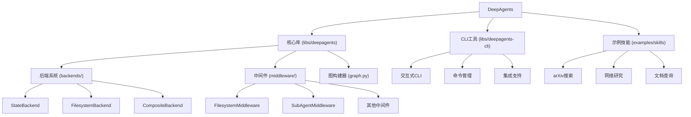

# DeepAgents LangChain - AI Agent 框架

DeepAgents 是一个基于 LangGraph 构建的开源 AI Agent 框架，专为处理长期任务而设计。它提供了规划、文件系统访问和子代理委派等核心能力，使 AI 能够处理复杂的多步骤工作流程。

## 项目愿景

DeepAgents 致力于解决长期 AI 任务中的成本和可靠性挑战，通过以下核心原则：
- **规划驱动** - 在任务执行前进行结构化规划
- **计算机访问** - 提供 shell 和文件系统访问能力
- **子代理委派** - 通过隔离的子代理处理特定任务

## 架构总览

DeepAgents 采用分层架构设计，包含以下核心组件：



## 模块索引

| 模块 | 路径 | 语言 | 职责 | 状态 |
|------|------|------|------|------|
| **核心库** | `libs/deepagents` | Python | 提供Agent创建、中间件和后端系统 | ✅ 完整 |
| **CLI工具** | `libs/deepagents-cli` | Python | 命令行界面和交互式体验 | ✅ 完整 |
| **示例技能** | `examples/skills` | Python | 预构建技能模板和示例 | ✅ 完整 |

## 运行与开发

### 快速开始

```bash
# 安装核心库
pip install deepagents

# 安装CLI工具（包含额外依赖）
pip install deepagents-cli

# 或从源码安装
git clone https://github.com/langchain-ai/deepagents-langchain
cd deepagents-langchain
pip install -e ./libs/deepagents
pip install -e ./libs/deepagents-cli
```

### 基本使用

```python
from deepagents import create_deep_agent

# 创建基础Agent
agent = create_deep_agent()

# 执行任务
result = agent.invoke({
    "messages": [{"role": "user", "content": "分析这个项目结构"}]
})
```

### CLI使用

```bash
# 启动交互式CLI
deepagents

# 列出可用代理
deepagents list

# 重置代理状态
deepagents reset --agent my-agent
```

### 开发环境设置

```bash
# 克隆仓库
git clone https://github.com/langchain-ai/deepagents-langchain
cd deepagents-langchain

# 安装开发依赖
cd libs/deepagents
pip install -e ".[dev,tests]"
cd ../deepagents-cli
pip install -e ".[dev,tests]"

# 运行测试
pytest libs/deepagents/tests/
pytest libs/deepagents-cli/tests/

# 代码检查
ruff check libs/deepagents/
ruff check libs/deepagents-cli/
```

## 测试策略

项目采用分层测试策略：

- **单元测试** - 测试单个组件和函数
- **集成测试** - 测试组件间交互和完整工作流
- **基准测试** - 性能和效率测试

### 测试覆盖范围

- `libs/deepagents/tests/` - 核心库测试
  - 单元测试：后端系统、中间件
  - 集成测试：完整Agent工作流
- `libs/deepagents-cli/tests/` - CLI工具测试
  - 单元测试：命令处理、配置管理
  - 集成测试：CLI交互和集成功能

## 编码规范

- **Python版本**: >= 3.11
- **代码格式化**: 使用 ruff
- **类型检查**: 使用 mypy，严格模式
- **文档**: Google风格docstring
- **行长度**: 150字符（核心库）、100字符（CLI）

### 主要规则

```toml
[tool.ruff]
line-length = 150  # 核心库
# line-length = 100  # CLI工具

[tool.ruff.lint]
select = ["ALL"]  # 启用所有规则
ignore = [
    "COM812", "ISC001",  # 格式化工具冲突
    "PERF203",           # 不太有用
    "SLF001",            # 允许私有成员访问
]
```

## AI 使用指引

### 项目特点

DeepAgents 专为以下场景优化：

1. **长期任务处理** - 通过TODO列表规划和进度跟踪
2. **复杂工作流** - 支持子代理委派和并行执行
3. **文件操作** - 内置文件系统工具和虚拟沙箱
4. **可扩展性** - 插件化中间件和后端系统

### 核心概念

- **Middleware（中间件）** - 为Agent添加工具和行为
- **Backends（后端）** - 控制文件存储和执行环境
- **Subagents（子代理）** - 隔离的专业化代理
- **Memory（记忆）** - 跨会话持久化存储

### 最佳实践

1. **任务规划** - 使用 `write_todos` 创建结构化任务列表
2. **上下文管理** - 利用文件系统卸载大型结果
3. **专业化委派** - 通过子代理处理特定领域任务
4. **持久化** - 使用CompositeBackend实现长期记忆

## 相关资源

- **[完整文档](https://docs.langchain.com/oss/python/deepagents/overview)**
- **[快速开始示例](https://github.com/langchain-ai/deepagents-quickstarts)**
- **[LangGraph文档](https://docs.langchain.com/oss/python/langgraph/overview)**

## 变更记录 (Changelog)

### 2025-11-19 - 初始化架构分析
- 完成全项目架构扫描和文档生成
- 识别3个主要模块：核心库、CLI工具、示例技能
- 覆盖率分析：已扫描80+文件，覆盖核心架构组件
- 生成模块级文档和索引结构

---

*本文档由自适应架构师自动生成和更新*